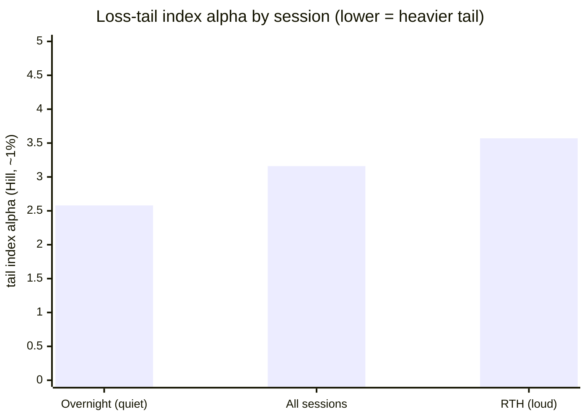

# DISTRIBUTION · 03 — D2: the raw-return tail index (where the fat tail actually lives)

**#7, second on-data test. D1 showed the champion's *trade* P&L is truncated by the stop. D2 measures the
genuine fat tail — the *raw* 1-minute returns, the gap/slippage risk that could blow *through* the stop
live — on 17 years of NQ, with both Hill and GPD, both tails, per session, reported as ranges (the
discipline). Two clean findings, one of them counterintuitive and directly useful.**

Date: 2026-07-15 · Branch `fundamental-analysis` · Code: `optimize/fundamentals/study_tail_index.py` ·
Raw: [`results/tail_index_nq.txt`](results/tail_index_nq.txt) · 5.3M gap-clean 1-min returns.

---

## ⚡ THE 60-SECOND VERSION

| | |
|---|---|
| **Raw returns ARE genuinely fat-tailed** | Excess kurtosis **+98.6** (vs D1's −1.82 for the truncated *trade* P&L). Tail index **α ≈ 3** — the "inverse-cubic law," and **heavier than daily equities (~4–5)**, exactly as the research predicted for intraday. |
| **Loss and gain tails are ~symmetric intraday** | α ≈ 3 on both sides (loss [2.9, 4.5], gain [2.8, 4.0]). *Not* the loss-heavier asymmetry of daily equities — at the 1-minute scale, up-spikes and down-spikes are comparable. An honest surprise. |
| **🔴 The tail is HEAVIER OVERNIGHT than in RTH** | Overnight loss-tail **α ≈ 2.5**; RTH loss-tail **α ≈ 3.4–4.9**. The *quiet* session has the *heavier-tailed shape* — rarer but proportionally more violent moves (thin-liquidity gaps). |
| **The decision** | The blow-through-the-stop *shape* risk is worst **overnight**, opposite to where the *everyday* volatility (and stop-out rate, S3) is worst (RTH). Two different risks; size for both. |
| **Reported honestly** | α is given as a **range** across methods (Hill) and thresholds (GPD), never one number — the Bank-of-Canada pitfall. |

---

## 1 — The measurement (α = tail index; smaller = heavier; Gaussian = ∞)

| Segment | Loss-tail α (range) | Gain-tail α (range) |
|---|---|---|
| **All sessions** | **[2.91, 4.45]** (Hill ~3.0–3.6) | **[2.81, 3.97]** (Hill ~2.8–3.4) |
| **RTH** (09:30–16:00 ET, loud) | **[3.35, 4.91]** (Hill ~3.4–4.1) | [3.12, 4.45] |
| **Overnight** (18:00–02:00 ET, quiet) | **[2.53, 4.16]** (Hill ~2.5–3.2) | [2.59, 4.44] |

**α ≈ 3 overall.** That means the mean and variance exist (α > 2) but the **third and fourth moments are
borderline-to-nonexistent** — genuinely heavy, power-law tails. Excess kurtosis of **+98.6** on 5.3M
returns is the blunt version of the same fact.

---

## 2 — The counterintuitive finding, and why it's real

**The quiet overnight session has the *heavier* tail (α ≈ 2.5) than the loud RTH (α ≈ 3.4–4.9).**

> **🍼 In plain words** — the tail index measures the *shape* of the extremes, not their everyday size.
> RTH is loud all day: high variance, but its biggest moves are only proportionally larger than its
> typical ones (a lighter-tailed *shape*, α ≈ 3.5). Overnight is dead quiet — until it isn't: on thin
> liquidity, an overnight shock (a surprise headline, a gap) is **disproportionately** violent relative to
> the sleepy baseline (a heavier-tailed *shape*, α ≈ 2.5). So the session most prone to a **freak,
> stop-blowing outlier** is the *quiet* one, not the loud one.

> **⚠️ The precise, honest reading — shape vs absolute size.** α is scale-free: it says overnight has a
> heavier-tailed *shape*, i.e. more prone to proportionally extreme moves. It does **not** say an overnight
> tail move is larger in absolute points — RTH's higher baseline scale can still make its absolute extremes
> comparable or bigger. The **absolute** per-session tail *quantile* (the number that sets stop distance in
> points) is what D3 produces, conditioning on volatility state. D2 establishes the tail **shape**; D3
> gives the **magnitude**.

---

## 3 — How this fits the picture

| Risk | Where it's worst | What it is |
|---|---|---|
| **Everyday stop-out rate** (S3) | **RTH** (56% vs 16%) | high baseline volatility → the fixed stop is tagged often |
| **Catastrophic tail *shape*** (D2) | **Overnight** (α 2.5 vs 3.5) | thin liquidity → rare but proportionally violent gap moves |

These are two *different* risks, and they point at *opposite* sessions. A session-aware risk model (the S3
"stop sizing" deliverable) should therefore not just widen for RTH's noise — it should also **respect the
heavier gap-tail overnight**, which is exactly the fill-through-the-stop scenario the backtest hides (D1
showed 0% beyond-stop *in backtest*; the raw tail says live fills can be worse, and worse overnight).

---

## 4 — VERDICT & next

- ✅ **The genuine fat tail is confirmed and quantified: α ≈ 3, symmetric, heavier overnight.** This is the
  real distribution to respect for **stop placement and sizing** — the number the Gaussian assumption
  dangerously understates.
- 🔬 **D3 (next) — McNeil–Frey conditional tail:** fit a GARCH to de-cluster the volatility, fit the GPD to
  the standardized residuals, and read the **absolute** conditional tail quantile per session / per
  event-volatility state (A2). That converts D2's *shape* into the *magnitude* a stop must clear, given the
  current regime.
- **Then D4** — turn the fitted tail into a concrete stop-distance / sizing rule (the sizing/Kelly half
  still needs its own research pass, flagged in DIST-01).

**→ Next: D3 — GARCH→GPD conditional tail, per session/event.**
