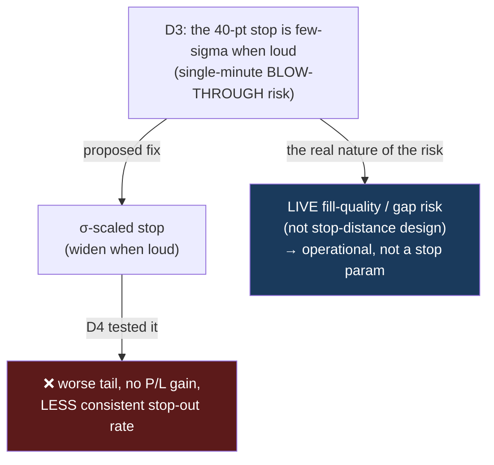

> # ✅ REINFORCED on the real champion ledger (2026-07-20)
> Re-run after BUG-01: the **fixed** stop-out rate is regime-**FLAT** (55.1 / 56.2 / 56.5%), while a
> σ-scaled stop would make it **SWING** (69.0 / 56.2 / 46.3%). The rejection is stronger than
> originally reported. → [`BUG-01`](BUG-01-sizing-studies-ran-the-wrong-strategy.md)

# DISTRIBUTION · 05 — D4: the vol-scaled stop is REJECTED (the fixed stop is already regime-invariant)

**#7, final on-data test — and it overturns its own proposed deliverable. D3 suggested a volatility-scaled
(constant-σ) stop because the fixed 40-pt stop's *single-minute blow-through* safety is regime-dependent.
D4 built and tested it, and the honest result is: the vol-scaled stop does NOT help — it worsens the tail,
doesn't improve P/L, and (the surprise) makes the stop-out rate LESS consistent. The fixed stop was already
right. This is the discipline catching a plausible-but-wrong idea before it shipped.**

Date: 2026-07-15 · Branch `fundamental-analysis` · Code: `optimize/fundamentals/study_vol_scaled_stop.py`
· Raw: [`results/vol_scaled_stop_nq.txt`](results/vol_scaled_stop_nq.txt) · NQ 1h + 15m champions, offline
re-simulation (no engine change).

---

## ⚡ THE 60-SECOND VERSION

| | |
|---|---|
| **Vol-scaled stop: no P/L gain** | 1h: $87,440 (fixed) vs $89,132 (σ-scaled); 15m: $49,840 vs $46,242. A wash, both directions. |
| **It makes the TAIL worse** | Worst trade −$800 (fixed) → **−$2,051** (σ-scaled). A σ-stop is *wider* in loud regimes, so it *books bigger losses* — the opposite of protection. |
| **🔑 The premise was wrong** | The fixed 40-pt stop **already** gives a regime-consistent ~**56% stop-out rate** (quiet 55.5% / normal 56.5% / loud 56.5%). The σ-scaled stop makes it *vary more* (quiet 69% / loud 45%). |
| **Why** | With a fixed stop AND a fixed TP, the win/loss race is **scale-invariant** — gambler's ruin: P(stop) ≈ 60/(40+60) = 60%, independent of volatility. σ-scaling the stop *alone* breaks that balance. |
| **Verdict** | ❌ **Reject the vol-scaled stop.** The fixed stop/TP is well-designed. D3's blow-through insight stands, but it's a **live fill-quality** concern, not a stop-*distance* problem. |

---

## 1 — The comparison

Median σ-stop set equal to 40 pts for a fair test (k ≈ 5.8 × the 1-min EWMA σ):

| Stop rule | total P/L | $/trade | win% | stop% | **worst** | sd |
|---|---|---|---|---|---|---|
| **1h — FIXED-40** | $87,440 | +$76 | 43.8% | 56.2% | **−$800** | $992 |
| **1h — σ-scaled** | $89,132 | +$77 | 43.1% | 56.9% | **−$2,051** | $1,011 |
| **15m — FIXED-40** | $49,840 | +$30 | 41.5% | 58.5% | **−$800** | $985 |
| **15m — σ-scaled** | $46,242 | +$27 | 40.9% | 59.1% | **−$1,814** | $1,007 |

No P/L edge, and the σ-scaled worst-case loss is **~2.5× larger** — because in a loud regime the σ-stop is
wide, so a trade that goes against you is allowed to lose far more than 40 points before stopping out.

## 2 — The stop-out rate by regime: the premise, falsified

| Regime | n | FIXED-40 stop% | σ-scaled stop% |
|---|---|---|---|
| quiet | 382 | **55.5%** | 69.1% |
| normal | 393 | **56.5%** | 56.0% |
| loud | 382 | **56.5%** | 45.5% |

> **🍼 In plain words** — the whole idea was "the fixed stop is regime-blind, so its stop-out odds must
> swing by regime; scale it to volatility to make them consistent." **The data says the fixed stop's
> stop-out rate is *already* consistent (~56% everywhere)**, and the σ-scaled version is what makes it
> swing. The reason is the cleanest result in the whole project: with a **fixed stop and a fixed
> take-profit**, every trade is a race between −40 and +60, and the odds of hitting the stop first are
> **60 / (40 + 60) = 60%** — a **gambler's-ruin** number that *does not depend on volatility* (volatility
> changes how *fast* the race resolves, not *who wins*). Scaling only the stop breaks that symmetry: a
> tight stop in a quiet market gets hit more; a wide stop in a loud market gets hit less. **You can't
> improve on a balance that's already scale-free.**

*(This is the same gambler's-ruin / martingale result that killed the dynamic stop-loss in report 04/06 —
here it works in our favour: it's why the fixed stop is robust across regimes.)*

---

## 3 — What survives, and the honest #7 conclusion

**D3's insight is not wrong — it was mis-applied.** The 40-pt stop's *single-minute blow-through* risk (a
gap that fills through the stop in one loud minute) genuinely is regime-conditional (D3). But that is a
**live execution / fill-quality** problem — how bad a fill you get when the market gaps — **not** a
stop-*distance-design* problem. Widening the stop-distance in loud regimes (the σ-scaled stop) does not
address gap fills; it just books larger losses on the trades that *don't* gap. The two are different, and
D4 shows conflating them makes things worse.

### The #7 workstream, concluded

| Step | Result |
|---|---|
| **D1** | Per-trade P&L is **truncated** by the stop (bounded, bimodal, light-tailed). The stop works. |
| **D2** | Raw returns are genuinely fat (α≈3), ~symmetric, heavier *shape* overnight. |
| **D3** | The tail is conditional; the 40-pt stop's blow-through safety swings ~100× by regime. |
| **D4** | **But a vol-scaled stop doesn't help** — the fixed stop/TP is already regime-invariant (gambler's ruin); σ-scaling worsens the tail. **Keep the fixed stop.** |

**Net:** #7 characterized the tail rigorously and **tested the one actionable idea it produced — which did
not survive.** That is a *successful* workstream: it prevented adopting a plausible-but-wrong change, and
it leaves us understanding *why* the current fixed stop is robust (gambler's-ruin scale-invariance). The
genuine residual risk (live gap blow-through) is an **operational** item (fill modelling / slippage
assumptions), not a strategy parameter — and it is exactly what the assist (B3) recklessly amplifies.

**Production unchanged; nothing adopted; $0. The honest recommendation is to keep the fixed stop.**

### Open (unchanged)
- The **sizing / Kelly** half of the decision layer still needs its own research pass (DIST-01) before any
  position-sizing rule — separate from stop distance, and the one place fat-tail-aware sizing could still add value.
- **GC** distribution work is frozen (2025–2026 only) pending long GC history.
