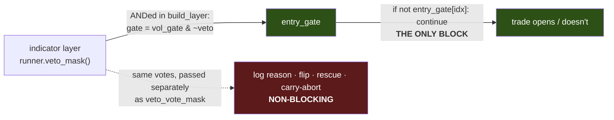

# ENGINEERING NOTE — What Actually Blocks an Entry (the `veto_mask` trap)

**A reusable fact about the engine, extracted from Task #4. Read this before adding any feature that is
supposed to "stand a trade aside," "veto," or "skip" a bar. It will save you from building something that
silently does nothing.**

Date: 2026-07-14 · Branch `fundamental-analysis` · Commit `a1017a2` · Code: `engine.py`, `strategy.py`

---

## THE ONE-SENTENCE VERSION

> **Exactly one array stops a new trade from opening: `entry_gate`. Everything else with "veto" in its
> name is a non-blocking hint, and setting it does nothing unless the block is already baked into
> `entry_gate`.**

---

## 🍼 In plain words — the trap, and how it bit us

When we started the **news-veto** work (stand aside during a scheduled news release), the obvious-looking
move was: *"the engine has a parameter called `veto_mask` — so pass a mask that's `True` on release bars,
and it'll skip them."*

**That would have done absolutely nothing, and nothing would have complained.** We'd have run a backtest,
seen trades still happening on release bars, and spent hours hunting for a bug that wasn't a bug — the
feature was simply inert by design.

The reason: the parameter that *sounds* like it blocks entries **doesn't**. The engine reads it only to
*describe* and *reshape* trades that some **other** mechanism already decided about. The actual blocking
is done by a single, differently-named array.

This note exists so nobody walks into that again.

---

## ⚙️ How it actually works

There are **two** different things in the codebase with "veto" in the name. They are not the same, and
conflating them is the whole trap.

### 1. `runner.veto_mask(...)` — the METHOD. This one is real.

It computes, per decision bar, whether the indicator layer casts a **veto vote** (e.g. an SMC structure
says "don't go long here"). It is **correctly named** and you should leave it alone.

Crucially, its output is **composed into the gate upstream**, in `runner.build_layer`:

```python
gate = vol_gate & ~veto_mask        # <- THIS is where a veto actually removes a bar
```

That composed `gate` is what becomes `entry_gate`. **The veto blocks because it was ANDed into the gate
here — not because it is a veto.**

### 2. `engine.run(..., veto_vote_mask=...)` — the PARAMETER. This one does NOT block.

(It used to be named `veto_mask`. That was the trap. Task #4 renamed it to `veto_vote_mask`.)

The engine's entry path is, in full:

```python
if not entry_gate[idx]:
    continue                        # <- the ENTIRE blocking mechanism. One line.
```

`entry_gate` is the only thing consulted to decide *whether* a trade opens. The `veto_vote_mask`
parameter is read **only** to:

| Use | What it does |
|---|---|
| `blocked_log` | classify *why* a bar was dropped (`'veto'` vs `'vol_gate'`) — **diagnostic only** |
| intra-candle rescue | arm a vetoed-but-vol-passed signal to enter mid-candle when the gate re-opens |
| `veto_as_flip` | decide which entries to **reverse** instead of drop |
| carry-abort | abort a carried setup in the live resolver |

Every one of those is about *reshaping or explaining* a decision. **None of them blocks.** The block
already happened, upstream, when the veto was ANDed into `entry_gate`.



---

## ✅ How to actually stand a bar aside

Remove it from `entry_gate`. That's it. The news-veto feature does exactly this — see
`optimize/core._news_window_mask`:

```python
gate = gate & ~nmask                # nmask = True on the bars to skip
```

If your new "skip these bars" feature does **not** end in an `& ~your_mask` on the gate (or an equivalent
exclusion before `entry_gate` is built), **it does nothing.** Test it by asserting that a bar you meant
to skip produces no trade — not by trusting the parameter name.

---

## What went well / what went wrong

**What went wrong (originally):** a parameter was named `veto_mask` when it does not veto. The name
implied a capability it never had, and the failure mode was **silent** — the worst kind. It nearly cost a
day during the news work.

**What went well (the fix):** renaming it to `veto_vote_mask` cost nothing behaviourally — **golden 6/6
byte-identical**, integration test green — because the engine's behaviour never depended on the *name*.
The rename buys clarity for free. And documenting the single real blocking mechanism (`entry_gate`) means
the next person adding a skip/veto/stand-aside feature knows exactly where it has to plug in.

> **The lesson, general form:** when a name promises a capability the code doesn't deliver, the bug isn't
> in any one run — it's a trap laid for the *next* feature. Rename it the moment you notice, while the
> change is free (a pure rename under a byte-identical regression gate), not after it has misled someone.
