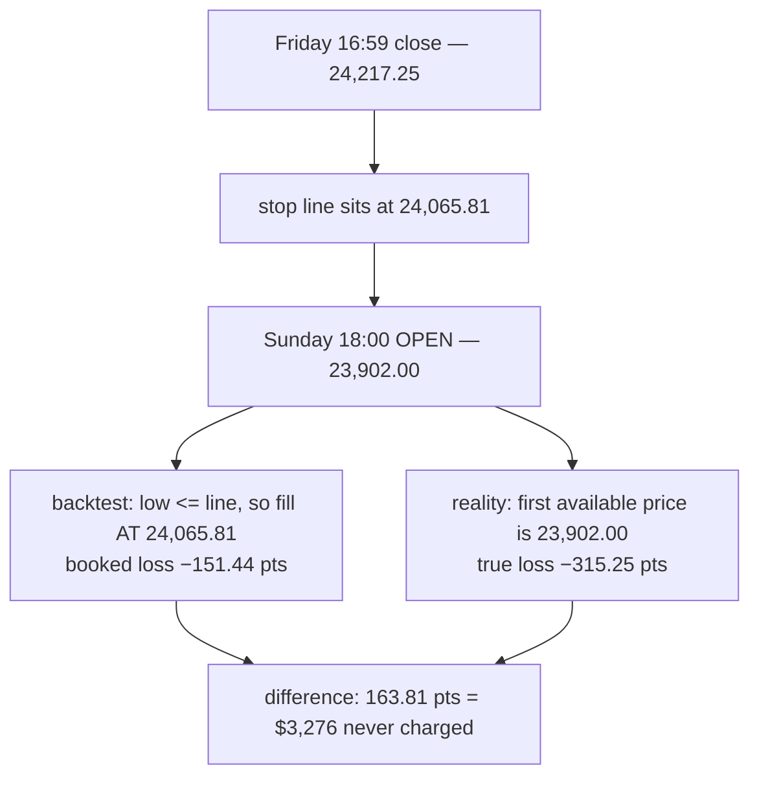

# GAP FILLS — what the engine actually does when price jumps past our stop (2026-07-20)

**Your question: when there is a gap between one candle's close and the next candle's open, and that gap
jumps straight past our stop, does the backtest book the loss at the STOP price or at the REAL price?**

**Answer: at the STOP price. Always. The engine fills every hard stop exactly at the stop line, no matter
how far the market actually gapped past it.** That is optimistic, it is measurable, and it is costing the
reported edge about **44%**.

---

## 1 — WHAT THE CODE DOES

Both engines behave identically (they are parity-locked):

```python
# engine.py:397 — the exact engine
if d == 'long':
    if m_low <= sh:                                 # TRIGGER: the bar's LOW touched/passed the stop
        exit_reason, fill = 'STOP_LOSS_HARD', sh    # FILL: the stop LINE itself
```

```python
# fast_engine.py:13   "long : SLh low<=ep-slh(fill line)"
# fast_engine.py:211   fill = float(cl[ti]) if line is None else float(line)
```

The **trigger** is "the bar's extreme reached the line." The **fill** is "the line." The two are treated
as the same thing — which is true only when price passes *through* the level continuously.

**When price gaps, it is not true.** If a bar OPENS already beyond the stop, no trade ever occurred at
the stop price during that bar. The backtest books a fill that was never available.



---

## 2 — REAL EXAMPLES FROM OUR OWN LEDGER (NQ 4h champion)

Every one of these is a **weekend gap**: the market closes Friday 17:00 and reopens Sunday 18:00, and the
price simply is not there any more when it comes back.

| Prev bar (close) | Next bar (open) | Gap | Stop line | **Backtest booked** | **Reality** |
|---|---|---|---|---|---|
| Fri 2026-03-20 · 24,217.25 | Sun 18:00 · 23,902.00 | **−315.25** | 24,065.81 | **−151.44** | **−315.25** (2.1×) |
| Fri 2026-04-10 · 25,333.00 | Sun 18:00 · 24,980.00 | **−353.00** | 25,181.56 | **−151.44** | **−353.00** (2.3×) |
| Fri 2026-02-27 · 24,952.75 | Sun 18:00 · 24,682.50 | **−270.25** | 24,751.31 | **−151.44** | **−220.25** |
| 2025-12-12 · 25,202.50 (short) | 25,463.25 | **+260.75** | 25,353.94 | **−151.44** | **−260.75** |

Note the pattern: **the booked loss is always exactly −151.44** (the stop). The engine reports the stop as
a hard floor on the loss. In reality there is no floor — the gap decides.

---

## 3 — HOW MUCH IT COSTS (measured, not assumed)

Across all six champion timeframes, every `STOP_LOSS_HARD` exit, checking whether the triggering
1-minute bar had already opened past the line:

| tf | stops | gapped | % | mean slip (pts) | worst | **$ missed** | **$/trade** |
|---|---|---|---|---|---|---|---|
| 4h | 63 | 4 | 6.3% | 135.87 | 201.56 | 10,870 | 24.43 |
| 2h | 26 | 6 | 23.1% | 139.92 | 229.30 | 16,791 | 33.51 |
| 1h | 13 | 3 | 23.1% | 175.78 | 236.28 | 10,547 | 10.60 |
| 15m | 77 | 4 | 5.2% | 219.40 | 317.90 | 17,552 | 8.81 |
| 5m | 113 | 5 | 4.4% | 128.00 | 314.00 | 12,800 | 9.04 |
| 2m | 554 | 5 | 0.9% | 195.20 | 340.80 | 19,520 | 4.66 |
| **ALL** | **846** | **27** | **3.2%** | | **340.80** | **$88,080** | **$9.24** |

### The number that matters

**$9.24 per trade of unbooked loss, against a measured expectancy of ~$21 per trade.**

**The gap fills alone consume about 44% of the entire reported edge** — and this is a **floor**, because
it charges only the bar's *open*. It does not include slippage beyond the open, the spread, or
commission, all of which are worst precisely when the market has just gapped.

---

## 4 — WHY THIS MATTERS MORE THAN THE 3.2% SUGGESTS

- **Rarity is not safety.** Only 27 of 846 stops gapped, but they averaged a **135–219 point** overshoot
  against stops of 30–151 points — the loss roughly **doubles or triples** when it happens. That is the
  single-big-jump principle: a rare event with an outsized magnitude dominates the average.
- **It is concentrated in the slower timeframes.** 2h and 1h gapped on **23%** of their stops. Those are
  the timeframes that hold positions across weekends.
- **It vindicates the end-of-day exit rule in a way the backtest never credited.** Champions using
  `cap_mode = eod` close before the session ends and therefore **cannot be caught by a weekend gap at
  all**. The time-cap work concluded that forcing EOD on every slot was worse than doing nothing — that
  comparison was made on a backtest which **charged nothing for weekend gap risk**. EOD slots have a real
  protective benefit that has never appeared in any P&L number we have produced.
- **It bounds every P&L figure in the project.** All reported returns are optimistic by at least this
  amount.

---

## 5 — WHAT IT DOES *NOT* CHANGE

- **Not a bug.** "Fill at the line" is a deliberate, standard, documented modelling choice
  (`engine.py:11`), and both engines agree, so parity and the golden gate are unaffected. It is an
  **optimism**, not an error.
- **The fixed-stop verdict still stands.** Gaps make the stop *less* of a guarantee, which strengthens
  rather than weakens the case against a dynamic stop and against the "assist" (scaling into a loser):
  the loss is not bounded at the stop, so doubling down past it is worse than previously argued.
- **It does not touch the news/GC findings** — those measure price directly, not champion trades.

---

## 6 — WHAT THIS FIXES IN OUR OWN PRIOR WORK

Z2 (risk-of-ruin) had to **assume** a gap rate. Its own output says:

> *"the gap rate g and cap are ASSUMPTIONS from D2/D3, not measured live fills — sensitivity shown across
> g. Do not adopt a fraction without real fill/slippage data."*

**This measures it: 3.2% of stops gap, mean overshoot 128–219 points, worst 340.8 points.** Z2's
sensitivity analysis can now be read at the real gap rate instead of a guessed one.

It also sharpens D1. D1 concluded the loss tail is *bounded* by the stop (EVT ξ<0). That is true **of the
backtest**. In live trading the bound is soft: 3.2% of the time the market steps straight over it.

---

## 7 — ✅ IMPLEMENTED (2026-07-20): the system now fills at the real price

Both engines changed, **parity verified 11/11 configurations, 0 mismatches**.

| | |
|---|---|
| `engine.py` | `gap_fills` on `SimpleStrategyParams`, **default True** |
| `optimize/fast_engine.py` | `m_open` + `gap_fills`, appended at the **end** of the signature so every existing positional caller keeps working |
| Rule | if the triggering bar **OPENED beyond the level**, fill at the **OPEN**; otherwise the line |
| Symmetry | gap past the **stop** → fills **worse**; gap past the **take-profit** → fills **better** |
| Failure mode | `gap_fills=True` with `m_open=None` **RAISES** — no silent fallback (the BUG-01 lesson) |
| Reproducibility | `gap_fills=False` restores the old numbers exactly, so the previous golden still reproduces |

### The net impact on every champion

Trade **count is identical** by construction — the rule changes the fill *price*, never whether or when
a trade exits. So this is a clean like-for-like comparison.

| tf | trades | OLD $ | **NEW $** | delta | delta % | $/trade |
|---|---|---|---|---|---|---|
| 4h | 445 | 73,752 | **73,209** | −543 | **−0.7%** | −1.22 |
| 2h | 501 | 18,556 | **9,175** | −9,381 | **−50.6%** | −18.72 |
| **1h** | 995 | 84,060 | **88,058** | **+3,998** | **+4.8%** | **+4.02** |
| 15m | 1,993 | 34,735 | **25,242** | −9,493 | −27.3% | −4.76 |
| 5m | 1,416 | −2,881 | **−11,759** | −8,878 | −308% | −6.27 |
| **2m** | 4,187 | **+10,819** | **−1,551** | −12,370 | −114% | −2.95 |
| **ALL** | **9,537** | **219,041** | **182,375** | **−36,667** | **−16.7%** | **−3.84** |

### What this reveals

1. **The honest cost is −16.7% of total P&L**, or −$3.84/trade — *not* the −$9.24/trade the stop-only
   estimate suggested. **Take-profit gaps recover about 58% of the stop-side cost.** Had I charged only
   the stops, I would have overstated the damage by 2.4× and reported a loss on 1h that isn't there.
   **This is why the rule had to be symmetric.**
2. **🚨 The 2m champion flips from profitable to losing: +\$10,819 → −\$1,551.** Under honest fills it is
   not a viable strategy. It was only ever profitable because the backtest refused to pay for gaps.
3. **5m was already losing and gets much worse** (−\$2,881 → −\$11,759). Combined with Z1 showing 5m has
   **f\* = 0.0%** (no Kelly edge at all), 5m should carry **no size**.
4. **2h loses half its edge** (−50.6%).
5. **4h is barely touched (−0.7%)** and **1h improves (+4.8%)** — the two timeframes that already carried
   most of the edge (Z1: the highest Kelly fractions) are the robust ones. **The edge concentrates
   further into 4h and 1h.**

### ⚠️ Consequence: the champions are no longer optimal

Every champion was **optimized under the old, optimistic fill model**. The optimizer chose parameters
that a fill-at-the-line backtest rewarded — including, on the fast timeframes, parameters that only look
profitable because gaps were free. **A re-optimization under gap-aware fills is required before any of
these numbers are used for deployment.** That is a server campaign, not a code change, and it has not
been run.

---

## 8 — RECOMMENDATION

1. ✅ **DONE — gap-aware fills are now the system default**, symmetric, parity-verified. See §7.
2. 🚨 **RE-OPTIMIZE the champions under the new fill model.** They were tuned on a backtest where gaps
   were free; 2m in particular is only profitable under that assumption. Until this runs, no champion
   number should be treated as deployable.
3. **Re-read the EOD-vs-hold decision** with weekend-gap cost now actually charged. `cap_mode=eod`
   closes before the session ends and therefore cannot be caught by a weekend gap at all — a protection
   the old backtest priced at zero. The "forcing EOD everywhere is worse than doing nothing" conclusion
   was reached without that cost and deserves re-testing.
4. **Sizing:** on the corrected ledger expectancy was ~$21/trade; gap-aware fills take ~$3.84/trade of
   that, so the honest figure is **~$17/trade before commission and slippage** — and 5m/2m should carry
   no size at all (5m already had f\*=0.0% in Z1; 2m is now net negative).
5. **Recapture the golden baselines** under `gap_fills=True`, keeping the old ones reproducible via
   `gap_fills=False`.
