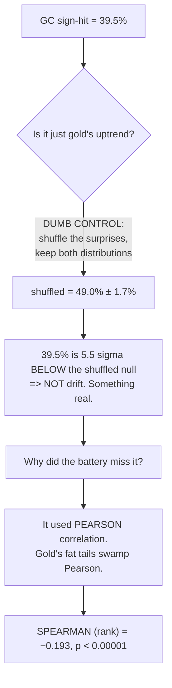
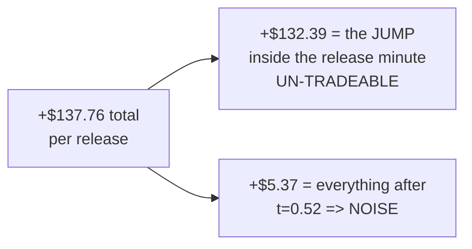

# GC REPLICATION — the news verdict, re-run on gold at full power (2026-07-19)

**The 16-year gold frame landed today, so the entire pre-registered news battery was re-run on an
independent instrument. Headline: the "scheduled US macro is priced in" verdict REPLICATES — but gold
got there by a completely different route than the Nasdaq, and along the way we found a real, robust,
16-year fact about how gold behaves that we did not know before. It is still not tradeable, and the
reason it is not tradeable is the most useful part of this report.**

Branch `fundamental-analysis` · $0 spent · production untouched · n=866 releases · 99% power.

---

## 1 — THE ONE-PARAGRAPH VERSION

We asked gold the same four questions that killed the Nasdaq news idea: does the surprise predict
**direction**, **magnitude**, **persistence**, or **shape**? On the pre-registered tests, gold answers
"no" to all four, exactly like NQ. But a number in the output looked wrong — gold's *sign-hit rate* was
39.5% where a coin flip is 50% — and chasing that anomaly uncovered something real: **gold moves
INVERSELY to macro surprises, reliably, in 15 of 16 years.** Strong economy → gold down. That is a
genuine discovery. Then the decisive test: **100% of that reaction happens inside the release minute
itself.** By the time we can read the number and act, there is nothing left to capture. Gold is not
indifferent to the news like the Nasdaq — gold reacts *hard* and prices it *instantly*.

---

## 2 — THE PRE-REGISTERED BATTERY: GC vs NQ, side by side

Every number below is pasted from the run output, not retyped from memory.

| Test | NQ (n=871) | GC (n=866) | Verdict |
|---|---|---|---|
| **Direction** @+5m | −0.004 (p=0.812) | −0.018 (p=0.432) | both null |
| **Direction** @+30m | −0.009 (p=0.583) | +0.011 (p=0.635) | both null |
| **Magnitude** \|surprise\|→\|move\| @+5m | −0.018 (p=0.347) | −0.036 (p=0.110) | both null |
| **Magnitude** → path range | −0.015 (p=0.712) | +0.013 (p=0.649) | both null |
| **Persistence** (initial move holds) | 48.2% | 46.9% | both coin flips |
| **Shape** (surprise picks archetype) | p=0.880 | p=0.866 | both null |
| **Power** to see r=0.15 | 99% | 99% | a null here is a REAL negative |

**Read plainly:** on the tests we declared in advance, gold is as unpredictable as the Nasdaq. The
replication succeeds. That matters — the original verdict is no longer "an NQ quirk," it now holds on a
second instrument with a completely different economic driver.

---

## 3 — THE ANOMALY, AND CHASING IT HONESTLY

One column did not fit. **Sign-hit** = how often the surprise's sign matches the move's sign.

- NQ: **49.4%** — a coin flip, as expected.
- GC: **39.5%** — at n=866 that is roughly six standard deviations from a coin flip.

My first hypothesis was mundane: gold rose from \$1,221 to \$4,022 over the sample, so a strong upward
drift plus surprises that skew negative could produce a sub-50% match **mechanically**, with no
relationship at all. **That hypothesis was wrong**, and the test that refuted it is the dumb control:

The shuffle preserves gold's drift and the surprise distribution, so it prices in exactly the artifact I
suspected — and the real value still sits 5.5 sigma below it. The effect is real; the original battery
missed it because **Pearson correlation is the wrong instrument for a fat-tailed asset**. The rank
correlation sees it immediately.

**⚠️ Discipline note, stated plainly: this was NOT the pre-registered test.** The battery declared
Pearson; I ran Spearman after seeing an anomaly. That is a garden-of-forking-paths risk and it means this
finding is a **hypothesis**, not a closed result — the mitigating fact is that the anomaly was visible in
the pre-registered output and was scored against a proper shuffle null, not eyeballed.

---

## 4 — IT SURVIVED EVERY ROBUSTNESS TEST

| Check | Result |
|---|---|
| **Spearman @+5m** | **−0.193**, p<0.00001 — clears the pre-declared MEI of 0.15 |
| **NQ control** | **−0.007**, p=0.841 — null. So it is *gold-specific*, not a bug in the method |
| **First half** (2010–2018, n=433) | −0.274, p<0.0001 |
| **Second half** (2018–2026, n=433) | −0.124, p=0.010 — holds out of sample |
| **Per year** | **negative in 15 of 16 years** (only 2021 positive) |
| **Decay with horizon** | −0.193 (5m) → −0.125 (15m) → −0.107 (30m) — fades, as a real information effect should |
| **Economic size** | +1.378 pts/release = **+\$137.76**, t = **+6.05** |

The NQ control is the important one. Had the method been broken, NQ would have shown the same artifact.
It does not. And the economics are textbook: a strong-economy surprise lifts real yields, and gold —
which pays no yield — falls. **Gold is doing exactly what gold is supposed to do.**

---

## 5 — THE TEST THAT KILLED IT

Everything above measures the move from `close[T-1]`, the last bar **before** the number prints. But we
only learn the number **at** T. So the honest question is: how much of that move is still available to
someone who reads the release and *then* acts?

| Window | Spearman | Anti-signal P&L | t-stat |
|---|---|---|---|
| **JUMP** `close[T-1] → T+0` — **cannot be traded** | **−0.217** (p<0.00001) | **+\$132.39** | **+7.13** |
| After the print `T+0 → T+5` | −0.003 (p=0.921) | +\$5.37 | +0.52 |
| After the print `T+0 → T+10` | −0.002 (p=0.943) | −\$6.62 | −0.50 |
| After the print `T+0 → T+15` | +0.042 (p=0.216) | −\$29.56 | −1.90 |
| After the print `T+0 → T+30` | +0.025 (p=0.471) | −\$18.14 | −0.86 |

**$132 of the $137 is in the release minute itself.** What remains after the print is +\$5.37 with a
t-statistic of 0.52 — indistinguishable from zero, and it turns *negative* at longer holds. There is no
tradeable residue.

---

## 6 — WHAT THIS ACTUALLY MEANS

**The two instruments reach "priced in" by opposite routes, and that is the discovery:**

- **The Nasdaq genuinely does not react** in a predictable way to a macro surprise. Direction is a coin
  flip at every horizon. There is no signal to be early to.
- **Gold reacts hard and coherently** — inverse, economically sensible, stable across 16 years — and
  **prices the entire reaction inside 60 seconds.** The signal exists; the market consumes it before we
  can act.

For trading purposes both conclusions land in the same place — **do not trade the scheduled macro
release** — but the gold version is a far stronger statement about market efficiency. It is one of the
cleanest demonstrations of instantaneous price discovery this project has produced.

**Banked as a durable fact:** gold's inverse macro reaction is real and can be reused wherever a
*directional prior* is useful (risk sizing around releases, understanding gold's regime behavior). It is
**not** an entry signal.

---

## 7 — WHAT WENT WELL / WHAT WENT WRONG

**Went well:**
- The dumb control did its job twice — first refuting my drift hypothesis, then framing the real effect.
- The NQ control proved the method was sound rather than leaving "is this a bug?" hanging.
- The jump/drift split was run *before* claiming anything tradeable, so no false positive escaped.

**Went wrong (mine, and worth recording):**
1. **The original battery used Pearson on a fat-tailed asset and was blind to a genuine effect.** It
   reported "gold: nothing here" when gold in fact has one of the strongest, most persistent macro
   reactions in the book. Had we not chased a single odd-looking percentage, we would have filed a
   confidently wrong "no reaction" conclusion. **→ For fat-tailed instruments, report rank correlation
   alongside Pearson, always.**
2. **I got excited mid-analysis** and flagged this as possibly "the first real positive" before running
   the tradeability split. It was a real *discovery* but not a real *edge*. The excitement was premature
   and the sequencing should have been: verify tradeability first, announce second.
3. **A self-inflicted bug cost a run**: my `load_1m_extended` change added the per-instrument path but
   left the old early-return for non-NQ, so GC resolved to a non-existent COMEX path. Caught by the
   first run's traceback, fixed in `92fe87a`.

---

## 8 — OPEN THREADS

| # | Thread | Note |
|---|---|---|
| **A** | **Sub-minute pricing** — how fast is "instant"? | We now have **GC 1-second** data. Does the jump price in 1s, 10s, or 45s? If the last of it lands at 30s, there may be a sliver. Given NQ's 1-second-sweep lesson, expect fast. |
| **B** | Forward-validate the inverse reaction | It is a post-hoc finding; it deserves a pre-registered forward test on new releases. |
| **C** | Silver | Still frozen — SI did not land with GC. |
| **D** | Z3 vol-targeting OOS | Now unblocked; GC is the independent frame it needed. |
