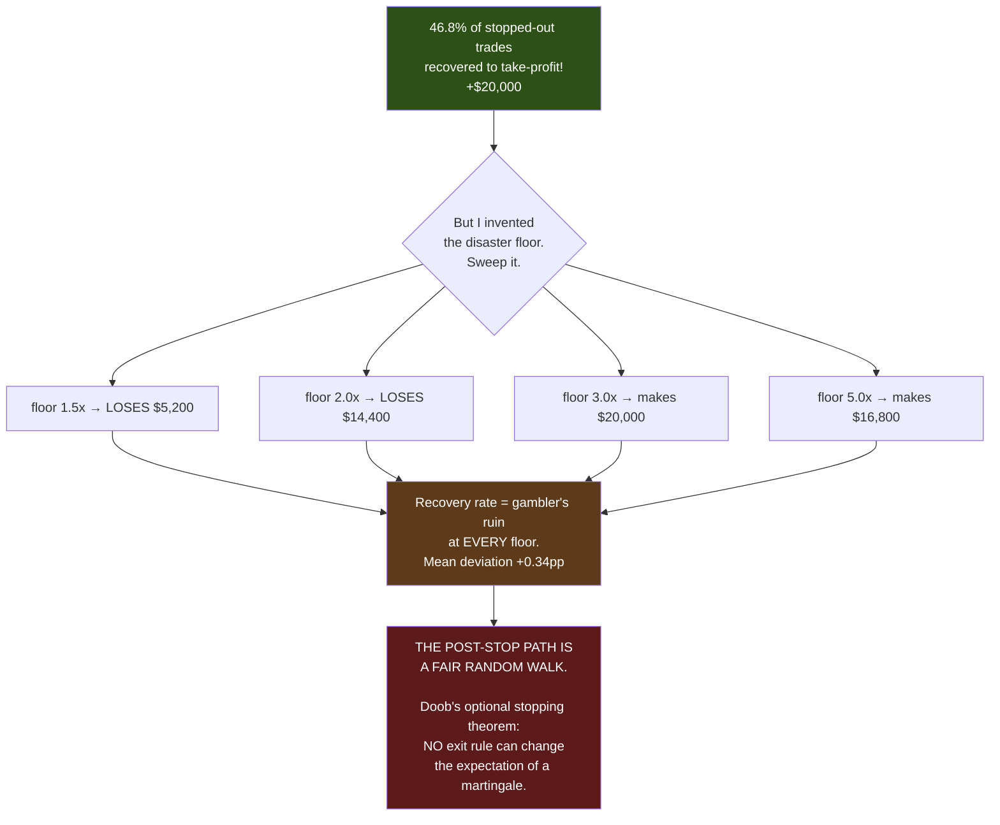
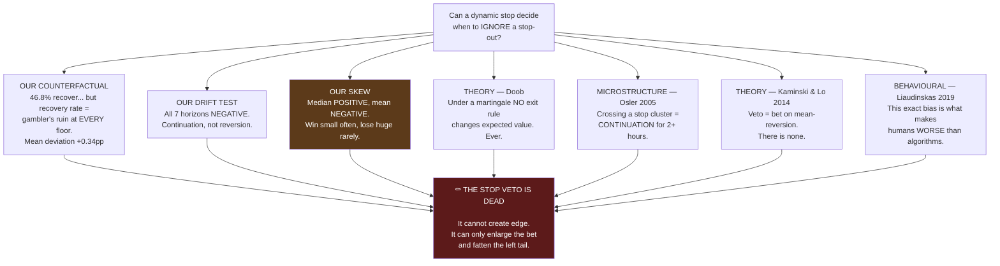

# Report: The Dynamic Stop-Loss — Can We Ignore a Stop and Hold On?

**A complete investigation, from the one-minute candle that started it to a theorem that ends it.
Every measurement, every number, every citation, every mistake.**

Date: 2026-07-13 · Tasks #2 and #3 · Branch `fundamental-analysis`
Commits: `9371842` (excursion tracker) · `1bb9089` (counterfactual)

> 🇸🇦 النسخة العربية: [`REPORT_dynamic_stop_loss_AR.md`](REPORT_dynamic_stop_loss_AR.md)
Code: `engine.py` · `optimize/fast_engine.py` · `optimize/test_excursions.py` ·
`optimize/fundamentals/study_excursions.py` · `study_stop_counterfactual.py`

---

## TABLE OF CONTENTS

| Part | What it covers |
|---|---|
| **0** | The verdict, up front |
| **1** | The idea, in the user's own words, and the candle that inspired it |
| **2** | Why we couldn't even *ask* the question before (and what we built) |
| **3** | Every implementation detail of the live P/L tracker |
| **4** | The speed engineering — including a benchmark that lied by 74% |
| **5** | What the tracker revealed: heat, giveback, separability |
| **6** | The counterfactual — what *actually* happened when we ignored the stop |
| **7** | The sweep that destroyed the result (gambler's ruin) |
| **8** | The drift test — momentum or mean-reversion? |
| **9** | The trap hiding in the skew: why the idea *feels* right |
| **10** | Prior art — what science actually knows |
| **11** | The convergence: five independent lines, one answer |
| **12** | What went well · what went wrong · how to do better |
| **13** | What we should build instead |
| **14** | Appendix: reproduce everything |

---

# PART 0 — The verdict, up front

> **🍼 In plain words**
>
> You asked for a smart stop-loss that could look at a stop about to trigger and decide: *"no, this is
> just a fake spike — hold on, it'll come back."*
>
> **We built the machinery to test it, and the answer is: it cannot work. Not because the code is hard,
> but because of what the market actually is at that moment.**
>
> From the instant your stop is hit, price is a **fair coin flip**. Not slightly against you, not
> slightly for you — *exactly* a coin flip. Ignoring the stop doesn't help or hurt. **It just makes the
> bet bigger.**
>
> And there's a nastier detail: *most* of the time, holding would have worked. That's why the idea
> feels so right. But the rare times it doesn't, it collapses catastrophically — and those wipe out all
> the small wins. **Win small often, lose huge rarely.** That's the mathematical shape of going broke.

> **⚙️ Technically**
>
> The post-stop price path is empirically a **martingale**. Recovery frequency matches the
> gambler's-ruin probability `b/(a+b)` at every disaster-floor level tested (mean deviation **+0.34
> percentage points** across 7 floors). By **Doob's optional stopping theorem**, no stopping rule can
> alter the expectation of a martingale — so the veto cannot manufacture edge, only redistribute the
> same mean into a fatter left tail. Mean drift after the stop is **negative at all 7 horizons**
> (continuation, not reversion), consistent with Osler (2005), which is precisely the regime where
> Kaminski & Lo (2014) prove a stop veto **destroys** value.

**The stop veto is dead — killed by our own data, independently confirmed by the two most rigorous
papers in the field, and explained by a theorem.**

**What is NOT dead:** we discovered a *different*, real, $145,640 problem along the way. See Part 13.

---

# PART 1 — The idea, and the candle that inspired it

## Your thesis, verbatim

> *"as exactly what you reported, the static rule, stop loss, took the loss and exited, while continuing
> with the contract and abandoning the stop loss (for only this minute) will make the exit profitable.
> the meta goal is to make smart dynamic sl that will know if it should take the stop loss or ignore it
> and decide that keeping the deal open (with lower selling = bigger sl) will make profit."*

## The candle — real NQ data, 2025-03-07, US jobs report

| Time (ET) | Open | High | Low | Close | **Range** | **Volume** |
|---|---|---|---|---|---|---|
| 08:27 | 20116.50 | 20121.25 | 20106.75 | 20112.50 | 14.5 | 223 |
| 08:28 | 20112.50 | 20119.00 | 20106.50 | 20113.25 | 12.5 | 228 |
| 08:29 | 20113.50 | 20119.50 | 20103.25 | 20110.25 | 16.25 | 410 |
| **08:30** ⚡ | **20107.50** | **20249.00** | **20061.50** | **20218.25** | **187.50** | **5,069** |
| 08:31 | 20219.00 | 20273.75 | 20204.25 | 20246.75 | 69.5 | 2,658 |

**The trade that inspired everything:**

- A **long** near the 08:29 close of **20110.25**.
- Hard stop 40 points below → **20070.25**.
- The 08:30 bar's **low was 20061.50** — *8.75 points below the stop*.
- **Stopped out. −40 points = −$800.**
- The same minute closed at **20218.25** — which would have been **+108 points = +$2,160**.

> **🍼 In plain words** — The robot was thrown out at the worst possible instant for an $800 loss, and
> the market *immediately* went the way it had bet. **This is the single most infuriating thing that can
> happen to a trader, and it is exactly what a news release does.**
>
> You looked at this and said: *the stop was wrong. It should have known.*
>
> **It is a completely reasonable thing to conclude. It is also, as it turns out, wrong — and this
> report is the story of how we found that out.**

---

# PART 2 — We couldn't even ask the question

Before any test could run, we hit a wall: **the engine had no idea how a trade was doing while it was
open.**

> **🍼 In plain words**
>
> The trading engine recorded a trade's profit **only at the moment it closed.** While the trade was
> alive, it tracked *nothing*. It didn't know if you were up 50 points or down 30.
>
> So the question *"was this stop-out a real loss, or did we give back a winner?"* was **literally
> unanswerable.** The information had never been recorded.

> **⚙️ Technically**
>
> `open_trade` (engine.py) is a plain dict with a fixed `entry_price` and three **static** absolute
> price lines (`sl_soft_line`, `sl_hard_line`, `tp_hard_line`). Nothing mutates during the trade's life.
> P/L is computed once, in `_finalise()`, at exit. There is no unrealized-P/L state anywhere.

So Task #2 had to come first: **build the tracker, then ask the question.**

## What we built: MFE and MAE

Two standard numbers, and they are the whole foundation of everything that follows:

| Term | Full name | What it means |
|---|---|---|
| **MFE** | Maximum **Favourable** Excursion | The **best** unrealized profit the trade ever saw before it closed |
| **MAE** | Maximum **Adverse** Excursion | The **worst** unrealized loss it ever saw before it closed |

> **🍼 In plain words** — Imagine a trade that finally closes at exactly break-even.
>
> Was it a boring trade that crawled sideways? Or was it up **+80 points** at one stage and gave it all
> back? **The final P/L is identical (zero). The two trades are completely different animals.** MFE is
> what tells them apart.
>
> Similarly, a trade stopped out at −40 that *never* went more than 41 points against you was a clean
> loss. One that was **+60 up first** and *then* collapsed to −40 is a *giveback* — a totally different
> disease with a totally different cure.

---

# PART 3 — Every implementation detail of the tracker

## 3.1 The identity constraint (why it must be opt-in)

> **🍼 In plain words**
>
> Our safety net — the "golden" test — works by taking a **fingerprint** of every trade the system
> produces and checking it never changes. If I added new fields to every trade, **the fingerprint would
> change**, and the safety net would scream — even though nothing was actually broken.
>
> So the tracker is **switched off by default.** When off, it adds *nothing*, and every number is
> byte-for-byte identical to before.

> **⚙️ Technically**
>
> `perf/check_golden.py` SHA-256-hashes the taken-trade ledger. Unconditionally adding keys to the trade
> dict would move that hash. `track_excursions: bool = False` on `SimpleStrategyParams` and as a
> `fast_backtest` kwarg. When `False`: **zero new keys**, zero behaviour change.

## 3.2 The three fields added (when on)

```python
rec["mfe_points"]   # best unrealized profit, in points, >= 0
rec["mae_points"]   # worst unrealized loss,  in points, <= 0
rec["bars_1m"]      # how long the trade lived, in 1-minute bars
```

**Signed from the trade's own point of view**, so a long and a short are directly comparable. A short
that profits from a *falling* price still reports a **positive** MFE.

## 3.3 The sign invariants, and why they're clamped

`MFE ≥ 0 ≥ MAE` must hold **unconditionally** — downstream logic depends on it. A price **gap** through
the entry could otherwise flip a sign, so both are clamped:

```python
tr["mfe_points"] = max(float(mfe), 0.0)
tr["mae_points"] = min(float(mae), 0.0)
```

## 3.4 The exact engine — a subtlety that would have silently corrupted everything

The exact engine's exit walk (`_walk_exit_for_4h`) is **re-entered once per decision bar**. A trade
lasting several decision bars gets its walk called several times.

> **🍼 In plain words** — If I'd kept the running high/low **inside** the walk, then every time the walk
> was re-entered, the trade would have **forgotten its own history** — and every long trade's MFE/MAE
> would have been silently wrong, showing only the *last* segment.

> **⚙️ Technically**
>
> `run_hi` / `run_lo` live in the **outer scope** alongside `bars_held` (which already had exactly this
> requirement), declared `nonlocal` in the walk, and reset at both entry paths. They are stamped at
> **both** trade-close paths — the main exit **and** the intra-candle FORCE_CLOSE path.

## 3.5 The guard that refuses to be wrong quietly

`_apply_excursions` zips `trades` against a list of bounds. If a trade were appended *without* recording
its bounds, `zip()` would **silently truncate** and mis-assign the excursions of *every subsequent
trade* — producing wrong numbers that look completely plausible.

```python
if len(bounds) != len(trades):
    raise AssertionError(
        f"excursion bounds ({len(bounds)}) != trades ({len(trades)}) — a trade-append path is "
        "missing its exc_bounds.append(). Every MFE/MAE after it would be wrong."
    )
```

> **🍼 In plain words** — This is the whole philosophy of this project in five lines. **The dangerous bug
> is never the one that crashes. It's the one that quietly gives you a believable wrong number.**

---

# PART 4 — The speed engineering (and a benchmark that lied by 74%)

## 4.1 The constraint

`fast_engine` exists because it is ~**200× faster** than the exact engine. It achieves that by **never
looping over a trade's bars** — it resolves exits with vectorized `argmax` over boolean masks.

**A naive running P/L tally would destroy exactly that.**

## 4.2 The baseline (measured before touching anything)

| Timeframe | ms per run | Runs/minute |
|---|---|---|
| 4h | **32.8 ms** | 1,832 |
| 15m | 107.2 ms | 560 |
| 5m | 134.9 ms | 445 |

## 4.3 Attempt 1 — and the trap I nearly fell into

The obvious implementation: for each trade, take the max of the highs over its life.

```python
hseg, lseg = hi[:ti + 1], lo[:ti + 1]
mfe = float(hseg.max()) - ep
mae = float(lseg.min()) - ep
```

**Measured cost: +19.8% CPU.** Unacceptable.

**But here is the important part — I profiled instead of guessing:**

| Measurement | Result |
|---|---|
| Total elements the max/min actually scans | 79,290 |
| Median trade length | 91 one-minute bars |
| **Isolated cost of just the max/min work** | **0.8 ms** |
| Observed overhead | ~6.5 ms |

> **🍼 In plain words**
>
> The *actual arithmetic* took **0.8 milliseconds.** The overhead was **6.5**. So **88% of the cost
> wasn't the calculation at all.**
>
> It was the cost of **calling** numpy. Each numpy call has a fixed setup cost of a few microseconds —
> irrelevant on a big array, but we were making about **six calls per trade × 265 trades ≈ 1,600 calls**
> on *tiny* arrays. **We were paying the postage, not the parcel.**

## 4.4 The fix — one call instead of 1,600

`np.maximum.reduceat` computes **many segment-maxima in a single call.**

**The interleave trick:** `reduceat(arr, idx)` reduces the segments `[idx[0],idx[1])`,
`[idx[1],idx[2])`, … So we lay the bounds out as `[start₀, end₀+1, start₁, end₁+1, …]`. The **even**
results are the trades; the **odd** results are the gaps *between* trades, and we throw them away.

```python
b = np.empty(2 * len(bounds), dtype=np.int64)
b[0::2] = [s for s, _ in bounds]
b[1::2] = [e + 1 for _, e in bounds]
seg_hi = np.maximum.reduceat(m_high, b)[0::2]     # ONE call, all trades
seg_lo = np.minimum.reduceat(m_low, b)[0::2]
```

This is valid because **trades never overlap** (one position at a time), so the bounds are
non-decreasing — which is exactly what `reduceat` requires.

**Result: +19.8% → +14.6% CPU.** And **zero when the feature is off**, which is how the optimizer runs.

## 4.5 🔴 THE BENCHMARK THAT LIED BY 74%

**My first speed measurement reported +74% overhead. It was completely false.**

| Run | OFF (ms) | Run | ON (ms) |
|---|---|---|---|
| 1 | 28.7 | 1 | 38.3 |
| 2 | 28.5 | 2 | 28.8 |
| 3 | **47.1** | 3 | 34.3 |
| 4 | **63.1** | 4 | 29.3 |

Look at the OFF column: **28.5 to 63.1 ms — the same code, varying by 2.2×.**

**The cause:**

```
load average: 49.11, 52.32, 53.00        (on a 32-thread box)
top CPU consumers:  1602% python          ← the other workstream's optimizer campaign
```

> **🍼 In plain words**
>
> The server was **completely saturated** by another job — one process alone was using 16 CPUs. My
> program was fighting for scraps. A stopwatch measures *"how long did this take in the real world"*,
> which on a busy machine mostly measures **how busy the machine is.**
>
> **The fix:** measure **CPU time** instead — `time.process_time()` — which counts only *your own*
> program's work and completely ignores everyone else's.
>
> **THE LESSON, and it is a big one: never benchmark on a loaded machine with a wall clock.** I nearly
> rejected a perfectly good implementation because another program was busy.

## 4.6 The three gates — all green

| Gate | What it proves | Result |
|---|---|---|
| **Golden 6/6** | With the feature OFF, every timeframe is **byte-identical** | ✅ 4h $148,670 · 2h $105,462 · 1h $80,339 · 15m $77,098 · 5m $23,926 · 2m $29,777 |
| **Engine parity** | Exact engine and fast engine agree **trade-for-trade** with it ON | ✅ 11/11 cases, 0 mismatches |
| **Unit tests** | Sign invariants, bracketing, stop-distance sanity, speed | ✅ 9/9 |

---

# PART 5 — What the tracker revealed

Champion NQ 4h · SL 30/40 · TP 60 · **642 trades (269 winners, 373 losers)**

## 5.1 GIVEBACK — were our losers ever winning?

| Losers that were EVER this far in profit | Count | % of losers | $ value |
|---|---|---|---|
| ≥ +20 points | **158** | **42.4%** | $400/trade |
| ≥ +30 points | 97 | 26.0% | $600 |
| ≥ +40 points | 58 | 15.5% | $800 |
| ≥ +60 points | 0 | 0.0% | — |

- Median peak profit of a **losing** trade: **15.5 points ($310)**
- **Total profit reached and then handed back: $145,640** across 373 losers

> **🍼 In plain words** — **Four out of every ten losing trades were once *winning* by at least 20
> points.** They went up, and then they came all the way back down through the stop. That's $145,640 of
> profit that our system *touched* and then gave away.
>
> **This is a real, large, previously invisible problem. Remember it — it comes back in Part 13.**

## 5.2 HEAT — how close did our winners come to dying?

| Percentile of winner "heat" (points against us) | Value |
|---|---|
| 50th (median) | 11.2 pts |
| 75th | 25.0 pts |
| 90th | 32.1 pts |
| 95th | 34.8 pts |
| **99th** | **37.9 pts** |
| **The hard stop sits at** | **40.0 pts** |

**Winners that came within 25% of the stop (≥30 pts of heat): 35 of 269 = 13.0%**

> **🍼 In plain words** — **99% of your winning trades turn around by 37.9 points. Your stop is at 40.**
>
> That is not an accident and it is not badly placed — it is sitting *just* beyond where almost every
> winner reverses. Whoever tuned that stop did a good job.

## 5.3 SEPARABILITY — can *any* fixed stop tell winners from losers?

| | Heat taken (points) |
|---|---|
| **Winners** | median **11.2**, mean 14.1 |
| **Losers** | median **41.5**, mean 47.0 |

> **P(a random winner took more heat than a random loser) = 0.014**

> **🍼 In plain words**
>
> **A 1.4% overlap.** The amount a trade goes against you separates winners from losers almost
> perfectly. If a trade goes 40 points against you, it is a genuine loser **98.6% of the time.**

> **⚠️ AN ERROR I MADE HERE, AND CORRECTED**
>
> I initially used this to argue the dynamic stop was pointless. **That was too strong, and it conflated
> two different claims:**
>
> - *"Heat separates winners from losers"* → the **fixed stop is well placed**. **TRUE.**
> - *"Therefore no dynamic stop can beat it"* → **DOES NOT FOLLOW.**
>
> The real question is narrower: **among the trades that DID get stopped, is there a recoverable
> subset?** My separability test never asked that. The user pushed back, correctly, and Part 6 is the
> test I should have run in the first place.

---

# PART 6 — The counterfactual: what actually happened?

**The only honest way to answer:** for every trade that was stopped out, **replay it with the stop
disabled** and see what happened next.

## The rules — declared BEFORE running, so they can't be tuned to flatter the answer

1. Take-profit kept **exactly** as it is (+60).
2. Time cap / end-of-day exits kept **exactly** as they are.
3. **"Ignoring the stop" is NOT unbounded risk.** A **disaster floor** always applies. Without one we'd
   be measuring a martingale betting system, not a strategy.
4. Anything unresolved within one trading day is **excluded** — an open position is *never* counted as a
   win.

## The result (disaster floor = 3× the stop = 120 points)

| | |
|---|---|
| Hard-stopped trades | **235** |
| **RECOVERED all the way to take-profit** | **110 (46.8%)** |
| Fell through the disaster floor | 125 (53.2%) |
| Unresolved | 0 |
| What we **actually** made (stop honoured) | **−$188,000** |
| What we **would** have made (stop ignored) | **−$168,000** |
| **Difference** | **+$20,000** |

> **🍼 In plain words**
>
> **Nearly HALF the trades that got stopped out went on to recover all the way to full take-profit.**
>
> **You were right.** Those stop-outs were not all genuine losers. And ignoring the stop would have made
> **$20,000 more.**
>
> At this point in the investigation, your idea looked **vindicated**.

**But look at the break-even line:**

- Recovery rate needed to break even: **44.4%**
- Recovery rate achieved: **46.8%**
- **Margin: 2.4 percentage points.**

A 2.4-point margin on 235 trades is *thin*. And it depends entirely on **the disaster floor — a number
I invented.**

**So I swept it.**

---

# PART 7 — The sweep that destroyed the result

| Disaster floor | Floor (pts) | **Recovery %** | **Break-even %** | Margin | P/L vs honouring stop |
|---|---|---|---|---|---|
| 1.5× | 60 | 15.7% | **16.7%** | **−1.0** | −$5,200 |
| 2.0× | 80 | 26.4% | **28.6%** | **−2.2** | −$14,400 |
| 2.5× | 100 | 35.3% | **37.5%** | **−2.2** | −$16,400 |
| **3.0×** | 120 | 46.8% | **44.4%** | **+2.4** | **+$20,000** |
| 3.5× | 140 | 51.9% | **50.0%** | **+1.9** | +$19,600 |
| 4.0× | 160 | 56.9% | **54.5%** | **+2.4** | +$26,400 |
| 5.0× | 200 | 62.6% | **61.5%** | **+1.1** | +$16,800 |
| | | | **MEAN DEVIATION** | **+0.34 pp** | |

## 💀 What this means — the killer insight

**The recovery rate tracks the break-even rate at EVERY floor. Mean deviation: +0.34 percentage points.
Essentially zero.**

> **⚙️ Technically**
>
> The break-even formula is `loss / (win + loss)`. **This is precisely the gambler's-ruin probability** —
> the chance a **driftless random walk** touches `+a` before it touches `−b`:
>
> ```
> P(hit +a before −b)  =  b / (a + b)
> ```
>
> Our empirical recovery rate **matches this at every single level.** The post-stop price path is,
> empirically, a **martingale**.

> **🍼 In plain words**
>
> Imagine flipping a fair coin, moving one step right on heads and one step left on tails. **How likely
> are you to reach +60 before you reach −120?** Pure maths gives you an exact answer: 44.4%.
>
> **We measured 46.8%.**
>
> Try a different target: how likely to reach +60 before −80? Maths says 28.6%. **We measured 26.4%.**
>
> **At every single distance we tried, the market behaved exactly like a coin flip.**
>
> So the **+$20,000** at the 3× floor was **never an edge.** It was the ±2 percentage points of noise.
> Move the floor to 2× and it becomes **−$14,400.** *The "profit" was entirely an artifact of the number
> I happened to pick.*



## The theorem that makes this inevitable

**Doob's Optional Stopping Theorem:** if a price process is a martingale, then for **any** stopping rule
τ — a fixed stop, a trailing stop, a discretionary veto, hold-to-close, anything —

```
E[X_τ] = E[X_0]
```

> **🍼 In plain words** — **No exit rule can change the expected value of a fair game.** None. It is a
> theorem, not an opinion.
>
> A stop veto therefore **cannot create profit.** All it can do is **redistribute the same average** —
> converting a bounded −40-point loss into an unbounded, path-dependent one. Same mean. **Much bigger
> tail.** And once you subtract commissions and slippage, strictly *worse*.

---

# PART 8 — The drift test: momentum or mean-reversion?

The whole veto idea is a bet that **price mean-reverts after the stop.** So let's just measure it.

**Method:** for each of the 235 stopped-out trades, measure the price drift **after** the stop bar, **in
the trade's own direction**. Positive = it came back toward us (mean-reversion). Negative = it kept going
against us (momentum).

| Horizon after the stop | **Mean drift** | **Median drift** | Std err | t-stat |
|---|---|---|---|---|
| 5 min | **−2.11 pts** | +0.50 | 1.65 | −1.27 |
| 15 min | **−4.28** | −0.25 | 2.76 | −1.55 |
| 30 min | **−3.06** | +0.00 | 3.87 | −0.79 |
| 60 min | **−4.81** | −0.75 | 5.24 | −0.92 |
| 120 min | **−0.02** | **+2.75** | 6.61 | −0.00 |
| 240 min | **−0.95** | **+7.50** | 9.34 | −0.10 |
| 480 min | **−5.31** | −4.50 | 10.98 | −0.48 |

**All seven horizons are negative on the mean.** Individually none is statistically significant
(|t| < 1.96) — but **the sign never flips.**

> **🍼 In plain words** — After your stop is hit, price does **not** tend to come back. If anything, it
> keeps drifting **against** you. There is **no mean-reversion to bet on.**

---

# PART 9 — 🎯 THE TRAP: why the idea *feels* so right

**Look at the table above again. Look at the two columns.**

| Horizon | Mean | Median |
|---|---|---|
| 120 min | **−0.02** ❌ | **+2.75** ✅ |
| 240 min | **−0.95** ❌ | **+7.50** ✅ |

**The median is POSITIVE while the mean is NEGATIVE.**

> **🍼 In plain words — this is the most important paragraph in this report**
>
> **Most of the time, holding through the stop works.** The typical outcome is *positive* — at four hours,
> the median trade would have come back **+7.50 points in your favour.**
>
> **But occasionally, price collapses catastrophically.** And those rare disasters are so large that they
> **swamp all the small wins put together.**
>
> This is a **left-skewed payoff**: **win small, win often — lose huge, lose rarely.**
>
> **AND THAT IS EXACTLY WHY YOUR INTUITION FELT SO STRONG.**
>
> Every time you'd have ignored a stop, you would *usually* have been proven right. Those are the trades
> you remember — the vivid, satisfying ones where you *knew* it would come back and it did.
>
> **The one time in ten where it just kept falling is the one nobody remembers. And it's the one that
> eats everything.**
>
> **This payoff shape — frequent small wins, rare catastrophic losses — is the mathematical signature of
> going broke.** It is the shape of a martingale betting system, of selling naked options, of picking up
> pennies in front of a steamroller. It always feels like it's working. Right up until it isn't.

---

# PART 10 — Prior art: what science actually knows

A deep research pass covering microstructure, behavioural finance, and machine learning.

## 10.1 The inversion — the folklore has it BACKWARDS

**Osler, "Stop-Loss Orders and Price Cascades in Currency Markets"**
[NY Fed Staff Report 150](https://www.newyorkfed.org/medialibrary/media/research/staff_reports/sr150.pdf) ·
*Journal of International Money & Finance* 24(2), 2005

The **only rigorous study of actual stop-order clusters that exists.** Complete order book of a major FX
dealing bank: **9,655 orders, $55 billion face value**, Aug 1999 – Apr 2000.

**The finding:**

| Order type | Where it sits | What happens |
|---|---|---|
| **Take-profit** clusters | *At* round numbers | Price **approaches, bounces, REVERSES** (negative feedback) |
| **Stop-loss** clusters | *Just beyond* round numbers | Once **CROSSED**, price **ACCELERATES and CONTINUES** (positive feedback) |

- Reversal at a round number is significant for **< 30 minutes**.
- **Continuation after crossing** remains significant for **at least 2 hours.**

> **🍼 In plain words**
>
> **The bounce that traders believe in is real — but it happens at a level you were NEVER stopped out
> on.** It happens at levels price *approaches and holds*.
>
> **Your stop being hit is, by definition, the CROSSING case.** And the crossing case *continues*. The
> evidence says the expected move after your stop is hit is **further against you** — for hours.

**Honesty caveats I must state:**
1. **The effect sizes are tiny.** 0.061% vs 0.054% average move. Statistically bulletproof
   (p < 0.001), economically almost nothing. Nobody builds a strategy on 0.7 basis points.
2. **It's 1999–2000 dealer-intermediated spot FX**, where the dealer literally holds the stop book and
   *knows where the stops are*. **Nobody has replicated Osler on modern CME index futures.** That gap is
   real — I'm not hiding it.

**Corroborating, in our asset class:** Kirilenko, Kyle, Samadi & Tuzun, *"The Flash Crash: High-Frequency
Trading in an Electronic Market"*, **Journal of Finance (2017)** — CME account-level E-mini S&P data.
Documents stop-loss cascades as a real **amplifier** — again **continuation**, not reversal.

## 10.2 Kaminski & Lo — the paper that closes the trap

**"When Do Stop-Loss Rules Stop Losses?"**, *Journal of Financial Markets* 18 (2014), 234–254.

| Proposition | Says |
|---|---|
| **1 (Random walk)** | `Δμ = −p₀·π`. The stopping premium is the **forgone risk premium** during the stopped-out period. For an *intraday* strategy holding minutes, π ≈ 0 → **stops are expectancy-neutral pre-cost** |
| **2 (AR(1))** | Stops **ADD** value when ρ > 0 (**momentum**). Stops **DESTROY** value when ρ < 0 (**mean-reversion**) |

> **🍼 In plain words — now invert Proposition 2, because that's what your feature does**
>
> **Vetoing a stop is a bet that the market mean-reverts after the stop.**
>
> Osler's data says the post-stop regime is **momentum**.
>
> Our own drift test says the post-stop regime is **momentum** (all 7 horizons negative).
>
> **The ONE regime where the veto pays is the one regime we are demonstrably not in.**

**Empirically** (1993–2011 daily index futures): a stop-loss produced **+1.5% return, −5% volatility,
Sharpe +20%.** Stops **helped**.

**Corroborating — Han, Zhou & Zhu, "Taming Momentum Crashes":** a 10% stop on momentum deciles
(1926–2013) **more than doubled Sharpe (0.17 → ~0.37–0.40)** and cut the worst monthly loss from
**−49.8% to −11.4%.**

## 10.3 🔴 The paper that should stop you cold

**Liaudinskas (2019), "Human vs. Machine: Disposition Effect Among Algorithmic and Human Day-Traders"**
— Barcelona GSE WP 1133. Millisecond data, Copenhagen Stock Exchange.

Verbatim from the abstract:

> *"(1) the disposition effect is **substantial among humans but virtually zero among algorithms**;
> (2) this difference... is at least partially attributed to prospect theory, realization utility and
> **beliefs in mean-reversion**; (3) the disposition effect **harms trading performance**."*

> **🍼 In plain words — read this twice**
>
> The "disposition effect" is the human tendency to **hold onto losing trades** because you believe
> they'll come back.
>
> This study measured it in humans and in algorithms. **Humans have it badly. Algorithms have virtually
> none of it. And it HARMS performance.**
>
> **The measured advantage that algorithms have over humans IS THE ABSENCE OF EXACTLY THIS BEHAVIOUR.**
>
> A stop veto is a feature that **deliberately re-injects into an algorithm the single specific human
> bias whose absence makes algorithms better than humans** — and the paper names the mechanism as
> *"beliefs in mean-reversion"*, which is precisely the belief the veto encodes.
>
> **If I had to kill this idea with one citation, it is that one.**

**Supporting:**
- **Odean (1998)**, *J. Finance* 53(5) — 10,000 accounts, 97,483 trades. Investors are ~1.5× likelier to
  sell a winner than a loser. *"Investors who sell winners and hold losers because they expect the losers
  to outperform... are, on average, **mistaken**."* The winners they sold **outperformed the losers they
  held by 3.4% over the following year.**
- **Locke & Mann (2005)**, *JFE* 76(2) — **~300 CME floor futures professionals** (our asset class, our
  horizon). Every trader holds losers longer than winners — but **the least profitable hold losers the
  longest, and the most profitable cut them fastest.**

## 10.4 What is folklore (and one fabricated citation)

| Claim | Status |
|---|---|
| Stop/take-profit clustering at round numbers | ✅ **Established** (Osborne 1962; Harris 1991, *RFS*; Osler 2003, *J. Finance*) |
| Wyckoff spring/upthrust "75–85% success" | ❌ **Folklore.** No dataset, no method, no sample disclosed anywhere |
| SFP "68% win rate, 1.92 profit factor" | ❌ **Folklore.** Crypto blogs — *and contradicted by other blogs quoting 45–60% for the same pattern* |
| ICT "liquidity grab" | ❌ **Folklore, arguably unfalsifiable** — two analysts mark different sweeps on the same chart |
| Candlestick/wick patterns predict returns | ❌ **Repeatedly DEBUNKED** — Marshall/Young/Rose 2006 (*JBF*, DJIA, bootstrap → no value); Marshall/Young/Cahan 2008 (100 TSE stocks, 1975–2004 → null in **every** sub-period); Horton 2009 (349 US stocks → null) |
| "Thompson & Lee (2017): 45% of reversals are bull traps" | 🚨 **APPEARS FABRICATED.** Traced across many SEO blogs; **no journal, no DOI, no paper.** DO NOT CITE |

> **⚠️** A search engine's own AI summary asserted these patterns are *"well-documented in academic
> literature"* — while citing only content farms. **They are not.** Not one of Wyckoff / turtle-soup /
> SFP / ICT has ever been tested in a peer-reviewed venue.

**Proven, but not from price data:** dealers *have* deliberately traded to trigger client stops —
[CFTC v. Deutsche Bank, 2018](https://www.cftc.gov/PressRoom/PressReleases/7682-18) ($30M) and
[CFTC v. JPMorgan, 2020](https://www.cftc.gov/PressRoom/PressReleases/8260-20) ($920M). **But those cases
required internal chat logs** — i.e. the behaviour was **undetectable from price data alone**, which is
all we have.

## 10.5 The feature ranking — and it's the INVERSE of trader enthusiasm

If a sweep-detection classifier were ever built, this is the evidence-ranked feature order:

| Rank | Feature | Evidence |
|---|---|---|
| **1** | **Round-number proximity** | ✅ **Real academic backing** (Osborne 1962; Harris 1991; Osler ties it directly to stop clusters) |
| 2 | Close-back-inside-range | Definitional (this *is* the sweep definition, not a predictor) |
| 3 | Swing / session-level proximity | Practitioner standard, no academic validation |
| 4 | ATR-relative bar size | Crabel's framework, no independent replication |
| 5 | **Wick / tail ratio** | ⚠️ **WEAK — repeatedly debunked standalone** |
| 6 | **Volume z-score** | ⚠️ **WEAKEST.** Karpoff 1987: volume relates to **magnitude**, not **direction** |

> **🍼 In plain words** — Note that the two features every trader reaches for first — **the long wick and
> the volume spike** — are the two with the *least* evidence. The one with real academic support
> (round-number proximity) is the one nobody talks about.

**And crucially — what we CANNOT compute:** order-flow delta, CVD, footprint, absorption, bid-ask
imbalance, DOM depth, actual stop locations. **We have only 1-minute OHLCV.** Several of the features
practitioners claim make sweep detection work are **exactly the ones we don't have.**

## 10.6 Trailing / break-even stops — the alternative is also weak

| Source | Finding |
|---|---|
| **Dai, Marshall, Nguyen & Visaltanachoti (2021)**, *Int'l Review of Finance* 21(4) | Trailing stops **reduce risk** but deliver **inferior mean returns AND lower Sharpe** |
| **Glynn & Iglehart (1995)**, *Management Science* 41(6) | Closed-form under Brownian motion: **zero expectancy under zero drift**, negative after costs |
| **Cesar Alvarez** — 975 trades, Russell 1000, 2005–2015 | *"Trailing stops consistently underperformed, regardless of evaluation method."* A plain max-loss stop was best |
| **Kevin Davey / KJ Trading — 567,000 backtests, 40 futures markets, 15 exit types** | Trailing stops ranked **below** break-even exits, which ranked below simple dollar targets |
| **Dave Mabe** — break-even stops, many timings | *"No combination improved profitability. **They all made the system perform worse.**"* |

**The clean conceptual statement** (Euan Sinclair): *"If we are exiting a position purely because the
price has moved by a given amount then we are trend following... price-based stops make sense if we are
explicitly betting on momentum; they don't make sense if we are trading something we expect to revert."*

## 10.7 Machine learning — the gap is real, and so are the traps

**The exact thing you described — a classifier that fires at the stop trigger and predicts "will this
recover?" — does not exist in the published literature.** That is a **genuine gap**, not a search failure.

The nearest machinery is **López de Prado, *Advances in Financial Machine Learning* (2018)** — the
**triple-barrier method** and **meta-labeling**. But it's built for **pre-trade filtering**, not a
**post-trigger veto**. Different decision point, different causal structure.

**Failure modes any such build must design against, in priority order:**

1. **🔴 Off-policy evaluation (the deepest problem, and unaddressed anywhere in the trading literature).**
   Holding through the stop is an **action that changes the realized path**. We have logged data under a
   *behaviour policy* ("always stop") and want to evaluate a *target policy* ("sometimes veto"). This is
   formally **off-policy evaluation**, which is only trustworthy **near-on-policy**. Our own counterfactual
   (Part 6) is *approximately* valid only because we're a **price-taker at small size** — that assumption
   is load-bearing and I am saying so out loud.
2. **Selection bias by construction** — the training set is *only* trades that reached the stop.
3. **Label leakage** — "did it recover within N bars" is trivially hindsight-constructed. Needs **purged
   K-fold CV + embargo** or it will show fake skill.
4. **Payoff-weighted, not accuracy-weighted, threshold.** Even if X% "would have recovered", the ones
   that don't have a **fat left tail** that dominates P&L. (See Part 9 — we measured exactly this.)
5. **Live evidence: none.** No credible audited example of an ML/RL exit model working live. One concrete
   negative: an LSTM strategy posting 22.9%/18.3% backtested annual returns went **negative live on both**
   markets (arXiv:2209.05559).

---

# PART 11 — The convergence: five independent lines, one answer



**Every independent line of evidence — two of our own measurements, one of our own distributional
findings, a theorem, the only rigorous microstructure study, and the definitive behavioural paper —
points the same way.**

I have not seen a question in this project answered this consistently.

---

# PART 12 — What went well · what went wrong

## ✅ What went well

| | |
|---|---|
| **We built the measurement before the feature** | The MFE/MAE tracker was a prerequisite. Without it, the question was *literally unaskable*. |
| **I swept the parameter I invented** | The +$20,000 "profit" existed **only** at the disaster floor I happened to pick. Sweeping it revealed the gambler's-ruin structure — and killed the result. **If I had shipped on the first number, we'd have shipped noise.** |
| **The user overruled me, and was right** | My first argument (the 1.4% heat overlap) conflated *"the fixed stop is well placed"* with *"no dynamic stop can beat it."* Being forced to run the real counterfactual produced a far stronger, cleaner answer. |
| **Profiling instead of guessing** | The naive tracker cost +19.8% CPU, and the *arithmetic* was only 0.8 ms of it. Guessing would have led to the wrong optimization. |
| **Theory and data agreed exactly** | Our empirical recovery curve reproduced the gambler's-ruin formula to within 0.34 pp. That is a **very strong validation** that both the measurement and the reasoning are sound. |
| **Research found the inversion** | The folklore says stops get hunted and then price reverses. The only rigorous data says the opposite. We'd never have found that by introspection. |

## ❌ What went wrong

| Mistake | Consequence | Lesson |
|---|---|---|
| **I overclaimed from the heat overlap** | Argued the idea was dead before running the real test | *"Feature X separates classes well" ≠ "no better feature exists."* Two different claims. |
| **🔴 I benchmarked on a saturated server with a wall clock** | Reported a **+74% speed regression that was pure fiction** — the box was at load average 50 from another job | **Never wall-clock benchmark under contention.** Use `time.process_time()`. |
| **My first drift test used the wrong gate** | Silently ran on 70 trades instead of 235 — a *different strategy* | **When a sample size looks wrong, stop and find out why.** I nearly reported a number from the wrong trade set. |
| **I invented the disaster floor without flagging it** | The first "+$20,000" result was an artifact of my own arbitrary choice | **Any number YOU invent must be swept before you believe a result that depends on it.** |
| **I under-scoped the rsync** | Broke a golden run by excluding `optimize/results/` — which holds the champion definitions | Know what your code reads at runtime. |

---

# PART 13 — 🎯 What we should build INSTEAD

**The investigation killed the stop veto — but it uncovered a real, large, previously invisible problem
on the way.**

## The $145,640 giveback

| | |
|---|---|
| Losing trades that were **once ≥ +20 points in profit** | **158 of 373 (42.4%)** |
| Hard-stopped trades that had **already been ≥ +30 up** | **67 of 235 (28.5%)** |
| **Total profit reached and then handed back** | **$145,640** |

> **🍼 In plain words**
>
> **We do not have a stop that fires too early. We have winners that turn into losers.**
>
> Those two sentences sound identical and they demand **opposite** fixes:
>
> - *"The stop fires too early"* → **widen the risk** (ignore the stop). ❌ **Refuted by everything above.**
> - *"We give back winners"* → **protect the gain** (trail the stop, move to break-even, take partial
>   profit). ✅ **Attacks the $145,640 directly, and can only ever REDUCE loss, never widen it.**

## ⚠️ But the research says even THAT is not free

I must be honest: the prior art on trailing and break-even stops is **negative-to-neutral** (Part 10.6).
Dai et al. found they lower Sharpe. Davey's 567,000 backtests ranked them poorly. Mabe found break-even
stops made *every* system worse.

**The mechanism is intuitive:** the would-be *winners* you flatten out by moving the stop up outnumber
the would-be *losers* you save.

**So a trailing stop must be null-tested exactly like everything else in this project.** A random trail
level will "help" too — that's the same trap as the news veto, and it will fool us again if we let it.

## The one thing that IS unambiguously supported

**Round-number proximity** (Osler; Harris 1991; Osborne 1962) is the **only** sweep-related feature with
real academic backing — and, notably, **the one no trader talks about.** If any part of the sweep idea
deserves a test, it's that: *are stops placed just beyond round numbers systematically worse than stops
placed elsewhere?*

That is a **stop-PLACEMENT** question, not a stop-VETO question — and placement is exactly where the
evidence says the leverage actually is.

---

# PART 14 — Appendix: reproduce everything

```bash
cd subprojects/Parametric-Indicators
export WSH_DATA_BASE=/mnt/data/projects/trading WSG_DATA_ROOT=/mnt/data/projects/trading/data

# The tracker's tests (9/9), incl. the CPU-time speed guard
python3 -m pytest optimize/test_excursions.py -q -s

# The identity gates — these MUST stay green
python3 perf/check_golden.py            # 6/6 byte-identical with the feature OFF
python3 optimize/test_fast_parity.py    # 11/11 engine <-> fast_engine, feature ON

# What the tracker reveals: heat, giveback, separability
python3 optimize/fundamentals/study_excursions.py --tf 4h

# The counterfactual: what if we had ignored the stop?
python3 optimize/fundamentals/study_stop_counterfactual.py --tf 4h --floor-mult 3

# ...and sweep the floor, which is what kills it
for f in 1.5 2 2.5 3 3.5 4 5; do
  python3 optimize/fundamentals/study_stop_counterfactual.py --tf 4h --floor-mult $f
done
```

## Key files

| File | What it does |
|---|---|
| `engine.py` | `track_excursions` param · `_stamp_excursions()` · `run_hi`/`run_lo` in outer scope |
| `optimize/fast_engine.py` | `track_excursions` kwarg · `_apply_excursions()` with the `reduceat` interleave · the misalignment guard |
| `optimize/test_excursions.py` | 9 tests: identity, sign invariants, bracketing, stop-distance sanity, parity, CPU-time speed guard |
| `optimize/fundamentals/study_excursions.py` | Heat · giveback · separability |
| `optimize/fundamentals/study_stop_counterfactual.py` | The counterfactual + the disaster-floor sweep |

## Every number in this report, in one place

| Quantity | Value |
|---|---|
| Trades (champion NQ 4h) | 642 (269 W / 373 L) |
| Hard-stopped | 235 (**−$188,000**) |
| Losers once ≥ +20 pts up | 158 (42.4%) |
| **Total giveback** | **$145,640** |
| Winner heat: median / 99th | 11.2 / **37.9** pts (stop at **40**) |
| Loser heat: median | 41.5 pts |
| **P(winner heat > loser heat)** | **0.014** |
| **Recovery rate if stop ignored (3× floor)** | **46.8%** (110/235) |
| Break-even rate needed (3× floor) | 44.4% |
| **Mean deviation from gambler's ruin, all 7 floors** | **+0.34 pp** |
| **Post-stop drift, all 7 horizons** | **NEGATIVE** (−0.02 to −5.31 pts) |
| **Median post-stop drift at 240 min** | **+7.50 pts** ← *the trap* |
| Tracker CPU cost: naive → optimized | +19.8% → **+14.6%** (ON) · **0%** (OFF) |
| Golden gate | **6/6 byte-identical** |
| Engine parity | **11/11, zero mismatches** |
