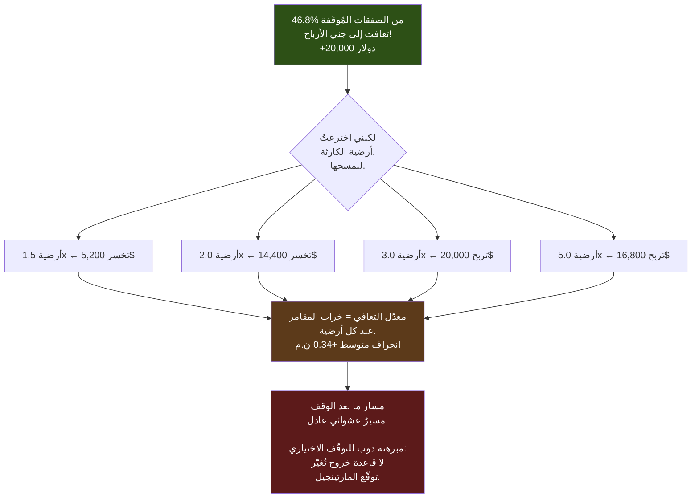
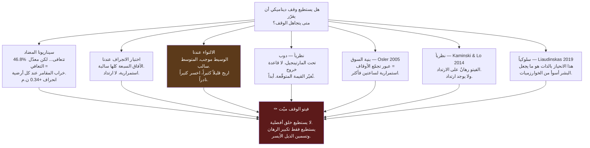

# تقرير: وقف الخسارة الديناميكي — هل نستطيع تجاهل الوقف والصمود؟

**تحقيقٌ كامل، من الشمعة الواحدة التي ألهمت الفكرة، إلى المبرهنة الرياضية التي أنهتها.
كل قياس، كل رقم، كل استشهاد، وكل خطأ ارتكبناه.**

التاريخ: 2026-07-13 · المهمّتان #2 و #3 · الفرع `fundamental-analysis`
الإيداعات: `9371842` (متتبّع الانحراف) · `1bb9089` (السيناريو المضاد)

> 🇬🇧 النسخة الإنجليزية: [`REPORT_dynamic_stop_loss.md`](REPORT_dynamic_stop_loss.md)

---

## فهرس المحتويات

| الجزء | المحتوى |
|---|---|
| **0** | الحكم، سلفاً |
| **1** | الفكرة بكلماتك أنت، والشمعة التي ألهمتها |
| **2** | لماذا لم نكن نستطيع حتى **طرح** السؤال (وما بنيناه) |
| **3** | كل تفصيلة في تنفيذ متتبّع الربح الحيّ |
| **4** | هندسة السرعة — وقياسٌ كذب عليّ بنسبة 74% |
| **5** | ما كشفه المتتبّع: الحرارة، والتنازل عن الربح، والفصل |
| **6** | السيناريو المضاد — ماذا حدث **فعلاً** حين تجاهلنا الوقف |
| **7** | المسح الذي دمّر النتيجة (خراب المقامر) |
| **8** | اختبار الانجراف — زخم أم ارتداد؟ |
| **9** | الفخّ المختبئ في الالتواء: لماذا تبدو الفكرة **صحيحة** |
| **10** | الأدبيات السابقة — ماذا يعرف العلم فعلاً |
| **11** | التقارب: خمسة خطوط مستقلة، جواب واحد |
| **12** | ما نجح · ما فشل · كيف نفعلها أفضل |
| **13** | ما ينبغي أن نبنيه **بدلاً** من ذلك |
| **14** | ملحق: كيف تعيد إنتاج كل شيء |

---

# الجزء 0 — الحكم، سلفاً

> **🍼 بلغة مبسّطة**
>
> طلبتَ وقف خسارة ذكيّاً يستطيع، لحظة اقتراب الوقف من التفعيل، أن يقرّر: *«لا، هذه مجرّد قفزة كاذبة —
> اصمد، سيعود السعر».*
>
> **بنينا الآلة اللازمة لاختبار ذلك، والجواب: لا يمكن أن ينجح. ليس لأنّ الشيفرة صعبة، بل بسبب طبيعة
> السوق نفسه في تلك اللحظة.**
>
> **من اللحظة التي يُضرب فيها وقف الخسارة، يصبح السعر رمية عملة عادلة.** ليس ضدّك قليلاً، ولا معك
> قليلاً — بل **رمية عملة تماماً**. تجاهل الوقف لا ينفع ولا يضرّ. **إنه فقط يُكبّر الرهان.**
>
> وثمّة تفصيلة أخبث: **في أغلب الأحيان، الصمود كان سينجح**. ولهذا تبدو الفكرة صحيحة إلى هذا الحدّ. لكن
> في المرّات النادرة التي لا ينجح فيها، ينهار السعر انهياراً كارثياً — وتلك الانهيارات تمحو كل الأرباح
> الصغيرة مجتمعة. **اربح قليلاً كثيراً، واخسر كثيراً نادراً.** هذا هو الشكل الرياضي **للإفلاس**.

> **⚙️ تقنياً**
>
> مسار السعر بعد الوقف هو تجريبياً **مارتينجيل** (عملية عادلة). تواتر التعافي يطابق **احتمال خراب
> المقامر** `b/(a+b)` عند **كل** مستوى أرضية-كارثة اختبرناه (انحراف متوسط **+0.34 نقطة مئوية** عبر 7
> مستويات). وبحسب **مبرهنة دوب للتوقّف الاختياري (Doob's Optional Stopping Theorem)**، لا يمكن لأي قاعدة
> توقّف أن تُغيّر توقّع المارتينجيل — فالفيتو لا يستطيع **تصنيع** أفضلية، بل فقط إعادة توزيع نفس المتوسط
> في **ذيل أيسر أسمن**. متوسط الانجراف بعد الوقف **سالب عند كل الآفاق السبعة** (استمرارية، لا ارتداد)،
> بما يتّسق مع Osler (2005)، وهو بالضبط النظام الذي تُثبت فيه Kaminski & Lo (2014) أنّ فيتو الوقف
> **يُدمّر** القيمة.

**فيتو وقف الخسارة ميّت — قتلته بياناتنا نفسها، وأكّدته بشكل مستقل أشدّ ورقتين بحثيتين صرامةً في المجال،
وتشرحه مبرهنة رياضية.**

**ما ليس ميّتاً:** اكتشفنا في الطريق مشكلةً **مختلفة**، حقيقية، بقيمة **145,640 دولاراً**. انظر الجزء 13.

---

# الجزء 1 — الفكرة، والشمعة التي ألهمتها

## أطروحتك، حرفياً

> *«الوقف الثابت أخذ الخسارة وخرج، بينما الاستمرار في العقد والتخلّي عن وقف الخسارة (لهذه الدقيقة فقط)
> كان سيجعل الخروج مربحاً. الهدف الأسمى هو صنع وقف خسارة ديناميكي ذكي يعرف متى يأخذ الخسارة ومتى يتجاهلها،
> ويقرّر أنّ إبقاء الصفقة مفتوحة (بوقف أوسع) سيحقّق ربحاً.»*

## الشمعة — بيانات ناسداك حقيقية، 2025-03-07، صباح تقرير الوظائف

| الوقت (شرق أمريكا) | افتتاح | أعلى | أدنى | إغلاق | **المدى** | **الحجم** |
|---|---|---|---|---|---|---|
| 08:27 | 20116.50 | 20121.25 | 20106.75 | 20112.50 | 14.5 | 223 |
| 08:28 | 20112.50 | 20119.00 | 20106.50 | 20113.25 | 12.5 | 228 |
| 08:29 | 20113.50 | 20119.50 | 20103.25 | 20110.25 | 16.25 | 410 |
| **08:30** ⚡ | **20107.50** | **20249.00** | **20061.50** | **20218.25** | **187.50** | **5,069** |
| 08:31 | 20219.00 | 20273.75 | 20204.25 | 20246.75 | 69.5 | 2,658 |

**الصفقة التي ألهمت كل شيء:**

- مركز **شراء** قرب إغلاق 08:29 عند **20110.25**.
- وقف خسارة صارم على بُعد 40 نقطة → **20070.25**.
- **أدنى** سعر لشمعة 08:30 كان **20061.50** — أي **8.75 نقطة تحت الوقف**.
- **خروج قسري. −40 نقطة = −800 دولار.**
- ثم أغلقت **نفس الدقيقة** عند **20218.25** — أي ما كان سيساوي **+108 نقطة = +2,160 دولاراً**.

> **🍼 بلغة مبسّطة** — طُرد الروبوت في أسوأ لحظة ممكنة بخسارة 800 دولار، ثم ذهب السوق **فوراً** في الاتجاه
> الذي راهن عليه. **هذا أكثر ما يُجنّ التاجر، وهو بالضبط ما يفعله خبر اقتصادي.**
>
> نظرتَ إلى هذا وقلت: **الوقف كان خاطئاً. كان يجب أن يعرف.**
>
> **إنه استنتاج معقول تماماً. وهو أيضاً — كما اتّضح — خاطئ. وهذا التقرير هو قصّة كيف اكتشفنا ذلك.**

---

# الجزء 2 — لم نكن نستطيع حتى طرح السؤال

قبل أي اختبار، اصطدمنا بجدار: **المحرّك لم يكن يعرف إطلاقاً كيف تسير الصفقة وهي مفتوحة.**

> **🍼 بلغة مبسّطة**
>
> المحرّك كان يسجّل ربح الصفقة **فقط لحظة إغلاقها**. أما وهي حيّة، فلم يكن يتتبّع **شيئاً**. لم يكن يعرف
> إن كنتَ رابحاً 50 نقطة أم خاسراً 30.
>
> لذا فإنّ سؤال *«هل كان هذا الخروج خسارةً حقيقية، أم أننا تنازلنا عن صفقة رابحة؟»* كان **بلا جواب
> حرفياً**. المعلومة لم تكن مسجّلة أصلاً.

> **⚙️ تقنياً**
>
> `open_trade` في `engine.py` عبارة عن قاموس بسيط بسعر دخول ثابت وثلاثة **خطوط سعرية مطلقة ساكنة**
> (`sl_soft_line`, `sl_hard_line`, `tp_hard_line`). لا شيء يتغيّر خلال حياة الصفقة. الربح يُحسب مرّة
> واحدة، في `_finalise()`، عند الخروج. لا توجد أي حالة «ربح غير محقّق» في أي مكان.

فكان لا بدّ للمهمّة #2 أن تسبق: **ابنِ المتتبّع أولاً، ثم اطرح السؤال.**

## ما بنيناه: MFE و MAE

رقمان معياريان، وهما أساس كل ما يلي:

| المصطلح | الاسم الكامل | المعنى |
|---|---|---|
| **MFE** | أقصى انحراف **مُواتٍ** (Maximum Favourable Excursion) | **أفضل** ربح غير محقّق رأته الصفقة قبل أن تُغلق |
| **MAE** | أقصى انحراف **معاكس** (Maximum Adverse Excursion) | **أسوأ** خسارة غير محقّقة رأتها قبل أن تُغلق |

> **🍼 بلغة مبسّطة** — تخيّل صفقة أُغلقت عند نقطة التعادل تماماً.
>
> هل كانت صفقة مملّة زحفت أفقياً؟ أم أنها كانت **رابحة بـ80 نقطة** في مرحلة ما، ثم أعادتها كلها؟ **الربح
> النهائي متطابق (صفر). لكن الصفقتين مخلوقان مختلفان تماماً.** و MFE هو ما يميّزهما.
>
> بالمثل: صفقة خرجت بخسارة −40 ولم تذهب ضدّك يوماً أكثر من 41 نقطة = **خسارة نظيفة**. أما التي كانت
> **+60 رابحة أولاً** ثم انهارت إلى −40 = **تنازل عن ربح** — **مرضٌ مختلف تماماً، وعلاجه مختلف تماماً.**

---

# الجزء 3 — كل تفصيلة في تنفيذ المتتبّع

## 3.1 قيد التطابق (لماذا يجب أن يكون اختيارياً)

> **🍼 بلغة مبسّطة**
>
> شبكة الأمان لدينا — الاختبار «الذهبي» — تعمل بأخذ **بصمة** لكل صفقة يُنتجها النظام، والتأكّد من أنها لا
> تتغيّر أبداً. لو أضفتُ حقولاً جديدة لكل صفقة، **لتغيّرت البصمة**، ولصرخت شبكة الأمان — رغم أنّ شيئاً لم
> يُكسر فعلاً.
>
> لذا فالمتتبّع **مُطفأ افتراضياً**. وحين يكون مُطفأً، لا يُضيف **شيئاً**، وكل رقم يبقى **مطابقاً بايتاً
> ببايت** لما كان.

> **⚙️ تقنياً**
>
> `perf/check_golden.py` يحسب بصمة SHA-256 لسجلّ الصفقات المأخوذة. إضافة مفاتيح بلا شرط كانت ستُحرّك تلك
> البصمة. لذا: `track_excursions: bool = False`. حين تكون `False`: **صفر مفاتيح جديدة**، صفر تغيير سلوكي.

## 3.2 الحقول الثلاثة المضافة (عند التشغيل)

```python
rec["mfe_points"]   # أفضل ربح غير محقّق، بالنقاط، >= 0
rec["mae_points"]   # أسوأ خسارة غير محقّقة، بالنقاط، <= 0
rec["bars_1m"]      # كم عاشت الصفقة، بشمعات الدقيقة
```

**مُوقّعة من منظور الصفقة نفسها**، فيصبح الشراء والبيع قابلين للمقارنة مباشرةً. مركز بيع يربح من **هبوط**
السعر يُسجّل MFE **موجباً**.

## 3.3 ثوابت الإشارة، ولماذا تُقيَّد

يجب أن يتحقّق `MFE ≥ 0 ≥ MAE` **دون شرط** — فالمنطق اللاحق يعتمد عليه. **فجوة سعرية** عبر سعر الدخول قد
تقلب الإشارة، لذا نُقيّد الاثنين:

```python
tr["mfe_points"] = max(float(mfe), 0.0)
tr["mae_points"] = min(float(mae), 0.0)
```

## 3.4 المحرّك الدقيق — دقّةٌ كانت ستُفسد كل شيء بصمت

مسار الخروج في المحرّك الدقيق (`_walk_exit_for_4h`) **يُستدعى مجدداً مرّة لكل شمعة قرار**. فالصفقة التي
تمتدّ عبر عدّة شمعات قرار يُستدعى مسارها عدّة مرّات.

> **🍼 بلغة مبسّطة** — لو أبقيتُ القمّة/القاع الجاريين **داخل** المسار، لكانت الصفقة **تنسى تاريخها** في كل
> مرّة يُعاد استدعاء المسار — ولكان MFE/MAE لكل صفقة طويلة **خاطئاً بصمت**، يعرض المقطع **الأخير** فقط.

> **⚙️ تقنياً**
>
> `run_hi` / `run_lo` يعيشان في **النطاق الخارجي** بجانب `bars_held` (الذي يحمل نفس المتطلّب تماماً)،
> ويُعلَنان `nonlocal` داخل المسار، ويُصفّران عند مساري الدخول. ويُختمان عند **كلا** مساري إغلاق الصفقة —
> المسار الرئيسي **و** مسار `FORCE_CLOSE` داخل الشمعة.

## 3.5 الحارس الذي يرفض أن يكون خاطئاً بصمت

`_apply_excursions` يُزاوج `trades` مع قائمة الحدود. لو أُضيفت صفقة **دون** تسجيل حدودها، لكان `zip()`
**يقتطع بصمت** ويُسيء إسناد انحرافات **كل صفقة تالية** — منتجاً أرقاماً خاطئة تبدو معقولة تماماً.

```python
if len(bounds) != len(trades):
    raise AssertionError(
        f"excursion bounds ({len(bounds)}) != trades ({len(trades)}) — a trade-append path is "
        "missing its exc_bounds.append(). Every MFE/MAE after it would be wrong."
    )
```

> **🍼 بلغة مبسّطة** — هذه هي فلسفة المشروع كلّه في خمسة أسطر. **العلّة الخطيرة ليست تلك التي تُسقط
> البرنامج، بل تلك التي تُعطيك بهدوء رقماً خاطئاً قابلاً للتصديق.**

---

# الجزء 4 — هندسة السرعة (وقياسٌ كذب بنسبة 74%)

## 4.1 القيد

`fast_engine` موجود لأنه **أسرع بنحو 200 ضعف** من المحرّك الدقيق. ويحقّق ذلك عبر **عدم المرور على شمعات
الصفقة إطلاقاً** — بل يحلّ الخروج بعمليات متّجهية (`argmax` على أقنعة منطقية).

**والتتبّع الساذج للربح الجاري كان سيدمّر هذا بالضبط.**

## 4.2 خط الأساس (قِيس قبل لمس أي شيء)

| الإطار | مللي ثانية/تشغيلة | تشغيلة/دقيقة |
|---|---|---|
| 4 ساعات | **32.8 ms** | 1,832 |
| 15 دقيقة | 107.2 ms | 560 |
| 5 دقائق | 134.9 ms | 445 |

## 4.3 المحاولة الأولى — والفخّ الذي كدتُ أقع فيه

التنفيذ البديهي: لكل صفقة، خذ أقصى قمّة عبر حياتها.

```python
hseg, lseg = hi[:ti + 1], lo[:ti + 1]
mfe = float(hseg.max()) - ep
mae = float(lseg.min()) - ep
```

**التكلفة المقيسة: +19.8% من المعالج.** غير مقبول.

**لكن الأهم — أنني قِستُ (profiled) بدل أن أخمّن:**

| القياس | النتيجة |
|---|---|
| مجموع العناصر التي يمسحها max/min فعلاً | 79,290 |
| وسيط طول الصفقة | 91 شمعة دقيقة |
| **التكلفة المعزولة للحساب نفسه (max/min)** | **0.8 ms فقط** |
| الزيادة الملحوظة | ~6.5 ms |

> **🍼 بلغة مبسّطة**
>
> **الحساب الفعلي استغرق 0.8 مللي ثانية. والزيادة كانت 6.5.** إذاً **88% من التكلفة لم تكن الحساب أصلاً.**
>
> بل كانت تكلفة **استدعاء** numpy. كل استدعاء لـnumpy له كلفة تجهيز ثابتة بضعة ميكروثوانٍ — لا تُذكر على
> مصفوفة كبيرة، لكننا كنّا نُجري نحو **ستة استدعاءات لكل صفقة × 265 صفقة ≈ 1,600 استدعاء** على مصفوفات
> **صغيرة**. **كنّا ندفع ثمن الطوابع البريدية، لا ثمن الطرد.**

## 4.4 الحل — استدعاء واحد بدل 1,600

`np.maximum.reduceat` يحسب **قِمَم مقاطع متعدّدة في استدعاء واحد**.

**حيلة التشابك:** `reduceat(arr, idx)` يختزل المقاطع `[idx[0],idx[1])`, `[idx[1],idx[2])`, … لذا نرصّ
الحدود هكذا: `[بداية₀, نهاية₀+1, بداية₁, نهاية₁+1, …]`. فتكون النتائج **الزوجية** هي الصفقات، والنتائج
**الفردية** هي **الفجوات** بين الصفقات، ونرميها.

```python
b = np.empty(2 * len(bounds), dtype=np.int64)
b[0::2] = [s for s, _ in bounds]
b[1::2] = [e + 1 for _, e in bounds]
seg_hi = np.maximum.reduceat(m_high, b)[0::2]     # استدعاء واحد، كل الصفقات
seg_lo = np.minimum.reduceat(m_low, b)[0::2]
```

هذا صحيح لأنّ **الصفقات لا تتداخل أبداً** (مركز واحد في كل مرّة)، فتكون الحدود غير متناقصة — وهو بالضبط ما
يتطلّبه `reduceat`.

**النتيجة: +19.8% ← +14.6% من المعالج.** و**صفر حين تكون الميزة مُطفأة**، وهي الحالة التي يعمل بها المُحسِّن.

## 4.5 🔴 القياس الذي كذب بنسبة 74%

**أول قياس سرعة أجريته أعلن زيادة +74%. وكان كاذباً تماماً.**

| التشغيلة | مُطفأ (ms) | التشغيلة | مُشغّل (ms) |
|---|---|---|---|
| 1 | 28.7 | 1 | 38.3 |
| 2 | 28.5 | 2 | 28.8 |
| 3 | **47.1** | 3 | 34.3 |
| 4 | **63.1** | 4 | 29.3 |

انظر لعمود «مُطفأ»: **من 28.5 إلى 63.1 مللي ثانية — نفس الشيفرة، تتفاوت 2.2 ضعف.**

**السبب:**

```
load average: 49.11, 52.32, 53.00        (على صندوق بـ32 خيط معالجة)
أكبر مستهلك للمعالج:  1602% python        ← حملة التحسين الخاصة بمسار العمل الآخر
```

> **🍼 بلغة مبسّطة**
>
> الخادم كان **مُشبعاً بالكامل** بمهمّة أخرى — عملية واحدة تستهلك 16 نواة. وبرنامجي كان يتقاتل على الفتات.
> ساعة الحائط تقيس *«كم استغرق هذا في العالم الحقيقي»*، وعلى آلة مزدحمة فهي تقيس أساساً **كم الآلة مزدحمة**.
>
> **الحل:** قِس **زمن المعالج** بدلاً من ذلك — `time.process_time()` — الذي يحسب عمل **برنامجك أنت فقط**
> ويتجاهل الجميع تماماً.
>
> **الدرس، وهو درسٌ كبير: لا تقِس الأداء أبداً على آلة محمّلة بساعة حائط.** كدتُ أرفض تنفيذاً سليماً تماماً
> لأنّ برنامجاً آخر كان مشغولاً.

## 4.6 البوابات الثلاث — كلها خضراء

| البوابة | ما تُثبته | النتيجة |
|---|---|---|
| **الذهبي 6/6** | مع إطفاء الميزة، كل إطار **مطابق بايتاً ببايت** | ✅ 4h $148,670 · 2h $105,462 · 1h $80,339 · 15m $77,098 · 5m $23,926 · 2m $29,777 |
| **تطابق المحرّكين** | المحرّكان يتّفقان **صفقةً بصفقة** مع تشغيلها | ✅ 11/11 حالة، صفر اختلاف |
| **اختبارات الوحدة** | ثوابت الإشارة، التقويس، سلامة مسافة الوقف، السرعة | ✅ 9/9 |

---

# الجزء 5 — ما كشفه المتتبّع

بطل ناسداك 4 ساعات · SL 30/40 · TP 60 · **642 صفقة (269 رابحة / 373 خاسرة)**

## 5.1 التنازل عن الربح — هل كانت خاسراتنا رابحةً يوماً؟

| صفقات خاسرة كانت **يوماً** رابحة بهذا القدر | العدد | % من الخاسرات | القيمة |
|---|---|---|---|
| ≥ +20 نقطة | **158** | **42.4%** | 400$ للصفقة |
| ≥ +30 نقطة | 97 | 26.0% | 600$ |
| ≥ +40 نقطة | 58 | 15.5% | 800$ |
| ≥ +60 نقطة | 0 | 0.0% | — |

- وسيط ذروة ربح الصفقة **الخاسرة**: **15.5 نقطة (310 دولاراً)**
- **إجمالي الربح الذي بلغناه ثم أعدناه: 145,640 دولاراً** عبر 373 صفقة خاسرة

> **🍼 بلغة مبسّطة** — **أربع من كل عشر صفقات خاسرة كانت يوماً *رابحة* بـ20 نقطة على الأقل.** صعدت، ثم
> عادت كل الطريق هبوطاً عبر الوقف. هذا **145,640 دولاراً** من الربح **لمسه** نظامنا ثم تخلّى عنه.
>
> **هذه مشكلة حقيقية وكبيرة وكانت غير مرئية تماماً. تذكّرها — ستعود في الجزء 13.**

## 5.2 الحرارة — كم اقتربت صفقاتنا الرابحة من الموت؟

| المئين لـ«حرارة» الصفقات الرابحة (نقاط ضدّنا) | القيمة |
|---|---|
| 50 (الوسيط) | 11.2 نقطة |
| 75 | 25.0 |
| 90 | 32.1 |
| 95 | 34.8 |
| **99** | **37.9** |
| **وقف الخسارة الصارم عند** | **40.0** |

**رابحات اقتربت لمسافة 25% من الوقف (حرارة ≥ 30): 35 من 269 = 13.0%**

> **🍼 بلغة مبسّطة** — **99% من صفقاتك الرابحة تنعكس عند 37.9 نقطة. ووقفك عند 40.**
>
> هذه ليست مصادفة وليست وضعاً سيّئاً — إنه يقع **بالكاد** بعد النقطة التي تنعكس عندها كل الرابحات تقريباً.
> من ضبط ذلك الوقف أحسن صنعاً.

## 5.3 الفصل — هل يستطيع **أي** وقف ثابت التمييز بين الرابح والخاسر؟

| | الحرارة المتحمّلة (نقاط) |
|---|---|
| **الرابحات** | الوسيط **11.2**، المتوسط 14.1 |
| **الخاسرات** | الوسيط **41.5**، المتوسط 47.0 |

> **احتمال(صفقة رابحة عشوائية تحمّلت حرارة أكثر من خاسرة عشوائية) = 0.014**

> **🍼 بلغة مبسّطة** — **تداخل 1.4% فقط.** مقدار ذهاب الصفقة ضدّك يفصل الرابح عن الخاسر **فصلاً شبه تام**.
> إن ذهبت الصفقة 40 نقطة ضدّك، فهي خاسرة حقيقية **بنسبة 98.6%**.

> **⚠️ خطأ ارتكبتُه هنا، وصحّحته**
>
> استخدمتُ هذا في البداية للاحتجاج بأنّ الوقف الديناميكي بلا جدوى. **كان ذلك مبالغة، وخلط بين ادّعاءين
> مختلفين:**
>
> - *«الحرارة تفصل الرابح عن الخاسر»* ← **الوقف الثابت موضوعٌ جيّداً**. **صحيح.**
> - *«إذاً لا يمكن لأي وقف ديناميكي أن يتفوّق عليه»* ← **لا يلزم منه.**
>
> السؤال الحقيقي أضيق: **بين الصفقات التي *فعلاً* خرجت بالوقف، هل توجد مجموعة فرعية قابلة للتعافي؟**
> اختبار الفصل عندي لم يسأل ذلك أبداً. **المستخدم اعترض، وكان محقّاً**، والجزء 6 هو الاختبار الذي كان يجب
> أن أُجريه من البداية.

---

# الجزء 6 — السيناريو المضاد: ماذا حدث فعلاً؟

**الطريقة الأمينة الوحيدة للإجابة:** لكل صفقة خرجت بالوقف، **أعِد تشغيلها مع تعطيل الوقف** وانظر ماذا حدث.

## القواعد — أُعلنت **قبل** التشغيل، كي لا تُضبط لتجميل النتيجة

1. جني الأرباح يبقى **كما هو تماماً** (+60).
2. أغطية الوقت / نهاية اليوم تبقى **كما هي تماماً**.
3. **«تجاهل الوقف» ليس مخاطرة غير محدودة.** تُطبَّق دائماً **أرضية كارثة**. بدونها نكون نقيس نظام مراهنة
   مارتينجيل، لا استراتيجية.
4. أي صفقة لم تُحسم خلال يوم تداول **تُستبعد** — المركز المفتوح **لا يُحسب أبداً** ربحاً.

## النتيجة (أرضية الكارثة = 3× الوقف = 120 نقطة)

| | |
|---|---|
| الصفقات التي خرجت بالوقف الصارم | **235** |
| **تعافت كل الطريق إلى جني الأرباح** | **110 (46.8%)** |
| سقطت عبر أرضية الكارثة | 125 (53.2%) |
| غير محسومة | 0 |
| ما ربحناه **فعلاً** (باحترام الوقف) | **−188,000$** |
| ما **كنّا** سنربحه (بتجاهل الوقف) | **−168,000$** |
| **الفرق** | **+20,000$** |

> **🍼 بلغة مبسّطة**
>
> **نصف الصفقات التي خرجت بالوقف تقريباً مضت لتتعافى بالكامل حتى جني الأرباح.**
>
> **كنتَ محقّاً.** تلك الخروجات لم تكن كلها خسائر حقيقية. وتجاهل الوقف كان سيربح **20,000 دولار إضافية**.
>
> عند هذه النقطة من التحقيق، بدت فكرتك **مُثبَتة**.

**لكن انظر لسطر التعادل:**

- معدّل التعافي المطلوب للتعادل: **44.4%**
- معدّل التعافي المحقّق: **46.8%**
- **الهامش: 2.4 نقطة مئوية.**

هامش 2.4 نقطة على 235 صفقة هامشٌ **رفيع**. وهو يعتمد كلياً على **أرضية الكارثة — وهي رقم اخترعتُه أنا.**

**لذا مسحتُه.**

---

# الجزء 7 — المسح الذي دمّر النتيجة

| أرضية الكارثة | النقاط | **% التعافي** | **% التعادل** | الهامش | الربح مقابل احترام الوقف |
|---|---|---|---|---|---|
| 1.5× | 60 | 15.7% | **16.7%** | **−1.0** | −5,200$ |
| 2.0× | 80 | 26.4% | **28.6%** | **−2.2** | −14,400$ |
| 2.5× | 100 | 35.3% | **37.5%** | **−2.2** | −16,400$ |
| **3.0×** | 120 | 46.8% | **44.4%** | **+2.4** | **+20,000$** |
| 3.5× | 140 | 51.9% | **50.0%** | **+1.9** | +19,600$ |
| 4.0× | 160 | 56.9% | **54.5%** | **+2.4** | +26,400$ |
| 5.0× | 200 | 62.6% | **61.5%** | **+1.1** | +16,800$ |
| | | | **الانحراف المتوسط** | **+0.34 ن.م** | |

## 💀 المعنى — الاكتشاف القاتل

**معدّل التعافي يتتبّع معدّل التعادل عند *كل* أرضية. الانحراف المتوسط: +0.34 نقطة مئوية. صفر عملياً.**

> **⚙️ تقنياً**
>
> صيغة التعادل هي `الخسارة / (الربح + الخسارة)`. **وهذا بالضبط احتمال خراب المقامر** — احتمال أن يلمس
> **مسير عشوائي بلا انجراف** القيمة `+a` قبل أن يلمس `−b`:
>
> ```
> P(بلوغ +a قبل −b)  =  b / (a + b)
> ```
>
> ومعدّل تعافينا التجريبي **يطابق هذا عند كل مستوى**. مسار السعر بعد الوقف هو، تجريبياً، **مارتينجيل**.

> **🍼 بلغة مبسّطة**
>
> تخيّل رمي عملة عادلة: خطوة يميناً على «صورة»، وخطوة يساراً على «كتابة». **ما احتمال أن تبلغ +60 قبل أن
> تبلغ −120؟** الرياضيات تُعطي جواباً دقيقاً: **44.4%**.
>
> **ونحن قِسنا 46.8%.**
>
> جرّب هدفاً آخر: احتمال بلوغ +60 قبل −80؟ الرياضيات تقول **28.6%**. **ونحن قِسنا 26.4%.**
>
> **عند كل مسافة جرّبناها، تصرّف السوق تماماً كرمية عملة.**
>
> إذاً الـ**20,000 دولار** عند أرضية 3× **لم تكن أفضليةً قط**. كانت **ضجيج الـ±2 نقطة مئوية**. حرّك
> الأرضية إلى 2× فتصبح **−14,400 دولاراً**. *«الربح» كان بالكامل أثراً جانبياً للرقم الذي اخترتُه صدفةً.*



## المبرهنة التي تجعل هذا حتمياً

**مبرهنة دوب للتوقّف الاختياري:** إن كانت عملية السعر مارتينجيل، فلأي قاعدة توقّف τ — وقف ثابت، وقف متحرّك،
فيتو تقديري، الاحتفاظ حتى الإغلاق، أي شيء —

```
E[X_τ] = E[X_0]
```

> **🍼 بلغة مبسّطة** — **لا توجد قاعدة خروج تستطيع تغيير القيمة المتوقّعة للعبة عادلة. ولا واحدة.** إنها
> **مبرهنة**، لا رأي.
>
> إذاً فيتو الوقف **لا يستطيع خلق ربح**. كل ما يفعله هو **إعادة توزيع نفس المتوسط** — محوّلاً خسارة محدودة
> بـ40 نقطة إلى خسارة **غير محدودة** ومعتمدة على المسار. نفس المتوسط. **ذيل أسمن بكثير.** وبعد خصم العمولات
> والانزلاق السعري: **أسوأ صراحةً**.

---

# الجزء 8 — اختبار الانجراف: زخم أم ارتداد؟

فكرة الفيتو كلها رهانٌ على أنّ السعر **يرتدّ إلى المتوسط** بعد الوقف. فلنقِس ذلك مباشرة.

**المنهج:** لكل صفقة من الـ235، قِس انجراف السعر **بعد** شمعة الوقف، **في اتجاه الصفقة نفسها**. موجب = عاد
نحونا (ارتداد). سالب = استمرّ ضدّنا (زخم).

| الأفق بعد الوقف | **متوسط الانجراف** | **الوسيط** | الخطأ المعياري | إحصائية t |
|---|---|---|---|---|
| 5 دقائق | **−2.11 نقطة** | +0.50 | 1.65 | −1.27 |
| 15 دقيقة | **−4.28** | −0.25 | 2.76 | −1.55 |
| 30 دقيقة | **−3.06** | +0.00 | 3.87 | −0.79 |
| 60 دقيقة | **−4.81** | −0.75 | 5.24 | −0.92 |
| 120 دقيقة | **−0.02** | **+2.75** | 6.61 | −0.00 |
| 240 دقيقة | **−0.95** | **+7.50** | 9.34 | −0.10 |
| 480 دقيقة | **−5.31** | −4.50 | 10.98 | −0.48 |

**كل الآفاق السبعة سالبة في المتوسط.** ولا واحد منها ذو دلالة إحصائية منفرداً (|t| < 1.96) — لكن **الإشارة
لا تنقلب أبداً**.

> **🍼 بلغة مبسّطة** — بعد ضرب وقفك، السعر **لا يميل** للعودة. بل إن كان ثمّة ميل، فهو الاستمرار **ضدّك**.
> **لا يوجد ارتداد إلى المتوسط لتراهن عليه.**

---

# الجزء 9 — 🎯 الفخّ: لماذا تبدو الفكرة **صحيحة** إلى هذا الحد

**انظر للجدول مجدداً. انظر للعمودين.**

| الأفق | المتوسط | الوسيط |
|---|---|---|
| 120 دقيقة | **−0.02** ❌ | **+2.75** ✅ |
| 240 دقيقة | **−0.95** ❌ | **+7.50** ✅ |

**الوسيط موجب بينما المتوسط سالب.**

> **🍼 بلغة مبسّطة — هذه أهم فقرة في التقرير كلّه**
>
> **في أغلب الأحيان، الصمود عبر الوقف ينجح.** النتيجة النموذجية **موجبة** — عند أربع ساعات، الصفقة الوسيطة
> كانت ستعود **+7.50 نقطة لصالحك**.
>
> **لكن أحياناً، ينهار السعر انهياراً كارثياً.** وتلك الكوارث النادرة **ضخمة إلى حدّ أنها تبتلع كل الأرباح
> الصغيرة مجتمعة.**
>
> هذا **عائد ملتوٍ يساراً**: **اربح قليلاً كثيراً — واخسر كثيراً نادراً.**
>
> **وهذا بالضبط لماذا كان حدسك قوياً إلى هذا الحد.**
>
> في كل مرّة كنتَ ستتجاهل فيها الوقف، كنتَ **غالباً** ستُثبت أنك على حق. تلك هي الصفقات التي تتذكّرها —
> الحيّة، المُرضية، التي *عرفتَ* أنها ستعود، وعادت.
>
> **أما المرّة الواحدة من عشر التي استمرّ فيها الهبوط، فهي التي لا يتذكّرها أحد. وهي التي تلتهم كل شيء.**
>
> **شكل العائد هذا — أرباح صغيرة متكرّرة وخسائر كارثية نادرة — هو التوقيع الرياضي للإفلاس.** إنه شكل نظام
> مراهنة مارتينجيل، وبيع الخيارات المكشوفة، والتقاط القروش أمام مِحدلة بخارية. **دائماً يبدو أنه ينجح. حتى
> اللحظة التي لا ينجح فيها.**

---

# الجزء 10 — الأدبيات السابقة: ماذا يعرف العلم فعلاً

## 10.1 الانقلاب — الفلكلور **معكوس**

**Osler, "Stop-Loss Orders and Price Cascades in Currency Markets"**
[NY Fed Staff Report 150](https://www.newyorkfed.org/medialibrary/media/research/staff_reports/sr150.pdf) ·
*Journal of International Money & Finance* 24(2), 2005

**الدراسة الصارمة الوحيدة الموجودة لتجمّعات أوامر الوقف الحقيقية.** دفتر الأوامر الكامل لبنك صرافة رئيسي:
**9,655 أمراً، بقيمة اسمية 55 مليار دولار**، آب 1999 – نيسان 2000.

| نوع الأمر | موقعه | ماذا يحدث |
|---|---|---|
| تجمّعات **جني الأرباح** | **عند** الأرقام المستديرة | السعر **يقترب، يرتدّ، ينعكس** (تغذية راجعة سالبة) |
| تجمّعات **وقف الخسارة** | **بعد** الأرقام المستديرة بقليل | حين **تُعبَر**، السعر **يتسارع ويستمرّ** (تغذية راجعة موجبة) |

- الانعكاس عند الرقم المستدير ذو دلالة لأقل من **30 دقيقة**.
- **الاستمرارية بعد العبور** تبقى ذات دلالة **ساعتين على الأقل**.

> **🍼 بلغة مبسّطة**
>
> **الارتداد الذي يؤمن به التجّار حقيقي — لكنه يحدث عند مستوى لم تُوقَف عنده أبداً.** يحدث عند مستويات
> **يقترب منها السعر ويصمد**.
>
> **وضربُ وقفك هو، بالتعريف، حالة العبور.** وحالة العبور **تستمرّ**. الأدلة تقول إنّ الحركة المتوقّعة بعد
> ضرب وقفك هي **مزيد من الحركة ضدّك** — لساعات.

**تحفّظان يجب ذكرهما بأمانة:**
1. **أحجام الأثر ضئيلة جداً**: 0.061% مقابل 0.054%. ذات دلالة إحصائية قاطعة (p < 0.001) لكنها **اقتصادياً
   لا شيء تقريباً**.
2. **إنها سوق صرف أجنبي بوساطة تجّار 1999–2000**، حيث يحمل التاجر دفتر الأوامر ويعرف **أين توجد الأوقاف
   حرفياً**. **لم يُعِد أحدٌ إنتاج نتائج Osler على عقود مؤشرات CME الحديثة.** هذه فجوة حقيقية — لا أُخفيها.

**تأكيد داخل فئة أصولنا:** Kirilenko, Kyle, Samadi & Tuzun, *"The Flash Crash"*, **Journal of Finance
(2017)** — بيانات CME على مستوى الحسابات لعقود E-mini S&P. توثّق شلالات الوقف كـ**مُضخِّم** حقيقي — **استمرارية
مجدداً، لا انعكاس**.

## 10.2 Kaminski & Lo — الورقة التي تُغلق الفخّ

**"When Do Stop-Loss Rules Stop Losses?"**، *Journal of Financial Markets* 18 (2014), 234–254.

| القضية | تقول |
|---|---|
| **1 (مسير عشوائي)** | `Δμ = −p₀·π`. علاوة التوقّف هي **علاوة المخاطرة الضائعة** خلال فترة الخروج. لاستراتيجية **داخل اليوم** تحتفظ دقائق، π ≈ 0 ← **الأوقاف محايدة توقّعياً قبل التكاليف** |
| **2 (AR(1))** | الأوقاف **تُضيف** قيمة حين ρ > 0 (**زخم**). و**تُدمّر** القيمة حين ρ < 0 (**ارتداد**) |

> **🍼 بلغة مبسّطة — الآن اعكس القضية 2، لأنّ هذا ما تفعله ميزتك**
>
> **فيتو الوقف رهانٌ على أنّ السوق يرتدّ إلى المتوسط بعد الوقف.**
>
> بيانات Osler تقول إنّ نظام ما بعد الوقف هو **زخم**.
>
> واختبار الانجراف عندنا يقول إنّ نظام ما بعد الوقف هو **زخم** (الآفاق السبعة كلها سالبة).
>
> **النظام الوحيد الذي يُربح فيه الفيتو هو النظام الوحيد الذي نحن — بالبرهان — لسنا فيه.**

**تجريبياً** (عقود مؤشرات يومية 1993–2011): وقف الخسارة أنتج **+1.5% عائد، −5% تقلّب، شارب +20%**. الأوقاف
**ساعدت**.

**وتأكيداً — Han, Zhou & Zhu, "Taming Momentum Crashes":** وقف 10% على عشيرات الزخم (1926–2013) **ضاعف
شارب أكثر من مرّتين (0.17 ← 0.37–0.40)** وخفّض أسوأ خسارة شهرية من **−49.8% إلى −11.4%**.

## 10.3 🔴 الورقة التي ينبغي أن توقفك تماماً

**Liaudinskas (2019), "Human vs. Machine: Disposition Effect Among Algorithmic and Human Day-Traders"**
— Barcelona GSE WP 1133. بيانات بدقّة الميلي ثانية، بورصة كوبنهاغن.

حرفياً من الملخّص:

> *«(1) أثر التصرّف **كبير لدى البشر لكنه معدوم عملياً لدى الخوارزميات**؛ (2) هذا الفارق... يُعزى جزئياً إلى
> نظرية الاحتمال، ومنفعة التحقيق، و**الاعتقاد بالارتداد إلى المتوسط**؛ (3) أثر التصرّف **يضرّ بأداء التداول**.»*

> **🍼 بلغة مبسّطة — اقرأ هذا مرّتين**
>
> «أثر التصرّف» (disposition effect) هو نزعة الإنسان إلى **التمسّك بالصفقات الخاسرة** لأنه يعتقد أنها ستعود.
>
> هذه الدراسة قاسته لدى البشر ولدى الخوارزميات. **البشر مصابون به بشدّة. الخوارزميات لا تكاد تملكه. وهو
> يضرّ بالأداء.**
>
> **الميزة المقيسة التي تملكها الخوارزميات على البشر هي بالضبط *غياب هذا السلوك*.**
>
> وفيتو الوقف ميزةٌ **تُعيد حقن الانحياز البشري الوحيد المحدّد الذي يجعل غيابُه الخوارزميات أفضل من البشر** —
> والورقة تسمّي الآلية صراحةً: **«الاعتقاد بالارتداد إلى المتوسط»**، وهو بالضبط الاعتقاد الذي يُرمّزه الفيتو.
>
> **لو اضطررتُ لقتل هذه الفكرة باستشهاد واحد، لكان هذا.**

**داعمات:**
- **Odean (1998)**، *J. Finance* 53(5) — 10,000 حساب، 97,483 صفقة. المستثمرون أميَل بـ1.5 ضعف لبيع الرابح.
  *«المستثمرون الذين يبيعون الرابحين ويحتفظون بالخاسرين لأنهم يتوقّعون تفوّق الخاسرين... **مخطئون** في
  المتوسط.»* الرابحون الذين باعوهم **تفوّقوا على الخاسرين الذين احتفظوا بهم بـ3.4% خلال السنة التالية**.
- **Locke & Mann (2005)**، *JFE* 76(2) — نحو **300 محترف عقود آجلة في قاعة CME** (فئة أصولنا، وأفقنا
  الزمني). كل تاجر يحتفظ بالخاسر أطول من الرابح — لكن **الأقلّ ربحيةً يحتفظون بالخاسرين الأطول، والأكثر
  ربحيةً يقطعونهم الأسرع**.

## 10.4 ما هو فلكلور (واستشهاد **ملفَّق**)

| الادّعاء | الحالة |
|---|---|
| تجمّع أوامر الوقف/الجني عند الأرقام المستديرة | ✅ **ثابت** (Osborne 1962; Harris 1991, *RFS*; Osler 2003) |
| «الينبوع/الاندفاع» عند Wyckoff بنجاح 75–85% | ❌ **فلكلور.** لا بيانات، لا منهج، لا عيّنة معلنة في أي مكان |
| SFP «نسبة ربح 68%، عامل ربح 1.92» | ❌ **فلكلور.** مدوّنات عملات رقمية — **وتناقضها مدوّنات أخرى تذكر 45–60% لنفس النمط** |
| «اقتناص السيولة» عند ICT | ❌ **فلكلور، وغير قابل للتفنيد أصلاً** — محلّلان يرسمان كنساً مختلفاً على نفس الرسم |
| أنماط الشموع/الذيول تتنبّأ بالعوائد | ❌ **مُفنَّدة مراراً** — Marshall/Young/Rose 2006 (*JBF*)؛ Marshall/Young/Cahan 2008 (100 سهم، 1975–2004 → صفر في **كل** فترة فرعية)؛ Horton 2009 (349 سهماً → صفر) |
| «Thompson & Lee (2017): 45% من الانعكاسات فخاخ صاعدة» | 🚨 **يبدو ملفَّقاً.** تُتبِّعناه عبر مدوّنات SEO كثيرة؛ **لا مجلّة، لا DOI، لا ورقة.** **لا تستشهد به** |

> **⚠️** ملخّصٌ آليّ لمحرّك بحث أكّد أنّ هذه الأنماط *«موثّقة جيداً في الأدبيات الأكاديمية»* — بينما استشهد
> بمزارع محتوى فقط. **هي ليست كذلك.** ولا واحد من Wyckoff / turtle-soup / SFP / ICT اختُبر قط في مجلّة
> محكّمة.

**مُثبَت، لكن ليس من بيانات الأسعار:** التجّار **قد** تعمّدوا فعلاً التداول لتفعيل أوقاف العملاء —
[CFTC ضد دويتشه بنك، 2018](https://www.cftc.gov/PressRoom/PressReleases/7682-18) (30 مليون$) و
[CFTC ضد جي بي مورغان، 2020](https://www.cftc.gov/PressRoom/PressReleases/8260-20) (920 مليون$). **لكن تلك
القضايا احتاجت سجلات محادثات داخلية** — أي أنّ السلوك كان **غير قابل للكشف من بيانات الأسعار وحدها**، وهي
كل ما نملك.

## 10.5 ترتيب الخصائص — وهو **عكس** حماس التجّار

| الترتيب | الخاصية | الدليل |
|---|---|---|
| **1** | **القرب من رقم مستدير** | ✅ **دعم أكاديمي حقيقي** (Osborne 1962; Harris 1991; Osler) |
| 2 | إغلاق عائد داخل المدى | تعريفي (هذا **هو** تعريف الكنس، لا متنبّئ به) |
| 3 | القرب من قمم/قيعان أو مستويات الجلسة | معيار عند الممارسين، بلا تحقّق أكاديمي |
| 4 | حجم الشمعة نسبةً لـATR | إطار Crabel، بلا إعادة إنتاج مستقلّة |
| 5 | **نسبة الذيل** | ⚠️ **ضعيف — مُفنَّد مراراً بمفرده** |
| 6 | **الدرجة المعيارية للحجم** | ⚠️ **الأضعف.** Karpoff 1987: الحجم يرتبط بـ**المقدار**، لا بـ**الاتجاه** |

> **🍼 بلغة مبسّطة** — لاحظ أنّ الخاصيّتين اللتين يلجأ إليهما كل تاجر أولاً — **الذيل الطويل وقفزة الحجم** —
> هما الأقلّ دليلاً على الإطلاق. أما التي تملك دعماً أكاديمياً حقيقياً (القرب من رقم مستدير) فلا يتحدّث عنها أحد.

**والأهم — ما **لا** نستطيع حسابه:** تدفّق الأوامر (delta/CVD)، البصمة، الامتصاص، اختلال العرض/الطلب، عمق
الدفتر، مواقع الأوقاف الفعلية. **نملك شمعات دقيقة OHLCV فقط.** وعدّة خصائص يزعم الممارسون أنها تجعل كشف
الكنس ناجحاً هي **بالضبط تلك التي لا نملكها**.

## 10.6 الأوقاف المتحرّكة / أوقاف التعادل — البديل ضعيف أيضاً

| المصدر | النتيجة |
|---|---|
| **Dai, Marshall, Nguyen & Visaltanachoti (2021)**, *Int'l Review of Finance* 21(4) | الأوقاف المتحرّكة **تخفض المخاطرة** لكنها تُعطي **عوائد أدنى ونسبة شارب أدنى** |
| **Glynn & Iglehart (1995)**, *Management Science* 41(6) | صيغة مغلقة تحت الحركة البراونية: **توقّع صفري عند انجراف صفري**، وسالب بعد التكاليف |
| **Cesar Alvarez** — 975 صفقة، Russell 1000، 2005–2015 | *«الأوقاف المتحرّكة كانت أضعف أداءً باستمرار، مهما كان أسلوب التقييم.»* وقف الخسارة الأقصى البسيط كان الأفضل |
| **Kevin Davey — 567,000 اختبار رجعي، 40 سوق عقود آجلة، 15 نوع خروج** | الأوقاف المتحرّكة جاءت **تحت** أوقاف التعادل، التي جاءت تحت أهداف الربح البسيطة |
| **Dave Mabe** — أوقاف تعادل، توقيتات كثيرة | *«لا تركيبة حسّنت الربحية. **كلها جعلت النظام أسوأ.**»* |

## 10.7 تعلّم الآلة — الفجوة حقيقية، والأفخاخ كذلك

**الشيء الذي وصفتَه بالضبط — مصنّف يعمل عند تفعيل الوقف ويتنبّأ بـ«هل سيتعافى؟» — غير موجود في الأدبيات
المنشورة.** هذه **فجوة حقيقية**، لا فشل بحث.

أقرب آلية هي **López de Prado, *Advances in Financial Machine Learning* (2018)** — **طريقة الحواجز الثلاثة**
و**الوسم الفوقي (meta-labeling)**. لكنها مبنية للـ**تصفية قبل الدخول**، لا لـ**فيتو بعد التفعيل**.

**أنماط الفشل التي يجب التصميم ضدّها، بترتيب الأهمية:**

1. **🔴 التقييم خارج السياسة (أعمق مشكلة، وغير معالَجة في أدبيات التداول إطلاقاً).** الصمود عبر الوقف
   **فعلٌ يُغيّر المسار المتحقّق**. لدينا بيانات مسجّلة تحت *سياسة سلوك* («أوقف دائماً») ونريد تقييم *سياسة
   هدف* («أوقف أحياناً»). هذا رسمياً **تقييم خارج السياسة**، وهو موثوق فقط **قرب السياسة**. سيناريونا المضاد
   (الجزء 6) صالح **تقريبياً** فقط لأننا **آخذو سعر بحجم صغير** — وهذا افتراض حامل، وأقوله بصوت عالٍ.
2. **انحياز الاختيار بالبناء** — مجموعة التدريب **فقط** صفقات بلغت الوقف.
3. **تسرّب التسمية** — «هل تعافى خلال N شمعة» يُبنى بأثر رجعي ببساطة. يحتاج **تصفية K-fold مُطهَّرة + حظر
   زمني** وإلا أظهر مهارةً وهمية.
4. **عتبة موزونة بالعائد، لا بالدقّة.** حتى لو تعافى X%، فالذين لا يتعافون لهم **ذيل أيسر سمين** يهيمن على
   الأرباح. (انظر الجزء 9 — قِسنا هذا بالضبط.)
5. **الأدلّة الحيّة: معدومة.** لا مثال مُدقَّق موثوق لنموذج خروج بتعلّم آلي نجح فعلياً.

---

# الجزء 11 — التقارب: خمسة خطوط مستقلة، جواب واحد



**كل خطّ دليلٍ مستقل — قياسان من عندنا، واكتشافٌ توزيعي من عندنا، ومبرهنة، والدراسة البنيوية الصارمة
الوحيدة، والورقة السلوكية الحاسمة — يشير إلى نفس الاتجاه.**

لم أرَ سؤالاً في هذا المشروع يُجاب بهذا الاتّساق.

---

# الجزء 12 — ما نجح · ما فشل

## ✅ ما نجح

| | |
|---|---|
| **بنينا القياس قبل الميزة** | متتبّع MFE/MAE كان شرطاً مسبقاً. بدونه كان السؤال **غير قابل للطرح حرفياً**. |
| **مسحتُ المُعامل الذي اخترعتُه** | «ربح» الـ20,000 دولار كان موجوداً **فقط** عند أرضية الكارثة التي اخترتُها صدفة. المسح كشف بنية «خراب المقامر» — **وقتل النتيجة. لو شحنتُ على أول رقم، لشحنتُ ضجيجاً.** |
| **المستخدم اعترض، وكان محقّاً** | حجّتي الأولى (تداخل الحرارة 1.4%) خلطت بين *«الوقف الثابت موضوع جيداً»* و*«لا وقف ديناميكي يتفوّق عليه»*. إجباري على إجراء السيناريو المضاد الحقيقي أنتج جواباً **أقوى وأنظف بكثير**. |
| **القياس بدل التخمين** | المتتبّع الساذج كلّف +19.8%، والحساب نفسه كان 0.8 ms فقط منها. التخمين كان سيقودني للتحسين الخاطئ. |
| **النظرية والبيانات تطابقتا تماماً** | منحنى تعافينا التجريبي أعاد إنتاج صيغة خراب المقامر بفارق 0.34 نقطة مئوية. **تحقّقٌ قويّ جداً** لسلامة القياس والاستدلال معاً. |

## ❌ ما فشل

| الخطأ | العاقبة | الدرس |
|---|---|---|
| **بالغتُ في الاستنتاج من تداخل الحرارة** | زعمتُ موت الفكرة قبل إجراء الاختبار الحقيقي | *«الخاصية X تفصل الفئات جيداً» ≠ «لا توجد خاصية أفضل».* ادّعاءان مختلفان. |
| **🔴 قِستُ الأداء على خادم مُشبع بساعة حائط** | أعلنتُ **تراجعاً في السرعة بنسبة +74% كان محض خيال** | **لا تقِس بساعة حائط تحت التزاحم.** استخدم `time.process_time()`. |
| **أول اختبار انجراف استخدم البوابة الخاطئة** | عمل بصمت على 70 صفقة بدل 235 — **استراتيجية مختلفة** | **حين يبدو حجم العيّنة خاطئاً، توقّف واكتشف السبب.** كدتُ أُبلّغ رقماً من مجموعة صفقات خاطئة. |
| **اخترعتُ أرضية الكارثة دون التنبيه لذلك** | أول نتيجة «+20,000$» كانت أثراً لاختياري الاعتباطي | **أي رقم تخترعه *أنت* يجب مسحه قبل تصديق نتيجة تعتمد عليه.** |

---

# الجزء 13 — 🎯 ما ينبغي أن نبنيه **بدلاً** من ذلك

**التحقيق قتل فيتو الوقف — لكنه كشف في الطريق مشكلةً حقيقية وكبيرة وكانت غير مرئية.**

## التنازل عن 145,640 دولاراً

| | |
|---|---|
| صفقات خاسرة كانت **يوماً ≥ +20 نقطة رابحة** | **158 من 373 (42.4%)** |
| صفقات خرجت بالوقف وكانت **قد بلغت ≥ +30 صعوداً** | **67 من 235 (28.5%)** |
| **إجمالي الربح المُبلَغ ثم المُعاد** | **145,640 دولاراً** |

> **🍼 بلغة مبسّطة**
>
> **ليس لدينا وقفٌ يُفعَّل مبكّراً جداً. لدينا رابحات تتحوّل إلى خاسرات.**
>
> الجملتان تبدوان متطابقتين وتتطلّبان علاجين **متعاكسين**:
>
> - *«الوقف يُفعَّل مبكّراً»* ← **وسّع المخاطرة** (تجاهل الوقف). ❌ **مُفنَّد بكل ما سبق.**
> - *«نتنازل عن الرابحات»* ← **احمِ المكسب** (وقف متحرّك، نقل الوقف للتعادل، جني ربح جزئي). ✅ **يهاجم الـ
>   145,640 دولاراً مباشرة، ولا يمكنه إلا أن يُقلّل الخسارة، لا أن يوسّعها أبداً.**

## ⚠️ لكن البحث يقول إنّ **ذلك أيضاً** ليس مجانياً

يجب أن أكون أميناً: الأدبيات حول الأوقاف المتحرّكة وأوقاف التعادل **سلبية إلى محايدة** (الجزء 10.6). Dai
وزملاؤه وجدوا أنها تخفض شارب. و567,000 اختبار عند Davey صنّفتها منخفضة. و Mabe وجد أنّ أوقاف التعادل جعلت
**كل** نظام أسوأ.

**والآلية بديهية:** الرابحات المحتملة التي تقتلها برفع الوقف **أكثر عدداً** من الخاسرات التي تُنقذها.

**لذا يجب اختبار الوقف المتحرّك بالاختبار العدمي تماماً كأي شيء آخر في هذا المشروع.** مستوى تتبّع عشوائي
«سيساعد» أيضاً — وهو نفس الفخّ الذي وقعنا فيه مع فيتو الأخبار، وسيخدعنا مجدداً إن سمحنا له.

## الشيء الوحيد المدعوم بلا لبس

**القرب من رقم مستدير** (Osler; Harris 1991; Osborne 1962) هو الخاصية **الوحيدة** المتعلّقة بالكنس ولها دعم
أكاديمي حقيقي — وهي، لافتاً، **الوحيدة التي لا يتحدّث عنها أي تاجر**. فإن استحقّ جزء من فكرة الكنس اختباراً،
فهو ذلك: *هل الأوقاف الموضوعة بعد الأرقام المستديرة بقليل أسوأ منهجياً من غيرها؟*

وهذا سؤال **وضْع الوقف**، لا **فيتو الوقف** — والوضع هو بالضبط حيث تقول الأدلة إنّ الرافعة الحقيقية موجودة.

---

# الجزء 14 — ملحق: إعادة إنتاج كل شيء

```bash
cd subprojects/Parametric-Indicators
export WSH_DATA_BASE=/mnt/data/projects/trading WSG_DATA_ROOT=/mnt/data/projects/trading/data

# اختبارات المتتبّع (9/9)، بما فيها حارس السرعة بزمن المعالج
python3 -m pytest optimize/test_excursions.py -q -s

# بوابات التطابق — يجب أن تبقى خضراء
python3 perf/check_golden.py            # 6/6 مطابق بايتاً ببايت مع إطفاء الميزة
python3 optimize/test_fast_parity.py    # 11/11 تطابق المحرّكين مع تشغيلها

# ما يكشفه المتتبّع: الحرارة، التنازل، الفصل
python3 optimize/fundamentals/study_excursions.py --tf 4h

# السيناريو المضاد: ماذا لو تجاهلنا الوقف؟
python3 optimize/fundamentals/study_stop_counterfactual.py --tf 4h --floor-mult 3

# ...ثم امسح الأرضية، وهو ما يقتل النتيجة
for f in 1.5 2 2.5 3 3.5 4 5; do
  python3 optimize/fundamentals/study_stop_counterfactual.py --tf 4h --floor-mult $f
done
```

## الملفات الأساسية

| الملف | ماذا يفعل |
|---|---|
| `engine.py` | مُعامل `track_excursions` · دالة `_stamp_excursions()` · `run_hi`/`run_lo` في النطاق الخارجي |
| `optimize/fast_engine.py` | مُعامل `track_excursions` · `_apply_excursions()` بحيلة تشابك `reduceat` · حارس عدم المحاذاة |
| `optimize/test_excursions.py` | 9 اختبارات: التطابق، ثوابت الإشارة، التقويس، سلامة مسافة الوقف، تطابق المحرّكين، حارس السرعة بزمن المعالج |
| `optimize/fundamentals/study_excursions.py` | الحرارة · التنازل عن الربح · الفصل |
| `optimize/fundamentals/study_stop_counterfactual.py` | السيناريو المضاد + مسح أرضية الكارثة |

## كل رقم في هذا التقرير، في مكان واحد

| الكمية | القيمة |
|---|---|
| الصفقات (بطل ناسداك 4 ساعات) | 642 (269 رابحة / 373 خاسرة) |
| خرجت بالوقف الصارم | 235 (**−188,000$**) |
| خاسرات كانت يوماً ≥ +20 نقطة | 158 (42.4%) |
| **إجمالي التنازل عن الربح** | **145,640$** |
| حرارة الرابحات: الوسيط / المئين 99 | 11.2 / **37.9** نقطة (الوقف عند **40**) |
| حرارة الخاسرات: الوسيط | 41.5 نقطة |
| **احتمال(حرارة رابحة > حرارة خاسرة)** | **0.014** |
| **معدّل التعافي بتجاهل الوقف (أرضية 3×)** | **46.8%** (110/235) |
| معدّل التعادل المطلوب (أرضية 3×) | 44.4% |
| **الانحراف المتوسط عن خراب المقامر، 7 أرضيات** | **+0.34 نقطة مئوية** |
| **الانجراف بعد الوقف، الآفاق السبعة** | **سالب** (−0.02 إلى −5.31 نقطة) |
| **وسيط الانجراف بعد الوقف عند 240 دقيقة** | **+7.50 نقطة** ← *الفخّ* |
| تكلفة المتتبّع: ساذج ← محسّن | +19.8% ← **+14.6%** (مُشغّل) · **0%** (مُطفأ) |
| البوابة الذهبية | **6/6 مطابق بايتاً ببايت** |
| تطابق المحرّكين | **11/11، صفر اختلاف** |
