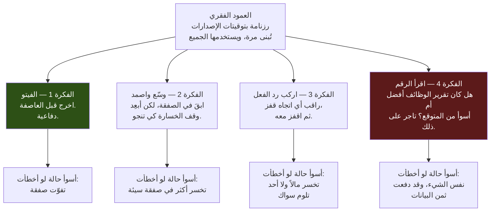
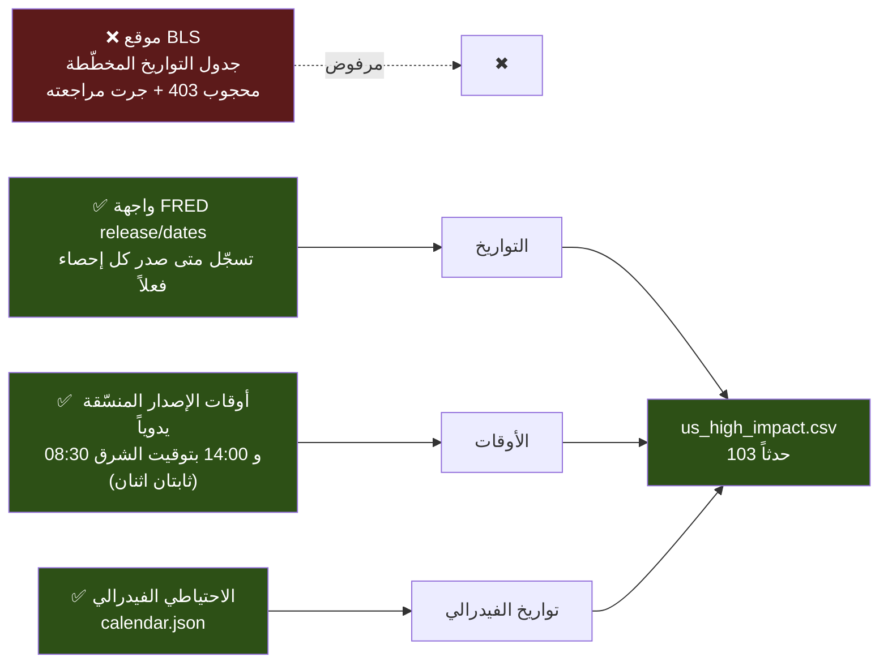
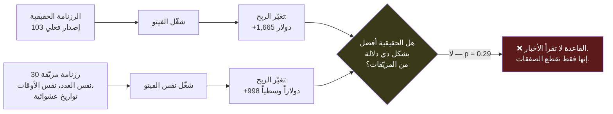
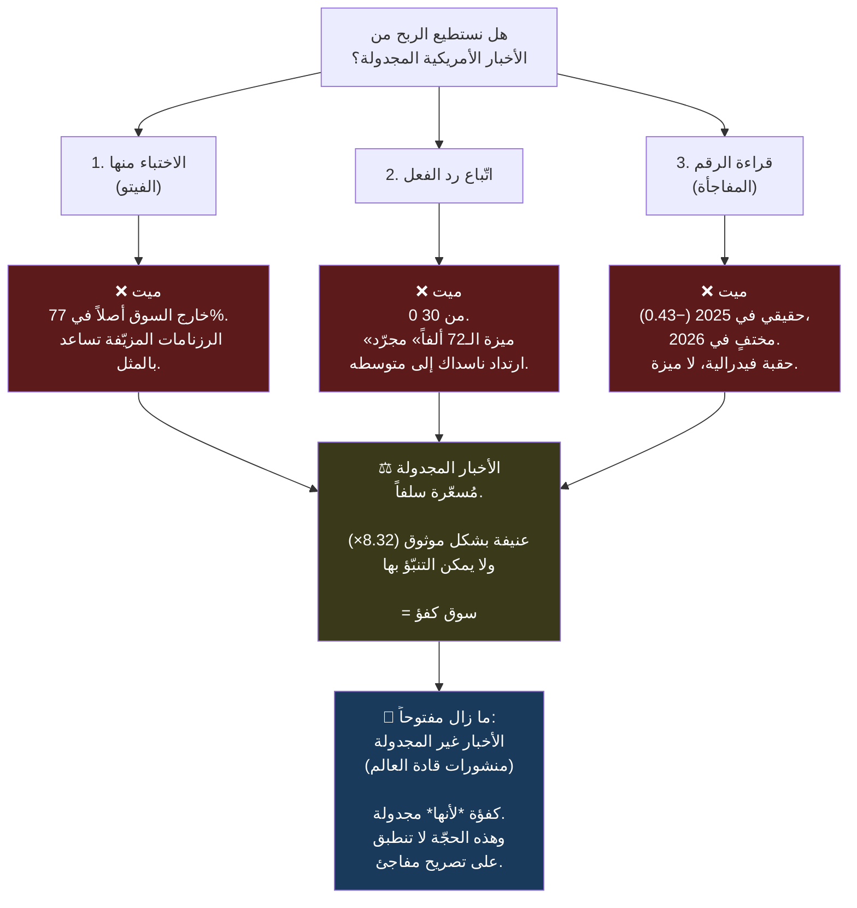

# ندوة: كيف بنينا نظاماً للتداول على الأخبار… ثم قتلناه

**شرحٌ خطوة بخطوة لمسار «التحليل الأساسي» — كل قرار، كل خطأ، وكل رقم مأخوذ من بياناتنا الحقيقية.**

التاريخ: 2026-07-12 · الفرع `fundamental-analysis`، مدموج في `dev` (`7b6a184`) · **لم يُشحن شيء**

> 🇬🇧 النسخة الإنجليزية: [`SEMINAR_fundamental_analysis.md`](SEMINAR_fundamental_analysis.md)

---

## كيف تقرأ هذه الوثيقة

كل قسم مكتوب بصوتين:

> **🍼 بلغة مبسّطة** — بلا مصطلحات، وبلا افتراض معرفة مسبقة. أي مصطلح يَرِد، يُشرح فوراً.

> **⚙️ تقنياً** — الآلية الدقيقة، والملف، والسطر، والرقم.

وكل قسم يجيب على أربعة أسئلة: **ماذا فعلنا، ماذا حدث قبل/بعد، ما الذي أخطأنا فيه، وكيف نفعلها بشكل أفضل.**

---

# الجزء 0 — السؤال الذي انطلقنا منه

> **🍼 بلغة مبسّطة**
>
> الروبوت الذي بنيناه ينظر إلى **السعر** فقط — أي كيف تحرّك عقد ناسداك الآجل. وهو لا يعرف شيئاً عن **العالم**.
> لا يعرف أنّ الساعة 8:30 صباحاً نشرت الحكومة الأمريكية **تقرير الوظائف**، وهو أضخم حدث اقتصادي مجدول في الشهر.
>
> السؤال: **لو أخبرنا الروبوت بالأخبار، هل سيربح أكثر؟**

> **⚙️ تقنياً**
>
> حقن تدفّق أحداث خارجي (exogenous event stream) داخل محرّك قرار من الطبقة الأولى (L1) لا يستهلك حالياً سوى
> `(df_dec, df1, box, vf)` — أي أطر الأسعار وتوقّع التقلّب. واختبار ما إذا كانت الإصدارات الاقتصادية الأمريكية
> المجدولة عالية الأثر تحمل معلومة قابلة للاستغلال، مقيسةً مقابل اختبار عدمي (null test) صارم قائم على التبديل
> العشوائي (permutation).

**الجواب، سلفاً، كي تقرأ الباقي وأنت تعرف إلى أين ينتهي:**

**لا. الأخبار الاقتصادية المجدولة **مُسعّرة سلفاً** في السوق. جرّبنا ثلاث طرق مختلفة لاستغلالها، وفشلت الثلاث
بأمانة. أنفقنا **0 دولار** على البيانات. وأثمن ما بنيناه هو **الآلة التي أثبتت أننا مخطئون**.**

---

# الجزء 1 — الدقيقة الواحدة التي تشرح كل شيء

قبل أي نظرية، انظر إلى بيانات **ناسداك الحقيقية** من يوم الجمعة **2025-03-07**، صباح نشر تقرير الوظائف الأمريكي.
هذه ليست محاكاة. هذه شموع الدقيقة الواحدة الفعلية.

| الوقت (شرق أمريكا) | افتتاح | أعلى | أدنى | إغلاق | **المدى (نقطة)** | **حجم التداول** |
|---|---|---|---|---|---|---|
| 08:27 | 20116.50 | 20121.25 | 20106.75 | 20112.50 | 14.5 | 223 |
| 08:28 | 20112.50 | 20119.00 | 20106.50 | 20113.25 | 12.5 | 228 |
| 08:29 | 20113.50 | 20119.50 | 20103.25 | 20110.25 | 16.25 | 410 |
| **08:30** ⚡ | **20107.50** | **20249.00** | **20061.50** | **20218.25** | **187.50** | **5,069** |
| 08:31 | 20219.00 | 20273.75 | 20204.25 | 20246.75 | 69.5 | 2,658 |
| 08:32 | 20250.75 | 20254.25 | 20207.00 | 20218.75 | 47.25 | 1,681 |

> **🍼 بلغة مبسّطة**
>
> لثلاث دقائق قبل الساعة 8:30، السوق بالكاد يتحرك — يتذبذب في مدى 14 نقطة، ولا أحد تقريباً يتداول (نحو 220 عقداً
> في الدقيقة). **الجميع ينتظر.**
>
> ثم يصدر الرقم. وفي **دقيقة واحدة فقط**، يتأرجح السعر **187.5 نقطة**. أي **13 ضعف** مدى الدقيقة التي سبقتها.
> ويقفز حجم التداول إلى 5,069 عقداً — **عشرون ضعف** المعتاد.
>
> في عقد ناسداك الآجل، النقطة الواحدة تساوي **20 دولاراً**. إذاً تلك الدقيقة وحدها احتوت على **3,750 دولاراً من
> حركة السعر** على عقد واحد.
>
> **وهنا الجزء القاسي.** انظر إلى شمعة 08:30 بتمعّن. فتحت عند 20107.50. ثم هبطت أولاً إلى **20061.50** (نزولاً
> 46 نقطة). ثم انطلقت صاعدةً إلى **20249.00** (ارتفاعاً 141 نقطة عن الافتتاح). **ذهبت في الاتجاهين داخل نفس
> الستين ثانية.**

> **⚙️ تقنياً**
>
> شمعة 08:30: `high - low = 187.5` مقابل متوسط مدى حقيقي (true range) للشمعات الثلاث السابقة ≈ 14.4 — أي **تمدّد
> في المدى بمقدار 13×** — مع `volume = 5069` مقابل متوسط ≈ 287 (**17.7×**). الشمعة عبارة عن **كنس سيولة ثنائي
> الاتجاه**: `low` أدنى من `open` بـ 46 نقطة، و`high` أعلى منه بـ 141.5 نقطة. اتجاهياً حُسمت صعوداً
> (`close - open = +110.75`)، لكن **بعد أن اصطادت الجانب السفلي أولاً**.

### الفخّ الذي يصنعه هذا — بالمال الحقيقي

استراتيجيتنا البطلة على إطار الأربع ساعات تستخدم **وقف خسارة صارم عند 40 نقطة**. لنفترض أنها كانت تحمل مركز
**شراء** (رهان على أنّ السعر سيصعد)، دخلته قرب إغلاق 08:29 عند **20110.25**.

- وقف الخسارة يقع عند 20110.25 − 40 = **20070.25**.
- **أدنى** سعر لشمعة 08:30 كان **20061.50** — أي **تحت الوقف**.
- **يُغلق المركز قسراً بخسارة 40 نقطة = −800 دولار.**
- ثم يُغلق السعر في **نفس الدقيقة** عند **20218.25** — وهو ما كان سيعني **+108 نقطة = +2,160 دولاراً.**

> **🍼 بلغة مبسّطة**
>
> الروبوت طُرد من الصفقة في أسوأ لحظة ممكنة، متكبّداً خسارة 800 دولار — ثم ذهب السوق فوراً في **نفس الاتجاه الذي
> راهن عليه**، وهو ما كان سيحقّق 2,160 دولاراً.
>
> **هذا أكثر ما يُجنّ التاجر، وهو بالضبط ما يفعله خبر اقتصادي بك.** وفكرتنا الأولى كلها بُنيت لمنع هذا.

---

# الجزء 2 — الخطة: أربع أفكار، مرتّبة حسب مدى قدرتها على إحراجنا



> **🍼 بلغة مبسّطة**
>
> بدأنا عمداً بالفكرة **الأكثر أماناً**، لا الأكثر إثارة.
>
> الفكرة 1 (الفيتو) لا يمكنها إلا أن **تحذف** صفقات. إن أخطأت، تفوّت بعض الربح — مزعج، لكنك لا تستطيع أن تخسر مالاً
> لم تكن تخاطر به أصلاً.
>
> الفكرة 4 (اقرأ الرقم) هي ما يريده الجميع فعلاً: *«تقرير الوظائف كان ممتازاً، إذاً اشترِ!»* لكنها إن أخطأت، تخسر
> المال **بمفردها**، ولا شيء آخر تلومه — **وتحتاج بيانات يجب أن تدفع ثمنها.**
>
> لذا نتسلّق السلّم: أثبت أنّ الآمنة تعمل قبل أن يُسمح لك ببناء الخطيرة.

> **⚙️ تقنياً**
>
> سلّم أدلة (evidence ladder) مرتّب حسب **الخطر المنسوب** لكل رأس. الفيتو لا يفعل سوى إدخال `False` في بوابة الدخول
> (يُقلّص مجموعة الصفقات بشكل رتيب/monotone). أما رأس «المفاجأة» فهو **الفاعل السببي الوحيد** لأرباحه وخسائره، فيحمل
> كامل عبء التقدير بلا أي متغيّر مربك (confounder) يمتصّ الخطأ. الترتيب بعبء الدليل، لا بالعائد المتوقّع.

**اعتراف صريح، سلفاً:** *هذا الترتيب كان خطأً.* أنت قلت لي ذلك لاحقاً، وكنتَ محقّاً:
**الغاية من قراءة الأخبار هي الربح من التقلّب، لا الاختباء منه.** أنا بنيتُ المظلّة أولاً. التفاصيل في الجزء 8.

---

# الجزء 3 — الخطوة 1: الحصول على الرزنامة (أصعب مما تبدو)

**المهمة:** إنتاج قائمة بكل إصدار اقتصادي أمريكي عالي الأثر، مع **الدقيقة الدقيقة** التي نُشر فيها.

> **🍼 بلغة مبسّطة**
>
> يبدو هذا تافهاً. «حمّل الجدول ببساطة». لكنه كان **أكثر خطوة مليئة بالأفخاخ** في المشروع كله.

### الفخ 1 — المصدر الرسمي يرفض التحدّث إلى الحواسيب

مكتب إحصاءات العمل الأمريكي (BLS) هو من ينشر تقرير الوظائف والتضخّم وأسعار المنتجين. موقعه يحوي الجدول. حاولنا جلبه:

```
403  https://www.bls.gov/schedule/news_release/empsit.htm     ← حتى بهوية متصفّح
403  https://www.bls.gov/schedule/schedule.ics
403  https://download.bls.gov/pub/time.series/
200  https://api.bls.gov/publicAPI/v2/...                      ← الواجهة البرمجية فقط تستجيب
```

> **🍼 بلغة مبسّطة** — المكتب يحجب التحميل الآلي. حمايته من الروبوتات تُعيد «403 ممنوع» لأي برنامج، حتى لو تظاهر بأنه
> متصفّح بشري. **لا يمكن كشطه (scraping) إطلاقاً.**

### الفخ 2 — الجدول نفسه **جرت مراجعته** (وهو ما لا يتوقّعه أحد)

هذا هو الاكتشاف الذي غيّر التصميم.

كنتُ قد كتبتُ في وثيقة التصميم أنّ جدول الإصدارات «**لا يمكن مراجعته بأثر رجعي**» — وأنّ هذه ميزته الكبرى على
المقالات الإخبارية. ثم أظهر بحثٌ على الويب صفحةً من المكتب عنوانها:

> *«تواريخ إصدار منقّحة عقب **انقطاعَي التمويل الحكومي في 2025 و2026**»*

وإشعاراً منفصلاً: *«إعادة جدولة إصدار مؤشر أسعار المستهلك لشهر أيلول/سبتمبر 2025»*.

> **🍼 بلغة مبسّطة**
>
> حدث **إغلاق حكومي** (government shutdown) في 2025 و2026. وحين تُغلق الحكومة، تتوقّف أجهزة الإحصاء عن العمل،
> فتصدر التقارير **متأخّرة** — في أيام مختلفة عمّا خُطّط له أصلاً.
>
> إذاً مجموعة البيانات الوحيدة التي وصفتُها بثقة بأنها «غير قابلة للمراجعة» **جرت مراجعتها**. ولو بنينا رزنامتنا من
> التواريخ **المخطّطة**، لكنّا وقفنا جانباً في أيام هادئة لا يحدث فيها شيء، ولتداولنا **بشكل أعمى** في الأيام التي
> صدر فيها الرقم فعلاً. الميزة كانت ستصبح **أسوأ من عديمة الفائدة** — كانت ستصبح **معكوسة**.

### الحل: اسأل عمّا **حدث فعلاً**، لا عمّا كان **مخطّطاً**



> **⚙️ تقنياً**
>
> `optimize/fundamentals/fetch_calendar.py` يستخدم نقطة النهاية `/fred/release/dates`. و**FRED** هي قاعدة بيانات
> بنك الاحتياطي الفيدرالي في سانت لويس. حقل `release_dates` فيها يسجّل التاريخ الذي **نُشر فيه الإحصاء فعلاً** —
> وبذلك تُلتقط إعادات الجدولة الناتجة عن الإغلاق الحكومي **مجاناً**، دون أي معالجة خاصة. أما **وقت** اليوم فهو ثابت
> لكل إصدار (08:30 أو 14:00 بتوقيت الشرق)، ويُتحقّق منه بشكل مستقل في الخطوة 2. مجاني، رسمي، ولا يحتاج سوى مفتاح
> واجهة برمجية بلا تكلفة.

### الفخ 3 — رقم تعريفي خاطئ أمسك به حارس

التشغيل الأول:

```
  nonfarm_payrolls     release_id=50   ->  17 dates
  cpi                  release_id=10   ->  17 dates
  ppi                  release_id=46   ->  17 dates
  gdp                  release_id=53   ->  17 dates
  pce                  release_id=54   ->  18 dates
  retail_sales         release_id=8    ->   0 dates      ← !!
RuntimeError: FRED returned 0 dates for retail_sales (release_id=8). Refusing to write a partial calendar.
```

> **🍼 بلغة مبسّطة**
>
> خمّنتُ رقماً تعريفياً خاطئاً لمبيعات التجزئة. كان بإمكان البرنامج أن يكتب بصمت رزنامةً **تنقصها كل أيام مبيعات
> التجزئة**، وكان كل ما يليها سيبدو سليماً — **وسيكون خاطئاً بصمت إلى الأبد.**
>
> بدل ذلك، **رفض أن يكتب أي شيء إطلاقاً.** ذلك الحارس ثلاثة أسطر من الشيفرة، وهو السبب في أننا نستطيع الوثوق بالنتيجة.

**كيف نفعلها أفضل:** ما كان ينبغي أن نخمّن الأرقام التعريفية أصلاً. تُستخرج من
`https://api.stlouisfed.org/fred/releases` أولاً. الرقم الصحيح كان **9** — «المبيعات الشهرية المسبقة للتجزئة وخدمات
الطعام».

### الفخ 4 — رزنامة الفيدرالي تحوي **ثلاثة** أحداث مختلفة كلها اسمها «FOMC»

ملفّ الاحتياطي الفيدرالي يحوي 135 مُدخلاً من نوع `FOMC`. وهي **ليست الشيء نفسه**:

| المُدخل | الوقت | ما هو | احتفظنا به؟ |
|---|---|---|---|
| **اجتماع اللجنة (FOMC Meeting)** | 2:00 م | **قرار سعر الفائدة**. ضخم. | ✅ **نعم** |
| المؤتمر الصحفي | 2:30 م | رئيس الفيدرالي يجيب على الأسئلة. كبير أيضاً — **لكن الملف لا يسرده إلا ابتداءً من أيلول 2025**، فإدراجه سيترك ثقوباً في ثلثي نافذتنا | ❌ لا |
| محضر الاجتماع (Minutes) | 2:00 م | **ملاحظات** الاجتماع، تُنشر بعد 3 أسابيع. أثرها أقل بكثير. | ❌ لا |

> **🍼 بلغة مبسّطة** — لو أخذنا بسذاجة كل ما يحمل اسم «FOMC»، لخلطنا الحدث العملاق (قرار الفائدة) بحدث ثانوي
> (المحضر، المنشور بعد ثلاثة أسابيع)، **ولوّثنا الرزنامة كلها**.

### الثقب المعلوم الذي رفضنا تجميله: ISM

معهد إدارة التوريد (ISM) ينشر استطلاعين كبيرين عند **الساعة 10:00 صباحاً**. **FRED لا يحمل بياناتهما** — لأنّ ISM
شركة خاصة وبياناتها مملوكة تجارياً.

كان **بإمكاني** تخمين التواريخ بقاعدة («أول يوم عمل في الشهر»). **واخترتُ ألّا أفعل.**

> **🍼 بلغة مبسّطة**
>
> تخمين التواريخ هو **بالضبط** نوع البيانات المفترَضة غير المتحقَّق منها الذي صُمّم هذا المشروع كله لتجنّبه. لقد
> تعلّمنا **للتوّ** أنّ حتى الجداول الرسمية المنشورة تكذب (الإغلاق الحكومي). فاختراع جدول من عندنا كان سيكون أسوأ.
>
> لذا تركنا ثقباً، ودوّنّاه، **وقِسنا كم يكلّفنا** (انظر الخطوة 2).

### **نتيجة الخطوة 1**

**103 أحداث**، تمتد من 2025-01-01 إلى 2026-06-30:

| الحدث | العدد |
|---|---|
| مؤشر أسعار المستهلك (التضخّم) | 17 |
| الوظائف غير الزراعية | 16 |
| مؤشر أسعار المنتجين | 16 |
| مبيعات التجزئة | 16 |
| الناتج المحلي الإجمالي | 13 |
| مؤشر PCE (مقياس التضخّم المفضّل للفيدرالي) | 13 |
| قرار الفائدة (FOMC) | 12 |

---

# الجزء 4 — الخطوة 2: إثبات صحّة الرزنامة (واكتشاف)

> **🍼 بلغة مبسّطة**
>
> لدينا الآن 103 توقيتات. **كيف نعرف أنها صحيحة؟** منطقة زمنية واحدة خاطئة، أو رقم تعريفي واحد سيّئ، ويصبح كل ما
> يليها **قمامة** — لكنها ستظل **تعمل**، وستظل تُنتج أرقاماً **تبدو معقولة**. الخطأ الصامت هو العدو.
>
> **الحيلة:** إن كانت توقيتاتنا صحيحة، فلا بدّ أن ينفجر السوق **بالضبط** في تلك اللحظات. إذاً **ندع السوق يصحّح
> واجبنا المدرسي.**

> **⚙️ تقنياً**
>
> `optimize/fundamentals/window.py::measure_envelope` يحسب، لكل إزاحة دقيقة من −60 إلى +60 حول كل إصدار، **متوسط
> القيمة المطلقة للعائد الدقيقي**، مُعايَراً على خط الأساس لكامل العيّنة. والاختبار
> `test_envelope_peaks_at_offset_zero` يؤكّد أنّ `argmax(ratio) ∈ [-1, +1]`. لو كان `release_id` أو وقت الساعة
> خاطئاً، لهبطت الذروة في مكان آخر **وسقط الاختبار**.

### النتيجة — الرزنامة تصحّح واجبها بنفسها

*(النسبة = كم تبلغ عنفوانية تلك الدقيقة مقارنةً بدقيقة عادية. 1.0 = طبيعي تماماً.)*

| الدقائق من الإصدار | −6 | −5 | −4 | −3 | **−2** | −1 | **0 (الرقم)** | +1 | +6 | +12 | +25 |
|---|---|---|---|---|---|---|---|---|---|---|---|
| **التقلّب** | 1.01× | 1.06× | 1.16× | 0.86× | **0.78×** | 1.34× | **8.32×** | 3.03× | 2.43× | 1.62× | 1.13× |

> **🍼 بلغة مبسّطة**
>
> **‏8.32×.** دقيقة الإصدار أعنف بأكثر من ثمانية أضعاف من دقيقة عادية — والذروة تهبط **بالضبط** على التوقيت الذي
> تنبّأنا به. لا قبله بدقيقة، ولا بعده بدقيقة.
>
> **هذا هو برهاننا.** لا رقم تعريفي خاطئ، ولا خطأ منطقة زمنية، ولا علّة توقيت صيفي يمكنها أن تُنتج هذا. **الرزنامة
> صحيحة.** ولم نضطر للوثوق بأحد — **السوق أكّدها لنا.**

### 💡 الاكتشاف الذي قتل أحد افتراضاتنا

انظر مجدداً إلى الدقائق **قبل** الإصدار: **1.01×, 1.06×, 1.16×, 0.86×, 0.78×, 1.34×**.

قبل تقرير الوظائف بدقيقتين، السوق عند **0.78× من الطبيعي** — أي **أهدأ من دقيقة متوسطة.**

> **🍼 بلغة مبسّطة**
>
> طلبك الأصلي قال: *«في النافذة قبل وأثناء وبعد، عادةً يكون لدينا تقلّب عالٍ.»*
>
> **البيانات تقول العكس.** قبل رقم كبير، السوق يصبح **ساكناً تماماً**. لا أحد يتداول. الجميع ينتظر. إنه **الهدوء
> الذي يسبق العاصفة** — حرفياً.
>
> ويمكنك أن **تراه** في الشموع الحقيقية من الجزء 1: 08:27 و08:28 و08:29 كلها بمدى ~14 نقطة وحجم ~220 عقداً. ثم
> 08:30 بمدى 187 نقطة و5,069 عقداً.
>
> **لماذا يهمّ هذا بشدّة:** الفكرة 2 كانت *«وسّع وقف الخسارة كي تنجو من الاضطراب الذي يسبق الخبر.»* **لا يوجد اضطراب
> يسبق الخبر.** تلك الفكرة بُنيت لحلّ **مشكلة غير موجودة**.

**إذاً النافذة المَقيسة هي: 0 دقيقة قبل، و12 دقيقة بعد.** ليس «15 دقيقة من كل جانب» لأنّ 15 رقم مستدير. *صفر واثنتا
عشرة، لأنّ هذا ما تقوله البيانات.*

### الفخ الذي كدتُ أقع فيه: شبح التاسعة والنصف

عند **+60 دقيقة**، يقفز التقلّب مجدداً إلى **4.91×**. كان حدسي الأول: «عجباً، الخبر **لا يزال** يتردّد صداه بعد
ساعة!»

**كلا.** معظم إصداراتنا عند 08:30. وبعد ستين دقيقة نكون عند **09:30** — وهي لحظة **افتتاح سوق الأسهم الأمريكي**.
هذا حدث **مختلف تماماً**.

> **🍼 بلغة مبسّطة** — كدنا نَنسب إلى تقرير الوظائف انفجاراً في التقلّب سببه الحقيقي **جرس الافتتاح**. سبب مختلف كلياً.

توجد فجوة هدوء عند +22 إلى +27 دقيقة (1.13×–1.35×) **تفصل الحدثين بنظافة**، ولذلك تتوقّف نافذتنا بشكل صحيح عند +12
ولا تبتلع الصباح كله. **وهذا الآن مثبَّت في اختبار** كي لا «يُصلحه» أحد لاحقاً.

### قياس تكلفة ثقب ISM

تذكّر أننا حذفنا ISM (استطلاعات العاشرة صباحاً). فهل يؤلمنا هذا؟

| وقت الساعة | التقلّب مقابل الطبيعي |
|---|---|
| 08:30 (إصداراتنا) | 3.13× |
| **09:30 (افتتاح سوق الأسهم)** | **4.58×** |
| **10:00 (ISM — لا نملك بياناته)** | **3.61×** |
| 11:00 (لا شيء مميّز) | 2.12× |
| 14:00 (الفيدرالي) | 1.73× |

> **🍼 بلغة مبسّطة**
>
> الساعة 10:00 تعمل عند **3.61×** من الطبيعي — دقيقة مضطربة بوضوح، أعلى بكثير من 2.12× لساعة حادية عشرة عادية. إذاً
> **نعم، ثقب ISM حقيقي وهو يكلّفنا شيئاً ما.** لقد **قِسنا** التكلفة بدل التلويح بها. وإن عدنا يوماً إلى هذا، فيجب
> **شراء** ISM بشكل صحيح — لا تخمينه.

---

# الجزء 5 — الخطوة 3: تعليم المحرّك (ومفاجأة سيّئة في شيفرتنا نحن)

> **🍼 بلغة مبسّطة**
>
> لدينا رزنامة. الآن يجب أن نُخبر الروبوت: *«لا تفتح صفقة خلال هذه الدقائق، وإن كنتَ في صفقة أصلاً، فاخرج.»*
>
> يبدو تغييراً صغيراً. لم يكن كذلك.

### المفاجأة 1: الشيء المسمّى «فيتو» **لا يمارس الفيتو**

قالت وثيقة التصميم: *«سنضيف فقط قناع فيتو آخر — الآلية موجودة سلفاً.»*

**كان هذا خطأً.** حين قرأنا الشيفرة الفعلية:

> **⚙️ تقنياً**
>
> `engine.py` يقبل وسيطاً اسمه `veto_mask` — لكنه **لا يمنع الصفقات به**. يستخدمه فقط لمنطق القلب (flip)، وإجهاض
> الحمل (carry-abort)، والإنقاذ داخل الشمعة. أما ما **يوقف** الصفقة فعلاً فهو بوابة الدخول المركّبة `entry_gate`:
>
> - `engine.py:520` — `if not gated: continue`
> - `optimize/fast_engine.py:97` — `if gate is not None and not gate[idx]:`
>
> والمستدعون يدمجون الفيتو داخل البوابة مسبقاً (`indicators/runner.py:251`، `optimize/core.py:273`). فكان على قناعنا
> أن ينضمّ إلى **البوابة**، لا إلى الفيتو.

> **🍼 بلغة مبسّطة**
>
> الجزء المسمّى «فيتو» **ليس** الجزء الذي يمارس الفيتو. لو وثقتُ بالاسم بدل قراءة الشيفرة، لكانت الميزة **لم تفعل
> شيئاً بصمت** — ولاستنتجتُ أنّ «الأخبار لا تنفع» لسبب **خاطئ تماماً**. **اقرأ الشيفرة، لا الأسماء.**

### المفاجأة 2: لا يوجد رقم «هل أنا رابح؟» في أي مكان

قاعدتنا كانت: *«اخرج قبل الإصدار — **إلا إن كنتَ رابحاً بشكل مريح**، فعندها اصمد.»*

لكن المحرّك **لا يملك رقم ربح جارٍ**. الصفقة عبارة عن قاموس بسعر دخول ثابت وثلاثة خطوط سعرية ثابتة. **الربح يُحسب
عند الخروج فقط.**

**الحل:** افحص الربح في **لحظة واحدة** — الشمعة التي نوشك أن نخرج عندها — بدل تتبّعه باستمرار.

> **⚙️ تقنياً**
>
> «رابح بشكل مريح» عُبِّر عنه بوحدات يفهمها المحرّك سلفاً: **الربح المفتوح ≥ `mult` × مسافة وقف الخسارة الصارم**.
> وبـ `mult = 1.0` يعني ذلك *«صاعدٌ أصلاً بمقدار مخاطرة وقفٍ كامل»* — أي أنك لا تخاطر بشيء لم تربحه بعد. وهذه الصيغة
> اللحظية هي أيضاً **الشيء الوحيد** القابل للتعبير عنه في نموذج الخروج المتّجهي (`argmax` على المرشّحين) في
> `fast_engine`؛ أما التتبّع المستمر فكان سيستحيل مطابقته بين المحرّكين.

### 💡 أهمّ سطر شيفرة في المشروع كله

متى نخرج؟ النافذة تُفتح **عند** 08:30. فهل نخرج **عند** 08:30؟

**لا. والخطأ هنا كان سيُزوّر نتيجة سلبية.**

عُد إلى الشموع الحقيقية:

| الوقت | الإغلاق | |
|---|---|---|
| 08:29 | **20110.25** | ← آخر دقيقة هادئة. **هنا نخرج.** |
| 08:30 | 20218.25 | ← الرقم. المدى: **187.5 نقطة.** فات الأوان. |

> **🍼 بلغة مبسّطة**
>
> لو خرجنا **عند** 08:30، فنحن نخرج **عند إغلاق شمعة الانفجار** — أي أننا ركبنا التأرجح الكامل البالغ 187 نقطة.
> **لم نكن محميّين إطلاقاً.** الميزة كلها ستصبح بلا معنى، وسنلوم «الأخبار» على **سوء تنفيذنا نحن**.
>
> لتكون آمناً **أثناء** العاصفة، يجب أن تكون خارجها **قبلها**. لذا نخرج عند إغلاق **08:29**، آخر شمعة هادئة.
>
> **«لكن أليس هذا غشّاً؟ نظرٌ في المستقبل؟»**
>
> **لا — وهذا التمييز هو قلب المشروع كله.** عند 08:29 نعرف أنّ رقماً سيهبط عند 08:30 **لأنّ الجدول نُشر قبل أشهر**.
> هذا ليس المستقبل؛ هذه **رزنامة معلّقة على الحائط**. معرفة **أنّ** رقماً قادم = معرفة عامة. معرفة **ماذا سيقول**
> الرقم = غشّ. ونحن لم نستخدم سوى الأولى.

> **⚙️ تقنياً**
>
> `window.py::news_exit_targets` يُعيد `open_idx - 1` — آخر شمعة دقيقة **قبل** فتح النافذة تماماً. وهذا سببي
> (causal) لنفس السبب الذي يجعل `trading_days.py::eod_targets` سببياً: إغلاق الجلسة عند 17:00 معروف مسبقاً أيضاً.
> ومثبَّت باختبار `test_the_exit_bar_lands_STRICTLY_BEFORE_the_release`.

### المفاجأة 3: محرّكان، حقيقة واحدة

النظام يملك **محرّكين**: الدقيق/السببي (`engine.py`، يمشي على كل شمعة) والمتّجهي الأسرع بـ200 ضعف
(`fast_engine.py`، يقفز فوق الشموع). **يجب أن يُنتجا صفقات متطابقة**، وإلا فالمُحسِّن يُحسّن **كذبة**.

**شبكة الأمان — قبل/بعد:**

| البوابة | ما تُثبته | النتيجة |
|---|---|---|
| **الذهبي 6/6** | مع إطفاء الميزة، الأطر الستة تُنتج نتائج **مطابقة بايتاً ببايت** لما قبلها | ✅ 4h $148,670 · 2h $105,462 · 1h $80,339 · 15m $77,098 · 5m $23,926 · 2m $29,777 — **كلها دون تغيير** |
| **تطابق المحرّكين** | مع تشغيل الميزة، يتّفق المحرّكان **صفقةً بصفقة** | ✅ 11/11 حالة، **صفر اختلاف** |

> **🍼 بلغة مبسّطة**
>
> «مطابق بايتاً ببايت» يعني: غيّرنا المحرّك، وحين تُطفأ الميزة الجديدة، **كل رقم هو بالضبط ما كان عليه، حتى آخر
> سنت.** ليس «قريباً كفاية» — بل **مطابق**. وهذا يُثبت أنّ الشيفرة الجديدة **لا يمكنها** أن تُفسد النتائج القائمة سرّاً.

---

# الجزء 6 — الخطوة 4: الاختبار العدمي — الآلة التي أبقتنا صادقين

> **🍼 بلغة مبسّطة**
>
> **هذا أهمّ ما بنيناه، وهو السبب الوحيد في أنّ هذه الوثيقة ليست كذبة.**
>
> إليك المشكلة التي يحلّها. لنفترض أننا شغّلنا فيتو الأخبار فارتفع الربح 1,665 دولاراً. هل نفرح؟ **لا ينبغي.** لأنّ
> هناك تفسيراً آخر: **ربما مجرّد قطع الصفقات مبكراً يساعد، لأسباب لا علاقة لها بالأخبار إطلاقاً.**
>
> كيف نفرّق بين الاثنين؟
>
> **نخترع رزنامة مزيّفة.** نفس عدد الأحداث. نفس أوقات اليوم (8:30 و2:00). لكن التواريخ **أيام عشوائية لم يحدث فيها
> شيء**. ثم نشغّل **نفس القاعدة بالضبط** على الرزنامة المزيّفة.
>
> إن ساعدت المزيّفة بقدر ما ساعدت الحقيقية — **فالأخبار غير ذات صلة**، وكل ما اكتشفناه هو أنّ روبوتنا **يقطع خسائره
> متأخّراً جداً**. وهذه حقيقة عن **وضع وقف الخسارة عندنا**، لا عن العالم. ولن تجني لنا دولاراً واحداً في المستقبل.

> **⚙️ تقنياً**
>
> `optimize/fundamentals/nulltest.py::fake_calendar` — اختبار تبديل (permutation test). يحافظ على **عدد الأحداث**
> و**توزيع وقت اليوم** بدقّة، ويبدّل **التواريخ فقط** إلى أيام خالية من الإصدارات. ولو عشوَأْنا وقت الساعة أيضاً،
> لأعدنا فقط اكتشاف أنّ 08:30 وقت متقلّب — وهذه ليست الفرضية قيد الاختبار. والقيمة الاحتمالية التجريبية هي
> `(#المزيّفات ≥ الحقيقية + 1) / (N + 1)`.



### النتيجة — قبل وبعد، بمال حقيقي

| الإطار الزمني | **قبل** (بلا فيتو) | **بعد** (بالفيتو) | التغيّر | **الرزنامات المزيّفة** | القيمة p |
|---|---|---|---|---|---|
| 4 ساعات | $42,187 · 209 صفقة | $42,217 · 208 صفقة | **+$30** | +$573 وسطياً | **0.548** |
| 15 دقيقة | $4,239 · 323 صفقة | $5,904 · 321 صفقة | **+$1,665** | **+$998 وسطياً** | **0.290** |
| 5 دقائق | $693 · 132 صفقة | $1,245 · 132 صفقة | **+$552** | +$614 وسطياً | **0.290** |

*(القيمة p = احتمال رؤية نتيجة بهذه الجودة **بمحض الحظّ**. كنا نحتاج أقل من 0.05. حصلنا على 0.29–0.55 — أي أنّ هذا
قد يكون حظّاً بسهولة.)*

> **🍼 بلغة مبسّطة**
>
> **انظر إلى صفّ الـ15 دقيقة.** رزنامة الأخبار الحقيقية حقّقت **+1,665 دولاراً**. يبدو فوزاً!
>
> لكن رزنامةً من **تواريخ مختلقة تماماً** حقّقت **+998 دولاراً**. الحقيقية بالكاد أفضل من **الخيال المحض**. **قطع
> الصفقات عشوائياً يربح مالاً لهذه الاستراتيجية** — هذا هو الاكتشاف الحقيقي. ولا علاقة له بالأخبار.

### 💡 **لماذا** فشل — الرقم الذي يشرح كل شيء

بحثنا في **السبب**، فوجدنا ما هو أثمن من الحكم نفسه:

| السؤال | الجواب |
|---|---|
| كم تدوم الصفقة النموذجية؟ | **1.4 ساعة** (الوسيط) |
| من أصل 103 إصدار، كم واحداً كانت هناك صفقة مفتوحة؟ | **24** |
| إذاً ما نسبة الإصدارات التي نكون معرّضين لها؟ | **23%** |
| **وما نسبة الإصدارات التي نكون فيها خارج السوق أصلاً؟** | **77%** |
| كم صفقة يمسّها الفيتو فعلاً؟ | **3–4%** (7 من 265 على إطار 4 ساعات) |

> **🍼 بلغة مبسّطة**
>
> **الروبوت خارج السوق أصلاً في 77% من كل الإصدارات.** إنه يحمل الصفقات نحو ساعة ونصف. واحتمال أن يصادف أنه يحمل
> شيئاً عند الثامنة والنصف صباحاً بالضبط في أحد 103 أيام محدّدة… **منخفض**.
>
> الفكرة كلها — *«لا تحمل مركزاً مكشوفاً عبر الإصدار»* — افترضت بصمت أنك **تحمل مراكز عبر الإصدارات كثيراً**. **أنت
> لا تفعل.** **لم يكن هناك ما يُحمى تقريباً.**
>
> **بنينا مظلّةً لرجلٍ كان في البيت أصلاً.**

### 🔴 غلطتي: كدتُ أُجري الاختبار كله على الإطار الزمني الخاطئ

انظر للصف الأول مجدداً: 4 ساعات. الفيتو غيّر الربح بـ**+30 دولاراً** وحذف **صفقة واحدة من 209.** لماذا القليل جداً؟

| | |
|---|---|
| شموع القرار على إطار 4 ساعات تقع عند: | 02:00، 06:00، 10:00، 14:00، 18:00، 22:00 |
| الإصدارات تقع عند: | **08:30** و14:00 |

> **🍼 بلغة مبسّطة**
>
> **إصدارات الثامنة والنصف — وهي 88% من كل أحداثنا — لا يمكنها أن تتزامن مع شمعة أربع ساعات. أبداً.** الشموع ببساطة
> **غير موجودة** عند 8:30. فقط قرارات الفيدرالي الاثنا عشر عند الثانية ظهراً يمكنها أن تتطابق.
>
> إذاً على إطار الأربع ساعات، كانت ميزة الأخبار عندنا **مُطفأة تقريباً بالكامل**، وأنا منشغل بقياس ما إذا كانت تعمل.
> **هذا كمن يختبر دواءً على مرضى لم يتناولوه قط.**
>
> كان يجب أن ألاحظ هذا **لحظة** رؤيتي نافذةً مدّتها **12 دقيقة** تُطبَّق على شمعة مدّتها **240 دقيقة**.

**كيف نفعلها أفضل:** *تحقّق دائماً من أنّ العلاج ينطبق فعلاً على عيّنة الاختبار قبل أن تقيس أثره.* سطرٌ واحد
(`mask.sum()`) كان سيخبرني: **11 شمعة من أصل 2,119.**

---

# الجزء 7 — الخطوة 5: «حسناً — إذاً لنتاجر على التقلّب»

هنا صحّحتَ لي، وكنتَ محقّاً:

> *«الهدف النهائي ليس تجنّب التقلّب — السبب الكامل لتحليل محتوى الخبر بدل معرفة توقيته فقط هو الاستثمار في وقت
> التقلّب بذكاء.»*

إذاً: **هل نستطيع الربح من الانفجار؟**

### المحاولة أ — اركب رد الفعل (مجاني، بلا محتوى إخباري)

> **🍼 بلغة مبسّطة**
>
> فكرة بسيطة: راقب أي اتجاه يقفز السعر في الدقائق الأولى بعد الرقم، ثم اقفز **معه**. إن انطلق صعوداً، اشترِ. إن انهار،
> بِع. أنت لا تتنبّأ بالخبر — أنت **تتبع رد فعل الحشد**.
>
> وهذا **لا يحتاج أي بيانات مدفوعة**. فقط رزنامتنا المجانية والسعر.

> **⚙️ تقنياً**
>
> `study_postrelease.py`. لكل إصدار عند الدقيقة T: `reaction = close[T+k]/close[T-1] - 1` (معروف عند T+k)، و
> `followthrough = close[T+h]/close[T+k] - 1` (يحدث كلّه **بعد** ذلك). مسحنا k ∈ {1,2,3,5,10,15} × h ∈
> {15,30,60,120,240}. سببي بالكامل. ومُقيَّم مقابل 50 رزنامة مزيّفة.

**النتيجة: 0 من 30 تركيبة كانت ذات دلالة.** (الحظّ وحده يتنبّأ بـ~1.5.) نسب الإصابة 42–57% — **رمي عملة**.

### 💰 سراب الـ72,000 دولار

لكن **كان** هناك نمط. عند الآفاق الطويلة، «ركوب الحركة» **خسر مالاً باستمرار** — عند **كل** قيمة لـk، كان الارتباط
سالباً (−0.14 إلى −0.23).

والخسارة الموثوقة تعني أنّ **فعل العكس يربح.** وإظهار عكس الحركة أعطى:

**+760 دولاراً للصفقة × 95 إصداراً = +72,170 دولاراً.**

> **🍼 بلغة مبسّطة**
>
> ميزة بـ72,000 دولار. رقم حقيقي، مثير، «اشحنه فوراً».
>
> **ثم شغّلنا الرزنامات المزيّفة. وأظهرت المزيّفات الشيء نفسه.** إظهار عكس حركة الأربع ساعات يربح مالاً في **أيام
> عشوائية بلا أي خبر إطلاقاً.**
>
> إنه ليس أثراً إخبارياً. إنه ببساطة **خاصية في مؤشر ناسداك** — المؤشر يميل للارتداد عبر بضع ساعات، في **أي** يوم.
> كنّا سنـ«نكتشف» استراتيجية بـ72,000 دولار هي في الحقيقة مجرّد *«ناسداك يرتدّ إلى متوسطه»*، مرتديةً **زيّ الأخبار**.
>
> **الاختبار العدمي أمسك بها. لولاه لكنّا شحنّاها.**

### المحاولة ب — اقرأ الرقم نفسه (التي أردتَها فعلاً)

> **🍼 بلغة مبسّطة**
>
> الآن الفكرة الحقيقية. **تقرير الوظائف قال 250,000 وظيفة جديدة. الاقتصاديون توقّعوا 180,000. هذا تجاوز كبير.** فهل
> يصعد ناسداك أم يهبط؟
>
> الفجوة بين **ما صدر** و**ما كان متوقّعاً** تُسمّى **المفاجأة**. وهي «المحتوى» — المعنى الفعلي للخبر، لا توقيته فقط.
>
> **المشكلة:** «ما توقّعه الاقتصاديون» بيانات يجب أن **تشتريها**.

**لكننا وجدنا طريقة مجانية لاختبار الفكرة أولاً.**

> **⚙️ تقنياً**
>
> توقّع **إحصائي** بدل توقّع السوق. `alfred.py` يسحب **نسخ نقطة-في-الزمن (point-in-time vintages)** — أي الإحصاء
> كما كان **صباح الإصدار بالضبط**. والتوقّع = متوسط التغيّرات الشهرية الستة السابقة **من داخل نفس النسخة**.
> والمفاجأة = (الفعلي − المتوقّع)، مُعيَّرة لكل نوع حدث بانحراف معياري **تمدّدي (سببي)**. لا شيء يختلس النظر.

### 🚨 حالة دراسية: لماذا «نقطة-في-الزمن» ليست بارانويا

سألنا ALFRED (أرشيف الفيدرالي) عن رقم الوظائف **كما طُبع ذلك الصباح**، وقارنّاه بالرقم **الموجود في قاعدة البيانات
اليوم**:

| الشهر المرجعي | طُبع ذلك الصباح | في قاعدة البيانات اليوم | **جرت مراجعته بمقدار** |
|---|---|---|---|
| كانون الثاني 2025 | 159,069,000 وظيفة | 158,268,000 | **−801,000** |
| شباط 2025 | 159,218,000 | 158,310,000 | **−908,000** |
| آذار 2025 | 159,398,000 | 158,377,000 | **−1,021,000** |
| نيسان 2025 | 159,517,000 | 158,485,000 | **−1,032,000** |

> **🍼 بلغة مبسّطة**
>
> رقم الوظائف **يُصحَّح** لأشهر بعد صدوره. **بمقدار مليون وظيفة تقريباً.**
>
> إن بنيتَ اختباراً رجعياً باستخدام قاعدة بيانات اليوم، فأنت تختبر استراتيجية على رقم **لم يكن بحوزة أحد على وجه
> الأرض ذلك الصباح**. سيبدو روبوتك عبقرياً، لأنه **يقرأ نسخة مصحّحة من التاريخ**. ثم تتداول به فعلياً فيموت.
>
> ALFRED يعطينا **الرقم الأصلي**، مجاناً. وهذه التفصيلة وحدها تفصل **اختباراً رجعياً حقيقياً** عن **وهم**.

### 🎯 النتيجة التي كادت تخدعنا

**داخل العيّنة (كل الإصدارات الـ52 المسعّرة):**

| مدّة الاحتفاظ | الارتباط | القيمة p |
|---|---|---|
| **5 دقائق** | **−0.322** | **0.021** ✅ |
| 15 دقيقة | −0.225 | 0.105 |
| 30 دقيقة | −0.204 | 0.142 |
| 60 دقيقة | −0.236 | 0.084 |

**وعلى سنة 2025 وحدها: الارتباط −0.432.**

> **🍼 بلغة مبسّطة**
>
> **وجدناها.** علاقة ذات دلالة إحصائية (p = 0.021 — أي 2% فقط احتمال أن تكون حظّاً).
>
> و**الإشارة** منطقية اقتصادياً تماماً. الارتباط **السالب** يعني: **رقم وظائف أفضل من المتوقّع يجعل ناسداك يهبط.**
>
> يبدو هذا معكوساً، لكنه ظاهرة شهيرة وموثّقة تُسمّى **«الخبر الجيّد خبر سيّئ»**: إن كان الاقتصاد يعمل بحرارة، فسيُبقي
> الاحتياطي الفيدرالي أسعار الفائدة مرتفعة لتبريده — والفائدة المرتفعة **سيّئة لأسهم التكنولوجيا**.
>
> **إذاً كان لدينا: رقم ذو دلالة، *و* قصّة متماسكة يومئ لها اقتصادي محترف برأسه موافقاً.**
>
> **هذه بالضبط اللحظة التي يشحن فيها الناس استراتيجية… ويخسرون أموالهم.**

### ⚰️ ثم اختبرناها على بيانات لم ترها قط

جمّدنا القاعدة المتعلَّمة من **2025** وطبّقناها، دون تغيير، على **2026**:

| المدّة | ارتباط **2025** | ارتباط **2026** | صمدت الإشارة؟ | **ربح 2026** |
|---|---|---|---|---|
| 5 دقائق | **−0.432** | −0.011 | نعم | **−2.8 نقطة أساس** |
| 15 دقيقة | **−0.377** | **+0.159** | ❌ **انقلبت** | **−3.1** |
| 30 دقيقة | **−0.362** | **+0.125** | ❌ **انقلبت** | **−4.5** |
| 60 دقيقة | **−0.252** | −0.021 | نعم | **−6.4** |

> **🍼 بلغة مبسّطة**
>
> **تبخّرت.** الارتباط لم يضعف — بل ذهب إلى **الصفر**، وفي اثنين من الآفاق الأربعة **انعكس اتجاهه تماماً**.
>
> وتطبيق قاعدة 2025 على 2026 **خسر مالاً في كل أفق**، بنسبة نجاح 32–41% — **أسوأ بشكل موثوق من رمي عملة.**
>
> **«الخبر الجيّد خبر سيّئ» لم يكن قانوناً للأسواق. كان خاصيةً لمزاج الاحتياطي الفيدرالي في 2025.** تغيّر موقف
> الفيدرالي، فتغيّرت العلاقة معه. كنّا سنتاجر بقاعدة **توقّفت عن الصحّة أصلاً**.
>
> **السبب الوحيد لعدم شحننا هذا** هو أننا دوّنّا **معيار القتل** — *«اهجر هذا إن فشل خارج العيّنة»* — **قبل** إجراء
> الاختبار، حين لم يكن أحد متعلّقاً عاطفياً بارتباط −0.43 وقصّة جميلة.

---

# الجزء 8 — ما نجح، ما فشل، وكيف نفعلها أفضل

### ✅ ما نجح

| | |
|---|---|
| **الاختبار العدمي** | أمسك بـ**ثلاثة** سرابات منفصلة: «ميزة» بـ72 ألف دولار كانت مجرّد ارتداد ناسداك؛ وفيتو ساوته الرزنامات العشوائية؛ وإشارة بـp=0.021 وقصّة مثالية كانت **حقبةً ميتة**. **هذا أثمن ناتج في المشروع.** |
| **الرزنامة أثبتت نفسها بنفسها** | لم نضطر لـ**الوثوق** بتوقيتاتنا. ذروة 8.32× الهابطة بالضبط على الإزاحة 0 **أثبتتها**. |
| **انضباط نقطة-في-الزمن** | قراءات ALFRED الأولى. بدونها كان مليون وظيفة من «معرفة ما بعد الحدث» ستتسرّب إلى كل اختبار. |
| **ضمان التطابق** | الذهبي 6/6 مطابق بايتاً ببايت. عدّلنا محرّكين ونستطيع **إثبات** أننا لم نكسر شيئاً. |
| **معيار القتل، مكتوباً أولاً** | الشيء الوحيد الذي وقف بيننا وبين شحن ارتباط −0.43 عديم القيمة. |
| **رفض التخمين** | حارس مبيعات التجزئة (رفض كتابة رزنامة ناقصة). وثقب ISM (قيس، لم يُخترع). |

### ❌ ما فشل

| الخطأ | التكلفة | الدرس |
|---|---|---|
| **بنيتُ الرأس الدفاعي أولاً** | أهدر النصف الأول من المشروع | *ابنِ للهدف، لا للأمان. أنت صحّحتني: الغاية هي التداول على التقلّب، لا الاختباء منه.* |
| **أجريتُ الاختبار على شموع 4 ساعات** | كاد يُنتج نتيجة بلا معنى | **88% من الإصدارات لا يمكنها التزامن مع شمعة 4 ساعات.** *تحقّق دائماً أنّ العلاج ينطبق فعلاً على عيّنة الاختبار.* |
| **وثقتُ باسمٍ في الشيفرة** | كان سيفعل «لا شيء» بصمت | الوسيط المسمّى `veto_mask` **لا يمارس الفيتو.** *اقرأ الشيفرة، لا الأسماء.* |
| **افترضتُ أنّ الجداول لا تُراجَع** | كان سيقلب الميزة رأساً على عقب | **الإغلاق الحكومي أعاد جدولة الإصدارات.** *فضّل «متى حدث فعلاً» على «متى كان مخطّطاً».* |
| **خمّنتُ رقماً تعريفياً في FRED** | أمسك به حارس | *ابحث عن المعرّفات؛ لا تخمّنها أبداً.* |
| **افترضتُ اضطراباً قبل الإصدار** | أبطل رأساً كاملاً مخطّطاً له | السوق **هادئ** قبل الإصدار (0.78×). *قِس الفرضية قبل البناء عليها.* |
| **فتحتُ اتصال SSH جديداً لكل أمر** | فعّل `fail2ban` على الخادم | *استخدم تعدّد الإرسال (multiplexing).* |
| **استثناءات rsync مفرطة** | كسرت أول تشغيل ذهبي | استثنيتُ `optimize/results/` — وهي تحوي **تعريفات الأبطال**. *اعرف ما تقرأه شيفرتك وقت التشغيل.* |

### 🔧 كيف ننفّذها بشكل أفضل

1. **ابدأ برأس الدخول، لا بالفيتو.** سلّم الأدلة كان أنيقاً فكرياً و**خاطئاً استراتيجياً**. ابنِ باتجاه الهدف.
2. **افحص «هل تشتغل الميزة أصلاً؟» قبل قياس أثرها.** تأكيد من سطر واحد — *«هل تمسّ هذه الميزة أكثر من X% من
   الصفقات؟»* — كان سيوفّر منعطف الأربع ساعات كلّه. **إن كانت تمسّ 3% من الصفقات، فلا يمكنها أن تحرّك المؤشّر، مهما
   كانت صحيحة.**
3. **اختبر على الإطار الزمني الذي يمكن للميزة أن تعمل فيه فيزيائياً.** نافذة 12 دقيقة تحتاج شموعاً أدقّ من 12 دقيقة.
4. **اشترِ ISM.** إنه ثقب حقيقي مَقيس بـ3.61× في الرزنامة.
5. **سجّل الشبكة كاملةً مسبقاً.** مسحنا k×h (30 خلية). ومع 103 حدث، **بعض الخلايا ستبدو رائعة بالصدفة**. عالجنا ذلك
   بالمزيّفات — لكنّ الإعلان المسبق عن الشبكة أنظف.
6. **مدّة الاحتفاظ في الاستراتيجية هي القيد الحاكم.** وسيط 1.4 ساعة ⇒ خارج السوق في 77% من الإصدارات ⇒ **لا** ميزة
   مرتبطة بـ**توقيت** الإصدار يمكنها أن تهمّ كثيراً أبداً. **إن أردتَ للأخبار أن تهمّ، فيجب أن تُصمَّم الاستراتيجية
   لتكون *داخل* السوق في تلك اللحظات** — وهذه **مشكلة دخول**، لا مشكلة مخاطرة.

---

# الجزء 9 — الحكم، والباب الذي ما زال مفتوحاً



> **🍼 بلغة مبسّطة — لماذا هذا منطقي**
>
> الإصدارات **مستحيلة التداول تحديداً لأنها مجدولة.**
>
> كل إنسان على الأرض يعرف أنّ تقرير الوظائف يهبط عند 8:30 في تاريخ منشور. كل بنك، وكل صندوق، وكل خوارزمية **قد
> موضَعت نفسها سلفاً**. **وبياناتنا نفسها تُظهر ذلك:** السوق يصبح **هادئاً** قبله (0.78×) — وهذا هو الجميع وهم
> يحبسون أنفاسهم، **بمراكز مأخوذة سلفاً**. ثم يهبط الرقم، فينفجر السعر 8.3×، وخلال **اثنتي عشرة دقيقة** يكون قد
> **أعاد التسعير بالكامل**.
>
> **هذا هو شكل السوق الكفؤ.** المعلومة تُمتصّ فوراً تقريباً، **ولا يبقى شيء على الطاولة لنا.**
>
> **لكن — وهذا هو الجزء المهم — تلك الحجّة تعمل *فقط لأنّ* الحدث كان مجدولاً.**
>
> **التصريح غير المجدول** — قائد عالمي ينشر شيئاً غير متوقّع في الثالثة فجراً — **لا يوجد له تموضع مسبق**، ولا
> **إجماع يُسعَّر مقابله**، ولا **فترة هدوء «الجميع ينتظر»**. والمنطق نفسه الذي قتل الرزنامة **يتنبّأ** بأنّ الأخبار
> غير المجدولة قد تتصرّف بشكل **مختلف تماماً**.
>
> كان هذا **المصدر الثاني** في طلبك الأصلي، **ولم نختبره قط**. **الباب ما زال مفتوحاً.** وهو أيضاً **الطريق الأصعب**:
> جولة البحث العميق وجدت **صفر** مصادر موثّقة بتوقيتات موثوقة، وهو يحمل **كل فخّ** أمضينا هذا المشروع نتعلّم تجنّبه.

---

## ملحق — أين يوجد كل شيء

| ماذا | أين |
|---|---|
| الرزنامة المتحقَّق منها (103 حدث) | `optimize/fundamentals/us_high_impact.csv` |
| باني الرزنامة (FRED + الفيدرالي) | `optimize/fundamentals/fetch_calendar.py` |
| المُحمِّل مع حارس المنطقة الزمنية | `optimize/fundamentals/release_calendar.py` |
| مغلّف التقلّب + الأقنعة | `optimize/fundamentals/window.py` |
| **الاختبار العدمي (البطل)** | `optimize/fundamentals/nulltest.py` · `run_nulltest.py` |
| قراءات نقطة-في-الزمن الأولى | `optimize/fundamentals/alfred.py` |
| دراسة «اركب رد الفعل» | `optimize/fundamentals/study_postrelease.py` |
| دراسة «اقرأ الرقم» | `optimize/fundamentals/study_surprise.py` |
| ربط المحرّك (مُطفأ افتراضياً) | `engine.py` · `optimize/fast_engine.py` · `optimize/core.py` |
| الاختبارات (27، كلها خضراء) | `optimize/test_release_calendar.py` · `test_release_window.py` · `test_news_veto.py` |
| التصميم الكامل + الإغلاق | `docs/superpowers/specs/2026-07-11-fundamental-analysis-design.md` |

**لإعادة إنتاج النتيجة الرئيسية:**

```bash
cd subprojects/Parametric-Indicators
export WSH_DATA_BASE=/mnt/data/projects/trading WSG_DATA_ROOT=/mnt/data/projects/trading/data
export FRED_API_KEY=<مفتاح مجاني من fred.stlouisfed.org>

python3 optimize/fundamentals/run_nulltest.py --tf 15m --n 30   # الفيتو: p = 0.290
python3 optimize/fundamentals/study_postrelease.py --n-fake 50   # رد الفعل: 0 من 30
python3 optimize/fundamentals/study_surprise.py --n-shuffle 2000 # المفاجأة: تموت خارج العيّنة
```
