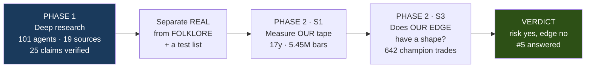
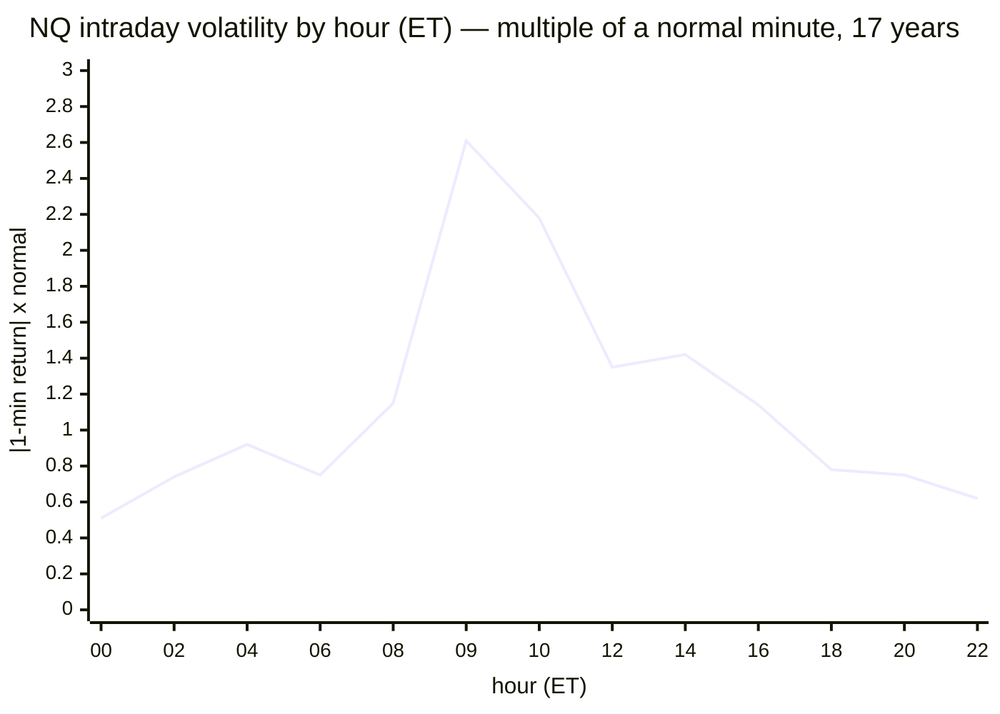
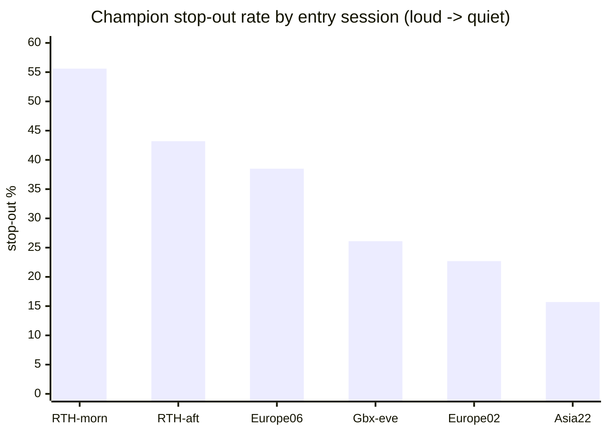

# SESSION WINDOWS · 00 — THE COMPLETE WORKSTREAM REPORT

**Task #5, start to finish, in one document. The detailed record of the trading-session-windows
investigation: what we asked, what the world's research says is real vs folklore, what our own 17 years of
data show, and the honest verdict — which is neither "we found an edge" nor "there's nothing here," but a
precise middle that hands us two real deliverables and closes the question.**

Date: 2026-07-14 · Branch `fundamental-analysis` (pinned worktree, not merged) · **$0 spent** · production
untouched (golden 6/6). Detailed phase reports: **[01](SESSION-01-RESEARCH-real-vs-folklore.md)**
(research) · **[02](SESSION-02-S1-our-session-shape.md)** (S1) · **[03](SESSION-03-S3-does-our-edge-have-a-shape.md)** (S3).

---

## PART 0 — THE GREAT PICTURE (read this first)

> **🍼 In one paragraph, no jargon**
>
> The trading day has a **shape**: the market is loud when New York is open and quiet overnight. That much
> is textbook, and we confirmed it precisely on our own data. The real question was whether **our
> strategy's money** follows that shape — whether we should only trade in certain sessions. The answer:
> our **risk** follows the shape (we get stopped out far more often in the loud sessions), but our **profit
> does not** (which session we enter in doesn't reliably predict whether we make money). So we should
> **not** build a "only-trade-in-session-X" filter. But the risk finding is genuinely useful: it tells us
> a fixed stop-loss is effectively **tighter in loud sessions**, which feeds how we size stops later.

| | |
|---|---|
| **What we set out to answer** | Do trading-session windows (Asia / London / New York, their overlaps, and gaps) affect our strategy — and should we make it "session-aware"? |
| **Why it mattered** | Our own news study found the **09:30 NY open contaminates event studies.** Session structure demonstrably affects us; we needed to know *how much* and *how to use it.* |
| **The two things we BANKED** | (1) The exact **per-minute volatility/volume multipliers** — the confound to remove from every future study. (2) The **session-dependent stop-out rate** (56% in RTH-morning vs 16% in Asia) — feeds session-aware stop sizing. |
| **What we did NOT build, and why** | A **session entry filter.** Our edge doesn't robustly inherit the session shape; the one stable exception is a fluke-window 1-of-6 cell (the "silver" pattern). |
| **Cost / risk to production** | **$0 / none.** Everything was measurement on existing data; no engine change. |

---

## PART 1 — THE METHOD (research first, then our own data)

Per the standing rule — *every new workstream starts with a deep online research mining pass before we
touch our data* — the workstream ran in two phases:



**Why this order matters:** the research told us in advance which effects are real (so we test those) and
which are folklore (so we don't waste a run). It also warned us of the single most important trap — that
the session shape is a *confound* that manufactures fake effects if you don't remove it — which is exactly
the wire our news study had already tripped.

---

## PART 2 — WHAT THE RESEARCH ESTABLISHED (real vs folklore)

101 research agents, 19 sources fetched, 65 claims extracted, **25 adversarially verified** (3 independent
skeptics per claim, 2/3 to kill). Full detail in **[SESSION-01](SESSION-01-RESEARCH-real-vs-folklore.md)**.

### ✅ REAL (verified, top-tier sources)

| # | Finding | The number | Source tier |
|---|---|---|---|
| R1 | **U-shaped RTH volatility** — loud open, quiet lunch, loud close | ~2× open/close-vs-midday, replicated for NQ/ES | primary (Andersen-Bollerslev) |
| R2 | **The session shape is a CONFOUND** that manufactures spurious persistence & causality — must be removed before any event/vol estimate | — | primary |
| R3 | **Volume-time-of-day is the largest driver of intraday variance** | **45%** for Nasdaq | primary (2025 WP) |
| R4 | **Overnight & RTH are segmented regimes** (equity-specific, weakened post-2015) | historically ~all of SPY's gain accrued overnight | primary (JFE) |
| R5 | Overnight carries **small** predictive info for RTH | economically tiny, execution-fragile | primary |
| R6 | **Naive session TRADES fail after costs** → session is a **FILTER, not an entry** | MNQ Asia breakouts *reverse*; gaps don't fill | preprint |

### ❌ FOLKLORE (refuted by adversarial verification)

| Refuted claim | Vote |
|---|---|
| The "entire equity premium in a 2–3am window" trade | 0-3 |
| A post-lunch positive "lunch effect" | 1-2 |
| The 08:35 macro-spike attribution | 0-3 |
| A London-session edge that **flipped T=+5.15 → −3.56 with a 1-bar entry delay** | 0-3 |

> **The cautionary tale (R6 + the London refutation):** session edges are **lethally
> execution-timing-sensitive** and the move you can see is already spent by the time a candle closes. This
> is *why* the research pointed us at session-as-filter, not session-as-signal — and it shaped everything
> we did next.

---

## PART 3 — S1: OUR OWN SESSION SHAPE (measurement)

We measured the shape on **5.45 million 1-minute NQ bars over 17 years.** This is a measurement — like the
calendar's 8× news spike, its truth doesn't depend on sample size. Full detail in
**[SESSION-02](SESSION-02-S1-our-session-shape.md)**.



| What we found | Value |
|---|---|
| **U-shape confirmed, matches the literature** | open/lunch ratio **1.94×** (papers predicted ~1.7–1.9×) |
| **RTH is 2–4× louder than overnight** | 09:30 open = 12.4× normal volume; 15:59 close = 16.7×; Asia = 0.55–0.65× |
| **The London–NY "overlap" is a NON-EVENT for NQ** | exactly **1.00×** — this *answers a question the research couldn't*; the "hot overlap" is FX folklore, not index-futures fact |
| **Timezone: triple-confirmed US Eastern** | top-5 volume minutes all US cash-session times; 08:30 vol spike on the exact ET candle |

**What S1 banked:** the exact per-minute-of-day multiplier for volatility and volume — **the confound to
normalize against** in every future event study. This is the direct fix for "the 09:30 open contaminates
our studies."

---

## PART 4 — S3: DOES OUR EDGE HAVE A SHAPE? (the money question)

We bucketed all **642 NQ 4h champion trades** by the session they entered in. A 4h strategy enters only at
the six 4h boundaries (02/06/10/14/18/22 ET) — a free natural experiment. Full detail in
**[SESSION-03](SESSION-03-S3-does-our-edge-have-a-shape.md)**.

### The robust finding — RISK inherits the shape



The champion's **stop-out rate tracks S1's volatility shape almost monotonically** — 55.6% in the loud RTH
morning, 15.7% in quiet Asia. A fixed 40-point stop is a *different stop* depending on the session. This is
mechanistic (not noise), holds out-of-sample (because the vol shape does), and is the **carry-forward
deliverable → session-aware stop sizing.**

### The P/L finding — EDGE does NOT broadly inherit it

| Test | Result |
|---|---|
| Clean RTH-vs-overnight $/trade | −$110, 95% CI [−$258, +$38], **p=0.147 (not sig)** |
| Per-session spread (permutation) | p=0.014 — but carried by **one cell** |
| Temporal stability (H1 vs H2) | **3 of 5 sessions flip sign**; only 22:00/Asia holds (+$352 → +$377) |

The net edge is *stop-rate (robust) minus winner-capture (noisy)*, and the noise wins. The one survivor,
the **22:00/Asia entry**, is the **silver situation**: 1 of 6 windows, n=89, fluke window, optimized
champion, no long history → a **frozen curiosity, not a filter.** And it points the wrong way (acting on it
removes entries, against the increase-entries goal).

---

## PART 5 — WHAT WENT WELL / WHAT WENT WRONG

### ✅ What went well

- **Research-first paid off immediately.** It told us session is a filter not a signal, and it named the
  confound trap we'd already hit — so S1 and S3 were aimed correctly from the first run.
- **The natural experiment was free.** The 4h timeframe's six entry hours gave a clean session split with
  no design choices to fudge.
- **The discipline caught two of my own errors** (see below) before either reached a conclusion.
- **A real, mechanistic deliverable emerged** (stop-out rate by session) even though the headline question
  (session entry filter) came back negative.

### ⚠️ What went wrong (and was caught)

- **My S3 verdict first tested the wrong contrast.** I keyed it on RTH-vs-off-hours (p=0.147) when I had
  *pre-declared* the permutation spread test (p=0.014). Same class of bug as the stop-loss study — fixed
  to match what I declared.
- **A stability correlation nearly fooled me.** The +0.414 H1/H2 correlation looked "stable" until I
  counted sign-consistency (only 2 of 5 sessions keep their sign) and saw it was **one cell (Asia)**
  carrying it. Added the sign-count so the verdict can't be fooled by a single stable cell.
- **My S1 timezone guard fired a false alarm** because I wrongly expected the volume peak at the *open*;
  for index futures it's the *close* (15:59). Fixed the guard, not the data — and it doubled as extra
  confirmation the frame is ET.

---

## PART 6 — THE VERDICT

| Question | Answer |
|---|---|
| Is the session shape real on our tape? | ✅ **Yes** (S1) — quantified, matches the literature |
| Is the London–NY overlap special for NQ? | ❌ **No** (S1) — a non-event, 1.00× |
| Does our RISK depend on session? | ✅ **Yes** (S3) — stop-out 56%→16%, robust → **stop sizing** |
| Does our EDGE depend on session? | ❌ **No** (S3) — not robustly; the one exception is a frozen fluke cell |
| Should we build a session ENTRY filter? | ❌ **No** — not justified, and it would remove entries |
| Is #5 answered? | ✅ **Yes** — two deliverables banked, the entry-filter question closed |

**The two deliverables that leave this workstream:**
1. **The confound-control multipliers** (S1) → normalize every future event/vol study by time-of-day.
2. **The session-dependent stop-out rate** (S3) → session-aware stop width/sizing.

Both feed *other* work rather than becoming a standalone session feature — which is the honest outcome the
research predicted (session is a filter/control, not an entry).

**Frozen alongside silver:** the 22:00/Asia cell — re-test only on future or long data; build nothing.

---

## PART 7 — WHAT'S NEXT

**Recommendation: treat #5 as answered and move to #7 (fit our own probability distribution)**, folding
the one optional session thread (S2 — overnight vs RTH *return distribution*, per market) into it. The
reason is precise: the thing that defeated every edge in this entire project — the news signal, the
stop-loss, and now the session edge — is the **fat per-trade tail** (an 80-point standard deviation that
makes an $80/trade effect indistinguishable from zero). **#7 exists to characterize exactly that tail**,
and *session is naturally one of its axes* (S3 already showed the stop-out tail is session-dependent). So
#7 is where the session work's loose threads and the project's central obstacle converge.

---

## Appendix — reproduce it

```bash
cd subprojects/Parametric-Indicators
# S1 (session shape) — study-only 17y frame:
WSH_DATA_BASE=/home/dev/Mulham python3 -u optimize/fundamentals/study_session_shape.py --instrument NQ
# S3 (does the edge have a shape) — engine's own 2025-2026 frame:
WSH_DATA_BASE=/home/dev/Mulham/wsg-h python3 -u optimize/fundamentals/study_session_edge.py --tf 4h
# timezone alignment guard (the hazard check):
WSH_DATA_BASE=/home/dev/Mulham python3 -u optimize/fundamentals/verify_timezone.py
```

Raw output archived under `docs/superpowers/results/`: `session_shape_NQ.txt`, `session_edge_4h.txt`.
