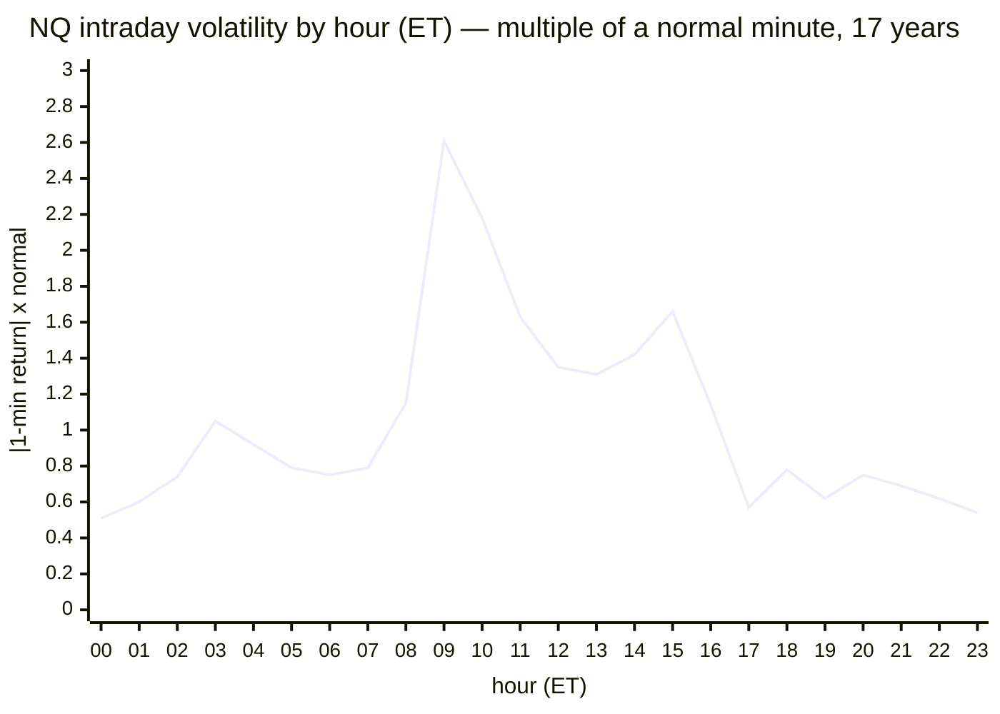
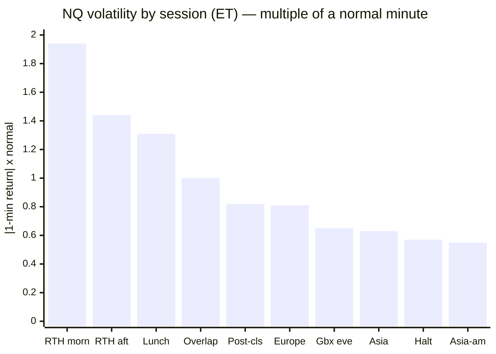

# SESSION WINDOWS · 02 — S1: OUR OWN SESSION SHAPE (measured)

**Task #5, phase 2, first test. The research (SESSION-01) said the intraday session shape is a CONFOUND
that must be measured before anything else. So here it is, measured on our own tape: 5.45 million
1-minute NQ bars over 17 years. This is a MEASUREMENT — like the calendar's 8× spike, its truth does not
depend on sample size.**

Date: 2026-07-14 · Branch `fundamental-analysis` · Code: `optimize/fundamentals/study_session_shape.py`
Raw output: [`results/session_shape_NQ.txt`](results/session_shape_NQ.txt)

---

## ⚡ THE 60-SECOND VERSION

| | |
|---|---|
| **The U-shape is REAL for us, and matches the literature** | RTH open runs **2.61×** a normal minute, lunch **1.35×**, close **1.66×**. **Open/lunch ratio = 1.94×** — the papers predicted ~1.7–1.9×. Confirmed on our own data. |
| **RTH is 2–4× louder than overnight** | The 09:30 open minute is **3.67×** normal volatility and **12.4×** normal volume; the cash close (15:59) is **16.7×** volume. Asia/overnight runs **0.55–0.65×**. The day is where everything happens. |
| **The London–NY "overlap" is NOT special for NQ** | The 08:00–09:30 pre-open window is exactly **1.00×** — an ordinary minute. The "overlap is a hot regime" idea is **FX folklore, not index-futures fact.** (This answers an open question the research couldn't.) |
| **Timezone: triple-confirmed US Eastern** | The 5 highest-volume minutes are all US cash-session times (15:59, 09:30, 09:31, 16:00, 09:32). Combined with the 08:30 volatility spike, the data **is** New York time — no mismatch anywhere. |
| **What we now hold** | A per-minute-of-day multiplier for volatility and volume — **the exact confound to normalize against** in every future event study, and the map for S2/S3. |

---

## 0 — Timezone, settled (the thing you flagged)

You asked whether the news and the candles could be in different timezones. This study bakes in the
check, and it passes three ways:

- The **5 loudest volume minutes** are `15:59, 09:30, 09:31, 16:00, 09:32` ET — **every one a US cash-session
  minute.** A GMT+3-vs-ET mismatch would scatter these into what we'd mislabel as the overnight.
- The **volume peak is the 16:00 cash close** (16.7× normal) with the **09:30 open** a close second (12.4×)
  — exactly the two US landmarks, in the right place.
- Separately, the **08:30 volatility spike** lands on the exact 08:30 ET candle (7.3×), with nothing 7
  hours away.

**The frame is US Eastern, and every session label below is in ET.** For your convenience the tables also
show GMT+3 (ET + 7h, summer) — but nothing is computed in GMT+3.

---

## 1 — The intraday curve

Mean absolute 1-minute return by hour (ET), as a multiple of a normal minute. Cross-gap steps (the
17:00–18:00 halt, weekends) are excluded so the reopen doesn't fake a spike.

> **🍼 In plain words** — read the shape. It is **flat and low (~0.5–0.8×) all through the overnight and
> European hours**, then it **erupts at 09:30** (the US cash open, hour 09 = 2.61×), stays elevated through
> the RTH day, dips slightly at lunch, bumps into the 16:00 close, and then **falls off a cliff after
> 16:30** back to the overnight baseline. This is the classic **U inside RTH sitting on a low overnight
> floor.** It is entirely predictable, and that predictability is exactly why it contaminates any study
> that doesn't remove it.

---

## 2 — The U-shape ratio vs the literature

| Window (ET) | Our NQ, 17 yrs | |
|---|---|---|
| RTH open (09:30–10:00) | **2.61× normal** | loudest |
| Lunch (12:00–12:30) | **1.35× normal** | the trough within RTH |
| RTH close (15:30–16:00) | **1.66× normal** | the close bump |
| **open ÷ lunch** | **1.94×** | **literature: ~1.7–1.9× ✅** |

**Our open/lunch ratio of 1.94× lands squarely on the Andersen–Bollerslev prediction.** One difference
worth noting: in our NQ data the **open is louder than the close** (2.61× vs 1.66×), whereas the 1990s S&P
had the close marginally louder. Both are U-shaped; the modern Nasdaq just front-loads its volatility onto
the open.

---

## 3 — The named sessions, ranked

Mean volatility per session, US Eastern:

| Session | Hours (ET) | Volatility | Volume |
|---|---|---|---|
| **RTH morning** | 09:30–12:00 | **1.94×** | 3.60× |
| RTH afternoon → close | 13:30–16:00 | 1.44× | 2.24× |
| Lunch | 12:00–13:30 | 1.31× | 1.85× |
| London–NY overlap / pre-open | 08:00–09:30 | **1.00×** | 0.77× |
| Post-close | 16:00–17:00 | 0.82× | 0.87× |
| Europe / London | 02:00–08:00 | 0.81× | 0.30× |
| Globex reopen / evening | 18:00–20:00 | 0.65× | 0.18× |
| Asia | 20:00–24:00 | 0.63× | 0.17× |
| Globex halt (dead) | 17:00–18:00 | 0.57× | 0.06× |
| Asia (post-midnight) | 00:00–02:00 | 0.55× | 0.13× |

---

## 4 — What we learned (and one piece of folklore killed)

1. **The confound is now quantified.** We hold the exact volatility/volume multiplier for every
   minute-of-day. Any future event or causality study can (and per the research, *must*) normalize by
   this before claiming an effect — otherwise "the market moved" may just mean "it was 09:35."
2. **RTH is the whole game; overnight is a different, quiet world.** RTH morning (1.94×) vs Asia (0.63×)
   is a **3× volatility gap.** This is the structural basis for testing overnight-vs-RTH segmentation (S2)
   — the two regimes are visibly different on our tape.
3. **The London–NY overlap is a non-event for NQ.** At exactly 1.00× it is a perfectly average window.
   The research flagged "is the overlap a distinct regime for index futures?" as unresolved; **for NQ, our
   data answers no.** That's a real (if negative) finding, and it saves us from chasing an FX idea on an
   equity instrument.
4. **The 08:30 macro minute shows 3.0× on average** — diluted across all days (only ~28% are release days,
   where it's ~8×). Consistent with the 17-year news verdict; nothing new, just a cross-check that lands.

> **⚠️ Honest caveat.** This is NQ only. The 17-year frame is NQ; the other 8 markets have only 2025–2026.
> S2 will test the segmentation per market on that shorter frame — and the research warns the overnight
> effects are equity-specific, so gold/oil may look nothing like this.

---

## 5 — Where S1 sends us next

S1 is the foundation; it does not by itself make money. It hands two things to the next tests:

| Next | Question | Why S1 enables it |
|---|---|---|
| **S3** *(recommended next — the money question)* | **Does our champion's edge concentrate by session?** Bucket every existing champion trade by entry session; is P/L, win-rate, and the 80-point stop-out tail **session-dependent**? | S1 gives the session buckets; if the edge is real only in RTH morning (the loud, liquid window), that's a **filter** worth having |
| **S2** | Are overnight and RTH **distributionally** different for our markets (per asset class)? | S1 shows a 3× vol gap NQ; S2 quantifies the *return* distribution split and tests gold/oil |
| **S4** | Session-aware **gating/sizing** — only if S3/S2 show a real, stable, cost-and-noise-surviving dependence | gated on the above; **never a standalone session entry** (SESSION-01 R6) |

**Recommendation: S3 next.** It is the most directly useful — it asks whether the money our champion
already makes is session-dependent, which is the whole point of a session-aware filter. It needs no new
data (just the existing champion trade ledger), and it turns "the tape has a shape" into "our edge has a
shape," which is the thing worth acting on.
