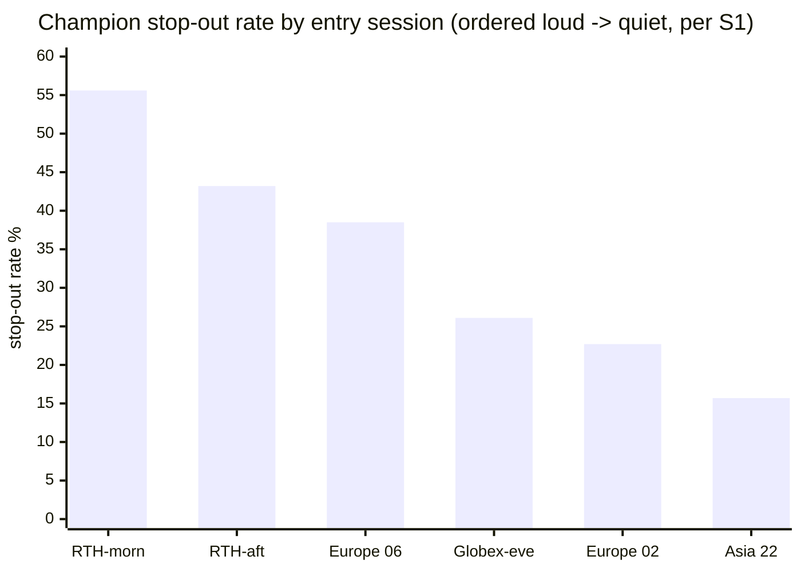

# SESSION WINDOWS · 03 — S3: DOES OUR EDGE HAVE A SHAPE? (the money question)

**Task #5, phase 2, the test that decides whether any of this is worth building. S1 proved the TAPE has a
session shape. S3 asks whether OUR MONEY does. Answer, in one line: the champion's RISK inherits the
session shape (robustly), but its EDGE does not (except one fluke cell). So: session-aware STOP SIZING is
justified; a session ENTRY filter is not.**

Date: 2026-07-14 · Branch `fundamental-analysis` · Code: `optimize/fundamentals/study_session_edge.py`
Raw output: [`results/session_edge_4h.txt`](results/session_edge_4h.txt) · NQ 4h champion, 642 trades,
2025–2026 (the engine's own frame).

---

## ⚡ THE 60-SECOND VERSION

| | |
|---|---|
| **The ROBUST finding** | **Stop-out rate tracks the volatility shape almost perfectly.** RTH-morning entries get stopped **55.6%** of the time; Asia entries **15.7%**. A fixed 40-pt stop is effectively *tighter* in a loud session. This is mechanistic, not noise — and it feeds session-aware **stop sizing.** |
| **The P/L finding** | **Our net edge does NOT broadly inherit the session shape.** The clean RTH-vs-overnight P/L contrast is **not significant** (p=0.147), and **3 of 5 sessions flip sign** between the first and second halves of the data. |
| **The one exception** | The **22:00 / Asia entry** is a stable standout (+$364/trade, positive in both halves, 56% win, 15.7% stop). But it is **1 of 6 windows, n=89, in the 2025–2026 fluke window, on an optimized champion** — the *silver situation.* A frozen curiosity, not a filter. |
| **The verdict** | ❌ **No session ENTRY filter.** ✅ **Stop-out-rate session dependence carried forward to sizing.** And note: even the Asia cell points the *wrong way* — acting on it removes entries, against the increase-entries goal. |

---

## 1 — The natural experiment (free, from the 4h timeframe)

A 4-hour strategy can only enter at the six 4h-bar boundaries. Two land in RTH, four are off-hours — a
clean split we did not choose after the fact:

| Entry (ET) | Session | n | P/L | $/trade | win% | **stop%** |
|---|---|---|---|---|---|---|
| 02:00 | Europe (off) | 66 | +$8,465 | +$128 | 43.9% | 22.7% |
| 06:00 | Europe (off) | 91 | −$12,750 | −$140 | 30.8% | 38.5% |
| **10:00** | **RTH-morning** | 153 | +$4,175 | +$27 | 41.2% | **55.6%** |
| **14:00** | **RTH-afternoon** | 132 | −$2,105 | −$16 | 37.9% | 43.2% |
| 18:00 | Globex-eve (off) | 111 | +$13,830 | +$125 | 44.1% | 26.1% |
| 22:00 | **Asia (off)** | 89 | +$32,420 | **+$364** | **56.2%** | **15.7%** |

---

## 2 — The ROBUST finding: stop-out rate IS the volatility shape

Order the entry hours by S1's volatility and the stop-out rate falls almost monotonically with it:

> **🍼 In plain words** — the champion carries a **fixed 40-point stop.** In the loud RTH morning, 40
> points is a small move that gets tagged **56%** of the time. In quiet Asia, 40 points is a big move that
> only gets tagged **16%** of the time. **The same stop is a completely different stop depending on the
> session** — and *that* is real, mechanistic, and directly useful: it is the empirical basis for
> **session-aware stop width / sizing**, exactly the "filter/sizing" use the research endorsed (SESSION-01
> R6). It also ties straight into the stop-loss workstream's 80-point per-trade tail.

**This is not an artifact.** It is a deterministic consequence of a fixed stop meeting a variable-
volatility tape. It would hold out-of-sample because the volatility shape (S1) holds out-of-sample.

---

## 3 — The P/L finding: our EDGE does NOT broadly inherit it

Net P/L is stop-rate (robust) *minus* winner-capture (noisy) — and the noise wins. The tests:

| Test | Result | Reading |
|---|---|---|
| Per-session $/trade spread (permutation, selection-aware) | observed $392, p = **0.014** | *marginally* significant… |
| Clean RTH-vs-overnight $/trade | −$110, 95% CI [−$258, +$38], p = **0.147** | …but **not** on the clean axis |
| Sample adequacy | $110 gap on a **$962** per-trade sd needs ~597 trades; we have 642 | right on the edge of resolvable |

**And the decider — temporal stability:**

| Session | 1st half $/trade | 2nd half $/trade | |
|---|---|---|---|
| Europe | −$168 | +$105 | 🔄 **sign flip** |
| Globex-eve | +$265 | +$22 | decays hard |
| RTH-afternoon | +$83 | −$151 | 🔄 **sign flip** |
| RTH-morning | +$88 | −$35 | 🔄 **sign flip** |
| **Asia** | **+$352** | **+$377** | ✅ **stable** |

**Only 2 of 5 sessions keep their sign; 3 flip.** The headline p=0.014 is carried by a **single stable
cell — Asia.** The correlation of +0.414 between halves is Asia holding up while everything else is noise.

> **🍼 In plain words** — if the session mattered for our *edge*, most sessions would stay on the same
> side of zero across time. Instead they **swap** — a session that made money in 2025 loses it in 2026,
> and vice versa. That is what noise looks like. The *only* survivor is the 22:00 Asia entry.

---

## 4 — The Asia cell: a frozen curiosity, not a filter (the silver pattern, again)

The 22:00 / Asia entry is genuinely stable (+$352 → +$377, 56% win, 15.7% stop). But apply the exact
discipline that governed silver:

- It is **1 of 6** entry windows — being the best of 6 is what luck produces.
- **n = 89**, in the **2025–2026 window we proved is fluke-prone**, on a champion **optimized on this very
  data** (so the optimizer could have fit session-correlated noise).
- There is **no long history** to confirm it (the engine frame is 2025–2026; the 17-year frame is
  study-only and would change the champion).

**So it is DROPPED as a filter and NOTED as a frozen observation** — like silver, testable only on future
data. And even taken at face value it points the *wrong way*: Asia is 89 of 642 trades, so filtering
*toward* it would **slash entries**, against the workstream's increase-entries goal.

---

## 5 — Verdict and what it means for #5

| | |
|---|---|
| **Session ENTRY filter?** | ❌ **No.** The edge doesn't broadly inherit the session shape; the one stable cell is a fluke-window 1-of-6. |
| **Session-aware STOP SIZING?** | ✅ **Justified.** Stop-out rate is robustly session-dependent (56%→16%). This is the real, carry-forward result. |
| **The confound control?** | ✅ **In hand** from S1 — the per-minute multipliers to normalize any future event study. |
| **The 22:00/Asia cell?** | ❄️ **Frozen** — re-test only on future/long data, alongside silver. Build nothing. |

**Where this leaves the session-windows workstream (#5):** its core question is largely **answered**.
Session structure is real in the **tape** (S1) and in our **risk** (S3 stop-out rate), but **not** as a
tradeable entry edge for us. The two genuine deliverables are the **confound-control multipliers** and the
**session-dependent stop-out rate** — both feed *other* work (event studies; stop/sizing) rather than
becoming a standalone session feature.

### Optional remaining threads (lower priority, user's call)

| Thread | What it would add | Worth it? |
|---|---|---|
| **S2** — overnight vs RTH *return-distribution* segmentation, per market | A distinct question from S3 (raw returns, not our edge); ties into **#7** (fit our own distribution) and the research's equity-vs-gold/oil open question | Moderate — better folded into #7 |
| Multi-market S1/S3 | Do GC/SI/CL/… show the same? | Low — S3 already says the edge doesn't inherit it |
| Rollover/gap handling | The research's uncovered item (6) | Low unless a concrete need arises |

**Recommendation:** treat #5 as **answered** — bank the two real deliverables (confound multipliers +
session-aware stop-out rate) — and move to **#7 (fit our own probability distribution)**, folding the S2
overnight/RTH distribution question into it. The 80-point per-trade tail that defeated every edge in this
project is exactly what #7 exists to characterize, and session is one of its axes.
