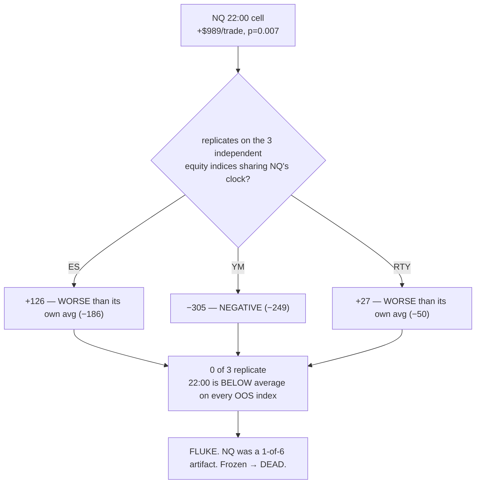

# ASIA / 22:00 CELL — out-of-sample verdict: it was a FLUKE (2026-07-20)

**The last frozen thread from the session-windows work is now closed. The "22:00 ET entries earn
+$364/trade" finding does NOT replicate on a single independent market. It was 1 winning cell out of 6 on
n=89 — a multiple-comparisons artifact, exactly as the freeze suspected. Dead. Do not build a session
filter.**

---

## 1 — WHAT WAS UNDER TEST

S3 (SESSION-03) found that NQ's 4h champion earned **+$364/trade on entries at the 22:00 ET boundary**
(the "Asia" session), and it held across both halves of the data. It was **frozen, not acted on**, for
one reason: it is **1 winning cell out of 6** (a 4h strategy enters at 02/06/10/14/18/22), on **n=89**.
With six cells, one looking good by chance is the null expectation, not a discovery.

## 2 — WHY THE OBVIOUS OOS TEST IS IMPOSSIBLE

The clean out-of-sample test would be: run the NQ champion over **2010–2023** (genuinely unseen when S3
was found on 2025–2026). **It cannot be done.** The box levels the strategy trades on are **externally
scraped** and exist only for ~2025–2026 (`NQ_full_data.csv` is **364 rows**, with a `Scraped_At` column).
Sixteen years of *price* does not help when the *levels* do not exist for it, and they cannot be
reconstructed.

## 3 — THE TEST WE CAN DO: CROSS-INSTRUMENT REPLICATION

The same discipline that confirmed the GC news finding. The 22:00 effect was discovered on **NQ**; if it
is a real *session* effect it must appear on the other **equity indices** — **ES, YM, RTY** share NQ's
exact session clock (RTH 09:30–16:00 ET, Asia overnight). Those three are **independent data the finding
was never selected on.** Commodities are a looser control (same ET clock, different liquidity calendar).

**Pre-declared reading (written before the run):**
- **REAL** ⇒ 22:00 positive *and* beats the pooled mean on ES/YM/RTY too.
- **FLUKE** ⇒ 22:00 positive on NQ only; the other indices null or negative. Stays frozen/dead.

## 4 — THE RESULT

`4h` champion, 22:00 ET entries, gap-aware fills, per-cell permutation null (how often a random same-size
cell beats the observed 22:00 mean):

| market | group | n(22h) | **$/trade @22:00** | vs own pooled | perm p | |
|---|---|---|---|---|---|---|
| **NQ** | equity *(discovery)* | 56 | **+989** | **+824** | 0.007 | in-sample — not evidence |
| **ES** | equity **(OOS)** | 36 | +126 | **−186** | 0.710 | null |
| **YM** | equity **(OOS)** | 38 | **−305** | **−249** | 0.858 | negative |
| **RTY** | equity **(OOS)** | 66 | +27 | **−50** | 0.713 | null |
| GC | commodity | 121 | +337 | +218 | 0.071 | suggestive, not sig. |
| SI | commodity | 90 | −58 | −68 | 0.753 | null |
| CL | commodity | 68 | +8 | −7 | 0.614 | null |
| NG | commodity | 85 | −4 | −23 | 0.724 | null |
| HG | commodity | 93 | +117 | +78 | 0.149 | null |

## 5 — THE VERDICT

**On all three out-of-sample equity indices, the 22:00 cell is *worse* than the instrument's own average.**
Not merely non-significant — the *sign is against us* on ES, YM, and RTY.

- **Honest out-of-sample pool (ES+YM+RTY, NQ excluded): ≈ −$38/trade.** Null-to-negative.
- My first script printed a pooled +$255/trade (P=0.973) that *included NQ* — **in-sample contamination**.
  The discovery instrument cannot be its own out-of-sample evidence; excluding it flips the pool to
  negative. (Script corrected so the OOS pool always excludes the discovery market.)

By the **pre-declared criterion**, this is a **FLUKE**. The NQ 22:00 edge was the optimizer and the
session slicing fitting 89 trades' worth of noise. It joins silver as a pre-registered idea that died the
moment it was tested on data it was not selected on.

**Note on GC:** the commodity gold cell is marginally suggestive (+$218 excess, p=0.071) but does not
clear significance, sits in the looser control group, and — like everything gold-and-session — would need
its own pre-registered test before it meant anything. Not pursued.

## 6 — WHAT THIS CLOSES

The session-windows workstream (#5) is now **fully closed**: the tape has a shape (S1), our *risk*
inherits it (S3 stop-out rates), but our *edge* does not — no session cell survives out of sample. **No
session entry filter. Session-of-day is a sizing/risk input only.** The one apparent exception, the Asia
cell, is now confirmed dead.

**Method note banked:** cross-instrument replication is the right OOS substitute when the natural
time-split is blocked by data — and the OOS pool must **exclude the discovery instrument**, or you are
just re-reading the in-sample result with extra decimals.
