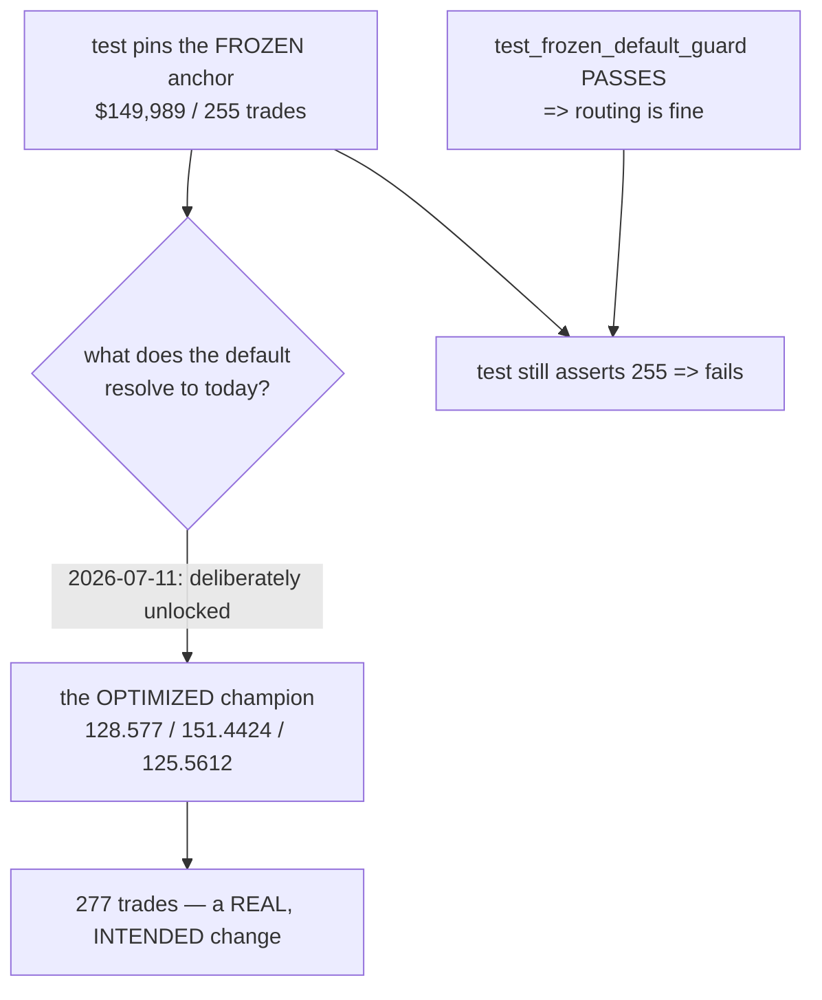

# TEST SUITE TRIAGE — the 35 "pre-existing" failures on `dev` (2026-07-20, in progress)

**A test suite carrying 35 known-failing tests is not a safety net — it is camouflage. Today proved
exactly how expensive that is: three silent bugs in one file invalidated two workstreams' headline
results ([`BUG-01`](BUG-01-sizing-studies-ran-the-wrong-strategy.md)), and a suite nobody expects to be
green cannot warn you. This is the triage: what is genuinely broken, what is stale, and what is already
fixed.**

Branch `fundamental-analysis` · nothing in `optimize/l2/` modified (that is another workstream's code) ·
task #19.

---

## 0 — THE HEADLINE

| | |
|---|---|
| **Fixed today** | `optimize/test_news_veto.py` — 7 tests now collect where there were **0** |
| **Diagnosed, needs its owner** | the 3 `l2` parity anchors — **a stale test, not a regression** |
| **Still open** | l2 taxonomy/tf_defaults/payload, intracandle (#15), `test_ablate`, `test_instruments_comex` |
| **Confirmed** | none of these were caused by the FA merge — verified against the pre-merge baseline `5469bed` |

---

## 1 — ✅ FIXED: the `perf` import failure (and it was hiding more than a test)

**Symptom:** `optimize/test_news_veto.py` failed at *collection* with

```
ModuleNotFoundError: No module named 'perf._common'; 'perf' is not a package
```

which reads like the file is missing. It is not — `perf/_common.py` sits right there.

**Root cause:** `perf/` had no `__init__.py`, making it only a **namespace package**. Namespace packages
have the **lowest priority** in Python's import system — they are used only when no regular module of
that name exists anywhere on `sys.path`. This machine has the Linux perf-tool Python bindings installed
at `/usr/lib/python3/dist-packages/perf.cpython-314-x86_64-linux-gnu.so`, and **that system module wins**,
even with `sys.path.insert(0, ".")`.

**Why it mattered far beyond one test:** the same import is used by `study_vol_target.py` (sizing Z3) and
`run_nulltest.py`. Both were **unrunnable on any machine with that system package**, while working fine
on machines without it — the worst kind of environment-dependent failure. It is also why Z3 could not be
run locally at all when I went to wire it for the GC out-of-sample test.

**Fix:** added `perf/__init__.py` (documented, load-bearing). `perf/` becomes a regular package and
`sys.path[0]` wins outright. **7 tests now collect.**

> ⚠️ **I got this wrong twice before getting it right.** I first reported the test as "genuinely
> orphaned because `optimize/perf/` does not exist" — I had looked in the wrong directory (`perf/` is at
> the project *root*). Then I reported "`perf/*.py` are not tracked in git" — false; all 39 files are
> tracked. That came from reading `git ls-files perf/ | head`, where the uppercase `.md` filenames sort
> before `_` in ASCII, so `head` showed ten `.md` files and silently cut off every `.py`.
> **Lesson: never conclude from a truncated listing.**

---

## 2 — ✅ DIAGNOSED: the three `l2` parity anchors are STALE, not a regression

**Symptom:** three live assertions fail, and the drift is internally coherent:

| Layer | Pinned | Actual | Δ |
|---|---|---|---|
| L1 | 255 trades | **277** | +22 |
| L2 | 34 trades | **48** | +14 |
| Combined | 289 trades | **325** | +36 |

(277 + 48 = 325 — consistent, so this is one cause, not three.)

**Correction to my earlier note:** I recorded these as "documented as RETIRED/xfail pending the l2v2
re-optimization." **There are no `xfail` or `skip` markers in that file at all** — all three are live
assertions. That claim came from memory rather than from reading the file.

**Root cause (verified, not inferred).** The test pins the **frozen lean anchor's** numbers
($149,989 / 255 trades). But the 4h L1 default was **deliberately unlocked** from that anchor to the
optimized champion on 2026-07-11 — stated in `l1_default_params`' own docstring. Direct evidence:

```
l1_default_params('4h')   -> sl_soft 128.577  sl_hard 151.4424  tp 125.5612  gate 89.66   (champion)
frozen_lean_params('4h')  -> sl_soft 149.8    sl_hard 167.1     tp 120.2     gate 86.9    (frozen anchor)
```

`test_frozen_default_guard` **still passes**, so the routing *mechanism* is intact. Only the pinned
numbers are stale — the default now legitimately routes to a different, better champion.



**Recommended fix — for the L2/dev owner, deliberately NOT applied here.** Have the anchor tests pass
`frozen_lean_params()` **explicitly** instead of relying on whatever `l1_default_params` currently
returns. That preserves the guard's actual purpose — protecting the frozen cached oracle — independent
of which champion happens to be deployed. Re-pinning the anchors to the champion's new numbers is the
*worse* option: it re-couples the guard to a value that will move again at the next re-optimization.

`optimize/l2/*` belongs to another workstream. Re-pinning anchor numbers is a judgement call for its
owner, so this is documented and handed over rather than changed unilaterally.

---

## 3 — STILL OPEN

| Group | Count | Note |
|---|---|---|
| `l2/test_taxonomy` · `test_tf_defaults` · `test_payload` | 6 | Likely the **same stale-default root cause** as §2 — verify before assuming |
| `test_intracandle_engine` · `test_intracandle_parity` | 5 | `StopIteration`. This is existing **task #15** |
| `test_ablate` | 3 | `FileNotFoundError` — a missing data file, probably environmental |
| `test_instruments_comex` | 1 | `resolve_paths_use_shifted_box` |
| `local_dash_test.py` | collection | needs `playwright` installed |

---

## 4 — WHY THIS WORK IS WORTH DOING

The suite was dismissed as "35 pre-existing failures" and left alone. Investigating just two groups
found:

1. a **real environment-dependent import bug** that silently made two research studies unrunnable, and
2. a **live, unmarked assertion** guarding a load-bearing invariant, failing for a benign-but-unrecorded
   reason — meaning it can no longer warn anyone if the invariant *actually* breaks.

Neither was visible from the failure list. Both were invisible *because* the suite was already red.

**The principle:** a red suite has zero signal. Every failure must be either fixed, or marked `xfail`
with a written reason and an owner. "Known failing" without a marker is indistinguishable from "newly
broken," which is precisely the state that let today's silent-default bug survive.
