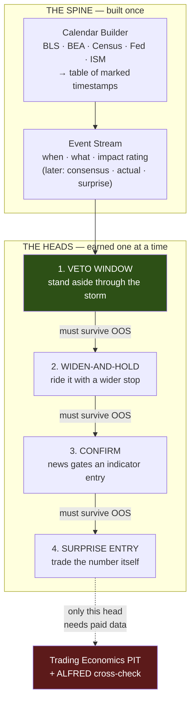
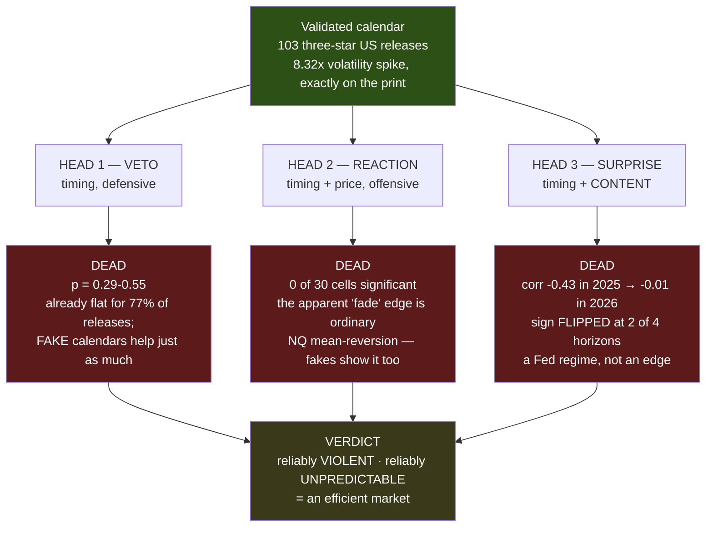

# Fundamental Analysis — Design

**Date:** 2026-07-11
**Branch:** `fundamental-analysis` (tag `brainstorming`)
**Status:** Design approved. Brainstorming artifact — this branch is **not** for merge.

---

## 1. What this is

A design for introducing **fundamental analysis** into the trading system: letting information
about *the world* — scheduled economic releases, financial news, and (eventually) the public
statements of world leaders — influence trading decisions that today are made purely from price
and indicators.

This document covers the **whole roadmap** at the level of architecture, and **Milestone 1** at the
level of implementable detail. Later milestones are deliberately left coarse; each gets its own
spec when it is earned.

### The two sources, and why we start with one

The original scope named two sources of fundamental information:

1. **The financial periodical news** — including the economic calendar of scheduled releases.
2. **World leaders on social media** — the unscheduled, unpredictable stream.

We start with **the economic calendar only**, and within it **US, high-impact ("three-star") events
only**. Everything else — two-star events, other countries, general news, world-leader posts — is
explicitly deferred.

This is not timidity. The economic calendar has a property nothing else in the fundamental universe
has: **its events are scheduled in advance by the publishing agency, at a known time, and that
schedule cannot be revised after the fact.** As Section 3 explains, that single property removes the
three failure modes that would otherwise silently destroy the backtest.

---

## 2. Architecture: one spine, four heads

**The spine** is one table. Every head is a separate consumer reading that same table, so the heads
cannot entangle with each other.

**The ordering is an evidence ladder, not an aesthetic preference.** Each head is placed by how much
evidence it needs before it can be trusted:

| Head | What it can do when wrong | Evidence burden |
|---|---|---|
| 1. Veto | Miss a trade it would have taken | **Lowest** — it only ever *removes* risk |
| 2. Widen-and-hold | Lose more on a trade that was already wrong | Low-medium |
| 3. Confirm | Take credit for profit it did not originate | Medium |
| 4. Surprise entry | Lose money with nothing else to blame | **Highest** — it is the sole cause of its own P&L |

We climb from the head that cannot embarrass us to the one that can. **Head 4 is the one we most
want** (it *increases* entries, matching the standing project direction) **and it is the one the data
is least able to support** (see Section 3.3). It is built last, and only if 1–3 survive.

### Decisions locked during brainstorming

These are settled; revisit only with new evidence.

- **Direction is judged from text alone; materiality from price history.** When we eventually judge
  *content* (news, leader posts), the direction model never sees the price — price is used only to
  *score* it. A separate **materiality** weight, estimated from historical price impact and shrunk
  toward zero for low-sample speakers, answers "does this speaker matter." Two heads, two ground
  truths, neither contaminating the other. (Rationale: Section 3.2.)
- **Validate on NQ; carry CL as an unlabelled falsification column.** We label and train against
  Nasdaq futures only. We *also* record what crude oil did in the same window, without labelling it.
  If our "bearish" events are consistently bearish for both, we have built an alarm detector, not a
  news reader. Cost: one extra column. (Rationale: Section 3.4.)
- **Speaker relevance is handled by shrinkage, not on/off switches.** Explicitly rejected: a
  `contributor_masks.py`-style enable/disable flag per world leader, optimized by the existing
  optimizer. Reason in Section 3.3.
- **Milestone 1 uses free official schedules.** Vendor spend is deferred until a head needs consensus
  or actual values — i.e. until Head 4. (Rationale: Section 4.)

---

## 3. The four traps this design exists to avoid

Everything above is shaped by four specific failure modes. They are recorded here because a future
reader will otherwise be tempted to "simplify" the design straight back into one of them.

### 3.1 Look-ahead by timestamp revision

News articles are **rewritten after publication**. A wire flash at 14:12 reading `OPEC MEETING ENDS`
becomes, by 15:40, a full analysis containing the outcome — often still carrying a timestamp near the
original. Scrape it, feed it to a backtest at 14:30, and the model appears to predict the afternoon.
It is reading tomorrow's paper. This is not an edge case; it is the normal behaviour of news
websites. Deleted posts compound it: a naive social archive shows only the statements the speaker
did not regret, a survivorship bias pointing in a conveniently profitable direction.

**How the design avoids it:** the economic calendar's release times are published *in advance* by the
agency itself and are never retroactively revised. Milestone 1 touches no revisable text at all.

### 3.2 Reverse causality

Political figures comment on markets that have **already moved**. *"The Fed is destroying this
country, look at what happened today"* arrives **because** the market fell. Label it by the
*subsequent* move and you will sometimes catch the continuation and conclude the post was causal.
You have built a model that reads a description of the past and calls it a prediction of the future
— invisible in backtest, fatal live. Worse, this failure is **concentrated in exactly the speakers
you most want to model**: the ones who talk about markets constantly.

**How the design avoids it:** direction is judged from **content only**, never from the price that
followed. Because the price is never consulted during labelling, reverse causality cannot enter. The
price becomes the thing we *test against*, not the thing we *learn from*.

### 3.3 Event scarcity — the central technical problem

This is the one that can kill the whole workstream, and it deserves plain arithmetic.

The indicator optimizer works because a switch that is "on" for a year of NQ data touches **tens of
thousands** of 1-minute bars. Noise averages out; a spurious improvement gets punished.

Now count the fundamental events. From 2025-01-01 to today is ~18 months. There are roughly **eight
or nine recurring US high-impact release types**. That is on the order of **150–200 releases total**
— and every branch we add to the decision tree divides that pile further. A five-action tree across
two windows is easily 8–10 leaf cases: **~18 events per leaf.**

The same arithmetic destroys the on/off-switch approach to world leaders. Flip a switch for a leader
who posted eleven times, four of them about earthquakes. Profit goes up. **Did it — or did four coin
flips land heads?** With eleven events you cannot tell, and *the optimizer cannot know that it cannot
tell*: "did profit go up" is a question it can always answer. Run that across eighty leaders and the
resulting mask is a record of which coins landed heads in-sample. Out of sample, they flip again.

**How the design avoids it:**
- **Fewest branches first.** Milestone 1 has *one* window and *one* threshold.
- **Shrinkage, not switches.** Speaker materiality is an estimate pulled toward the global mean in
  proportion to how little data supports it. A speaker with eleven events is pulled almost all the
  way back to "irrelevant"; one with nine hundred consistent events barely moves. No free switches
  for the optimizer to abuse, and it degrades gracefully for a leader who takes office next month
  and has no history at all — a case the on/off mask cannot represent.
- **The null test** (Section 5) directly measures whether an apparent improvement is distinguishable
  from chance.

### 3.4 The alarm-detector illusion

If we train and validate only on an equity index, almost all alarming geopolitical news is bearish.
A model that learns nothing but *"scary → sell"* will score beautifully and will have understood
nothing. The tell is an instrument where the same alarming news goes the **other way**: sanctions on
a major oil producer are unambiguously bad news and unambiguously **bullish** crude.

**How the design avoids it:** CL is carried as an unlabelled column purely as a lie detector
(see "Decisions locked").

---

## 4. Data sourcing

### The finding that shaped the plan

A verified deep-research pass (102 agents, 19 sources, 24/25 claims confirmed under adversarial
verification) established the provider landscape. The full detail is in Appendix A. The conclusion
that matters:

> **Milestone 1 needs the release *schedule* and nothing else.**

"Do not hold a naked position through a three-star release" requires knowing *that* a release occurs
at 08:30:00 ET on a given date. It does **not** require the consensus forecast, and it does **not**
require the printed actual. Those fields — the expensive, integrity-fragile ones — are needed only by
**Head 4 (surprise entry)**, which is built last.

And the schedule is **free and authoritative**, published by the agencies themselves. A Bureau of
Labor Statistics release calendar cannot be secretly backfilled: BLS *is* the primary source every
vendor resells.

### Milestone 1 sources (free, authoritative)

| Agency | Releases |
|---|---|
| Bureau of Labor Statistics (BLS) | Non-Farm Payrolls, Consumer Price Index, Producer Price Index |
| Bureau of Economic Analysis (BEA) | Gross Domestic Product, Personal Consumption Expenditures (the Fed's preferred inflation gauge) |
| Census Bureau | Retail Sales |
| Federal Reserve | FOMC statement + press conference |
| Institute for Supply Management (ISM) | Manufacturing PMI, Services PMI |

The "three-star" set is **hand-curated** — it is not a vendor secret, it is the eight-or-nine releases
every trader can name. Hand-curation is a feature: it is auditable.

### Deferred vendor decision (Head 4 only)

- **Trading Economics** is the *only* surveyed provider that documents a **point-in-time** calendar
  API — returning events *"exactly as they appeared on a specific date, preserving the original
  values before any subsequent revisions"* — and it explicitly markets this for backtesting. It
  carries release timestamp, survey consensus, actual, previous, and an impact rating.
  **Caveat: this is a vendor assertion, not an independent audit.** Price is not public (~$149–299/mo
  visible tiers; calendar-only price must come from sales). Free trial is unusable for a backfill
  (100 requests lifetime).
- **FRED / ALFRED** (free, official, St. Louis Fed) is the authoritative cross-check for the
  **actual** only. FRED shows the latest revised value; **ALFRED archives every vintage**, so it can
  answer "what did payrolls say on the morning it was released?" Concrete example from the research:
  **January 2021 Non-Farm Payrolls printed at 49,000, was revised to 166,000, then to 233,000.** A
  backtest against the final 233,000 trades on a number nobody had that morning. **ALFRED does not
  store the consensus forecast**, so it can never be a standalone calendar.
- **Financial Modeling Prep** ($22/mo, 5-year history) and **EODHD** ($60/mo, data from 2020) both
  return actual/previous/estimate — but **neither documents any guarantee that the "estimate" field
  is the pre-release consensus rather than a value silently overwritten afterwards.** That is
  precisely trap 3.1 in a different suit. EODHD additionally has **no impact rating at all**.

### Parallel task (starts now, costs an afternoon)

**Empirically audit the Trading Economics point-in-time claim before we ever depend on it:** pull a
specific 2025 payrolls release through their point-in-time endpoint and diff the actual against
ALFRED's first print. If they disagree, the guarantee is worthless — and we will have learned that
for free, long before Head 4 needs it.

---

## 5. Milestone 1 — the Veto Window (implementable detail)

### 5.1 Components

**Calendar Builder** → emits one table. Columns: `timestamp` (UTC, with the source's stated
timezone recorded), `event_name`, `agency`. Nothing else. One row per release.

**Window Measurer** → answers *"how wide is the storm?"* **from the data, not from a round number.**
Take the 1-minute NQ bars, align them to every past release, and measure the realized-volatility
envelope: when does volatility begin climbing before the print, and when does it decay back to
baseline after? If the answer is "it lifts 4 minutes before and settles 11 minutes after," the window
is **4 and 11** — not "15 minutes each side" because 15 is a round number. Output: a plot of the
average volatility envelope, and the two window bounds read off it. This is the same empirical
discipline already applied to every indicator parameter.

**One window for all event types, not one per event.** Milestone 1 measures a **single global
window** applied to every three-star release. Per-event-type windows (payrolls may disturb the market
longer than retail sales) are an obvious refinement — and are **deliberately deferred**, because with
~150–200 total releases, splitting the window per event type immediately re-creates the scarcity
problem of Section 3.3: ~20 events per event type is not enough to measure a window from. If the
global window proves out, per-event windows become a candidate refinement with its own evidence bar.

**Veto Mask** → a boolean over the decision frame: `True` inside a release window.

**The rule.** Inside the window:
- **Block** new entries.
- **Flatten** any open position that is *not* comfortably in profit.

"Comfortably in profit" is expressed in units **the engine already speaks** — open profit as a
multiple of the current stop distance — rather than inventing a new concept. The multiple itself is
the single tunable threshold.

Total new tunable surface: **one window** (two bounds, both measured from data) and **one profit
threshold** (one number). That is the entire parameter budget for Milestone 1, and it is deliberately
this small — see Section 3.3.

### 5.2 Where it plugs in — reuse, not new machinery

The engine already treats certain bars as special:
- `trading_days.py` classifies sessions.
- The `eod` cap-mode already force-exits at end of trading day.
- `contributor_masks.py` already **produces a boolean veto mask over the decision frame, and the
  engine already consumes it.**

"These bars are inside a release window" is the **same species of object** as the veto mask that
already exists. **We are not building a new engine. We are adding one more mask.**

### 5.3 The honesty harness — built in from day one, not bolted on

**The null test (most important).** Run the identical veto rule against **fake release times** —
same event count, same time-of-day distribution, but on random days with no actual release. If the
fake calendar "improves" performance about as much as the real one, we have discovered nothing except
that flattening trades sometimes helps. This costs almost nothing and it is **the single most likely
way this milestone turns out to be an illusion.** It must pass before anything ships.

**Out-of-sample discipline.** Measure the window on one period; test the rule on another. Never both
on the same data.

**The crude-oil thermometer.** As locked above.

### 5.4 Honest expectation, stated in advance

**This milestone will most likely reduce the entry count slightly and reduce drawdown.** That runs
*against* the standing project direction of increasing entries.

It is still the right first rung, because it is the only rung that proves the calendar plumbing
works **without betting money on a news judgment.** The entry-increasing heads are Milestones 2 and
4; this one buys the right to build them. Naming the trade-off now, so it is not discovered later as
a disappointment.

### 5.5 Definition of done

1. Calendar table built from free official sources, covering 2025-01-01 → present.
2. Volatility envelope measured and plotted; window bounds derived from it.
3. Veto mask wired into the engine as an additional mask (existing golden tests unchanged when the
   feature is off).
4. **Null test passes** — the real calendar's effect is distinguishable from the fake one.
5. Result holds out-of-sample.
6. CL thermometer recorded.
7. Dashboard-UI verification per standing project rule (browser UI, `--ind-1min`), not API-only.

---

## 6. Later milestones (coarse — each earns its own spec)

- **Head 2 — Widen-and-hold.** Keep the open trade through the window but temporarily widen the stop,
  so the volatility spike does not knock you out of a position that is ultimately right. Encodes the
  "more profitable to stay locked in" intuition. Adds one parameter (a widen factor).
- **Head 3 — Confirm.** News never opens a trade alone, but when the indicator layer already wants
  in, a supportive fundamental state permits or upsizes it. Slots into the existing contributor
  confirm-count machinery.
- **Head 4 — Surprise entry.** Compute `actual − consensus`, enter in the surprise direction. **This
  is the only head that requires paid, point-in-time-clean data.** It is also where the post-release
  question lives: *did the initial move hold, or is it a head-fake to fade?* Highest upside, highest
  embarrassment risk, hardest to validate on ~180 events. **A kill criterion must be agreed before it
  is built, while nobody is emotionally invested** — deciding it after seeing a beautiful equity curve
  is how everyone talks themselves into overfitting.
- **Beyond the calendar.** Two-star events → other news → world-leader posts. Each re-introduces the
  traps in Section 3, which the calendar work lets us sidestep for now.

### Open questions (deliberately unresolved)

- **Timestamped expert-commentary sources are entirely unresearched.** The original scope wanted the
  *analysis around* a release (previews before, instant reactions after). The research pass returned
  **zero verified sources** for this. It needs its own dedicated research pass — recorded as a gap,
  not papered over with a guess.
- Several providers (Finnhub, Alpha Vantage, Polygon, Forex Factory, Investing.com, Twelve Data,
  Nasdaq Data Link, Econoday, Tradier, Marketaux) produced **no verified evidence either way**. They
  were not ruled out; they were simply not established.
- Trading Economics' point-in-time guarantee is **vendor-asserted and unaudited** (see the parallel
  task in Section 4).

---

## Appendix A — Research provenance

Deep-research pass run 2026-07-11. 102 agents, 6 search angles, 19 sources fetched, 74 claims
extracted, 25 verified by 3-vote adversarial verification: **24 confirmed, 1 refuted, 0 unverified.**

Key primary sources:
- `https://docs.tradingeconomics.com/economic_calendar/point-in-time/`
- `https://docs.tradingeconomics.com/economic_calendar/snapshot/`
- `https://research.stlouisfed.org/publications/page1-econ/2022/08/01/data-revisions-with-fred`
- `https://site.financialmodelingprep.com/developer/docs/stable/economics-calendar`
- `https://eodhd.com/financial-apis/economic-events-data-api`
- `https://tradingeconomics.com/api/pricing.aspx`, `https://docs.tradingeconomics.com/get_started/rate-limits/`
- `https://site.financialmodelingprep.com/terms-of-service`

**Refuted claim** (recorded so it is not resurrected): "FMP's free tier is capped at 250 API
calls/day with only End-of-Day data" — voted down 0–3. FMP free-tier specifics remain **unverified**.

**Licensing note:** FMP's terms bar redistribution and derivative data products without written
approval, and define business-tied use — including "data-driven decision-making" — as Commercial Use.
An automated trading system tied to a business needs the Commercial tier. Trading Economics' and
EODHD's storage terms were **not** in the verified claim set and must be confirmed before storing
their data.

**Time-sensitivity:** all pricing is 2026-current and must be reconfirmed at purchase.

---

# Milestone 1 — RESULT: the veto window FAILED its null test. Not shipped.

**Date:** 2026-07-12. Measured on NQ, 2025-01-01 → 2026-05-19 (~16.5 months, 103 three-star events).

## The verdict

| Timeframe | Baseline P/L | With veto | Delta | Fake-calendar delta (mean ± sd) | p-value | Verdict |
|---|---|---|---|---|---|---|
| 4h | $42,187 | $42,217 | **+$30** | +$573 ± $4,568 | **0.548** | fails |
| 15m | $4,239 | $5,904 | **+$1,665** | +$998 ± $1,075 | **0.290** | fails |
| 5m | $693 | $1,245 | **+$552** | +$614 ± $3,055 | **0.290** | fails |

The bar was p < 0.05. Nothing came close. **The veto window is not shipped.**

## Why it failed — the finding that matters

**The fake calendars help too.** On 15m, a *randomly placed* calendar improves P/L by **+$998 on
average** — versus the real calendar's +$1,665. Randomly flattening trades makes this strategy money.
So whatever small gain the real veto shows is not evidence that news matters; it is evidence that
**this champion holds its losers slightly too long**, and *any* excuse to cut them early helps a bit.
That is a fact about our stop placement, not about the world. Exactly the failure mode the null test
was built to catch, caught.

**And the root cause is structural: the strategy is ALREADY FLAT for 77% of releases.**

- Median hold time: **1.4 hours.**
- Of 103 releases, a position was open for only **24** of them (23%).
- The force-exit therefore fires on just **3–4% of trades** (7/265 on 4h, 19/488 on 15m, 21/600 on 5m).

The whole premise — *"don't hold naked through a release"* — quietly assumed we often hold through
releases. **We don't.** There is almost nothing for the veto to protect.

## Two structural traps found along the way

**The 4h test bed was meaningless, and that was our error.** 4h decision bars land at 02:00 / 06:00 /
10:00 / 14:00 / 18:00 / 22:00. Releases land at 08:30 and 14:00. So **08:30 — which is 91 of our 103
events (88%) — can never coincide with a 4h bar.** Only the twelve FOMC statements at 14:00 can. The
4h entry-veto touched 11 bars out of 2,119 and removed **one trade out of 209**. A 12-minute window
against a 240-minute bar is nearly a no-op. Same for 1h (08:30 is not on the hour). Only 15m/5m/2m can
see these releases at all.

**Statistical power is very low regardless.** With only ~20 affected trades, this test could not have
detected a modest real effect even if one existed. Read the result as *"no evidence of an effect,
and positive evidence that the mechanism is trade-cutting rather than news"* — not as proof that news
never matters.

## What DID hold up

- **The calendar is real and correct.** The release minute runs **8.32× a normal minute**, and the
  spike lands exactly on offset 0 — which validates every FRED release id and every Eastern clock time.
- **There is NO pre-release volatility ramp** (spec §5.1 assumed one). Offsets −6..−1 sit at
  0.78×–1.34× baseline; at two minutes out the market is *quieter* than average. Traders stand aside
  and wait. **The measured window is pre=0, post=12.**
- Both engines wired, golden 6/6 byte-identical when off, trade-for-trade parity when on.
- Infrastructure (calendar, envelope, masks, null test) is reusable by every later head.

## What this kills, and what it opens

**Kills Head 1 (veto).** No evidence, and no mechanism — we are already flat.

**Wounds Head 2 (widen-and-hold).** It targets the same 3–4% of trades, and the pre-release turbulence
it was meant to ride *does not exist*.

**Opens Head 4 (surprise entry) — and inverts the argument for it.** The very fact that sank the veto
is an argument *for* the entry head: **we are flat during 77% of releases, and those are moments the
market moves 8.3× a normal minute.** We are standing aside during the most violent, most
information-rich minutes of the month. That is an entry opportunity, not a risk to hide from — and it
matches the standing project direction (increase entries).

**Caveat, unchanged:** Head 4 needs point-in-time consensus + first-print actuals (paid), and with
~103 events it carries the highest overfitting risk of any head. Its kill criterion must be agreed
BEFORE it is built.

---

# 🚨 CORRECTION — 2026-07-13: THE CLOSE-OUT BELOW WAS UNDERPOWERED. RE-OPENED.

**Read this before you read anything below it. The close-out that follows overstates its confidence,
and I am the one who overstated it.**

## What was wrong

The close-out declares that scheduled US macro news is **"priced in"** and closes the workstream on a
negative result. **That verdict rested on 52–103 events.** The surprise head's out-of-sample "death"
rested on **28 events.**

**We never asked whether the study was large enough to detect anything at all.** It was not.

## The power analysis (`optimize/fundamentals/power_analysis.py`)

| True effect | **Power we had (n=52)** | Events needed for 80% power |
|---|---|---|
| r = 0.10 | **10%** | 783 |
| **r = 0.11 — the effect we actually measured** | **12%** | **647** |
| r = 0.20 | 29% | 194 |
| r = 0.30 | 58% | 85 |

**We had 12% power. We had 8% of the sample required.**

**Even if the effect were entirely real, we would have failed to detect it 88% of the time.**

And the pattern study's magnitude signal came back **POSITIVE on all four independent measures**
(+0.105, +0.121, +0.105, +0.107) — a consistent sign, every one "not significant."
**At 12% power, "not significant" is not evidence of absence. It is a study too small to see.**

## What the honest verdict actually is

> **NOT "scheduled news does not work."**
>
> **"We cannot tell with sixteen months of price data."**

## The bottleneck, and it is fixable

**It is NOT the calendar** — FRED has decades of releases, free. **It is our price data:**
2025-01-01 → 2026-05-19.

| Price history | Releases | Power at r=0.11 |
|---|---|---|
| **What we had** | **52** | **12%** ❌ |
| + 2024 (complete, sitting UNUSED in `data/2024_data/`) | ~100 | 19% |
| 5 years | 188 | 32% |
| 10 years | 376 | 57% |
| **Back to ~2009** | **640** | **80%** ✅ |

**And we do not need continuous history.** These studies need only ±60-minute windows around each
release — roughly **78,000 bars** for 650 events. A small, cheap acquisition, not seventeen years of
continuous futures data.

## What still stands, and what does not

| Claim | Status |
|---|---|
| The calendar is validated (8.32× spike exactly on the print) | ✅ **STANDS** — that is a measurement, not an inference |
| The market is CALM before a release (0.78× at −2 min) | ✅ **STANDS** — measured |
| **The 08:30 lockup does NOT leak** (07:45–08:28 ≈ ordinary days) | ✅ **STANDS** — verified 2026-07-13 |
| The veto is structurally near-useless (already flat for 77% of releases) | ✅ **STANDS** — that is an arithmetic fact about our holding period, not a statistical inference |
| The 4h timeframe cannot see 08:30 releases | ✅ **STANDS** — arithmetic |
| The "$72k fade edge" is ordinary NQ mean-reversion (fakes reproduce it) | ✅ **STANDS** — the fake-calendar control is valid regardless of power |
| **"The surprise signal is dead"** | ❌ **RETRACTED — UNDERPOWERED.** 28 out-of-sample events |
| **"Scheduled US macro is priced in"** | ❌ **RETRACTED — UNDERPOWERED.** We cannot tell |
| **"Do not buy vendor consensus data"** | ⚠️ **SUSPENDED.** The argument rested on the retracted verdict |

## The lesson, recorded

**I was rigorous about multiple comparisons, out-of-sample validation, and null tests — and then never
once asked whether the sample was large enough to see anything.** That is a basic omission and it is
the same class of error this whole document exists to guard against. **A null test tells you whether an
effect you found is real. A POWER analysis tells you whether you could have found it at all. We ran the
first and skipped the second.**

**Both are mandatory. Neither substitutes for the other.**

---

# WORKSTREAM CLOSE-OUT — 2026-07-12 *(SUPERSEDED — read the correction above)*

## The one-line answer

**Scheduled US macro releases are priced efficiently by NQ. All three exploitation routes were tested
honestly and all three are dead. No vendor data was purchased, and none is recommended.**

## What was tested, and how each died

### Head 3 is the one worth remembering

It **passed** in-sample: correlation **−0.322** pooled (p = 0.021 vs a shuffled-surprise null), and
**−0.432** on 2025 alone. The sign was economically coherent — a better-than-expected number was
bearish for NQ, the classic "good news is bad news" hawkish-Fed regime. Significant, plausible,
mechanistic.

Out of sample it **evaporated**: 2026 correlations of −0.011 / +0.159 / +0.125 / −0.021 — the sign
**flipped at two of four horizons** — and the frozen 2025 rule lost money at every horizon in 2026
(−2.8 to −6.4 bp/trade, hit rate 32–41%).

Not a power problem. The effect is *gone*. **"Good news is bad news" is a property of a Fed regime,
not a law of markets.** The kill criterion was written down before the test ran; that is the only
reason this was killed instead of shipped.

## Why it is efficient — and the hypothesis this does NOT touch

The releases are unexploitable **precisely because they are scheduled.** Everyone knows a number lands
at 08:30 on a published date. The market has already positioned. Our own envelope shows it directly:
the market goes **QUIET** before a print (0.78×–1.34× baseline at −6..−1 minutes), then explodes 8.32×
at the print and re-prices within ~12 minutes. That is textbook efficient absorption of *anticipated*
information.

**That argument does not extend to UNSCHEDULED news** — the second source in the original scope (world
leaders on social media), never tested. An unscheduled statement has no pre-positioning, no consensus
to price against, and no "everyone is waiting" quiet period. The efficient-market logic that killed
the calendar actually *predicts* that unscheduled news could behave differently.

**But the honest caveats stand, and they are the ones from §3:** unscheduled text carries the
timestamp-revision trap (3.1), reverse causality (3.2), survivorship of deleted posts, and worse event
scarcity than the calendar — and the deep-research pass returned **zero verified timestamped sources**
for it. It is the harder path with the worse data, and nothing here has made it easier.

## What survived and is worth keeping

- **The validated calendar** (`optimize/fundamentals/us_high_impact.csv`, 103 events). Proven correct:
  the volatility spike lands exactly on the print. Reusable by anything.
- **ALFRED point-in-time first prints** (`alfred.py`). Free, official. 2025 payrolls were revised by
  801k–1,032k jobs after the fact — point-in-time integrity is not paranoia.
- **The measured envelope**: no pre-release ramp; the storm is (pre=0, post=12).
- **Both engines wired**, `news_veto` off by default, **golden 6/6 byte-identical**, full engine↔
  fast_engine parity. The feature is inert and harmless where it sits.
- **The null-test harness** — the most valuable artifact here. It caught **three** mirages:
  a $72k "fade" edge that was just NQ mean-reversion, a veto whose gains random calendars matched,
  and a p=0.021 surprise signal with a good story that was a dead regime.

## Recommendation

**Do not buy vendor consensus data.** The counter-argument — that a real economist consensus is a
cleaner yardstick than our statistical one, and a noisy yardstick can destabilise a true relationship —
is fair but now has to carry all the weight. We have no free evidence that content predicts direction
*stably*, and the one relationship found flipped sign inside twelve months. A better ruler does not
help when the thing being measured keeps moving.
