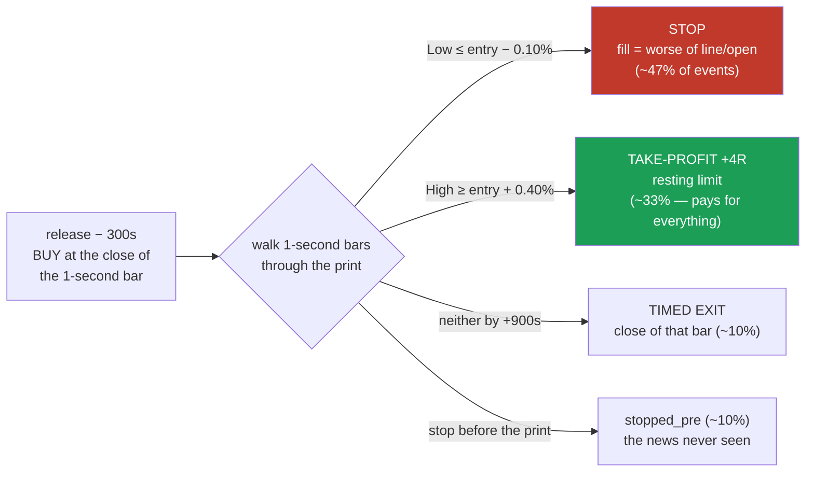
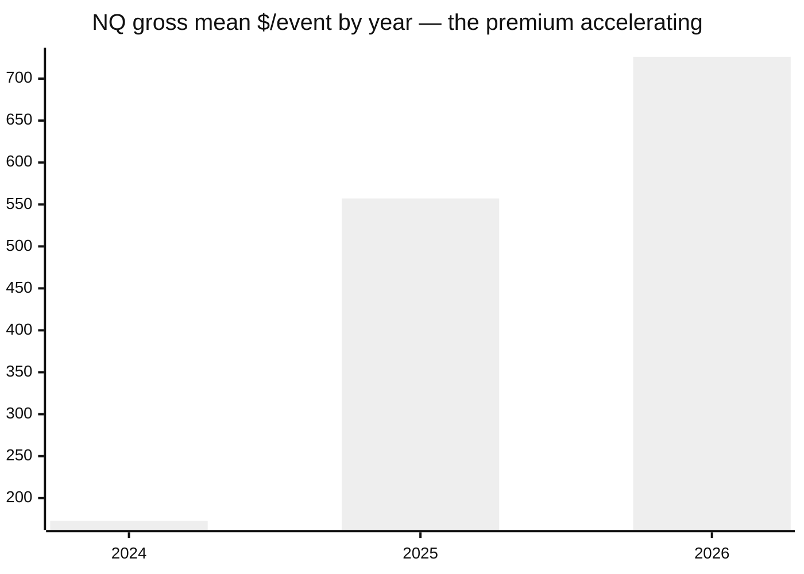
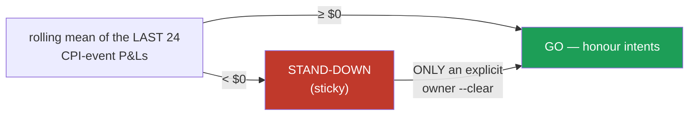

# PLAYBOOK — news-release-long v1.0.0
### The Announcement-Premium Bracket: LONG through scheduled macro releases

**Status: PAPER ONLY — merge/deploy gated on explicit owner instruction (#127).**
Operative window per the owner: **2024 → 2026** (history back to 2010/2016 kept for study reference only).
Bundle contents: `champion.json` (the spec + expected numbers) · `portable_backtester.py`
(self-contained, numpy+pandas only) · `schedule_2024plus.csv` (the release schedule) · this playbook.
**Reproduce & verify:** `python3 portable_backtester.py --bars-1s <NQ_1s.csv> --instrument NQ --verify`
→ must print `VERIFY: PASS` (it does: NQ and RTY both, to the cent, on the server).

---

## 1 · The trade, in one diagram

- **Series:** CPI (Inflation Rate MoM) · NFP · FOMC — CPI is the engine in every measurement method.
- **Tie rule:** one 1-second bar breaching BOTH stop and TP counts as a **STOP** (pessimistic, pre-registered).
- **Direction is LONG only** — the short side *pays* the premium (negative in 18/18 tested cells).
- **qty:** native integer sizing; dollars scale exactly linearly (verified 327/327 events to the cent).

## 2 · Expected performance, 2024 → 2026 (net = STRESSED costs, $22.50/event)

| | NQ | RTY |
|---|---|---|
| events | 81 | 81 |
| gross mean / event | **+$447.03** | +$117.69 |
| net (stressed) / event | **+$424.53** | +$95.19 |
| total gross | **+$36,209.52** | +$9,533.11 |
| win rate | 42.0% | 39.5% |
| median event | **−$362.8** (loses!) | −$102.5 |
| p5 / p95 | −$554 / **+$2,071** | −$133 / +$574 |
| best / worst event | +$2,900 / −$995 | +$609 / −$310 |
| by year (gross mean) | 2024 +$173 · 2025 +$557 · 2026 +$726 | 2024 −$49 · 2025 +$158 · 2026 +$351 |

⚠️ **Read the distribution before trading it:** the median event LOSES. A typical month is one or two
small −1R losses; two to four take-profit seconds carry the whole year. Live performance that "feels
losing" while matching this table is the strategy working as measured.

## 3 · Did it add value? The with-vs-without measurement (same system, same window)

The NQ 1h champion slot (the dashboard's own accounting) with and without this overlay merged in:

| window 2025-01 → 2026-05 | WITHOUT | WITH |
|---|---|---|
| total P&L | +$78,823 | **+$103,309** |
| max drawdown | $8,815 | $9,401 |
| P&L per $ of drawdown | 8.94 | **10.99** |

**+31.1% profit for +6.6% drawdown** · daily P&L correlation **+0.098** (near-orthogonal) · overlay
time-in-market **~14 h** vs the slot's 581 h · releases while the slot held a position: 6 of 42 ·
worst joint day −$2,032.

## 4 · Risk facts (inherited from the evidence — live use may not shed them)

1. **Worst measured stop slippage = 2.1× the nominal stop** (gap-through-stop in the sweep second;
   NFP 2026-03-06, −$995 on a ≈$476 stop). Budget the losing leg as −2R.
2. **Blind spot:** fills assume line-or-open on 1-second bars; sweep-second slippage beyond the
   stressed 4 ticks is unmeasurable in bar data.
3. **Era dependence:** the premium was ≈0 before 2020 and is strongest 2025–26. Nothing in-sample
   separates a permanent premium from an inflation-era regime — hence the monitor (next section).
4. RTY note: the bundle schedule includes the 2026-03-06 NFP+Retail shared minute that the study's
   RTY selection tie-broke out (documented in `champion.json`; −$128.22 on RTY).

## 5 · Operating conditions (non-optional)

- Monitor: `src/deploy/regime_monitor.py` — halting is automatic; **restarting is an owner decision**.
- Annual: re-run the claims ledger (`optimize/verify/run.py`, research branch) — if it is not
  27/27, published numbers have drifted and this playbook is stale.
- Deployment gates: owner merge instruction on #127 · a live execution path (currently paper
  intents only) · monitor GO.

## 6 · Provenance chain (why these numbers are believable)

Confirmed in WS-NEWS3 M3 (#117) at **Bonferroni α/54 + chronological half-split** → executor replay
reproduces the committed evidence **exactly** (NQ 327/327; 2024+ subset 81/81, $36,209.52 to the
cent) → this bundle's portable code re-verifies against `champion.json` (`--verify` = PASS, both
instruments) → claims ledger IDs in `champion.json` re-derive every headline from committed files.

## 7 · Scaling (v1.1.0 addendum — D3 + D4)

The scaling studies live in **`SCALING-FINDINGS.md`** (per-scale summaries for qty 1/5/10/20),
with the raw evidence in `evidence/`. The one-line map: **qty 1–2 as verified · qty 5 work the
entry · qty 10–20 worked entry only (validated; NQ keeps 96% of the edge, RTY improves +24%) ·
combined qty=20 pace ≈ $330k/yr at 1.3–2.5% window participation.** Full stage picture:
`STAGE-STATUS-REPORT.md`; one page: `EXECUTIVE-SUMMARY.md`.

## 8 · ES CPI — DEPLOYED (owner ship instruction on #139, 2026-08-18)

The same frozen ride, on ES, riding **CPI only** (the premium is CPI-concentrated everywhere):
net **+$151.37/event** full-era at $52.50 stressed costs (p=0.0027, jump 20.5×); the 2024→2026
window nets **+$529.44/event** (n=29, +$15,353.82/contract) — reproduced to the cent by the
executor (`--instrument ES --series "Inflation Rate MoM"`). Integration adds **+36.5%** to the
layer at qty=1 — but it **scales the CPI bet rather than diversifying it** (ES↔NQ same-event
correlation 0.78; 24% of CPI events lose on all three legs; worst joint CPI event −$1,023).

Independence caveat, verbatim from the pre-registration: ES's own history generated the
hypothesis; the true holdout (never-touched YM data) returned **VOID-DATA** — YM's premarket
tape is thinner than the registered quality line (median 101 traded pre-release seconds), while
its descriptive numbers (net +$107.64, t=3.15) *agree* with ES. **The owner explicitly accepted descriptive-grade evidence and ordered the ship on #139 (2026-08-18)** — the pre-registered rule is satisfied by that word; the YM VOID caveat stays on the record. Full case: `docs/WS-ESCPI-REPORT-BILINGUAL.html`, issue #139, ledger 36/36.

Usage (v1.2.0): `python3 portable_backtester.py --bars-1s <ES_1s.csv> --instrument ES --verify`
(the bundle filters the schedule to CPI via `spec.instruments.ES.series`). Executor:
`python3 -m src.deploy.release_executor replay|paper --instrument ES --series "Inflation Rate MoM"`.
Regime monitor guards ES like the rest (CPI net-stressed feed).

## 9 · YM CPI — verified candidate (NOT deployed)

The full-grid sweep's only positive (+$107.64 net/event, p=0.0016, jump 9.8×, n=116) — walked
through the same core + dashboard verification as ES (#139/#147). Held back from deployment by
its thin premarket tape (median 101 traded pre-release seconds ⇒ execution study RQ-7 required)
and by the owner's word. Evidence grade: grid-exploratory, same consumed-history caveat as ES.
