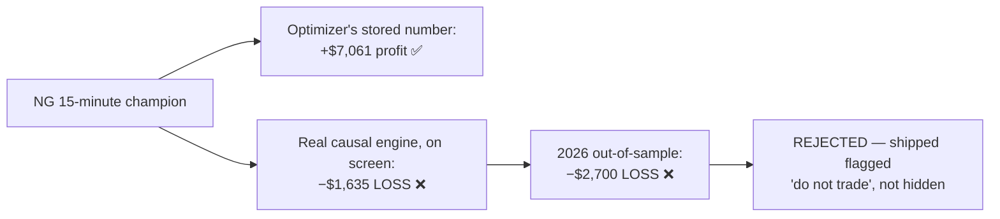
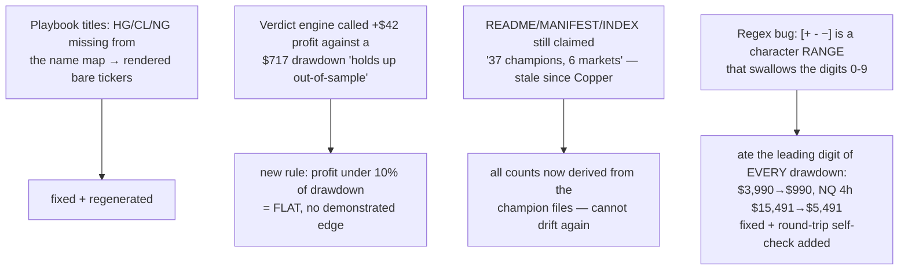
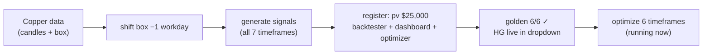
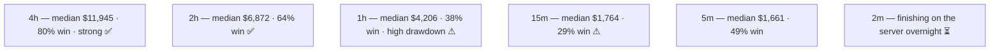
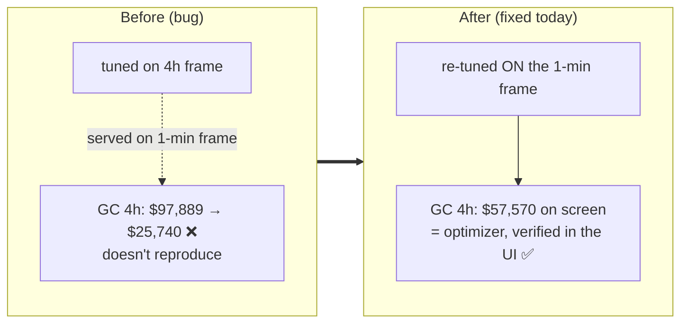
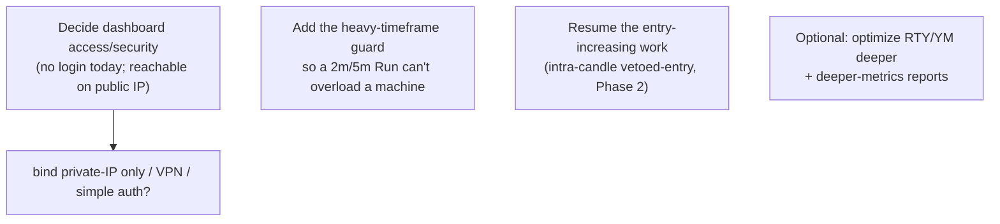

# Daily Reports

_Newest on top. High-overview standup: what got done · what's next · challenges._

---

## 2026-07-11 — Oil + Gas onboarded end-to-end; a losing champion caught before it shipped; 9 markets live

_(End-of-day. Nothing left running on the server — the queue is empty for the first time in four days.)_

### ✅ What got done today

**The headline: two new energy markets went from raw price files to shipped, verified, documented product —
and one champion the optimizer swore was profitable turned out to lose money, and got caught.**

**WORKSTREAM 1 — finished the Oil + Gas optimization and extracted the champions.**
The overnight campaign completed at 01:06 — **12 timeframe-searches, 5,700 trials each, ~68,000 backtests
total**, the same budget every other market got. I pulled the best configuration out of each of the 12
searches (each one is a "best trade-off" frontier of ~100–400 candidates; the champion is the top pick by the
conservative cross-validation score).

**WORKSTREAM 2 — verified all 12 through the real dashboard, and this is where the day earned its keep.**
Rather than trusting the optimizer's own reported number, I drove the **actual browser dashboard** for every
champion, twice each (full history + the held-out 2026 year) — **24 real backtests** — and read the exact
figures off the screen.

**Eleven reproduced. One did not.**

The optimizer uses a fast approximate engine to search quickly; the dashboard uses the exact causal engine.
For Natural Gas 15-minute they **disagreed by $8,700 and by sign**. The on-screen figure is the truth. This is
the **second** time this has happened (Copper 2-minute was the first) — so it is a pattern, not a fluke, and
the rule "verify every champion through the actual UI" is now load-bearing, not ceremony.

**What the two new markets are actually worth** (real on-screen numbers · worst drawdown · profit in 2026, a
year the tuning never saw):

| Timeframe | Crude Oil (CL) | Natural Gas (NG) |
|---|---|---|
| 4-hour | $21,760 · DD $3,990 · **+$2,475** ✅ | $17,363 · DD $2,086 · **+$5,910** ✅ |
| 2-hour | $10,448 · DD $1,098 · **+$2,561** ✅ | $18,112 · DD $2,053 · **+$1,733** ✅ |
| 1-hour | $7,939 · DD $740 · **+$1,436** ✅ | $12,086 · DD $1,132 · **+$6,183** ✅ |
| 15-min | $15,852 · DD $1,021 · **+$5,943** ⚠ low win | **−$1,635 · LOSES MONEY** ❌ |
| 5-min | $4,090 · DD $717 · **+$42** ⚠ flat | $27,991 · DD $366 · **+$8,502** ⚠ low win |
| 2-min | $17,775 · DD $911 · **+$4,707** ✅ | **$30,294 · DD $230 · +$10,024** ✅ best |

**11 of 12 usable.** The standout is **Natural Gas 2-minute**: $30,294 of profit against a worst-ever dip of
only **$230**, and it still made **+$10,024** in the unseen 2026 year.

**WORKSTREAM 3 — playbooks + the shareable code bundle, extended to 9 markets.**
- **12 new playbook PDFs** (the suite is now **55**: 9 markets × 6 timeframes + the Gold 4h-indicator variant).
- Captured each champion's **exact settings** as the dashboard sends them, and added all 12 to the shareable
  backtester bundle → **55 champions**. Then proved the bundle actually reproduces them: **12/12 exact, matching
  both the headline profit AND the 2026 figure, to the dollar.**

**WORKSTREAM 4 — four real bugs found and fixed while doing the above** (none of these were on the plan):

Bug #4 deserves a note: in the pattern `[+-−]`, the hyphen sits between `+` and `−`, which silently turns it
into a *range* covering every digit. It was quietly corrupting the drawdown column of the shipped manifest —
including for markets that were already live. The fix comes with a **self-check that fails loudly** if a parsed
number can't be re-formatted back into the text it came from, so this class of error can't ship again.

**Shipped:** everything merged and pushed to `dev` (`ff79770`), which also carried the Copper bundle commit
that had been sitting unpushed since the 9th.

### 🎯 What's next (tomorrow)

- **Decide the direction.** The onboarding run is complete (9 markets, 55 champions, all verified) — this
  chapter is closed. The standing priority is back to **increasing entries** toward near-zero-day-hold, on
  Layer 1 first.
- **Resume the intra-candle vetoed-entry feature** — it's the live entry-increasing workstream, already
  validated out-of-sample in Phase 1 and paused at the optimizer-wiring step.
- **Investigate the fast-engine divergence properly.** Two markets have now been caught (HG 2m, NG 15m). Right
  now we only find these by verifying each champion by hand. Worth a focused look at *why* the fast engine
  disagrees — if it's systematic, it may be quietly costing us better champions during the search itself.

### ⚠️ Challenges / lessons

- **The optimizer's number is not evidence.** NG 15m would have shipped as a deployable default on the
  optimizer's word alone. Only the browser-UI check exposed it. Two-for-two now — this stays mandatory.
- **"Technically positive" is not the same as "profitable."** Crude Oil 5-minute made **+$42** in 2026 while
  exposing you to a **$717** drawdown. The old logic called that a pass. It's noise, not an edge, and now it's
  flagged as such. Small honesty gaps like this are exactly how a suite quietly loses credibility.
- **Stale hardcoded counts and a swallowed digit both shipped unnoticed.** Two of today's bugs were *already
  live* before today — the manifest had been wrong since Copper landed. Derived-not-hardcoded, plus a
  self-check, is the actual fix; spotting it by eye is not a strategy.

### 📌 State at end of day
- **9 markets live, 55 verified champions, 55 playbooks, one parity-locked shareable bundle** — all pushed to
  `dev` (`ff79770`).
- **44 deployable · 9 caution · 2 non-feasible · 51 of 55 profitable out-of-sample.**
- **Nothing running on the server.** No overnight job, nothing to babysit.
- Loose end: the expanded 2026-07-08 report entry is still uncommitted.

---

## 2026-07-09 → 07-10 — Copper finished + Oil/Gas onboarded (not separately reported at the time)

_Recorded here so the work isn't lost — these two days ran into each other around the Copper campaign._

- **Copper (HG) completed end-to-end:** all 6 champions extracted, **UI-verified**, reported, committed and
  pushed (`dev 8e0f83c`). 4h ($50k), 2h ($26k) and 2m ($32k) deployable. This is where the **first fast-engine
  divergence** turned up — Copper 2-minute's stored number ($76k) was nothing like the real on-screen figure
  ($31,787). Also discovered the **dashboard's market dropdown is hardcoded HTML**, not generated from the
  registry — so a newly-registered market is invisible in the UI until an entry is added by hand. The
  onboarding checklist was corrected (it had falsely claimed the list was automatic).
- **Copper added to the shareable bundle** as the 7th market (43 champions).
- **Oil (CL) + Gas (NG) onboarded through Step 4:** contract values confirmed with you ($1,000 and $10,000 per
  point), data placed, boxes shifted back one trading day, signals generated + validated + packaged, both
  registered across backtester + dashboard + optimizer, safety test green (**golden 6/6**), both live in the
  dashboard — and the hardcoded-dropdown fix applied **up front** this time. Then launched the 12-timeframe
  optimize campaign that finished overnight into today.

---

## 2026-07-08 — 37 shareable playbooks + a parity backtester, and Copper (HG) onboarded end-to-end

_(End-of-day. The Copper optimize campaign keeps running on the server overnight — it will finish on its own.)_

### ✅ What got done today

Three big workstreams, each with substantial investigation behind it — not just the visible deliverable.

**WORKSTREAM 1 — 37 shareable playbooks (a full investigation, not just "made PDFs").**
- Wrote and committed a **design spec**, then produced **36 one-page, self-contained PDFs** (every market ×
  timeframe): plain-language verdict, the exact settings to load, a how-it-trades diagram, the full results
  table with the **real dashboard screenshot embedded**, the 2026 out-of-sample check, and honest "when NOT to
  trade" notes. **33 green ("deployable"), 3 "caution," 35 of 36 profitable out-of-sample.**
- The hard part was **getting the numbers provably right.** I had to run a **server pass driving the live
  dashboard for all 36 champions × 2 windows (full + 2026)** to capture the exact on-screen figures, and along
  the way debug three real traps that each cost time: (a) the on-screen headline comes from one internal field
  (`boxes`), **not** the other (`summary`) they're ~2% apart; (b) the first capture silently returned blanks on
  heavy timeframes — fixed by reading the dashboard's own memory instead of racing the network; (c) a
  JavaScript-scope bug in the wait logic. Every headline number was then **verified to match the dashboard to
  the dollar.**
- Added a **37th "bonus" playbook** — Gold 4-hour using **4-hour indicators** (the stronger high-timeframe
  version from our comparison report): **+$97,950 vs the deployed +$57,570, and +$22,310 vs −$540
  out-of-sample.** This one wasn't served by the dashboard at all, so I had to **reconstruct its champion from
  the raw optimizer results** and inject it correctly (a fiddly multi-step job — the first two attempts gave
  $45k and $81k before it reproduced the exact $97,950).

**WORKSTREAM 2 — a shareable code bundle that reproduces every playbook to the dollar.**
- One **self-contained backtester** (the *exact* causal engine the dashboard runs — not a rewrite) plus **37
  ready-to-run champion configs**. Anyone drops in their own price files and reproduces each champion's numbers
  exactly — **verified 37/37, to the dollar, including a clean-room test of the shipped zip.**
- This was the biggest hidden time-sink: the obvious/simple engine **silently mismatched the newer markets by
  up to 70%** (they use a "time cap" only the full engine applies). I had to **rebuild the bundle on the
  correct causal engine, make it portable** (bring-your-own-data folder), and **untangle a heavy dependency**
  (the causal engine dragged in the whole optimizer/optuna stack — reduced to the one pure function actually
  needed). **Committed and pushed to `dev`** (merge `0cd3086`) with all the generator/build scripts.

**WORKSTREAM 3 — onboarded a brand-new market, Copper (HG), end-to-end.** Confirmed the contract value with you
($25,000 per point), placed the price + box data, shifted the box back one trading day, generated all the
trading signals (validated + packaged), registered Copper in the backtester + dashboard + optimizer, and
confirmed the safety test (Nasdaq unchanged, "golden 6/6") still passes. **Copper is live in the dashboard.**

**Then launched Copper's optimization** — the same 5,700-trials-per-timeframe search every other market got,
plus a data-backed investigation into why it *looked* slow (see Challenges).
**5 of the 6 timeframes finished today** (the last, 2-minute, is finishing on the server tonight). Best
Copper champions so far, by the optimizer's conservative cross-validation number (the real full-history
figure is typically ~2–3× higher — confirmed at verification):

### 🎯 What's next (tomorrow)

- **Finish Copper:** extract the 6 champions → verify each in the dashboard UI (exact on-screen numbers) →
  measure 2026 out-of-sample → write the **full dashboard-replica report** for each (not just profitable/not),
  flagging the weak slots honestly (1h and 15m look high-drawdown / low-win-rate so far).
- **Commit + push Copper** (registry + champions) to `dev`.
- Optional: give Copper the same **playbook PDFs** and add it as the **7th market** in the shareable bundle.

### ⚠️ Challenges / lessons

- **I over-estimated the optimize time and corrected it with data.** I first projected 6–10 hours by
  extrapolating from the slow warm-up phase. In reality the search **prunes and accelerates hard** — exactly
  as you recalled — so the full 5,700-trial budget runs ~40–60 min per timeframe, and every earlier market ran
  the *same* 5,700 (confirmed from the trial store). Lesson: don't extrapolate a genetic search's speed from
  its first few minutes.
- **The reproducer engine choice mattered a lot.** The simple engine silently mismatched the newer markets by
  up to 70% because it ignores their time cap; only the full causal engine reproduces them. Worth the rebuild.
- **Copper's low timeframes look weak** (1h/15m: high drawdown, ~30% win) — likely "caution" slots like
  Gold-1h / Silver-4h were. Tomorrow's out-of-sample check will confirm.

### 📌 State at end of day
- **Playbooks + shareable bundle: shipped and pushed to `dev`** (merge `0cd3086`).
- **Copper onboarded through Step 4** (data, signals, registry, golden 6/6, live in dashboard) — **not yet
  committed** (holding until champions are verified tomorrow for one clean commit).
- **Copper optimize: 5/6 timeframes done; 2-minute finishing on the server overnight** (detached — survives
  logout, no babysitting needed). Studies saved in Postgres (prefix `hg1`).

---

## 2026-07-07 — Five new markets onboarded, the frame bug fixed, dashboard shipped as a shared service

_(End-of-day. Supersedes the mid-day paused note: everything that was "for tomorrow" got resolved today.)_

### ✅ What got done today

**1. Onboarded five markets end-to-end** — Gold (GC), Silver (SI), and re-aligned E-mini S&P (ES) in the morning,
then Russell 2000 (RTY) and Dow (YM) in the afternoon. For each: placed the price + box data, shifted every box
back one workday, generated all the trading signals, registered them in the backtester + dashboard dropdown, and
wired them into the optimizer. The original Nasdaq (NQ) was never touched — the safety test (golden 6/6) stayed
byte-identical all day. The dashboard now offers **6 instruments × 6 timeframes = 36 champions**.

**2. Built a reusable onboarding pipeline** (`onboard_stock.py` + a written procedure with a "check with me first"
gate), so the next market follows the same steps. A parallel mode runs signal generation in minutes on the server
instead of ~1 hour locally, proven to give identical output.

**3. Found, root-caused, AND fixed the critical "wrong-frame" bug.** The optimized settings weren't reproducing in
the dashboard — because they were tuned reading indicators on the *decision* timeframe (e.g. 4-hour), but the
dashboard was *forcing* indicators onto the *1-minute* frame. Same settings, wrong frame → completely different
trades. We chose **Option A: re-run every campaign the correct way (on the 1-minute frame)** on the server, then
**verified each champion through the real dashboard browser UI** — the on-screen numbers now match the optimizer
exactly. (Also added a dashboard dropdown to switch 1-min vs decision-frame indicators, defaulting to 1-min.)

**4. Fixed the Silver blow-up** — a rounding bug was chopping tiny stop/target prices to zero (a degenerate
"no-stop" setup that lost ~$119k). Kept full precision → Silver recovered to healthy positive numbers.

**5. Fixed two dashboard defects + made it fast:**
- A red **"Maximum call stack size exceeded"** banner on heavy timeframes — caused by feeding a huge list of price
  bars into a function all at once; replaced with a running max. Committed and **pushed to dev**.
- The dashboard backtest was recomputing everything from scratch each Run; reused the optimizer's cached work →
  a heavy 2-minute Silver Run went from **~175 seconds to ~3 seconds**, with identical results.

**6. Produced 36 full-dashboard snapshots** (every market × every timeframe) on the server, each verified: **0 error
banners, 30/30 exact match** to the recorded champions. Fixed a crop problem (the page was only capturing the top
third) so each snapshot is now the *complete* dashboard, and bundled all 36 into one scrollable PDF contact-sheet.

**7. Shipped the dashboard as a shared service.** It now runs on the server reachable by anyone with server access
(private/VPN address recommended), **survives logout, and auto-restarts within ~2 seconds if it crashes** (tested
by killing it live). Added a one-command control script (`dash.sh start|stop|refresh|status|logs`) and a plain-
language user guide (`docs/DASHBOARD_GUIDE.md`).

### 🎯 What's next (tomorrow)

### ⚠️ Challenges / lessons

- **The verify-immediately rule paid off.** The wrong-frame bug earlier slipped through because verification was
  deferred; today every re-tuned champion was checked in the live UI *as it landed*, so nothing wrong shipped.
- **Snapshots were silently cropped** — the dashboard's scrolling area hides its true height, so the screenshot
  tool only grabbed the visible part. Found by checking the image dimensions, fixed by expanding the page before
  capture, then re-ran all 36.
- **Security caveat, flagged not fixed:** the shared dashboard has **no login** and is currently reachable on the
  public IP. Recommended keeping it on the private network/VPN; the access decision is yours (didn't touch the
  firewall without a go-ahead).

### 📌 State at end of day
- **Pushed to `dev`** (merge `ec08533`): the heavy-timeframe crash fix + the memoization speed-up.
- All 6 markets' champions are now **re-tuned on the correct frame and verified in the dashboard UI** — the
  on-screen numbers are trustworthy again.
- Dashboard is **live and shared** on the server (`dash.sh status` → HTTP 200), with guide + control script in place.

## 2026-07-03

**What did you do today?**
A big, two-part day. First we **wrapped up and packaged the volatility/signal-fusion research** — full write-ups,
a single self-contained briefing others can read cold, and a **sourced catalogue of every advanced method worth
revisiting later** — and parked the most promising next idea (fusing in *outside* market signals like a fear-gauge
and breadth) because it's **waiting on a data feed from the team lead**. Second, and the main event, we **designed,
built, and rigorously tested a brand-new "second-chance entry" feature**: take the trade setups the system
currently skips and enter them **partway through the candle when conditions improve**. We tested it every way we
could — on the main strategy, with a "give the proven trades priority" fix, out-of-sample, then a full re-tuning on
the server, and finally by isolating it in the second layer (two different ways). The **honest verdict across all
of it: the feature reliably trades *more often* but never makes *more money*** — the skipped setups are genuinely
low-quality — so we **retired the feature** (fully built, tested, and safely switched off). But the re-tuning we
ran to test it fairly **threw off a real prize**: a re-tuned version of our champion strategy that makes
**about +$24,000 more (≈$166.5K vs $142K) at the same risk, and it held up out-of-sample — +66% on the most recent
year.** We **validated it and promoted it** — it's now the dashboard's **default strategy, ready to trade**.

**What will you do tomorrow?**
Pick up the next entry-increasing thread toward the "trade more often" goal — most likely the **outside-signal
fusion** if the team lead's data has arrived (even one feed is enough to run the decisive first test), otherwise
one of the other ready ideas (the advanced-methods catalogue, or hardening the new champion with a pure
out-of-sample re-test before it goes live).

**Is there any challenges?**
The same honest, recurring difficulty: **promising ideas keep adding activity without adding profit.** The setups
the system skips are skipped for good reason, so every "trade more" idea has to prove it clears the bar — and the
second-chance-entry feature, tested three separate ways, ultimately didn't. The single highest-value next
direction (fusing outside market signals) remains **blocked on external data we don't yet have.** The bright spot:
the discipline works — it stopped us shipping a feature that looked good but wasn't, and surfaced a genuine,
validated improvement instead.

---

## 2026-07-02

**What did you do today?**
Today we brought the volatility / signal-fusion research program to a **clean, honest close** and lined up the next
bet. We finished and rigorously tested the **last idea** in the Kalman study — using the market's volatility
"regime" to decide how we exit trades — and, like the ideas before it, it looked plausible but **fell apart under
across-time testing**, so we closed the whole study with a clear verdict: the trades our system currently skips are
**genuinely hard to trade**, and none of the methods we tried recover them reliably. We then packaged everything
for the future: a full writeup of every experiment (in both plain-English and technical form), a **single
self-contained briefing** others can read with no background, and — importantly — a **catalogue of every
more-advanced method that exists**, hardened with a real, **sourced literature search**, so we have a ready menu to
revisit later. We also clarified and locked down the **real next opportunity**: fusing in genuinely *new outside
signals* (a volatility fear-gauge, market breadth, interest rates, options data) to read *market conditions* for
position sizing and when to sit out — and we mapped exactly which data to get and where to get it. That work is now
**parked, waiting on the data feed from the team lead**. Finally, we opened a **brand-new idea** and began
designing it: giving the setups we currently reject a **second chance to enter partway through the 4-hour window**
if conditions improve — and produced a decision worksheet for sign-off before building.

**What will you do tomorrow?**
Turn the answers on the "second-chance entry" worksheet into a concrete design and build plan, then implement the
**first phase** — measuring its effect on our **current best strategy** before any heavier work. In parallel, if
the outside-signal data arrives, run the cheap first test on it; otherwise keep momentum on the other
ready-to-build improvements.

**Is there any challenges?**
The same disciplined difficulty as before: promising ideas keep **shrinking under honest testing** — good hygiene,
but it means no confirmed new edge yet from the fusion research. The most valuable next step is **blocked on
external data we don't yet have**. And the new "second-chance entry" idea, while cheap to test on the current
strategy, will be **more work to fold into the optimizer** — so we're deliberately testing it small first before
committing to the heavier build.

---

## 2026-07-01

**What did you do today?**
Today we **closed out the overnight "trade more often" experiment** and turned it into something usable: we pulled
the results, wrote them up, and wired the best variants into the dashboard as ready-to-use strategies — one set as
the **zero-touch default that reproduces its numbers exactly** on open. The lesson: we *can* push the system to
trade about **1.8× more often**, but chasing volume alone costs profit, so it doesn't beat our current best strategy.
Then we ran a **deep, disciplined research program on Kalman filtering and signal fusion** — the "can we safely
trade far more of the signals we currently skip?" question. We first pinned down the key fact: our profit-per-trade
is fixed by the exit rules, so the whole game is getting the **direction** right on the skipped signals — and if we
could do that perfectly, the upside is roughly **9×**. We then tested three ways to recover that direction:
combining signals across timeframes (**no edge**); a Kalman trend estimate (**looked great at first — nearly doubled
out-of-sample profit while trading more — but a rigorous across-time re-test showed the edge is marginal and
inconsistent**, i.e. the exciting number was over-fit); and we **started designing the third and final approach** —
using the market's volatility "regime" to adjust both which trades we take and how we exit them.

**What will you do tomorrow?**
Finish designing, then build and honestly test the **regime-based approach** — the last untested idea, and the only
one that can raise **profit-per-trade** rather than just trade more. If it survives the same across-time validation,
it's a genuine win; if it doesn't, we'll have a conclusive answer on whether the skipped signals are worth
recovering at all — and can close the study cleanly.

**Is there any challenges with your task?**
The honest across-time testing keeps **deflating exciting first-cut results** — good discipline, but it means no
confirmed edge yet. The root difficulty is real: the signals the strategy currently skips are genuinely hard to
trade profitably, and our data window is short, so anything promising has to **prove it holds across time** before
we trust it. Today's Kalman result is the clearest example — impressive on one split, ordinary under scrutiny.

---

## 2026-06-30

**What did you do today?**
Today we **finished optimizing ES across all timeframes** — every timeframe now has its own tuned,
drawdown-controlled strategy, the strongest being the 1-hour at **~$52K** and the 4-hour at **~$39K** in profit.
We then **built a cross-timeframe capability** that lets the system trade two timeframes at once — a primary and
a secondary that fills the primary's idle windows — which lifted results to **~$174K on NQ** and **~$72K on ES**,
beating either timeframe alone. We also **mapped out every workstream into a single progress dashboard** so we can
see, at a glance, where each effort stands and what's next. Finally, we **opened a new optimization direction** —
re-tuning NQ to maximize how *actively* it trades (more entries) rather than win-rate — and kicked off that run,
while **starting to brainstorm where the next gains will come from**.

**What will you do tomorrow?**
Step back and **review all the open workstreams to evaluate progress on each**, then **double down on the most
promising ones to push results further** — **starting with the Kalman filter and signal-fusion** research, which
is the most likely place to find a genuinely new edge.

**Is there any challenges with your task?**
The headline numbers are encouraging, but they're still **lab results that need real-world (out-of-sample)
validation before we can trust them** — we've already seen one case where a great-looking result fell apart under
fresh data, so proving durability is the real next hurdle, not finding bigger in-sample numbers.