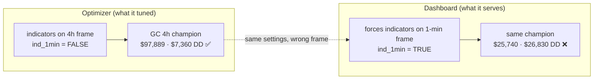
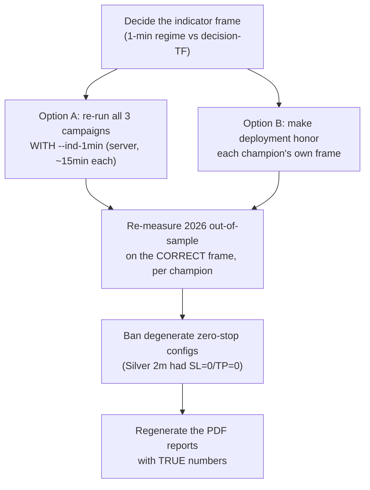

# Daily Reports

_Newest on top. High-overview standup: what got done · what's next · challenges._

---

## 2026-07-07 — Gold/Silver/ES onboarding + optimization (and a caught bug)

### ✅ What got done today

- **Onboarded Gold (GC) + Silver (SI) end-to-end**, and re-aligned E-mini S&P (ES):
  placed the price + box data, shifted every box back one workday, generated all the trading signals,
  registered them in the backtester + dashboard (they now appear in the dropdown), and wired them into the
  optimizer. NQ stays untouched (golden 6/6 byte-identical throughout).
- **Built a reusable onboarding pipeline** (`onboard_stock.py`) + a written procedure (`NEW_STOCK_ONBOARDING_SOP.md`)
  with a "check with me first" gate, so the next stock follows the same steps. Added a parallel mode (`--jobs`) so
  signal generation runs in minutes on the server instead of ~1 hour locally (proven byte-identical to serial).
- **Ran the full optimization for all three** on the AMD server — ~34,200 trials each, 24 workers, ~15 min apiece.
  Extracted the best settings per timeframe, wired them as dashboard defaults, committed.
- **Fixed the dashboard dropdown** (Gold/Silver weren't listed) and produced **champion reports as local, single-page PDFs** (one combined + one per instrument).
- **Found and fully root-caused a critical bug** (below).

### 🔴 The bug (found late, root cause confirmed)

The optimized champions **do not reproduce in the dashboard** — the real engine shows far worse numbers, and all
looked negative in 2026. Root cause is **not** the optimizer or a math error: the champions were tuned computing
indicators on the **decision (e.g. 4-hour) timeframe**, but deployment **forces indicators onto the 1-minute
frame** — a different setting than they were optimized for, so the dashboard takes completely different trades.

Proof (Gold, 4-hour champion): on the frame it was optimized for it makes **$97,950** with a **$7,360** drawdown
(matches the optimizer exactly); on the wrongly-forced frame it collapses to **$25,740** with a **$26,830**
drawdown. The champions are good — they're just being *served on the wrong frame*.

### 🎯 What's next (tomorrow)

- Also open: a **dashboard guard** so selecting a heavy timeframe can't freeze the machine.

### ⚠️ Challenges / lessons

- **The box froze once** — backtesting a heavy 2-minute timeframe locally exhausted the 14 GB RAM (OOM). Heavy
  backtests now go to the server (128 GB). A dashboard guard is queued.
- **Process miss (owned):** the 2026 out-of-sample / dashboard-reproduction check was explicitly requested, and I
  deferred it behind finishing the campaigns and building the report — so the wrong-frame champions got committed
  as defaults and the bug was only caught by chance while making the report. Corrected the working rule:
  verification runs **immediately per champion**, before anything else moves.
- Slow link to the server made data pushes/pulls slow (worked around with background transfers).

### 📌 State at pause
- Committed: onboarding + pipeline + all 3 optimized champions + dropdown fix + reports (commits `e855fa7` →
  `9c08e70`, branch `stocks-drop-down-backtester-optimizer`). **Not pushed.**
- Champions are **wrong-frame as deployed** — do not trust the current dashboard defaults or the PDF numbers until
  the fix + re-measure tomorrow.
