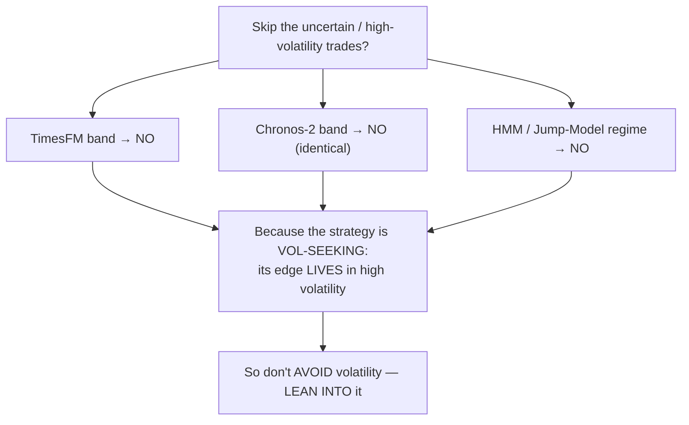
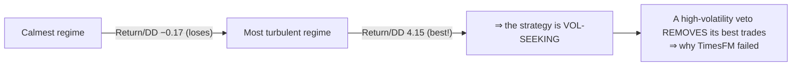

# Daily Reports — Agent B (Research)

_Newest on top. High-overview standup: what got done · what's next · challenges._

> ### 🤝 Two parallel agents work this project
> This codebase is developed by **two Claude agents running in parallel**, each pinned to its own
> branch/worktree so they never collide:
> - **Agent A — Optimizer / Champions** (mainline `dev`): optimization, new-market onboarding, playbooks,
>   the shareable bundle, cap re-optimization, champion-set/best-per-slot work. → logs in **`DAILY_REPORTS.md`**.
> - **Agent B — Research** (this file; isolated `research-*` branches): the deep-research-first studies —
>   Kalman, fundamental analysis, session-windows (#5), own-distribution/tail (#7), the TimesFM & Chronos-2
>   volatility-model tests, regime detection (HMM/Jump-Model), and the regime-edge program. → logs **here**.
>
> Kept in a **separate file** so the two agents never conflict on a shared log. Nothing in the research
> branches is merged/deployed unless explicitly promoted. (Prior research days — Kalman 07-01, fundamental
> analysis / #5 / #7 through ~07-14 — were folded into Agent A's `DAILY_REPORTS.md` before this split; from
> 07-15 on, Agent B logs here.)

---

## 2026-07-18 — The volatility-model line closed (3 methods agree), and the one thing that *does* work: size **with** volatility

**Today finished the volatility-signal investigation and found the single actionable result of the whole arc.**

### ✅ What got done today

**1 — Chronos-2 (the strongest TimesFM successor) was tested and it fails identically.** We fed our fusion
strategy's trade log through Amazon's Chronos-2 forecast — a newer, richer foundation model (21 uncertainty
bands vs TimesFM's 10) — used the same way: skip trades when the model says the near future is very
uncertain. It **hurt**, exactly like TimesFM: risk-adjusted return 5.52 → 4.63, the worst drawdown completely
untouched, worse than removing trades at *random*. The two models' "uncertainty" readings correlate 0.71 —
they're measuring the same thing, so the richer model buys nothing.

**2 — That closes the whole question.** Three independent methods now agree — TimesFM, Chronos-2, and the
Hidden-Markov regime model — that **filtering our strategy by volatility does not help**, because the strategy
is **vol-seeking**: it earns its money precisely *in* turbulent markets. So I **closed three more planned
model experiments** (TiRex, Moirai-2, Toto-2) as expected-negatives rather than burn compute re-proving it.

**3 — Ran the three mechanism-based redirects, one by one.** Instead of "avoid volatility", tested the
directions that still have a real mechanism:
- **NQ concentration** (are gains driven by a few mega-caps, or broad?) — a genuinely *non-volatility* signal,
  sourced free from Yahoo Finance. Showed a clean gradient (the strategy earns best when mega-caps dominate)
  but did **not** beat a random-label control on our one year of trades. **Suggestive, not proven.**
- **Sizing, not vetoing** — ⭐ **the winner.** Keep every trade, but size **bigger** in turbulent regimes
  (where we earn) and **smaller** in calm ones. Risk-adjusted return **5.52 → 5.90**, more profit, **beats
  95% of random sizings, and helps all three years.** And the textbook move — *inverse*-volatility sizing —
  actually **hurt** (4.06), because it shrinks exactly the trades we make money on.
- **Gate a volatility-*hurt* strategy** — built a quick mean-reversion baseline to test the flip side, but on
  the Nasdaq a naive fade just loses money (no edge to protect). **Inconclusive** — needs our real second-layer
  book.

### 🎯 What's next
- Promote the **sizing** result properly: choose the size ramp *out-of-sample*, re-test on a longer trade
  history, and cap absolute drawdown — then wire it into the L1/L2 policy.
- Optional: a cleaner concentration test; run the vol-hurt test on the real L2 book; push the research
  branches + a cross-workstream summary for the team.

### ⚠️ Challenges / lessons
- **A negative result, tripled, is still worth a lot** — proving vol-filtering is dead across three methods
  stops us (and future me) from chasing every new forecasting model as a fix.
- **The constructive flip only appeared by asking the opposite question.** Every "avoid volatility" test
  failed; inverting it to "lean into volatility" is what finally beat a control.
- Everything here is still **one year of live trades** (our box levels only exist 2024→). The sizing win is
  promising but borderline; it needs a longer book before it's trusted.

---

## 2026-07-17 — A teammate's "+$50k AI edge" reproduced to the dollar — then died out-of-sample; and the reason why

**Took a foundation-model trading claim from raw files to a rigorous verdict, and discovered *why* it fails.**

### ✅ What got done today

**1 — Fact-checked a teammate's TimesFM result and reproduced it exactly.** The brief said a Google
time-series AI model added **+$50k profit and cut drawdown to $12k** on our Nasdaq strategy. Checking the
actual files, the documented figure is **+$20.7k / drawdown $10.4k** — the +$50k wasn't supported (flagged and
corrected). Then reproduced the real number **to the dollar** on the server, and independently re-verified the
causal logic (no peeking at the future).

**2 — Passed the "dumb control", then *failed* the honesty test that matters.** The AI beat every cheap
volatility proxy (plain ATR, realized vol) on the original sample — so it wasn't trivially replaceable. But
extending the test from one 16-month **bull** window to a second year, with the strategy tuned honestly
out-of-sample, it **collapsed**: it hurt every year, left the worst drawdown untouched, and its trade
selection became no better than random. **Verdict: NO-GO — a single-regime artifact, not a durable edge.**

**3 — Opened a regime-detection study from your X-thread and found the real explanation.** Fit a Hidden Markov
Model to label each day's market regime (calm → turbulent), then looked at where our strategy makes money:

The strategy earns **best** in the most turbulent regime and **loses** only in the calmest — so any
"skip-the-uncertain-trades" rule strips out the good trades. That single finding explains the whole TimesFM
result. The regime model as a *veto* was also a NO-GO (and the fancier Jump Model over-fit), but the
*diagnosis* is gold.

**4 — Built the reusable machinery.** A standardized 5-stage reporting system (prior-art → reproduce →
dumb-control → robustness → verdict) so every future idea runs the same gauntlet, plus two vetted backlogs
(recent foundation-model successors; external data sources).

*(Also progressed the parallel tail-risk (#7) and news-trading (fa-v2) research threads to their verdicts.)*

### 🎯 What's next
- Test the best successor model (Chronos-2) to close the "did we try the strongest tool?" question.
- Turn the vol-seeking diagnosis into a constructive test (sizing, not veto).

### ⚠️ Challenges / lessons
- **Verify, don't trust — even your own intermediate numbers.** Caught a subtle bug where the volatility gate,
  re-created fresh per trade, never accumulated history and silently vetoed *nothing*; only reproducing a known
  number flagged it.
- **A cache keyed on the wrong thing hides real changes.** Extending the data appeared to do nothing until I
  cleared a results cache that keys on strategy parameters, not on the underlying data.
- **n=1 is the recurring enemy** — our box levels only exist from 2024, so every test is one regime deep.

---

## 2026-07-15 — Three research threads opened deep-research-first; a foundation-model claim taken in for testing

**A "research-first" day: every new thread started with a prior-art mining pass before touching our data.**

### ✅ What got done today

**1 — Opened the TimesFM volatility-model investigation.** A teammate shared a foundation-model result
claiming a large profit boost on our Nasdaq strategy. Rather than take it at face value, I vendored the code
and data into an isolated research branch, fact-checked the claim against the actual files (the headline was
overstated), and ran the mandatory deep-research prior-art pass: 25 sourced findings, whose upshot was that
these models are weak at *direction* but their *uncertainty* might be a usable volatility signal — with **no
published precedent** for using it as a trade filter, so the burden of proof was ours.

**2 — Ran deep-research passes for two more threads.** Session-windows (#5 — does time-of-day carry a
tradeable edge?) and own-distribution / tail-risk (#7 — how fat are our per-trade losses, really?). Each
started from an online prior-art sweep, then a concrete on-our-data test plan — the standing rule that every
workstream begins research-first.

### 🎯 What's next
- Reproduce the TimesFM number on the server and put it through the full gauntlet.

### ⚠️ Challenges / lessons
- **The brief's number didn't match the source files.** Catching that on day one (documented +$20.7k, not the
  quoted +$50k) set the honest baseline for everything that followed.
- A web-research rate limit interrupted the adversarial-verification stage; salvaged the sourced findings and
  queued the verification rather than block.
