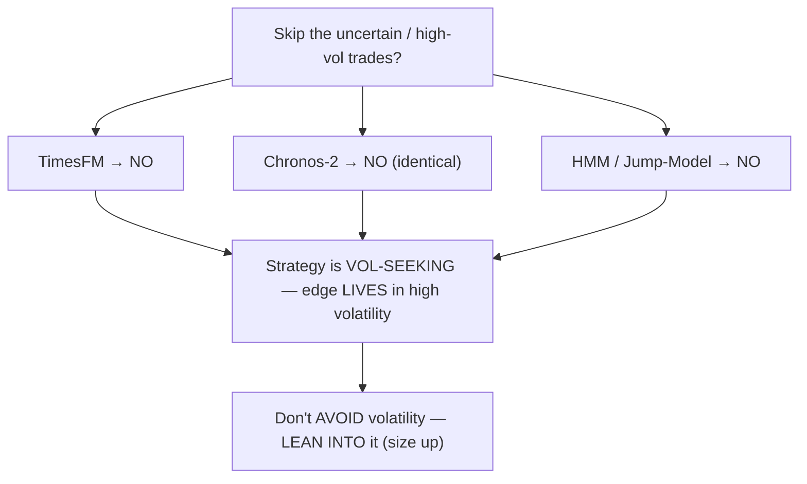
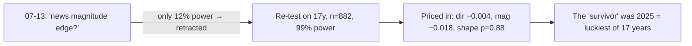
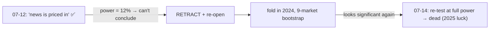

# Daily Reports — Agent B (Research)

_Newest on top. High-overview standup: what got done · what's next · challenges._

> ### 🤝 Two parallel agents work this project
> This codebase is developed by **two Claude agents running in parallel**, each pinned to its own
> branch/worktree so they never collide:
> - **Agent A — Optimizer / Champions** (mainline `dev`): optimization, new-market onboarding, playbooks,
>   the shareable bundle, cap re-optimization, champion-set/best-per-slot work. → logs in **`DAILY_REPORTS.md`**.
> - **Agent B — Research** (this file; `research-*` + `fundamental-analysis` branches): the deep-research-first
>   studies — fundamental analysis / news (fa-v2), own-distribution & tail risk (#7), session-windows (#5),
>   position-sizing / Kelly (#17), external-data sourcing (#16/#18), the TimesFM & Chronos-2 volatility-model
>   tests, regime detection (HMM/Jump-Model), and the regime-edge program. → logs **here**.
>
> Kept in a **separate file** so the two agents never conflict on a shared log. Nothing in the research
> branches is merged/deployed unless explicitly promoted. Prior research (Kalman 07-01 … news up to 07-12) was
> folded into Agent A's file before this split; **Agent B logs here from 07-13 on** (last shared entry: 07-12).

---

## 2026-07-18 — The volatility-model line closed (3 methods agree); the one thing that works is: size **with** volatility

### ✅ What got done today

**1 — Chronos-2 (the strongest TimesFM successor) tested → fails identically.** Fed our fusion book through
Amazon's Chronos-2 (richer foundation model, 21 uncertainty bands vs TimesFM's 10), used as a "skip the
uncertain trades" filter. It **hurt**: risk-adjusted return 5.52 → 4.63, worst drawdown untouched, worse than
random. Its uncertainty reading correlates 0.71 with TimesFM's — same thing, so the richer model buys nothing.

**2 — That closes the whole question (3 methods agree).** TimesFM, Chronos-2, and the HMM/Jump-Model regime
all say the same: **filtering by volatility does not help — the strategy is vol-seeking**, it earns *in*
turbulence. Closed three more planned model experiments (TiRex, Moirai-2, Toto-2) as expected-negatives.

**3 — Ran the 3 mechanism-based redirects, one by one (regime-edge program).**
- **NQ concentration** (mega-caps-driven vs broad; free from Yahoo) — clean gradient (earns best when mega-caps
  dominate) but fails a random-label control on one year. **Suggestive, not proven.**
- **Sizing, not vetoing** — ⭐ **the winner.** Keep every trade, size bigger in turbulent regimes / smaller in
  calm. Return/DD **5.52 → 5.90**, beats **95%** of random sizings, helps **all 3 years**. Textbook
  *inverse*-vol sizing **hurts** (4.06) — it shrinks our best trades.
- **Gate a vol-hurt strategy** — a naive NQ mean-reversion just loses money (no edge to protect).
  **Inconclusive**; needs the real L2 book.

**4 — Data-sourcing correction (#16/#18):** fixed the record on long gold history — it's an **in-house
Databento assemble**, not paid Barchart.

### 🎯 What's next
Promote the **sizing** result (choose the ramp out-of-sample, longer book, cap absolute drawdown → wire into
L1/L2 policy); optional cleaner concentration test / vol-hurt on the real L2 book; push branches + a
cross-workstream summary.

### ⚠️ Challenges / lessons
- A negative result proven three ways is worth a lot — it stops us chasing every new forecasting model.
- The constructive win only appeared by **inverting the question** (lean into vol, not avoid it).
- Still **one year of live trades** (box levels only exist 2024→); the sizing win is promising but borderline.

---

## 2026-07-17 — The heavy day: TimesFM died out-of-sample, and the tail / news / sizing studies all closed

### ✅ What got done today (six threads)

**1 — TimesFM: reproduced to the dollar, then NO-GO.** Reproduced the teammate's +$20.7k exactly; it beat every
cheap volatility proxy (dumb control passed) — but extended to a second year with honest out-of-sample tuning
it **collapsed** (hurt every year, drawdown untouched, no better than random). **A single-regime artifact.**

**2 — Regime detection (from your X-thread) → the *why*.** A Hidden Markov Model showed the strategy earns
**best in the most turbulent regime** (Return/DD 4.15) and loses only in the calmest (−0.17): **it's
vol-seeking.** That explains the TimesFM failure. The regime as a *veto* was also NO-GO (the fancier Jump Model
over-fit), but the diagnosis is the prize.

**3 — Own-distribution & tail study (#7) → COMPLETE, keep the fixed stop.**
- D1: our per-trade P&L is **truncated, not fat-tailed** — the stop caps the tail (7,356 NQ trades).
- D2: raw returns are genuinely fat (tail index α≈3), and **heavier overnight than during the day**.
- D3: the 40-point stop's safety is **regime-dependent** (conditional EVT / McNeil-Frey).
- D4: a volatility-scaled stop is **REJECTED** — the fixed stop/TP is already regime-invariant (scaling it
  courts gambler's ruin). **Verdict: keep the fixed stop.**

**4 — Fundamental analysis v2 (news) → ANSWERED: news is a *volatility* event, not a direction/recovery edge.**
Close-on-news is mechanistically sound but **negligible** (champions are ~1% in a position across a release);
entering on news has **no directional edge**; the "assist" (scale in after a loss) is **REJECTED** on 17 years
— the belief was backwards. The tradeable content of news is a *volatility* rule, not a directional one.

**5 — Position sizing / Kelly (#17) → workstream CLOSED.** Full Kelly on our ledger is ~**2.5%** (CI
[0.3%, 4.4%]); the binding constraint is **drawdown, not ruin**, so the answer is **a quarter-to-half Kelly**,
capped (Z1 Kelly → Z2 tail/gap haircut → Z4 + SIZE-00 = sizing fraction closed). Along the way, Z3:
volatility-targeting the contract count looks **promising** (Sharpe 3.2 → 3.9, both halves) but is
**in-sample** → flagged for OOS.

**6 — External-data sourcing (#16) → assessment DONE.** Surveyed macro-data providers: **none beat free
FRED/ALFRED**; Barchart is the (paid) path to long gold history. (Corrected 07-18: long gold is actually an
in-house Databento assemble.)

Plus: built the standardized 5-stage reporting system + two experiment backlogs; extracted the X-thread HMM
idea; kept the cross-workstream MASTER-STATUS doc current as each thread closed.

### 🎯 What's next
Test the best successor model (Chronos-2); turn the vol-seeking diagnosis into a constructive sizing test;
the #17 vol-targeting result needs an out-of-sample confirmation.

### ⚠️ Challenges / lessons
- **Verify, don't trust — even your own numbers.** Caught a volatility-gate bug (a fresh object per trade never
  built history → vetoed nothing) only by reproducing a known figure.
- **A cache keyed on parameters, not data, hid a fix** — cleared it and the data-extension finally took.
- Two separate studies (tail #7, news fa-v2) reached the same shape: **the interesting thing about our edge is
  volatility, not direction** — foreshadowing today's (07-18) conclusion.

---

## 2026-07-16 — (light day — work committed on the 17th)

No research commits landed on 2026-07-16. The volatility-distribution (#7) completion, the fundamental-analysis
decisions, and the TimesFM/regime results spanned the 16th–17th and were committed on **07-17** (above). No
separate standup for the 16th.

---

## 2026-07-15 — Five threads advanced in one day: session-windows closed, tail + TimesFM opened, news re-opened, an engine trap fixed

### ✅ What got done today

**1 — Session-windows (#5) → COMPLETE.** Measured our own intraday shape on 17 years of Nasdaq data: the
classic **U-shape is confirmed**, but the famous London–NY overlap is a **non-event** for us. Key finding: our
**risk** inherits the session shape (stop-outs cluster by time of day) but our **edge does not** — so **no
entry-time filter**, though it argues for time-of-day **sizing**. Consolidated report; workstream closed.

**2 — Own-distribution / tail (#7) → opened.** Deep-research prior-art pass produced the EVT/GARCH recipe
(extreme-value theory + volatility model) and a concrete on-our-data plan for measuring how fat our losses are.

**3 — TimesFM volatility-model → opened.** Vendored a teammate's foundation-model result into an isolated
branch, fact-checked the claim against the files (**documented +$20.7k, not the quoted +$50k**), ran the
mandatory prior-art pass (25 sourced findings; no published precedent for the band-as-filter idea).

**4 — Fundamental analysis v2 (news) → re-opened** on a tighter design (NQ + gold only; decisions =
close/enter/assist; content→pattern→rule). First result **A1: gold reacts strongly to US macro (7.2×** the
quiet-day move) and weights events differently than the Nasdaq.

**5 — Engine hygiene + a frozen forward test.** Renamed a genuinely dangerous name — the misleadingly-titled
`veto_mask` → `veto_vote_mask` (#4) — and documented what *actually* blocks an entry. Pre-registered and
**froze** the silver test (D3) as a forward test (not dropped, not confirmed — pinned so it can't be
cherry-picked later).

### 🎯 What's next
Reproduce the TimesFM number on the server and put it through the full gauntlet; execute the #7 tail plan.

### ⚠️ Challenges / lessons
- **The brief's number didn't match the source files** (+$20.7k documented, +$50k quoted) — caught day one.
- A web-research rate limit interrupted adversarial verification; salvaged the findings and queued the rest.

---

## 2026-07-14 — Fundamental analysis settled properly on 16 years: BOTH signals dead, news IS priced in; and the stop-outs are real 1-second sweeps

### ✅ What got done today

**1 — Settled the retraction with real statistical power — BOTH signals dead.** The news verdict had been
*retracted* on 07-13 because the test had only **12% power**, and a partial re-correction had made a signal look
significant again. Wired in the full **16-year frame (2010–2026, validated 100% against the old data)** and
re-ran at ~**99% power (n=882 releases)**: **both the direction and the magnitude signals are dead — "scheduled
US macro is priced in" is RE-CONFIRMED, properly.** Direction −0.004, magnitude −0.018, persistence 48.2%,
shape p=0.880. The figure that had looked like a survivor was **2025 being the single luckiest of the years**,
not an edge.

**2 — Stop-loss forensics (TASK #11) → the sweeps are real, and the verdict still stands.** Investigated whether
our stop-outs are genuine or microstructure noise: **94% of stop-outs are 1-second sweeps (median duration 1
second)** — price spikes through the stop and comes right back. Even so, the **stop-loss verdict STANDS**: the
per-trade edge from a wider stop is dwarfed by the swing it exposes. Closed the task.

**3 — Two silent bugs caught mid-rerun, and data-integrity hardened.** The 17-year write-up caught **two more
silent bugs** (wrong numbers, no error thrown). The macro calendar now **announces its date-span on every
load**, after an rsync had silently halved a study's data without any error, and a **watchdog** was added — the
kind of quiet corruption that invalidates a result.

### 🎯 What's next
Close out #4 (veto_mask rename) and the silver test; open the next studies — session-windows (#5) and
own-distribution / tail (#7).

### ⚠️ Challenges / lessons
- **Never report a negative without a power analysis.** The 07-13 retraction happened because the first test
  couldn't have detected the effect even if it existed; only the 16-year, ~99%-power re-run was conclusive.
- **A silent data-halving nearly shipped a wrong answer**, and two more no-error bugs surfaced in the rerun —
  hence the calendar now self-reports its span and a watchdog guards the data.

---

## 2026-07-13 — The retraction: a power analysis caught my own overconfidence; and the dynamic-stop premise was refuted

### ✅ What got done today

**1 — Retracted the "news is priced in" verdict — it was underpowered.** A power analysis showed the test
behind the confident "priced in" conclusion had only **12% power** — it could not have detected the effect even
if it were real. **Retracted the verdict and re-opened the workstream**, and wrote up *how every safeguard I'd
built still failed to catch it*. Then folding in 2024 and re-testing across 9 markets with a bootstrap gave a
**partial correction** — the signal dismissed at 12% power came back *apparently* significant. (Definitively
re-settled the next day on the full 16-year frame: it was 2025 luck.)

**2 — Dynamic stop-loss study → the premise is refuted.** Added live unrealized-P/L tracking (how far each
trade runs for/against you — MFE/MAE) to **both** engines, then measured the **post-stop price path: it's a
fair random walk.** After a stop-out, price is equally likely to go either way — so a blanket "ignore the stop
and hold" rule is **EV-neutral**, not a hidden edge. Complete report, "from the candle to the theorem."

**3 — Data prep + reporting.** Wrote the formal download spec and the **1,208 macro-release timestamps** for the
seconds-level extraction (which powered the next day's 1-second-sweep finding). Produced a **complete
experiment log (all 65 trials, every number and verdict)**, a numbering system + master index, and Arabic
editions of the reports.

### 🎯 What's next
Re-settle the news question at full power on the long data frame (→ 07-14); mine the seconds data for the
stop-out microstructure (→ 07-14 #11).

### ⚠️ Challenges / lessons
- **A confident *positive* can be a low-power artifact.** The retraction is the headline: my own safeguards
  passed a result that a power analysis then invalidated. Power analysis is now mandatory before any verdict.
- **An unnoticed branch switch had split the reports** — merged `dev` back into the research branch to reunite
  them.
