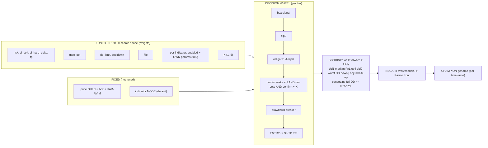

# The Optimizer as a Network — Inputs · Decision Wheel · Outputs

**What this is:** a neural-net-style map of the NSGA-III strategy optimizer (`optimize/optimizer.py`, the `wsh4`
study) — exactly what it tunes (its "weights"), what stays fixed, how a per-bar trade decision is made (the
"forward pass" / decision wheel), and what it scores (its "loss"). Code-verified 2026-06-15.

---

## 0. Two myths, corrected up front
| You thought | Reality (code) |
|---|---|
| "We take each indicator's own params (e.g. its window) as the recommended value and only **scale / activate** it." | **The optimizer SEARCHES each indicator's own params directly** — `_suggest_indicators` → `_suggest_param` (`optimizer.py:48–64`) suggests every param across its schema `[min,max]` (e.g. `ema_trend fast 2–400`). The champion's `sma_trend fast=346/slow=339`, `keltner n=4` were **found**, not defaults. No scaler exists; on/off (`en_<key>`) is *also* searched. |
| "The confirmation layer is **not attached** to the decision wheel, and we must add it to the optimizer inputs." | **It is already both.** Engine: `gate_used = vol_gate ∧ ¬veto ∧ (confirm≥K)` folds veto + K-of-N confirm into the entry gate (`core.py:78–108`) — it gates every entry (champion runs 8 indicators). Optimizer: `specs=_suggest_indicators(trial)` + `k=suggest_int("k",1,5)` (`optimizer.py:144–145`) are in every trial. **The ONLY part not searched is each indicator's *mode* (confirm/veto/both)** — fixed to the schema default. |

So the real open enhancement is small: **add `mode` to the search space** (and, separately, the SL/TP *sizing
mode* — the derived-SL/TP avenue, currently closed by the feasibility studies).

---

## 1. ANN analogy (what maps to what)
| Neural-net concept | This optimizer |
|---|---|
| **Input layer (per-sample features)** | Per-bar **market state**: box Stage-1 signal, HAR-RV vol `vf`, the enabled indicators' readings, price/ATR |
| **Weights & biases (learned)** | The **tuned knobs**: `sl_soft, sl_hard, tp, gate_pct, dd_limit, cooldown, flip`, per-indicator `enabled + own params`, `K` |
| **Activations / thresholds** | `enabled` (0/1 per indicator) · `gate_pct` percentile threshold · `K-of-N` confirm threshold · drawdown-breaker trip — all **step/gate** functions |
| **Forward pass** | The **decision wheel** (§3): box → flip → vol-gate → confirm/veto → DD-breaker → entry → SL/TP exit |
| **Loss function** | **3 objectives** (max median-fold P/L, min worst-fold DD, max median win-rate) + **constraint** (full-window DD ≤ 25%·P/L) |
| **Optimizer (the "backprop")** | **NSGA-III** evolutionary multi-objective search over many trials (Optuna), walk-forward scored |
| **Trained output** | The **champion genome** = one Pareto-optimal knob set per timeframe |

---

## 2. Block diagram (ASCII)

```
                          ┌──────────────────────── FIXED INPUTS (given, NOT tuned) ───────────────────────┐
                          │  price OHLC (4h dec-frame + 1-min)   box Stage-1 trigger   HAR-RV vf series     │
                          │  indicator MODE (confirm/veto = schema default)   dd_cap   pv   decision TF     │
                          └───────────────────────────────────────────────────────────────────────────────┘
                                                          │ (data the wheel consumes)
   TUNED INPUTS  ─ the search space (the "weights") ─┐    ▼
   ┌───────────────────────────────────────────┐    │  ╔══════════════ DECISION WHEEL (per decision bar) ═══════════╗
   │ RISK:   sl_soft ∈ bounds                   │    │  ║  1. box Stage-1 signal  → long / short / hold              ║
   │         sl_hard = sl_soft + delta          │────┼─▶║  2. flip?  (swap long↔short if flip=True)                  ║
   │         tp ∈ bounds                         │    │  ║  3. VOL GATE:   trade only if vf ≤ pct(gate_pct)           ║
   │ GATE:   gate_pct ∈ [0,100]                 │────┼─▶║  4. CONFIRM/VETO LAYER  ◀── the confirmation layer         ║
   │ BREAKER:dd_limit ∈ [0,5000], cooldown      │    │  ║       gate = vol ∧ ¬veto ∧ (#confirm ≥ K)                  ║
   │ DIR:    flip ∈ {F,T}                        │────┼─▶║  5. DRAWDOWN BREAKER: halt `cooldown` trades if DD≥dd_limit║
   │ INDICATORS (×15):  per indicator            │    │  ║  6. ENTRY taken → exit on SL_soft/SL_hard/TP lines         ║
   │     enabled ∈ {F,T}                         │────┼─▶║                                                            ║
   │     own params ∈ schema[min,max]            │    │  ╚════════════════════════════╤═══════════════════════════╝
   │     (e.g. ema fast/slow, rsi n/…)           │    │                               │ trades → equity curve
   │ CONFIRM RULE:  K ∈ [1,5]                    │────┘                               ▼
   └───────────────────────────────────────────┘        ┌──────────── SCORING (the "loss") ─────────────┐
                                                         │ walk-forward k folds + full-window feasibility │
                                                         │  obj1 ↑ median-fold P/L                        │
   NOT tuned (could be added):                           │  obj2 ↓ worst-fold max-DD                      │
   • indicator MODE (confirm/veto/both)                  │  obj3 ↑ median-fold win-rate                   │
   • SL/TP SIZING MODE (fixed vs derived)                │  constraint: full DD ≤ 0.25 · full P/L         │
                                                         └───────────────────────┬───────────────────────┘
                                                                                 ▼
                                                   ╔═══════════ NSGA-III (the optimizer) ═══════════╗
                                                   ║ evolve trials → Pareto front (P/L, DD, win%)   ║
                                                   ╚═══════════════════════╤════════════════════════╝
                                                                           ▼
                                                   OUTPUT ►  CHAMPION genome (one knob set / timeframe)
                                                              e.g. 4h: sl_soft 149.8 · sl_hard 167.1 · tp 120.2
                                                              gate_pct 86.9 · dd_limit 4747 · k 1 · 8 indicators ON
                                                              (each with its SEARCHED params)
```

---

## 3. Same thing as a graph (mermaid)


---

## 4. Precise tables

### 4a. TUNED inputs (the optimizer's search space — `optimizer.py:137–148`)
| Knob | Type / range | Note |
|---|---|---|
| `sl_soft` | float, per-TF derived bounds | soft stop (exit at bar close) |
| `sl_hard_delta` | float ≥ 0 | `sl_hard = sl_soft + delta` |
| `tp` | float, per-TF derived bounds | take-profit |
| `gate_pct` | float [0,100] | HAR-RV vol percentile; 0 = gate off |
| `dd_limit` | float [0,5000] | drawdown-breaker trip; 0 = off |
| `cooldown` | int [0, per-TF cap] | trades halted after a trip |
| `flip` | {False,True} | swap long↔short |
| `enabled` × **15 indicators** | {False,True} each | which indicators vote |
| **own params** per indicator | int/float in schema `[min,max]` | **searched** (e.g. `ema fast/slow 2–400`, `rsi n/lower/upper`, …) |
| `K` | int [1,5] | min confirms required (clamped to #confirmers) |

### 4b. FIXED inputs (constants the wheel consumes, not tuned)
price OHLC (decision TF + 1-min) · box Stage-1 trigger · HAR-RV `vf` series · **indicator mode** (confirm/veto,
= schema default) · `dd_cap` · `pv` (point value) · decision timeframe · HAR-RV lags (1/6/30).

### 4c. Outputs / objectives (`optimizer.py:159–167`)
3 maximized objectives — **median-fold P/L**, **−worst-fold max-DD**, **median-fold win-rate** — under the
**feasibility constraint** full-window max-DD ≤ 25%·full-window P/L. NSGA-III returns a **Pareto front**; the
**champion** is the selected point (per timeframe).

### 4d. NOT optimized today — candidates to add (your point)
| Candidate | Status | To add |
|---|---|---|
| Indicator **mode** (confirm vs veto vs both) | fixed to schema default | make `mode` a `suggest_categorical` per indicator in `_suggest_indicators` |
| SL/TP **sizing mode** (fixed vs derived/ATR) | fixed; derived avenue **closed** by `STUDY_relative_feasibility.md` / `STUDY_fixed_window_sltp_mapping.md` | only if that avenue is reopened (new `wsh5` search dimension) |
| HAR-RV lag weights / box-trigger logic | fixed by design (frozen layers) | out of scope for the param sweep |

---

## 5. Bottom line
- The optimizer **already** tunes the indicators' **own parameters** (not just on/off, no scaler) **and** the
  full **confirmation layer is wired into entries and into the search** (`enabled`, params, `K`).
- The **only** confirmation-layer knob left out is each indicator's **mode** — a one-line addition to
  `_suggest_indicators` if you want the optimizer to also choose confirm-vs-veto per indicator. Note it widens
  the search space (more trials needed; mind the Minimum-Backtest-Length / overfitting limit from the research).
- SL/TP **sizing mode** remains fixed (derived/dynamic SL/TP was studied and closed); re-opening it is the
  separate `wsh5` joint-search decision.
