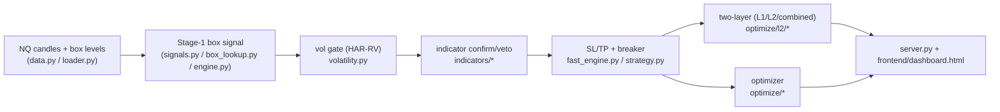

# MASTER — Parametric-Indicators subproject (start here)

**This is the father document.** A fresh agent should read §0–§2, then use the **routers** (§4, §9) to
jump to the canonical doc for any topic. It does not duplicate those docs — it points to them.

> 🍼 In one breath: this folder is a self-contained NQ-futures trading system — a "box" strategy gated
> by indicators + volatility, a multi-objective **optimizer** that tunes it, a **two-layer** (L1+L2)
> variant, and a **web dashboard** to run/inspect it. ~40 Python modules, ~180 markdown docs. This file
> is the map.

---

## 0. Read-me-first (orientation, in order)

1. **`README.md`** — the 5-minute version + the headline WS-G strategy + the Data section.
2. **`docs/STRATEGY.md`** — what the strategy does and why (the trading logic).
3. **`docs/ARCHITECTURE.md`** — how the code fits together (the engine wiring).
4. **`optimize/l2/REPORT_workstream_closure.md`** — the current state of the unified dashboard (the
   most recent big workstream; CLOSED).
5. **`SERVER_AGENT_MANUAL.md`** — how to drive the live server/API as an agent.

If you only have 2 minutes: run `./run_dashboard.sh`, open `http://localhost:8200/`, click **Run**.

---

## 1. What this subproject is

A **box strategy**: on a decision timeframe (default NQ 4h), per-day price "boxes" (weekly/monthly
levels) generate a Stage-1 buy/sell signal. That signal is filtered by (a) a **HAR-RV volatility gate**,
(b) a set of **1-minute indicators** (a K-of-N confirm/veto layer), and exited by **SL/TP** with a
**drawdown circuit-breaker**. On top of that sit:

- an **optimizer** (NSGA-III multi-objective, two-stage, MAP-Elites) that searches parameters per
  timeframe, persisted to SQLite/Postgres;
- a **two-layer** system (**L1** = the primary strategy; **L2** = trades the signals L1 dropped;
  **Combined** = both on one account), computed by a single **causal log** pass;
- a **server + unified web dashboard** (3 tabs: L1 / L2 / Combined).



**Headline numbers (NQ 4h, full research window, n=1):**
- WS-G drawdown-capped champion: +$24,720 / max DD $4,845 (the README strategy).
- Two-layer causal system: **L1 $149,989 · L2 $78,391 · Combined $228,380** (the dashboard defaults).
  These are **parity anchors** — they must never move (see §8).

---

## 2. Quick start

```bash
cd subprojects/Parametric-Indicators
export WSH_DATA_BASE=/mnt/data/projects/trading WSG_DATA_ROOT=/mnt/data/projects/trading/data
./run_dashboard.sh                 # start the server + open http://localhost:8200/
python3 -m pytest optimize/l2 -q   # the two-layer/dashboard test suite
python3 perf/check_golden.py       # the byte-parity golden gate (6 TFs)
```
Agents driving the API: **`SERVER_AGENT_MANUAL.md`** (endpoints, schema, curl, self-check anchors).
No credentials needed — only the two data-path env vars (`.env.example`).

---

## 3. Code map (the pipeline, file by file)

| Stage | Files | Canonical doc |
|---|---|---|
| **Data load** | `loader.py`, `optimize/data.py`, `config.py`, `build_plus20d_data.py`, `shift_2024_box.py` | `docs/ARCHITECTURE.md` |
| **Box signal (Stage 1)** | `box_lookup.py`, `engine.py`, `optimize/signals.py`, `strategy.py` | `docs/STRATEGY.md` |
| **Volatility gate** | `volatility.py` (HAR-RV + `gate_threshold`) | `docs/HAR_RV_VOLATILITY_GATE.md` |
| **Indicators (confirm/veto)** | `indicators/` (`library.py`, `runner.py`, `classic.py`, `smc.py`, `confirm.py`, `votes.py`, `timing.py`, `generate.py`) | `docs/INDICATORS.md`, `docs/INDICATOR_LOGIC.md` |
| **Fast engine + exits + breaker** | `optimize/fast_engine.py`, `optimize/core.py`, `optimize/cooldown.py`, `optimize/sl_tp_bounds.py` | `docs/VECTORIZATION.md`, `docs/KNOWN_QUIRKS.md` |
| **Optimizer** | `optimize/optimizer.py`, `two_stage.py`, `map_elites.py`, `folds.py`, `storage.py`, `timeframes.py`, `report*.py` | `docs/OPTIMIZER_DEEP_ANALYSIS.md`, `docs/NSGA3.md` |
| **No-entry / pause analytics** | `optimize/no_entry.py`, `pause_streaks.py`, `counterfactual_pause.py`, `diagnose_pause.py` | `docs/WS-I_MEGADOC.md` |
| **Two-layer (L1/L2/combined)** | `optimize/l2/` (`logbook.py`=causal pass, `aggregate.py`=boxes, `charts.py`=engine charts, `engine.py`=L2, `l1_runner.py`=L1, `payload.py`=server glue, `metrics.py`, `dataset.py`) | `optimize/l2/REPORT_causal_logfirst.md` |
| **Server + frontend** | `server.py`, `frontend/dashboard.html` (+ `dashboard_common.js/.css`), `run_dashboard.sh` | `frontend/README.md`, `SERVER_AGENT_MANUAL.md` |
| **Parity gates / tests** | `perf/check_golden.py`, `optimize/l2/test_*.py`, `optimize/test_*.py` | `docs/WS-I_WHAT_WAS_TESTED.md` |

> The strategy engine has TWO parity-locked implementations: `strategy.build_payload` (full-feature,
> per-year bundles) and `optimize.fast_engine.fast_backtest` (vectorised). They are kept byte-identical
> by `optimize/test_fast_parity.py` + the golden gate. `optimize/l2` uses the fast path.

---

## 4. Documentation router (by topic → canonical docs)

| Topic | Go to |
|---|---|
| **Strategy logic / going live** | `docs/STRATEGY.md` · `docs/PLAYBOOK.md` · `README.md` |
| **Architecture / engine wiring** | `docs/ARCHITECTURE.md` · `docs/RUNNER_BINDING_SEMANTICS.md` |
| **Indicators (math + rules + decisions)** | `docs/INDICATORS.md` · `docs/INDICATOR_LOGIC.md` · `docs/INDICATOR_DECISIONS.md`(+`_SIMPLE`) · `docs/GOLF_ENGULFING.md` · `docs/ENTRY_TIMING_CHANGES.md` · `docs/ONEMIN_INDICATORS_AND_VECTORIZATION.md` |
| **Volatility gate (HAR-RV)** | `docs/HAR_RV_VOLATILITY_GATE.md` · `docs/HAR_LAG_REVIEW.md` |
| **Optimizer (NSGA-III, two-stage, MAP-Elites, folds, Postgres)** | `docs/OPTIMIZER_DEEP_ANALYSIS.md` · `docs/NSGA3.md` · `optimize/server/` (scaling/deploy) · `optimize/dashboard/` (optimizer UI) · `optimize/reports/` (results) |
| **WS-I indicator engine (the current engine line)** | `docs/WS-I_MEGADOC.md` · `docs/WS-I.3_ENGINE_REPORT.md` · `docs/WS-I.4_DASHBOARD_REPORT.md` · `WS-I_PLAN.md` · `WS-I_PROGRESS.md` |
| **Multi-instrument (NQ/ES) dropdown — engine·dashboard·optimizer·ES champions** | `docs/INSTRUMENT_WORKSTREAM_MEGADOC.md` (index) · `docs/INSTRUMENT_01_SELECTOR_ENGINE_DASHBOARD.md` · `docs/INSTRUMENT_02_OPTIMIZER_WIRING.md` · `docs/INSTRUMENT_03_ES_CHAMPION_CAMPAIGN.md` · `docs/INSTRUMENT_04_DASHBOARD_PERF_AND_LAUNCH.md` · `docs/RESEARCH_ES_CHAMPION_VALIDITY.md` · spec `docs/superpowers/specs/2026-06-29-instrument-selector-design.md` |
| **WS-H multi-timeframe engine** | `optimize/reports/WS-H_RESULTS.md` |
| **Two-layer system (L1/L2/combined) + causal log** | `optimize/l2/REPORT_causal_logfirst.md` · `optimize/l2/UPDATE_l2_backtester.md` · `optimize/l2/REPORT_l2*.md` |
| **Unified dashboard (the latest workstream)** | `optimize/l2/REPORT_workstream_closure.md` (status) · `REPORT_unified_dashboard.md` (how) · `REPORT_achievements_and_open.md` (plain-words) · `FOLLOWUPS_unified_dashboard.md` (F1–F5, all ✅) · `frontend/README.md` |
| **Running the server as an agent** | `SERVER_AGENT_MANUAL.md` · `.env.example` · `docs/SERVER_RUN_READINESS.md` |
| **Dynamic-SL/TP research (range regime, ATR sizing debate)** | `study_range_regime/` (42 docs) · root: `RESEARCH_fixed_vs_dynamic_sltp.md`(+`_BABY`) · `DECISION_derived_sltp_options.md`(+`_BABY`) · `ACTION_PLAN_derived_sltp.md` · `META_STAGE_adaptive_sltp.md` · `COUNCIL_RULING_atr_sizing.md` · `REVIEW_atr_sizing_contradiction.md` · `REMOVAL_sltp_sizing_mode.md` |
| **Profit semantics / drawdown case study** | `docs/TYPICAL_VS_TOTAL_PROFIT.md` · `WSI-Case_Study/CASE_STUDY_2026_maxDD.md` |
| **Perf / speed (#210) + golden** | `perf/` (`ACTION_PLAN_axisB.md`, golden baselines) |
| **Plans & design specs (superpowers)** | `docs/superpowers/plans/` (6) · `docs/superpowers/specs/` (2) |
| **Milestone: two layers + time-cap + cold-start (latest)** | `docs/MILESTONE_two_layers_time_capped.md` — the time-cap (`none\|bars\|eod`), `cap_1min` as a searched dim, and the cold-start discovery (wsh6cold `cap=448` → $153,321/$9,589, OOS-verified, triple-confirmed) |
| **Performance / speed (single source of truth)** | `docs/PERFORMANCE.md` — result-neutrality rule + golden gate, two-engine parity, vectorization history, caching layers, dimensionality↔trials↔wall-clock, fleet throughput, the candidate-L1 L2 slowdown investigation + gated fix |
| **System-wide change log / mega-narrative** | `SYSTEM_UPDATES_MEGADOC.md` · `STAGE_REPORT_optimizer_hardening_and_dashboard.md` |
| **Shareable, runnable bundles** | `shareable/` — `two_layer_causal_backtester.zip`, `server_agent_kit.zip`, `lean_3indicator_backtester.zip`, `winning_strategy_backtester.zip` (each has its own README+PLAYBOOK) |

---

## 5. Dictionary (key terms)

- **Box / Stage-1** — per-day weekly/monthly price levels; the raw long/short signal off them.
- **Decision timeframe (TF)** — the bar the strategy decides on (4h default; 1m–4h supported).
- **HAR-RV gate** — a volatility forecast; trade only when forecast vol ≤ the `gate_pct` percentile of
  the in-sample prefix. Threshold = `volatility.gate_threshold(vf, n_split, gate_pct)`.
- **Indicators / K-of-N** — confirm/veto layer on the 1-minute frame; need ≥K confirmations to enter.
- **Breaker (dd_limit/cooldown)** — halts entries after a drawdown bleed for `cooldown` trades.
  (`dd_cap` is **display-only**, not a trade lever.)
- **flip** — reverse the box signal's entry direction (long↔short). Exits then follow the **normal**
  model on the entered direction (`hard-SL > hard-TP > soft-SL`; soft = stop-loss). Changed 2026-06-22
  from the old "soft swaps to the TP side" rule — see `optimize/l2/REPORT_flip_semantics.md`.
- **Window** — backtest segment: `full / 2024 / 2025(in-sample) / 2026(OOS) / full+20d / 2026+20d`.
- **L1 / L2 / Combined** — primary strategy / second layer on L1's dropped signals / both on one account.
- **Causal log** — one per-candle pass (`logbook.run_causal`) that is the single source of truth; every
  box/chart/CSV is derived from it (`aggregate.py`, `charts.py`).
- **vf_seed** — the in-sample vol prefix carried on `L1Result` so windowing can't reseed the gate on
  out-of-sample data.
- **Champion / preset** — a tuned parameter set (e.g. `wsh_lean_4h_champion.json`, `l2v1_4h_champion`).
- **Golden gate** — `perf/check_golden.py`: byte-for-byte parity check across 6 TFs; the regression alarm.
- **Parity anchors** — L1 $149,989 / 255 / $15,491 (flip=false, **byte-identical, locked**). L2 + Combined
  were **re-locked 2026-06-22** to the `l2v2` champion after the flip-semantics change: L2 **$25,383 / 34 /
  $7,136**, Combined **$175,372 / 289 / $14,342** (the old $78,391 / $228,380 were inflated by the flip
  quirk; l2v2 is the honest, OOS-positive baseline — see `optimize/l2/REPORT_flip_semantics.md`).
- **WS-* / Q* / P* / DASH** — workstream codenames (see §6).

---

## 6. Workstream lineage (codenames you'll see in commits/docs)

| Code | What it was |
|---|---|
| **WS-A…WS-H** | research arcs: GARCH vol, OHLC targets, DL on 1-min, GARCH-family, **WS-G** drawdown-capped champion, **WS-H** multi-TF NSGA engine |
| **WS-I** | the 1-minute **indicator** confirm/veto engine (the current engine line) + its sweep (wsh4) |
| **WS-AS** | "all-stocks" — generalize the pipeline to ES/QQQ/SQQQ instruments |
| **Q1–Q6** | split SL/TP, regime charts, OB/breaker entry-placement |
| **P2–P4** | optimizer algorithms: selectable sampler, two-stage, MAP-Elites |
| **L2 / L2C** | the second layer + the combined dashboard-inside-dashboard |
| **DASH STEP 0–7 + F1–F5** | the **unified 3-tab dashboard** rebuild (this workstream — CLOSED; see `REPORT_workstream_closure.md`) |

---

## 7. Conventions (hard rules in this repo)

- **No silent fallback** — bad params raise (HTTP 400), never clamp.
- **Parity gates** — every engine change must keep the golden 6/6 + the anchors byte-identical.
- **Never remove a box/feature without explicit permission** (UI metric cards especially).
- **Visuals = Mermaid only** (no ASCII art) in docs.
- **Two engines stay in lockstep** — `strategy.build_payload` ≡ `fast_backtest` (parity-locked).

---

## 8. "Where do I find X?" (fast lookup)

| I want to… | Look at |
|---|---|
| run the dashboard | `./run_dashboard.sh` → `http://localhost:8200/` |
| drive the API from an agent | `SERVER_AGENT_MANUAL.md` |
| understand the trade logic | `docs/STRATEGY.md` |
| change/understand an indicator | `docs/INDICATORS.md` + `indicators/library.py` |
| understand the two-layer/causal design | `optimize/l2/REPORT_causal_logfirst.md` + `logbook.py` |
| see the unified-dashboard state + history | `optimize/l2/REPORT_workstream_closure.md` |
| run/extend the optimizer | `docs/OPTIMIZER_DEEP_ANALYSIS.md` + `optimize/optimizer.py` |
| check nothing regressed | `perf/check_golden.py` + `optimize/l2/test_parity_anchor.py` |
| grab a runnable standalone copy | `shareable/*.zip` |
| know what's still open | `optimize/l2/FOLLOWUPS_unified_dashboard.md` (all ✅) + task **#210** (speed) |

---

## 9. Status snapshot (as of this document)

- **Unified dashboard workstream: CLOSED** (STEP 0–7 + F1–F5 all done, pushed on `dev`).
- **Open/adjacent:** #210 (backtester 1-min-indicator speed); plus research streams `study_range_regime/`
  and the optimizer next-runs (wsh6) are separate, not blocking.
- Branch `dev`; the dashboard serves at `/`; data via `WSH_DATA_BASE`/`WSG_DATA_ROOT`.

*Keep this file current: when a new workstream lands, add one row to §4 (router) and §6 (lineage), and
update §9. It is the single entry point — a new agent reads this first.*
