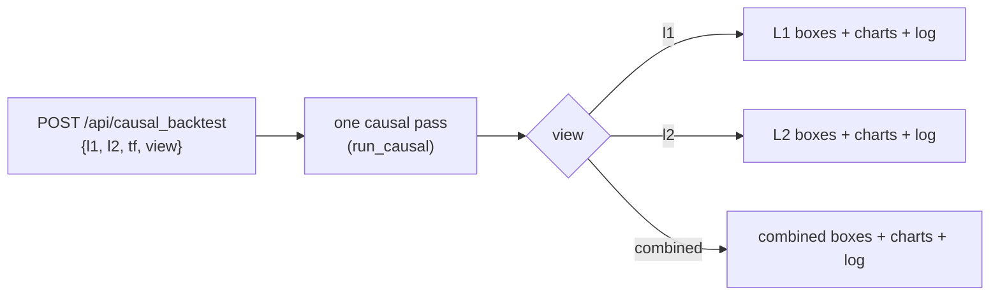

# Server Agent Manual — driving the Unified L1·L2·Combined backtest server

A complete, self-contained guide for **another agent** (or human) to operate `server.py` — the HTTP
backend behind the unified dashboard. Everything an agent needs: how to start it, every endpoint, the
exact request/response shapes, the parameter schema, ready-to-run `curl` examples, the known-good
numbers to self-check against, and what configuration/secrets it does (and does **not**) need.

> 🍼 **In plain words:** this file teaches a robot how to press the buttons on our trading backtester
> over the network — start it, ask it to run a backtest, read the answer, and know it's working.

---

## 0. TL;DR for an agent

```bash
# 1. start it (one command; detached; idempotent)
cd <repo>/subprojects/Parametric-Indicators
WSH_DATA_BASE=/path/to/trading WSG_DATA_ROOT=/path/to/trading/data ./run_dashboard.sh
# 2. confirm it's alive
curl -s http://localhost:8200/api/health
# 3. run the default two-layer backtest, combined view
curl -s -X POST http://localhost:8200/api/causal_backtest -H 'Content-Type: application/json' \
  -d '{"l1":{LAYER},"l2":{LAYER},"tf":"4h","view":"combined"}'
```
Self-check: the **default** run must return L1 **$149,989** / L2 **$78,391** / Combined **$228,380**.
If it doesn't, the data env vars point at the wrong data.

---

## 1. Start / stop / status

The server is plain Python stdlib HTTP (no framework). It binds `localhost:<port>` (default 8200).

| Action | Command |
|---|---|
| start (detached, opens browser) | `./run_dashboard.sh` |
| stop | `./run_dashboard.sh stop` |
| restart (after code change) | `./run_dashboard.sh restart` |
| status | `./run_dashboard.sh status` |
| raw start (foreground) | `python3 server.py --port 8200` |

`run_dashboard.sh` runs `python3 server.py --port 8200` under `nohup` so it survives the shell; it is
**idempotent** (a second start detects the running server). Override with `PORT=` / `PYTHON=`.

First backtest after a cold start recomputes the L1 1-minute-indicator pass (~38 s) then disk-caches it
(`/tmp/wsh_l1_cache/`); subsequent runs are seconds.

---

## 2. Configuration & secrets (READ THIS)

**This server needs NO credentials — no API keys, no passwords, no tokens.** It only needs to find the
NQ data on disk, via two environment variables:

| Env var | Default | What it points at |
|---|---|---|
| `WSH_DATA_BASE` | `/mnt/data/projects/trading` | base dir holding `Full_Canldes_Data/<RAW_DIR>/NQ_<tf>.csv` + `NQ_1m.csv` |
| `WSG_DATA_ROOT` | `/mnt/data/projects/trading/data` | holds `full_data/NQ_full_data.csv` (per-day box levels) |

A template is shipped as **`.env.example`** (copy to `.env` and edit paths; the server reads the env,
not a `.env` file directly — `export` them or use your shell/process manager).

**Other secret files exist in the wider workspace but are NOT used by this server** — do not bundle
their real values anywhere shareable:
- `<workspace>/.env` — `GEMINI_API_KEY` (used by other tools, not the dashboard).
- `$WSI/pg.env` — Postgres credentials for the **optimizer** dashboard (a different service).
- training-server SSH credentials — for remote GPU trainings (different workflow).

> 🍼 **In plain words:** our backtester doesn't have a password. It just needs to be told where the
> price-history files live. The other "secret" files in the project belong to *other* tools; keep their
> real contents private — never zip them up to share.

---

## 3. The two-layer model (what you're driving)

- **L1** = the primary box strategy (frozen lean 4h champion by default). It always has priority.
- **L2** = a second layer that trades the signals **L1 dropped** (veto + vol-gate) while L1 is flat; an
  L1 entry **force-closes** any open L2 trade. Disjoint from L1.
- **Combined** = both on one shared 1-contract account.

Three **views** project the SAME single causal pass: `l1`, `l2`, `combined`.



---

## 4. The parameter schema (a "LAYER" object)

Both `l1` and `l2` take the **same** layer schema. All fields validated server-side (no silent
fallback — a bad value returns HTTP 400 with `{"error": "..."}`).

| Field | Type | Meaning |
|---|---|---|
| `sl_soft` | number > 0 | soft stop-loss (points) |
| `sl_hard` | number ≥ sl_soft | hard stop-loss (points) |
| `tp` | number > 0 | take-profit (points) |
| `gate_pct` | 0–100 | volatility-gate percentile; `0` = gate OFF |
| `dd_limit` | ≥ 0 | drawdown circuit-breaker trigger ($); `0` = OFF |
| `cooldown` | int ≥ 0 | breaker cooldown (trades) |
| `flip` | bool | trade the box direction (false) or flipped (true) |
| `k` | int ≥ 1 | min indicator confirmations to enter |
| `ind_1min` | bool | compute indicators on the 1-min frame (regime) vs the decision TF |
| `indicators` | list | indicator specs `[{key, enabled, mode, params}]` (see `/api/combined_config.indicator_schema`) |
| `window` | enum | `full` (default) · `2024` · `2025` · `2026` · `full+20d` · `2026+20d` |
| `long_sl_soft` / `long_sl_hard` / `long_tp` | number\|null | optional per-side (LONG) overrides; null ⇒ shared |
| `short_sl_soft` / `short_sl_hard` / `short_tp` | number\|null | optional per-side (SHORT) overrides; null ⇒ shared |

Get the ready-made defaults (frozen champions) from `GET /api/combined_config` → `l1_default`,
`l2_default`. Easiest path: fetch those, optionally tweak, and POST them back.

---

## 5. Endpoints

Base URL: `http://localhost:8200`. All POST bodies are JSON. Errors: non-2xx + `{"error": "..."}`.

### GET `/api/health`
Liveness + the loaded data size + the WS-G winner preset.
`→ {"status":"ok","bars":2119,"winner":{...}}`

### GET `/api/combined_config`
Everything the UI/agent needs to build a request: the indicator schema + the default champions + saved
profiles.
`→ {indicator_schema, l1_default, l2_default, l1_label, l2_label, l1_profiles, l2_profiles}`

### POST `/api/causal_backtest`  ← the main one
Body: `{"l1": LAYER, "l2": LAYER, "tf": "4h", "view": "l1"|"l2"|"combined"}`
Returns one view from a single causal pass:
```
{ meta:{ view, n, boxes, dropped_counts },
  candles:[{time,open,high,low,close}],
  l1_spans, dropped, trades:[{layer,entry_time,exit_time,direction,entry_price,exit_price,exit_reason,pnl,...lines}],
  l1_equity, l2_equity, combined_equity,
  engine:{ vol:[{time,value}], gate_thr, state:[{time,value}], drawdown:[{time,value}], events:[{time,type,text}] },
  log:[ per-candle rows ] }
```
- `meta.boxes` for `l1`/`l2` is a **flat** dict (e.g. `boxes.pnl`); for `combined` each box is
  `{value, layer}` (e.g. `boxes.pnl.value`).

### POST `/api/backtest_causal`  ← the RICH L1 engine view
Body: a **strategy-schema** object (the LAYER fields + `timeframe`). Returns
`strategy.build_payload`'s full payload (vol/state/drawdown/**events with would-be-P/L + indicator
vote chips**/`meta.gen_report` SMC structure report) **plus** the causal `log` and log-derived
`meta.boxes` (equal to the engine summary). This is what the unified **L1 tab** uses.

### GET `/api/causal_log.csv`
The full per-candle log of the **last** causal run, as CSV (RFC-4180). One row per candle; a `layer`
column separates L1/L2.

### POST `/api/warmup`
Body: `{"indicators": [...]}` → `{per, n_enabled, frame, max_bars, driver}` — the data footprint the
current indicator set needs.

### POST `/api/l1_profiles` · POST `/api/l2_profiles`
Body: `{"name": "...", "preset": LAYER}` → `{profiles}`. Saves a reusable named profile.

### Other (legacy / specific)
`GET /api/config`, `GET /api/l2_config`, `POST /api/l2_backtest`, `POST /api/combined_backtest`,
`POST /api/profiles` — older single-purpose routes; prefer `causal_backtest` / `backtest_causal`.

### Static
`GET /` → the unified dashboard (`frontend/dashboard.html`); `GET /<file>` → `frontend/<file>`.

---

## 6. Worked examples (copy-paste)

```bash
BASE=http://localhost:8200

# A) health
curl -s $BASE/api/health | python3 -m json.tool

# B) grab the default champions, then run the combined view with them
CFG=$(curl -s $BASE/api/combined_config)
python3 - "$CFG" <<'PY' > /tmp/body.json
import sys, json
c = json.loads(sys.argv[1])
print(json.dumps({"l1": c["l1_default"], "l2": c["l2_default"], "tf": "4h", "view": "combined"}))
PY
curl -s -X POST $BASE/api/causal_backtest -H 'Content-Type: application/json' -d @/tmp/body.json \
  | python3 -c 'import sys,json;b=json.load(sys.stdin)["meta"]["boxes"];print("combined P/L =", round(b["pnl"]["value"]))'
# expect: combined P/L = 228380

# C) the rich L1 engine view (gen_report + full event log)
python3 - "$CFG" <<'PY' > /tmp/l1.json
import sys, json
c = json.loads(sys.argv[1]); d = dict(c["l1_default"]); d["timeframe"]="4h"; print(json.dumps(d))
PY
curl -s -X POST $BASE/api/backtest_causal -H 'Content-Type: application/json' -d @/tmp/l1.json \
  | python3 -c 'import sys,json;d=json.load(sys.stdin);print("L1 P/L =",round(d["meta"]["summary"]["pnl"]),"| gen_report:", "gen_report" in d["meta"])'
# expect: L1 P/L = 149989 | gen_report: True

# D) windowed run (2026 out-of-sample): set window on the L1 layer
#    (numbers will differ — that's expected; 2026 is OOS)
```

---

## 7. Self-check anchors (is it working correctly?)

With the **default** champions, `window:"full"`:

| View | P/L | trades | max DD |
|---|--:|--:|--:|
| L1 | **$149,989** | 255 | $15,491 |
| L2 | **$78,391** | 80 | $8,961 |
| Combined | **$228,380** | 335 | $20,303 |

These are byte-stable. If an agent gets different numbers on the default, the **data env vars are
wrong** (pointing at different/missing CSVs) — fix `WSH_DATA_BASE` / `WSG_DATA_ROOT`.

---

## 8. Failure modes

| Symptom | Cause | Fix |
|---|---|---|
| `Cannot reach backend` / connection refused | server not started | `./run_dashboard.sh` |
| HTTP 400 `{"error": "..."}` | bad params (e.g. `sl_hard < sl_soft`, `window` not in the enum) | read the message; fix the field |
| numbers ≠ the anchors | wrong data location | set `WSH_DATA_BASE` / `WSG_DATA_ROOT` |
| first request hangs ~38 s | cold L1 indicator recompute | normal once; it disk-caches |
| stale numbers after a code change | in-memory/disk cache | `./run_dashboard.sh restart` (+ clear `/tmp/wsh_l1_cache/`) |

---

## 9. Programmatic (no HTTP) — for an agent that imports Python

```python
import json
from optimize.l2 import logbook, aggregate, payload
from optimize import timeframes as TF
l1 = payload.l1_default_params("4h")
l2 = json.load(open("optimize/results/l2v1_4h_champion.json"))["params"]
res = logbook.run_causal(l1, l2, "4h")              # ONE causal pass
bs  = int(TF.get("4h").bar_td.total_seconds())
print(round(aggregate.boxes_for_layer(res,"L1",bs)["pnl"]))   # 149989
print(round(aggregate.combined_boxes(res,bs)["pnl"]["value"]))# 228380
```
The self-contained version of this stack ships as `shareable/two_layer_causal_backtester.zip`.
