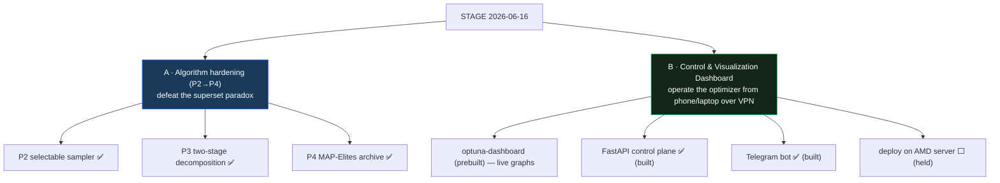
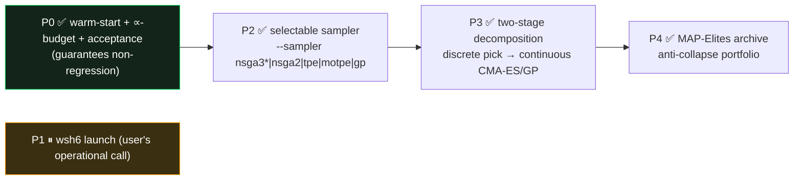
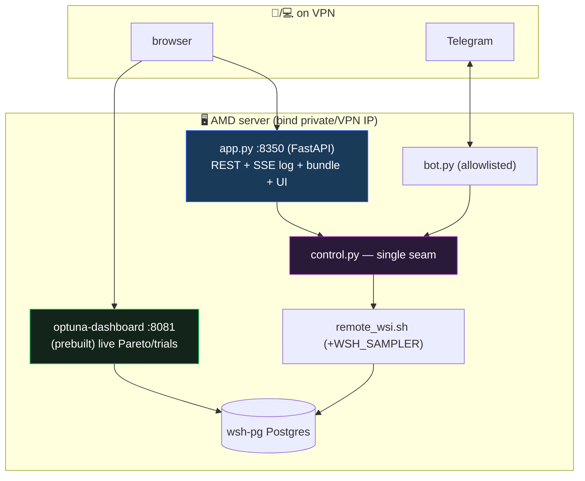

# 📦 STAGE REPORT — Optimizer Algorithm Hardening (P2→P4) + Control Dashboard

**Date:** 2026-06-16 · **Branch:** `dev` · **First commit:** `25942eb` · **Golden:** 6/6 MATCH (unchanged).

This stage closed two cohesive workstreams. **(A)** hardened the optimizer's *algorithms* against the
"bigger-space-worse-result" superset paradox, and **(B)** built a dashboard to *control and watch* the
optimizer from anywhere over the VPN. Every change kept the deployed champion's engine byte-identical.

---

## Part A — Optimizer algorithm hardening (P2→P4)

**Why:** wsh5 (a *superset* search) returned a *worse* champion than wsh4 — proven to be a finite-budget
stochastic-search/density artifact, not a bug (see `study_range_regime/REPORT_optimizer_superset_paradox_and_system_breakdown.md`).
P0 (warm-start + ∝-budget + acceptance gate) was done previously; this stage delivered the *algorithm*
options surveyed in `REPORT_optimizer_algorithm_alternatives.md`.

| Stage | Deliverable | Validation | Doc |
|---|---|---|---|
| **P2** | `optimizer.make_sampler()` + `--sampler` (default `nsga3` byte-identical; GP=native `GPSampler`; `cmaes` guarded single-obj) | `test_sampler_factory.py` **6/6**; nsga3 & gp both reproduce golden 4h **$142,203** | `UPDATE_P2_selectable_sampler.md` |
| **P3** | `two_stage.py` — Stage A discrete indicator pick → Stage B continuous tuning (`--stage-b cmaes\|gp`), warm-started | `test_two_stage.py` **4/4**; 4h proof: both engines reproduce champion to the dollar, guarantee held | `UPDATE_P3_two_stage_decomposition.md` |
| **P4** | `map_elites.py` — best per niche (worst-DD × #ind) ⇒ portfolio | `test_map_elites.py` **5/5**; 4h proof: **16 niches**, champion-floor met (best-return $36k@higher-DD; safest $5.4k-DD; simplest 5-ind) | `UPDATE_P4_map_elites_archive.md` |

**New dependency:** `cmaes==0.13.0` (Optuna `CmaEsSampler` backend). **Tracker:**
`study_range_regime/WORKSTREAM_optimizer_algorithm_hardening_TRACKER.md`.

**Key result:** the deployed **wsh4 champion (median $33,587 / full $142,203 / DD ~10% / 8-ind) remains the
best risk-adjusted point**. P3/P4 are non-regressing and structurally collapse-proof; P4's best-return niche
($36k median) is higher-return-higher-risk (not a strict domination). Their value is *robustness coverage* +
a champion *menu*, not (yet) a deployment swap — that still goes through the unchanged OOS-domination gate.

---

## Part B — Optimizer Control & Visualization Dashboard

**Decisions (locked in brainstorming):** hybrid · VPN-served · pause = stop · full Telegram bot · FastAPI ·
bundle both modes · containerize later. **Access model verified:** `kw-full.ovpn` is full-tunnel → reach the
server's private IP:port only when VPN-connected (Twingate-style); services bind private-only.

**Built (P-A…P-E), 26 tests green:** `control.py` (10) · `app.py` (9) · `bot.py` (7) · `static/index.html`
(live uvicorn serve 200) · `run_dashboard.sh` / `dashboard.env.example` / `.gitignore`. **Deviation:** the
two-stage engine is not routed through `remote_wsi.sh`'s watchdog (in-memory studies would loop) — the clean
`--sampler` path is wired; two-stage launch is a follow-up. **Docs:** `optimize/dashboard/{SPEC,PLAN,UPDATE}_optimizer_dashboard.md`
+ `WORKSTREAM_optimizer_dashboard_TRACKER.md`.

---

## Status board (end of stage)

| Item | Status |
|---|---|
| P2 / P3 / P4 algorithm hardening | ✅ done, validated, golden 6/6 |
| Dashboard P-A…P-E (local build) | ✅ built, 26 tests green |
| **P1 — wsh6 launch** | ⏸ user's operational call |
| **#3 — two-stage launch wiring** | ⏸ HELD (do FIRST when resumed) |
| **#2 — dashboard deploy on AMD server + smoke** | ⏸ HELD (do AFTER #3) |
| P-F — docker-compose | ⬜ later |
| Broken Vue-optimizer-UI tasks (#98–#110) | 🗑 deleted (architecture abandoned) |

## Security & hygiene
- Committed **explicitly by path** — no `git add -A`. **No secrets staged** (`SERVER_DATA.env`, `keypass.txt`,
  `login.txt`, `kw-full.ovpn`, `vpn_*.sh` excluded), nor the 3 pre-existing files (`WS-I_RESULTS.md`,
  `*_wsi_pareto.png`, `winning_strategy_backtester.zip`). Telegram token / OpenVPN creds stay in gitignored
  `SERVER_DATA.env`; `optimize/dashboard/dashboard.env` is gitignored.
- All report visuals are **Mermaid** (never ASCII), per standing instruction.

## Next actions (paused, in this order)
1. **#3** — wire the two-stage engine launch (direct `optimize.two_stage`, outside the watchdog).
2. **#2** — deploy the dashboard on the AMD server: install deps in `REMOTE_VENV`, create `dashboard.env`,
   **confirm the VPN bind IP from the phone**, `run_dashboard.sh`, then the live smoke (start→graphs→pause/
   resume→bundle→bot alert).
3. Optionally **P1** (launch wsh6 — hardened, warm-started) and **P-F** (docker-compose).

> Per the user's directive: after this report + recommit, **pause** and await the next task assignment before
> resuming #3 then #2.
