# WORKSTREAMS — Master Register & Progress Watcher

**This is the one file that lists every workstream we have, maps each to its git *work tree*
(branch / worktree / tag), and tracks its progress.** It is a router + status board — the detailed
canonical doc for each stream is linked from its dossier (§4+). Companion to `MASTER.md` (the code
map), `docs/PROGRESS_REPORT.md` (ticket counts), and the per-stream trackers (`WS-I_PROGRESS.md`,
`study_range_regime/WORKSTREAM_optimizer_algorithm_hardening_TRACKER.md`,
`optimize/dashboard/WORKSTREAM_optimizer_dashboard_TRACKER.md`).

> One breath: a self-contained NQ/ES "box" futures strategy — Stage-1 box signal → HAR-RV vol gate →
> 1-min indicator confirm/veto → SL/TP + drawdown breaker — tuned by a multi-objective **optimizer**,
> extended to a **two-layer** (L1+L2) and **multi-timeframe** system, served by a **web dashboard**, and
> validated by a byte-parity **golden gate**. ~40 Python modules, ~180 markdown docs.

## Legend

| Symbol | Meaning |
|---|---|
| ✅ | Done / shipped / verified |
| 🟡 | In progress or pending a gate |
| ⏸️ | Paused with a resume pointer |
| ⬜ | Planned, not started |
| ❌ | Tried and rejected (kept as record) |
| 🔒 | Parity anchor — number must never move (golden gate) |
| n=1 | In-sample, single-sample — not OOS-validated; treat as exploratory |

---

## 1. Progress watcher — all workstreams at a glance

Status of every stream, its git work tree, headline result, and the single next action.

| # | Workstream | Work tree (branch / tag) | Status | Headline | Next action |
|---|---|---|---|---|---|
| **A** | Forecasting research (Meta-Prophet, ARIMA/Darts/GARCH) — WS-A…G | `dev`; GPU box | 🟡 mostly done, 5 backlog | WS-G drawdown-capped champ +$24,720 / DD $4,845 🔒(README) — n=1 | WS-B/D/E/F deep-learning branches (WS-F blocked on data source) |
| **WS-G** | Drawdown-capped winner strategy | tag `v4.2-wsg-drawdown-capped-winner` | ✅ (corrected) | +$7,735 / DD $3,670 (post breaker-bug fix); old +$24,720 was a bug | OOS on more instruments (WS-F) before trusting $ |
| **WS-H** | Per-timeframe generalization (1m→4h) | branch `wsh-engine`; tag `WSH-…NASGII` | ✅ complete | engine identity pinned; per-TF champions feed the optimizer | — (folded into optimizer) |
| **WS-I** | Indicator engine (confirm/veto, SMC) | `dev` | ✅ I.1–I.7 done; 🟡 I.8 next | 80 tests + parity; NSGA-III per-TF Pareto fronts | I.8 NSGA-III + win-rate + extended search; I.9/I.10 sweeps |
| **WS-KALMAN** | Kalman / signal-fusion study (M0–M3) | `dev` (…→21d940a) | ✅ CLOSED 2026-07-02 — edge NOT confirmed | M0 ceiling 9× ($1.3M); M1 STOP (56.7%<57.5%); M2 +$41k single-split → +8% walk-forward (2/4); M3 DEAD (−12%). Payoff pinned 0.74 → breakeven 57.5%. **SCOPE: vanilla linear KF only** — advanced variants (EKF/UKF/adaptive/particle, M2b) + advanced fusion NOT built (gated behind vanilla passing WF) | closed; **further-push menu ranked** in `docs/KALMAN_ADVANCED_VARIANTS_BACKLOG.md` (advanced KF variants + finance filters + fusion; top picks: HMM/Markov-switching regime, dynamic factor model, SV particle filter). Re-open only if other workstreams stall. Docs: `docs/RESEARCH_KALMAN_FUSION_STUDY.md` + `docs/KALMAN_FUSION_TRIALS_DEEPDIVE.md` |
| **WS-I-OPEN** | ⏸️ Indicator open items (post-Kalman) | `dev` | ⏸️ PARKED — resume after Kalman study closes | full WS-I set already built; 4 product decisions + global retrace/wait refactor + ablation study pending | **RETURN-TO:** `docs/INDICATOR_INVENTORY_AND_OPEN_ITEMS.md` §3–4 |
| **WS-SIG-FUSION** | ⏸️ Exogenous signal fusion (VIX/breadth/rates/options) | `dev` | ⏸️ PINNED 2026-07-02 — PARKED, **prep complete, only blocked on team-leader data** | spec + causal pipeline + TradingView/source map + evidence-backed method menu all DONE; orthogonal regime signals → state → policy head (size/SL-TP/sit-out), NOT entry dir; gated by cheap 1-feature pre-test | **UNBLOCK (only step left):** team leader provides VIX(+VIX3M) CSV → build loader → 1-feature pre-test. Spec: `docs/EXOGENOUS_SIGNALS_FUSION_WISHLIST.md` (§3 = TV symbols/sources) |
| **WS-AS** | All-stocks signal export (6 instruments) | `dev` (commit c06f541, 8ea75b2) | ✅ CLOSED | 6 bundles, NQ byte-parity 105/105, 63.2M rows | — (frozen; regenerate via scripts) |
| **WS-ES1** | Cross-instrument ES → NQ L1 contributor | `dev` | ✅ VERDICT: drop ES | 0/813 Pareto points ES-on; ES-off dominates → ES doesn't help NQ | keep substrate for π(state) signal-fusion path |
| **Simple engine** | Stage-1 + dual-SL/TP backtester | tags `v4.0…`, `backtest-approved/simple-1c-v4.0` | ✅ approved @ 1c | flip-off +$65,555 / flip-on −$37,620 (594/539 trades) | P4 — point the optimizer at it |
| **Unified box v4** | One `NQ_full_data.csv` box format | merged (commit ebca1f2) | ✅ done | 363 rows, hour≥18→+1 day rule | — |
| **Flip semantics** | flip = reverse-entry-only | `dev` (eb8dc63..b72d39c) | ✅ shipped | L1 $149,989 🔒; L2 re-opt → l2v2; combined $175,372 | — (anchors re-locked) |
| **Exit cap modes** | per-layer `cap_mode none\|bars\|eod` | `dev`; tag `two-layers-time-capped` | ✅ shipped | both engines parity-locked, golden-safe | add cap to optimizer space; port to bundles |
| **Signal counting** | 1 entry/candle proof + taxonomy boxes | `dev` | ✅ done | per-box conflict is structurally impossible (0/191) | — |
| **Verbose logs + audit** | causal log = single source of truth | `dev` (ae3d9bc..a0a6704) | ✅ done | 23 LogRow fields verbose; dead endpoints retired | `max-1min-open-trade-streak-cap` (own spec) |
| **Optimizer: Postgres** | SQLite→Postgres scaling | `dev`; server `wsh-pg` | ✅ live | 6 studies migrated, 0 lock deaths @30 workers | fresh runs use a NEW prefix |
| **Optimizer: warm-start + budget** | seeds + ∝-dims trials + acceptance | `dev` | ✅ done | front provably ≥ prior champion; --auto-trials | — |
| **Optimizer: algo hardening** | P2 sampler · P3 two-stage · P4 MAP-Elites | `dev` | ✅ COMPLETE | selectable sampler; two-stage ≥ wsh4; QD archive | P1 = wsh6 launch (was user's call, done) |
| **Optimizer: wsh5 split** | separate long/short SL/TP | `dev` (commit bbe7dd1) | ✅ done | split champ $89.0k did NOT beat wsh4 → alt profile | — |
| **WS-12: wsh6/cold/wsh7 cap+cold** | `cap_1min` search + cold-start | `dev`; tag `two-layers-time-capped` | ✅ done | **wsh6cold cap=448 = $153,321 / DD $9,589** 🔒, OOS +$2,459, triple-confirmed | — (champion of record) |
| **Optimizer: instrument (NQ/ES)** | per-instrument + per-tf wiring | `dev` (pushed @ e942ef2); tag `stocks-drop-down-…` | ✅ COMPLETE e2e | ES champions per-TF; 1h $52,167 · 4h $38,728 | 2m/1m TFs + ETFs (out of scope) |
| **Optimizer: fastening** | memoization speedup program | `dev` (commit c0db7f7) | ⏸️ items 1+5 done | candidate-L1 fleet 24→1,286/min (~50×) | item 4 (ifvg/breaker vectorize) then item 6 (batched engine) |
| **Optimizer: dashboard** | control plane + Telegram bot, VPN | `dev` (UNCOMMITTED) | 🟡 built local | 26 tests green, golden 6/6 | deploy on AMD server + P-F docker-compose |
| **L2 second layer** | manages L1's dropped signals | `dev` (commit 7db822c) | ✅ causal rebuild pushed | L1 $149,989 / L2 $78,391 / Combined $228,380 (pre-flip-fix) | round-2 hardening (walk-forward) |
| **L2 optimizer (l2v1…v4)** | NSGA-III over L2 profiles | `dev` (l2v2 = 3184d4e) | ✅ l2v2 production; 🟡 l2v4 | l2v2 IS +$24,479 → **OOS +$904** (honest baseline) | l2v4 OOS-gate on completion |
| **Cross-instrument L2 (xinst)** | ES feeds NQ's L2 (state-feature layer) | `dev` (d08cb4b..c038f49) | ✅ substrate done; ES dropped | engine+search complete, golden 6/6; ES adds no edge | π(state) dynamic policy (next phase, untested form) |
| **MTF layer fusion** | two timeframes, one instrument | `dev` (commit ddc42b0) | ✅ shipped | **ES 1h+4h $71,800 · NQ $173,789** (residual default byte-identical) | 4h-primary/1h-secondary (blocked by guard); OOS validation |
| **Training server** | remote AMD GPU box | infra | ✅ live | Ryzen 9 9950X 32c/123GB + RX 6700 XT | (shared utility) |
| **Server sync + audit repo** | rsync code + server-local git | infra (server `/home/dev/Mulham/wsg-i`) | ✅ live | audit repo tracks code+champions, no secrets/data | scrub `launch.sh` PG password (low urgency) |
| **Dashboard refactor (legacy)** | worktree spikes | worktrees `phase1-core-engine`, `phase3-live-dashboard` | ⏸️ stale 6wk | template/chart + output dir extraction | reconcile or delete (superseded by dev dashboard) |

🔒 **Parity anchors (must never move):** golden 6 TFs — 4h $142,203/214 · 2h $91,996/262 · 1h $99,172/315 ·
15m $77,098/654 · 5m $23,926/332 · 2m $29,777/276. Two-layer L1 $149,989 / L2 $78,391 / Combined $228,380.
wsh6cold L1 $153,321 / DD $9,589. (Verify with `python3 perf/check_golden.py`.)

---

## 1A. Iteration tree — every workstream, every iteration

Each leaf is one iteration/round with its outcome (✅ done · 🟡 running/pending · ⏸️ paused · ⬜ planned ·
❌ rejected · ⛔ blocked · 🔒 parity anchor). Drawn as an inline Mermaid `flowchart` tree
(root → category → workstream → iteration).

```mermaid
flowchart LR
  R(["Parametric-Indicators"])

  %% Research / Forecasting
  R --> FC["Research / Forecasting · Phase 4 · GPU box"]
  FC --> FCa["WS-A baseline forecasting ✅"]
  FC --> FCb["WS-B OHLC multi-target ⬜ backlog"]
  FC --> FCc["WS-C deep-learning NBEATS/TFT/RNN 🟡"]
  FC --> FCd["WS-D flip / regime committee ⬜ backlog"]
  FC --> FCe["WS-E Kalman family ⬜ backlog"]
  FC --> FCf["WS-F instruments / data acquisition ⛔ blocked"]
  FC --> FCg["WS-G drawdown-capped winner ✅ corrected"]
  FCg --> FCg1["v4.2 breaker 2500/30 → +$24,720 / DD $4,845 ❌ BUG peak-reset"]
  FCg --> FCg2["fix global-HWM 2000/20 → +$7,735 / DD $3,670 ✅ n=1"]

  %% WS-H
  R --> H["WS-H per-timeframe generalization 1m→4h ✅ branch wsh-engine"]

  %% WS-I
  R --> I["WS-I indicator engine · confirm/veto + SMC"]
  I --> I1["I.1 freeze rules ✅"]
  I --> I2["I.2 document ✅"]
  I --> I3["I.3 engine + manual test ✅ 65 tests"]
  I --> I4["I.4 dashboard + vote-attribution log ✅ 80 tests"]
  I --> I5["I.5 team-leader sign-off ✅ 2026-06-08"]
  I --> I6["I.6 full docs + PLAYBOOK ✅"]
  I --> I7["I.7 vectorize into fast_engine ✅"]
  I --> I8["I.8 NSGA-III + win-rate + extended search 🔵 NEXT"]
  I --> I9["I.9 4h smoke ⬜"]
  I --> I10["I.10 all-TF sweep + results ✅ NQ 6-TF + ES 5-TF"]

  %% WS-AS
  R --> AS["WS-AS all-stocks signal export · 6 instruments"]
  AS --> AS1["round-1 · 6 bundles · NQ parity 105/105 · 63.2M rows ✅ c06f541"]
  AS --> AS2["AS.8 ETF box −1 BDay shift · NQ/ES frozen ✅ 8ea75b2 CLOSED"]

  %% WS-ES1
  R --> ES1["WS-ES1 cross-instrument ES → NQ verdict"]
  ES1 --> ES1a["l2es1 ES into NQ-L2 ⏸️ stopped · residual pruned 97/98"]
  ES1 --> ES1b["wshes1 ES into NQ-L1 · 15,023 trials cold ✅ VERDICT DROP ES · 0/813"]

  %% Engine / Strategy
  R --> ENG["Engine / Strategy"]
  ENG --> SE["Simple engine"]
  SE --> SE1["v4.0 Stage-1 + dual-SL/TP ✅ tag v4.0"]
  SE --> SE2["v4.1 + flip toggle ✅ backtest-approved 1c"]
  ENG --> UB["Unified box v4 · NQ_full_data.csv ✅ ebca1f2"]
  ENG --> FL["Flip semantics · reverse-entry-only"]
  FL --> FL1["engine change + byte-lock ✅"]
  FL --> FL2["l2v2 re-opt + anchors re-locked ✅ L1 $149,989 🔒"]
  FL --> FL3["follow-up 1 · default l2v1→l2v2 ✅ 3184d4e"]
  FL --> FL4["follow-up 2 · WS-I 1h/2h degraded-flagged ✅ 4e125d2"]
  FL --> FL5["follow-up 3 · PG password rotation ✅"]
  FL --> FL6["tp_soft stripped · single hard TP ✅ ca36ddc"]
  FL --> FL7["4 shareable bundles re-derived ✅ b72d39c"]
  ENG --> EC["Exit cap modes"]
  EC --> EC1["bars · N traded 1-min bars ✅"]
  EC --> EC2["eod · trading-day-end exit ✅ tag two-layers-time-capped"]
  ENG --> SC["Signal counting · 1 entry/candle proof ✅ + taxonomy boxes"]
  ENG --> VL["Verbose logs + output audit ✅ 23 LogRow fields"]

  %% Optimizer L1 lineage (chained = evolution order)
  R --> OL1["Optimizer · L1 champion lineage"]
  OL1 --> OL1a["wsh4 shared NSGA-III champion 🔒 4h full $142,229"]
  OL1a --> OL1b["wsh5 split long/short SL/TP · 5,028 tr ✅ $89.0k not beat wsh4 ⚖"]
  OL1b --> OL1c["wsh6 warm cap search · 11,407 / 8,650 feas ✅ cap only costs PnL · seed-biased"]
  OL1c --> OL1d["wsh6cold cold control · 22,868 / 17,807 feas ✅ cap=448 → $153,321 / $9,589 🔒 OOS +$2,459"]
  OL1d --> OL1e["wsh7 re-opt warm from both peaks · 24,237 tr ✅ converged to cold seed · TRIPLE-confirmed"]

  %% Optimizer L2 lineage
  R --> OL2["Optimizer · L2 champion lineage"]
  OL2 --> OL2a["l2v1 round-1 · 1,687/637 feas · IS +$48,830 → OOS +$6,260"]
  OL2a --> OL2a1["l2v1-extend · 4,000/2,837 feas · IS +$54,401 → OOS +$23,989 ✅ adoption-grade"]
  OL2 --> OL2b["l2v2 post-flip-fix · IS +$24,479 → OOS +$904 ✅ PRODUCTION DEFAULT"]
  OL2 --> OL2c["l2v3 cap search · 11,632 tr · IS +$78,651 → OOS −$6,651 ❌ overfit NOT promoted"]
  OL2 --> OL2d["l2v4 cold-start on wsh6cold · 569 residuals 🟡 RUNNING OOS-gated"]

  %% Optimizer algorithm hardening
  R --> OAL["Optimizer · algorithm hardening"]
  OAL --> OAL0["P0 warm-start + ∝-budget + acceptance ✅"]
  OAL --> OAL1["P1 wsh6 launch ✅"]
  OAL --> OAL2["P2 selectable sampler ✅ default byte-identical"]
  OAL --> OAL3["P3 two-stage decomposition ✅ ≥ wsh4"]
  OAL --> OAL4["P4 MAP-Elites QD archive ✅"]

  %% Optimizer fastening
  R --> OFA["Optimizer · fastening"]
  OFA --> OFA1["item 1 indicator-vote memoization ✅ c0db7f7"]
  OFA --> OFA5["item 5 candidate-L1 slowdown ✅ SOLVED by item 1 · 24→1,286/min"]
  OFA --> OFA2["item 2 worker sweet-spot sweep 🟡 partial"]
  OFA --> OFA3["item 3 shared/persisted cache ⬜ likely unnecessary"]
  OFA --> OFA4["item 4 vectorize ifvg/breaker ⬜ NEXT lever · high-risk"]
  OFA --> OFA6["item 6 batched-CPU engine ⬜ multi-week · high-risk"]

  %% Optimizer infra
  R --> OIN["Optimizer · infra"]
  OIN --> OIN1["Postgres wsh-pg localhost-only ✅ 6 studies · 0 lock deaths"]
  OIN --> OIN2["Control/watch dashboard P-A…P-E 🟡 built local · 26 tests"]
  OIN --> OIN3["ES-aware server runner + oversubscription guard ✅ 9d1ada9"]

  %% Two-layer build lineage
  R --> TL["Two-layer L2 · build lineage"]
  TL --> TL1["round-1 backtester ✅ 10 tests"]
  TL --> TL2["issue-236 dashboard-inside-dashboard ✅ 18 tests"]
  TL --> TL3["issue-237 optimizer NSGA-III l2v1 ✅"]
  TL --> TL4["combined.html ⟳ superseded by plan"]
  TL --> TL5["causal log-first REBUILD ✅ 7db822c · 32 tests · golden 6/6"]

  %% Cross-instrument xinst
  R --> XI["Cross-instrument xinst · state-feature layer S"]
  XI --> XI1["Part A substrate ✅ 375/375 + golden"]
  XI --> XI2["Part B1 contributor_gate_masks ✅ 31 tests"]
  XI --> XI3["Part B2 _apply_contributors separate_and ✅ 112 tests"]
  XI --> XI4["Part B2b 3 topologies ✅ 117 tests"]
  XI --> XI5["Part B3 searchable --contributors ES ✅ 45 tests"]
  XI --> XI6["dashboard manual-test wiring ✅ 4b413be"]
  XI --> XI7["speed profile + SMC-exclude lever ✅ ifvg+breaker 90%"]
  XI --> XI8["verdict ✅ substrate KEPT · ES dropped"]

  %% MTF
  R --> MTF["MTF · multi-timeframe layer fusion"]
  MTF --> MTF1["spec + plan ✅"]
  MTF --> MTF2["engine run_dual_tf + run_causal l2_mode ✅ golden-safe"]
  MTF --> MTF3["API + per-layer-tf UI + L2 mode ✅"]
  MTF --> MTF4["default ES 1h+4h → $71,800 zero-mod ✅ NQ → $173,789"]
  MTF --> MTF5["run_dashboard.sh restart-kill fix ✅"]
  MTF --> MTF6["shareable bundle byte-exact ✅ ddc42b0 · in-sample n=1"]

  %% Instrument NQ/ES
  R --> INS["Instrument · NQ/ES end-to-end"]
  INS --> INS1["Phase A optimizer core ✅"]
  INS --> INS2["Phase B report + champions extract ✅"]
  INS --> INS3["Phase C L2 optimizer --instrument ✅"]
  INS --> INS4["Phase D1 remote_wsi.sh WSH_INSTRUMENT ✅"]
  INS --> INS5["Phase D2 ES 4h champion extract + verify ✅"]
  INS --> INS6["ES all-TF campaign ≥10k/TF ✅ 1h $52,167 · 4h $38,728 · 5m $23,310 · 2h $19,479 · 15m $8,456"]
  INS --> INS7["cap_1min round-trip bug FIX ✅ affects NQ too"]
  INS --> INS8["Playwright 7/7 + pushed ✅ e942ef2"]

  %% Infra
  R --> INF["Infra"]
  INF --> INF1["Training server amd-trading · RX 6700 XT ✅ live"]
  INF --> INF2["Server sync + local-only audit repo ✅ live"]

  %% Legacy worktrees
  R --> LEG["Legacy worktrees"]
  LEG --> LEG1["phase1-core-engine ⏸️ stale 6wk · 41aaf79"]
  LEG --> LEG2["phase3-live-dashboard ⏸️ stale 6wk · 74aa367"]
```

---

## 2. Git topology — the "work tree" map

### 2.1 Worktrees (checked-out trees)

| Worktree path | Branch | HEAD | State |
|---|---|---|---|
| `/mnt/data/projects/trading` (main) | **`dev`** | `ddc42b0` | active, 26 uncommitted (see §2.4); **508 ahead of master** |
| `.worktrees/phase1-core-engine` | `phase1-core-engine` | `41aaf79` | ⏸️ stale 6 weeks, clean, 4 ahead / 23 behind master |
| `.worktrees/live-dashboard` | `phase3-live-dashboard` | `74aa367` | ⏸️ stale 6 weeks, clean, 0 ahead / 15 behind master |

### 2.2 Branches (local) and how far ahead of `origin/master`

| Branch | Ahead of master | Tracks | Meaning |
|---|--:|---|---|
| `dev` | 508 | `origin/dev` | the live integration branch — all current work lands here |
| `master` | 0 | `origin/master` | stable release line |
| `stocks-drop-down-backtester-optimizer` | 493 | `origin/…` | NQ/ES instrument workstream snapshot (tagged) |
| `best-of-4h-1min-3ind-149kpnl-15kdd` | 243 | `origin/…` | optimizer dashboard deploy snapshot |
| `two-layers-time-capped` | 397 | local | WS-12 milestone snapshot (tagged) |
| `wsh-engine` | 111 | local | WS-H engine identity pin |
| `approved-4h-indicators-backtester` | — | local | all-stocks per-drop signal snapshot |
| `v4.0-…` / `v4.1-…` / `stable-v2` / `v1.0-working` / `test-sample-*` | — | mixed | tagged historical states |
| `backup/master-pre-advance` | — | local | safety backup |

`origin` remotes: `dev`, `master`, `stocks-drop-down-backtester-optimizer`,
`best-of-4h-1min-3ind-149kpnl-15kdd`, `two-layers-time-capped`, `v4.0/v4.1`, `stable-v2`,
`v1.0-working`, `test-sample-three-months`, `test-sample-last-week`.

### 2.3 Tags (milestone markers)

`v4.2-wsg-drawdown-capped-winner` · `two-layers-time-capped` · `stocks-drop-down-backtester-optimizer` ·
`v4.1-simple-engine-with-flip` · `v4.0-simple-engine-stage1-driven` · `backtest-approved/simple-1c-v4.0` ·
`approved-4h-indicators-backtester` · `l2-es` · `v3-stable-dynamic-backtest-dashboard` ·
`WSH-HAR_RV-Drowdown_Breaker-Cooldown_Couner-Vectorized_NASGII` · `v1.0.0` / `v1.1` / `v1.0-working` ·
`docs-pre-wipe` · `right-graphs-wrong-logs`.

### 2.4 Uncommitted on `dev` (deliberately not committed)

- `profiles/l2_profiles.json` — 5 ES L1 champions added as L2 profiles (awaiting commit-ask).
- `optimize/reports/WS-I_RESULTS.md`, `optimize/results/*_wsi_pareto.png` — regenerated artifacts.
- `shareable/l2_optimizer.zip` deleted; new `shareable/wsh6cold_4h_backtester/` + `l2_optimizer_fastenedzip` untracked.
- Workspace-root loose files (`SERVER_DETIALS.md`, `keypass.txt`, `*.ovpn`, `login.txt`, `vpn_*.sh`,
  `data/`) — secrets/scratch, intentionally untracked, never staged.

---

## 3. Live / in-flight state (the watcher's "now")

| Item | Where | State |
|---|---|---|
| **l2v4** (L2 cold-start on wsh6cold residuals) | server Postgres `l2v4_4h` | 🟡 RUNNING / OOS-gated on completion — promote only if it holds OOS (l2v3 went +$78k→−$6.7k) |
| **l2es1 / wshes1** (xinst ES studies) | server Postgres | ⏸️ stopped/preserved (resumable); verdict already in (ES dropped) |
| AMD server | `amd-trading` 78.89.209.212:33362 | ✅ idle, healthy; **oversubscription guard live** (never >cores−2 = 30 workers) |
| Local dashboard | `./run_dashboard.sh` → :8200 | restart kills ANY `server.py`; default opens **ES 1h+4h → $71,800** |

⚠️ **Stale-server rule:** a browser refresh reloads only the frontend. Any change to
`server.py`/`payload.py`/`logbook.py`/`mtf.py` needs `./run_dashboard.sh restart` **then** hard-refresh.

---

## 4. Workstream dossiers (full detail)

### A · Forecasting research (Meta-Prophet) — Phase 4, WS-A…G
- **Purpose:** forecast NQ to drive/augment the box strategy (ARIMA, Darts NBEATS/TFT/RNN, GARCH).
- **Status:** 28 done / 5 backlog. WS-G (drawdown-capped optimisation) is the headline output.
- **Backlog:** WS-B OHLC multi-target · WS-D flip/regime committee · WS-E Kalman family ·
  **WS-F instruments/data acquisition — hard-blocked on a user data source** · WS-G/D per-bar flip schedule.
- **Compute:** GPU box (`gfx1031` needs `HSA_OVERRIDE_GFX_VERSION=10.3.0`); toolkit `subprojects/meta-prophet/server/`.

### WS-G · Drawdown-capped winner
- **Config:** `sl_soft=30, sl_hard=40, tp=60`, vol gate @60th pct, drawdown breaker $2,000/20 (GLOBAL HWM), 1 contract.
- **Result (NQ 4h, n=1, in-sample):** **+$7,735 / true maxDD $3,670**, win 43.9%, 66 trades — both years +.
- **Correction:** the old `v4.2` +$24,720 / $4,845 was a **breaker bug** (peak reset on unlock → DD ratcheted
  while the breaker read low). Fixed to a global high-water mark; engine logic was correct, only breaker
  bookkeeping + the claim were wrong.
- **Caveat:** breaker is a causal post-processing overlay (not yet an execution-layer equity stop); n=1/in-sample.
- **Tag:** `v4.2-wsg-drawdown-capped-winner`. Reports: `notes/44–46` (46 supersedes 44/45).

### WS-H · Per-timeframe generalization
- **Purpose:** generalize the 4h engine to 1m→4h; pin the engine identity used by the optimizer.
- **Status:** ✅ complete (Phase 5, 9 tasks). Report `optimize/reports/WS-H_RESULTS.md`.
- **Work tree:** branch `wsh-engine`; tag `WSH-HAR_RV-Drowdown_Breaker-Cooldown_Couner-Vectorized_NASGII`.

### WS-I · Indicator engine (confirm/veto + SMC)
- **Purpose:** a K-of-N 1-min indicator confirm/veto layer over the box signal, plus SMC structures.
- **Status:** I.1–I.7 ✅; **I.8 NSGA-III + win-rate + extended search = next**; I.9 4h smoke / I.10 all-TF ⬜.
- **Built:** 14 classic + SMC indicators (FVG, structure-trend, order-block→breaker), K-rule aggregator,
  retrace/wait timing, vote-attribution logging, vectorized fast-path GATE. **80 tests + parity locks.**
- **I.5 review (approved 2026-06-08):** HAR lags keep 1/6/30 · golf→N-candle engulfing · global retrace+wait ·
  wait on 1-min bars.
- **Trackers:** `WS-I_PROGRESS.md`, `WS-I_PLAN.md`; reports `docs/WS-I.3_ENGINE_REPORT.md`,
  `docs/WS-I.4_DASHBOARD_REPORT.md`, `docs/WS-I_MEGADOC.md`, `optimize/reports/WS-I_RESULTS{,_ES,_SIMPLE}.md`.
- **NSGA-III feasible per-TF champions, NQ (optimizer full-eval P/L, DD≤25%; `optimize/reports/WS-I_RESULTS.md`):**
  4h med $33,592 / full **$142,229** (K=1, 8 ind) · 2h $92,057 · 1h $96,024 · 15m $77,336 · 5m $24,030 · 2m $29,665.
  (These full-eval P/L are the optimizer's; the dashboard parity anchors above — e.g. 4h $142,203 — differ by the
  known causal gate-freeze effect.) ES per-TF champions: see the Instrument dossier below.

### WS-AS · All-stocks signal export
- **Purpose:** generalize the frozen NQ signal-export pipeline to 6 `ALL_STOCKS/` instruments
  (NQ, ES, QQQ-RTH/ETH, SQQQ-RTH/ETH).
- **Status:** ✅ CLOSED. 6 bundles validated, NQ byte-parity 105/105, 32 tests, 63.2M signal rows /
  74,391 reverse windows. **Uniform-NQ-logic decision:** every instrument (incl. ETFs) uses the
  `hour≥18→+1 day` roll + weekly/monthly levels only.
- **AS.8:** the 4 ETFs only were re-exported with box `Date` shifted −1 business day (isolated script);
  NQ & ES frozen.
- **Commits:** c06f541, 8ea75b2. Bundles are gitignored build artifacts (regenerate via subproject scripts).

### WS-ES1 · Cross-instrument ES → NQ at L1 (verdict)
- **Purpose:** does feeding ES signal+indicators into NQ's L1 optimizer improve NQ?
- **Status:** ✅ **VERDICT — NO, drop ES.** wshes1 (15,023 trials, cold/unforced; feasible 11,238, front 813):
  **0 of 813 Pareto points ES-on**; optimizer drove `es_enabled→False`; ES-off champion (median-fold **$41,000** /
  worstDD **$11,793** / win **64%** / full **$118,322** @12% DD; K=2, 2 ind = **bollinger veto + macd confirm**)
  dominates best ES-on ($28,668 / $14,302 / 57%) on every objective. ES-on's higher full-period P/L was a non-robust overfit.
- **Recommendation:** keep the instrument-agnostic substrate (registry/loader/align/committee/combine) for the
  future π(state) signal-fusion path — that untested form is where correlated markets could still help.
- **Docs:** `docs/XINST_ES_L1_VERDICT.md`, `optimize/reports/WS-ES1_RESULTS.md`, artifacts `optimize/results/wshes1/`.

### Simple backtest engine
- **Purpose:** a clean sibling engine — Stage-1 entry (+ optional flip toggle) + dual-SL/TP exit.
- **Status:** ✅ approved at 1 contract (tag `backtest-approved/simple-1c-v4.0`). 39+5 tests.
- **Real-data lock (`full` preset):** flip-off 594 trades / +$65,555; flip-on 539 / −$37,620.
- **Files:** `src/strategy/simple_strategy.py`, `docs/strategy/references/simple_engine_truth_table.md`.
- **Next:** P4 — re-target the optimizer at this engine.

### Unified box v4
- **Purpose:** one `NQ_full_data.csv` (363 rows, W*/M* cols) replaces two old shifted CSVs.
- **Status:** ✅ merged (ebca1f2). Rule: `hour≥18 → box_date+1 day`; daily D* dropped at load.

### Flip semantics (reverse-entry-only)
- **Change (2026-06-22):** `flip` reverses entry direction ONLY; normal exit model applies. Old "soft→TP side"
  branch deleted. Invariant `flip=True(S) ≡ flip=False(¬S)` byte-locked in both engines.
- **Anchor impact:** L1 $149,989 🔒 byte-identical; old L2 $78,391 / Combined $228,380 were flip-inflated → retired
  → **l2v2 re-opt** is the honest baseline (L2 $25,383 / Combined $175,372). WS-I 1h/2h flip champions degraded →
  flagged `degraded:true` (still selectable). PG password rotated. `tp_soft` stripped (single hard TP).
- **Commits:** eb8dc63..b72d39c. Report `optimize/l2/REPORT_flip_semantics.md`.

### Exit cap modes (time-cap / EOD)
- **Feature:** per-layer `cap_mode ∈ none|bars|eod`. `bars` = N traded 1-min bars; `eod` = trading-day-end exit
  (18→17 session; full days 15 min before close, partial at close). Precedence hard-SL ▸ hard-TP ▸ soft-SL ▸ cap.
- **Status:** ✅ both engines parity-locked (`test_fast_parity` eod 708 trades, 0 mismatch); default-off byte-identical
  (golden ✅). `optimize/trading_days.py` classifier (342 full / 14 partial / 1 abnormal).
- **Next:** add cap to optimizer search space (done for L1 in WS-12); port to shareable bundles.

### Signal counting per candle
- **Finding:** the engine already counts **1 entry/candle** (boxes collapse pre-entry). Per-box directional
  conflict is structurally impossible (0/191 multi-box candles conflict); the stateful per-level path is dead code.
- **Added:** `signals.box_fire_stats` + dashboard Totals + Candle-taxonomy boxes (all additive, golden unchanged).

### Verbose logs + output audit
- **Status:** ✅ done (ae3d9bc..a0a6704). The causal per-candle log (`logbook.run_causal`, one `LogRow`/bar) is the
  single source of truth — all 23 fields verbose; CSV exports 24 cols. Audit: dashboard was already 100% log-first,
  no box miscalc, no re-lock. Two dead engine endpoints retired.
- **Next (own cycle):** `max-1min-open-trade-streak-cap` time-cap exit cause. Doc `docs/LOG_FIELDS.md`.

### Optimizer: Postgres
- **Status:** ✅ live. `wsh-pg` (postgres:16) on AMD box, **localhost-only 127.0.0.1:55432**; creds in `$WSI/pg.env`
  (chmod 600, never in git). All 6 `wsh4_*` studies migrated (~29k trials). Contention smoke: 30w×20 = 0 lock deaths.
- **Store precedence:** local `WSH_STORAGE_URL` → server `pg.env` → per-TF SQLite. Fresh runs need a NEW prefix.

### Optimizer: warm-start + ∝-budget
- **Status:** ✅ done. Warm-start (default ON) enqueues known champions as first trials → front provably ≥ prior
  (reproduces wsh4 $142,203 exactly). Dimension-proportional budget (`--auto-trials`, `--plan`). Acceptance gate in
  `remote_wsi.sh run` (prints plan, requires `y` / `WSH_CONFIRM=1`).

### Optimizer: algorithm hardening (P2→P4)
- **Status:** ✅ COMPLETE. P2 selectable sampler (`--sampler nsga3|nsga2|tpe|motpe|gp|cmaes`, default byte-identical).
  P3 two-stage decomposition (discrete indicator pick → CMA-ES/GP tuning; warm-start ⇒ ≥ wsh4; new dep cmaes==0.13.0).
  P4 MAP-Elites QD archive (worst-DD × #indicators). P1 = wsh6 launch (operational, done in WS-12).
- **Tracker:** `study_range_regime/WORKSTREAM_optimizer_algorithm_hardening_TRACKER.md`.

### Optimizer: wsh5 split run
- **Status:** ✅ done (5028 trials). Split long/short SL/TP champion $89.0k (DD 14.2%, win 86.5%) did **not** OOS-dominate
  wsh4 shared champion → wsh4 stays deployed; split imported as alternative profile `⚖ WS split 4h`. Confirms no
  asymmetric edge. Report `study_range_regime/REPORT_wsh5_4h_split_champion.md`.

### WS-12 · wsh6 / wsh6cold / wsh7 — cap search + cold-start
- **Status:** ✅ done; the centerpiece milestone (`docs/MILESTONE_two_layers_time_capped.md`, tag `two-layers-time-capped`).
- **Findings:** warm `wsh6` cap search (11,407/8,650 feasible) → "cap only costs PnL" — **but seed-biased**. Cold control
  `wsh6cold` (22,868/17,807 feasible) found **cap=448 → $153,321 / DD $9,589** 🔒, which **dominates** the old champion on
  PnL (+2.2%) and DD (−38%), **beats it OOS** (+$2,459, payoff 1.32 vs 0.74). `wsh7` (24,237 trials, warm from both peaks)
  converged back to the cold seed — triple-confirmed. Cap is load-bearing (127/211 trades exit via TIME_CAP).
- **Infra:** `--l1-champion` flag; candidate-L1 disk cache (406×); `warm_start_seeds` enqueues both peaks; preset
  `❄ WS cold 4h · cap 448` + L1-tab profile; verified bundle `shareable/wsh6cold_4h_backtester`.

### Optimizer: instrument (NQ/ES)
- **Status:** ✅ COMPLETE end-to-end (engine + dashboard + optimizer, NQ+ES). Pushed to `origin/dev` @ e942ef2; snapshot
  branch+tag `stocks-drop-down-backtester-optimizer`.
- **Naming rule:** `suf = "" if NQ else f"_{instrument}"` across study/db/pareto/champions. NQ byte-identical.
- **ES all-TF campaign (server, 2026-06-30):** ≥10k completed trials/TF. Feasible champions (full P/L, DD≤25%):
  **1h $52,167(+7ind) · 4h $38,728(+10) · 5m $23,310(+8) · 2h $19,479(+14) · 15m $8,456(+8)**. Imported as 5 named L1
  profiles. **Real bug fixed (affects NQ too):** pareto CSV dropped `cap_1min` → rebuilt champions ran cap=0 and diverged;
  now round-tripped (ES caps 871/114/923/109/827). Dashboard validated via Playwright (7/7).
- **Out of scope:** 2m/1m TFs, ETFs, strategy.py cap support.

### Optimizer: fastening (speedup program)
- **Status:** ⏸️ paused 2026-06-28; items 1 & 5 done.
- **Item 1 — indicator-vote memoization (commit c0db7f7):** caches the param-independent 1-min source + per-(window,config)
  votes in `optimize/core.py` + `optimize/l2/engine.py`. Verified result-neutral (golden 6/6 + L2 78 passed).
- **Item 5 — candidate-L1 §7 fleet slowdown SOLVED by item 1 (measured):** wsh6cold 16-worker fleet **24→1,286/min (~50×)**.
- **Remaining:** item 2 (worker sweet-spot sweep, partial) · item 3 (shared cache — likely unnecessary now) · **item 4
  (vectorize ifvg/breaker — HIGH-RISK, next real lever)** · item 6 (batched-CPU engine — multi-week).

### Optimizer: dashboard (control + watch)
- **Status:** 🟡 built locally (P-A…P-E, **26 tests green**, golden 6/6); UNCOMMITTED on `dev`.
- **Architecture:** hybrid — optuna-dashboard (Pareto/trials) + FastAPI control plane (`app.py` :8350,
  config/plan/run/stop/resume/status/SSE/bundle) + Telegram bot (`bot.py`, chat-id allowlist) + one `control.py` seam
  over `remote_wsi.sh`+Postgres. VPN-served (`kw-full.ovpn`), bind private IP only.
- **Remaining:** deploy on the AMD server (install deps, confirm VPN bind from phone, smoke) + P-F docker-compose.
- **Tracker:** `optimize/dashboard/WORKSTREAM_optimizer_dashboard_TRACKER.md`. Secrets in gitignored `SERVER_DATA.env`.

### L2 second layer
- **Purpose:** a second decision layer trading the box signals the frozen L1 champion drops (veto + vol-gate).
- **Status:** ✅ causal log-first rebuild **BUILT + VERIFIED + PUSHED** (commit 7db822c). Single shared account, L1 priority,
  L2 force-closed on L1 entry; causal per-candle interleave; logs = single source of truth; 3 views (L1/L2/combined).
- **Anchors:** L1 $149,989 / L2 $78,391 / Combined $228,380 (pre-flip-fix); 32 L2 tests + golden 6/6. Headless-browser
  self-verification unlocked (Playwright + system Chrome).
- **Files:** `optimize/l2/{logbook,aggregate,engine,l1_runner,payload}.py`, `frontend/{l2,combined,index}.html`.
- **Next:** broader walk-forward / multi-fold robustness before sizing beyond 1 contract.

### L2 optimizer (l2v1 → l2v4)
- **l2v1:** in-sample +$48,830 → OOS +$6,260 (mild overfit); extend → +$54,401 → **OOS +$23,989** (adoption-grade).
- **l2v2 (production default, commit 3184d4e):** post-flip-fix honest baseline — IS +$24,479 (25) → **OOS +$904 (9)**;
  flip=True, k=3, 7 inds. Combined $175,372 🔒.
- **l2v3:** cap search → **OVERFIT** (+$78,651 IS → −$6,651 OOS) → NOT promoted.
- **l2v4:** 🟡 RUNNING — L2 cold-start on wsh6cold's 569 residuals; OOS-gated. Validation = full-period IS 2025 + OOS holdout
  2026 (`docs/L2_VALIDATION_kfold_vs_holdout.md`).

### Cross-instrument L2 contributors (xinst)
- **Purpose:** a unified, extensible **state-feature layer S** — every instrument contributes aligned per-NQ-bar features;
  L2 committee = decision-head #1; future π(state) policy = head #2 on the same S.
- **Status:** ✅ **engine + search-space side COMPLETE** (Part A → B1 → B2 → B2b → B3): registry/loader/causal-alignment/net-state/
  ES committee/signal-voter; `contributor_gate_masks`; 3 topologies (separate_and / merged / or_boost); searchable via
  `--contributors ES`. No-contributor path byte-identical (golden 6/6). Dashboard manual-test wiring done (commit 4b413be).
- **Verdict:** ES adds no edge (see WS-ES1) — **substrate kept**, ES dropped as a contributor.
- **Speed:** ES committee 106.4s/trial is bimodal (ifvg 58s + breaker 38s = 90%); SMC excluded from ES search by default
  (`--contrib-include-smc` re-enables). Docs `docs/XINST_*`, `docs/OPTIMIZER_PARALLELISM_AND_GPU.md`.

### MTF layer fusion
- **Purpose:** trade two timeframes of one instrument at once — primary (priority) + secondary (gap-fill), each its own profile,
  one shared 1-contract account.
- **Status:** ✅ shipped (commit ddc42b0). `optimize/l2/mtf.py` (`run_dual_tf` — primary-priority + force-close on the finer
  master grid); `run_causal(l2_mode='residual'|'independent', l2_tf=)`; default `residual` byte-identical → golden 6/6.
- **Result:** NQ 1h+4h **$173,789** · ES 1h+4h **$71,800** — beats either layer alone, far below the naive sum (single shared
  position; primary preempts). Dashboard timeframe is per-layer; default opens ES 1h+4h → Run = $71,800 zero-mod.
- **Constraint / follow-up:** primary must be finer-or-equal (4h-primary/1h-secondary is rejected by the guard).
  Shareable bundle `shareable/mtf_layer_fusion_backtester/` reproduces both numbers byte-exact. **Caveats: in-sample, n=1,
  no OOS — exploratory.** Doc `docs/MTF_LAYER_FUSION.md`.

### Training server (infra)
- **Host:** `amd-trading` = 78.89.209.212:33362, user `dev` (key `~/.ssh/amd_trading`). Ryzen 9 9950X (32t), 128 GiB,
  RX 6700 XT (`gfx1031` → `HSA_OVERRIDE_GFX_VERSION=10.3.0`). Venv `/home/dev/Mulham/.venv` (torch 2.5.1+rocm6.2).
- **Workflow:** local = source of truth + git; server = ephemeral compute; rsync → detached setsid workers → stream logs → pull.
- 🚨 **HARD RULE: never run heavy compute on the local box (12c/14GB) without explicit bold permission — default to the server.**

### Server sync + audit repo (infra)
- **Sync:** rsync code local→server; server keeps its OWN local-only git repo at `/home/dev/Mulham/wsg-i` (never pushed) as an
  audit trail (code + champions, no secrets/data). GitHub repo `molhamfetnah/trading-strategy-finder` is **PUBLIC** → no data/results pushed.
- **Oversubscription guard (commit 9d1ada9):** `remote_wsi.sh` aborts if Σworkers > cores−2; `WSH_FORCE_OVERSUBSCRIBE=1` overrides.
- **Open:** scrub the PG password hard-coded in server-local `launch.sh` (local-only repo, low urgency).

### Dashboard refactor worktrees (legacy)
- `phase1-core-engine` (`41aaf79`, 6 weeks): template + candlestick-chart extraction. `phase3-live-dashboard` (`74aa367`):
  write live dashboards to `output/dashboard`. Both clean, behind master, superseded by the current `dev` dashboard.
- **Action:** reconcile useful bits or remove the worktrees (`git worktree remove`).

---

## 5. Cross-cutting invariants & rules (apply to every workstream)

- 🔒 **Golden gate** (`perf/check_golden.py`, 6 TFs) and the L1/L2/Combined + wsh6cold anchors must never move; every
  additive feature is default-off and byte-identical.
- 🧪 **No look-ahead** (causal/log-first); **no silent fallback** (`ParamError`/HTTP 400 on bad params).
- 🖥️ **No local heavy compute** without explicit bold permission — server only.
- 🔁 **Stale-server rule** — restart `server.py` before trusting a dashboard change.
- 📊 **Mermaid-only visuals** in docs (never ASCII art); comparison tables are fine.
- 🔐 **Public repo** — never commit secrets (`pg.env`, `*.env`, keys, OVPN); never push data/results to GitHub.

---

*Maintenance: update §1 + the relevant §4 dossier whenever a workstream changes state. Regenerate the git topology
(§2) and live state (§3) from `git worktree list` / `git branch -vv` / `trial_count.py` when reviewing.*
