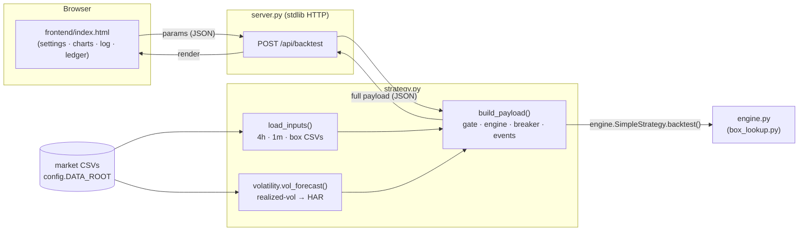

# Architecture — how the code & system fit together (self-contained)

For someone reading **only this folder**. Explains every module, the data flow, and how a backtest
request becomes the dashboard you see. No other part of the repo is needed.

---

## 1. The big picture

Data is loaded **once** at server start. Each **Run Backtest** click POSTs the form parameters,
`build_payload` runs the engine + risk overlays with those params, and returns one JSON blob the
frontend draws.

## 2. The modules (each file, what it owns)
| File | Responsibility | Notes |
|---|---|---|
| `config.py` | data paths (`DATA_ROOT`, env `WSG_DATA_ROOT`), the **winning preset**, constants | the only place to change inputs |
| `loader.py` | `load_data(csv)` → normalised OHLCV DataFrame (maps `datetime`→`Date`, parses dates) | copied, pure pandas |
| `box_lookup.py` | weekly/monthly box level constants + `_candle_to_box_date` (the 18:00 session roll) | copied; `src.exceptions` inlined as local shim |
| `engine.py` | the **single-contract backtest engine**: Stage-1 entry + dual soft/hard SL-TP exit on 1-min bars; supports `entry_gate` (skip bars) + `sl_tp_mult` (scale distances) | parity-tested clone of the verified engine; imports the local `box_lookup` |
| `volatility.py` | `compute_rv_pts(df4,df1)` (realized vol = √Σ 1-min sq log-returns × close) + `har_forecast` + `vol_forecast` | self-contained; reproduces the precomputed series exactly |
| `strategy.py` | `load_inputs()` (all years → df4/df1/box/vf) and `build_payload(params)` (gate threshold, run engine, **drawdown breaker** overlay, equity/drawdown/state series, **verbose event log**, summary) | the orchestrator; no repo imports |
| `server.py` | stdlib `ThreadingHTTPServer`: serves `frontend/`, `GET /api/health`, `POST /api/backtest` | loads data once at startup |
| `frontend/index.html` | the UI: settings sidebar, metric cards, price+SL/TP chart, vol/state/equity/drawdown panes, event log, trade ledger; `fetch('/api/backtest')` | falls back to embedded `data.js` if opened as a file |

## 3. The backtest pipeline (what `build_payload` does)
1. **Resolve params** (merge over the winning preset); clamp `sl_hard ≥ sl_soft`.
2. **Slice the data window** (full / 2025 / 2026).
3. **Volatility gate:** threshold = the chosen percentile of the **2025-train** HAR-RV (frozen,
   causal); `gate = vf ≤ threshold`. (`gate_pct = 0` ⇒ no gate.)
4. **Run the engine** (`SimpleStrategy.backtest`) with the SL/TP params, the `entry_gate`, and the
   1-min data for sub-bar exits → the list of candidate closed trades.
5. **Drawdown circuit-breaker (causal overlay):** walk trades in entry order; track equity & peak;
   on running DD ≥ `dd_limit` → lock for `cooldown` trades, then resume (reset peak). Each
   decision uses only earlier trades — no look-ahead. (`dd_limit = 0` ⇒ no breaker.)
6. **Emit** for the kept trades: candles, HAR-RV + gate threshold, engine TRADING/LOCKED state,
   equity, underwater drawdown, a **verbose event log** (ENTRY/EXIT/LOCK/UNLOCK/SKIP with reasons),
   the **trade ledger** (entry/exit/SLsoft/SLhard/TP/reason/P/L/equity/DD), and summary stats.

## 4. Causality & correctness guarantees
- **No look-ahead:** entry uses the just-closed bar; the gate threshold is frozen on train data;
  the breaker decision for a trade uses only prior trades; 1-min exit bars are all *after* the
  signal.
- **Per-trade loss is capped** at `sl_hard × $20` (≈$800) — the property that keeps max drawdown
  small (the breaker can only overshoot its trigger by ≈ one capped loss).
- **Self-contained & exact:** the local realized-vol computation reproduces the original
  precomputed series, so this app returns the validated winner numbers ($24,720 / $4,845) bit for
  bit — verifiable via `GET /api/health` + a winner-params `POST`.

## 5. Extending it
- New parameters: add to `config.WINNER`, accept in `strategy.build_payload`, add a field in
  `frontend/index.html`'s settings panel.
- A real backend framework (FastAPI) could replace `server.py` 1:1 (same two endpoints) if you
  want auth/scaling — the core (`strategy.py`) is framework-agnostic.
- Per-bar dynamic flip / live equity-stop are the known next engine features (see the workstream
  notes). The box-grid graphic from the production dashboard is intentionally **not** reproduced
  here (project rule); the price pane shows candles + trade overlays only.
