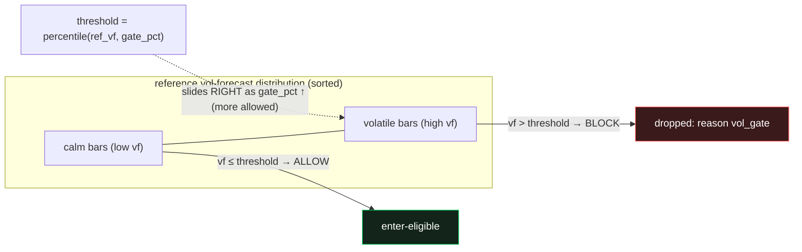
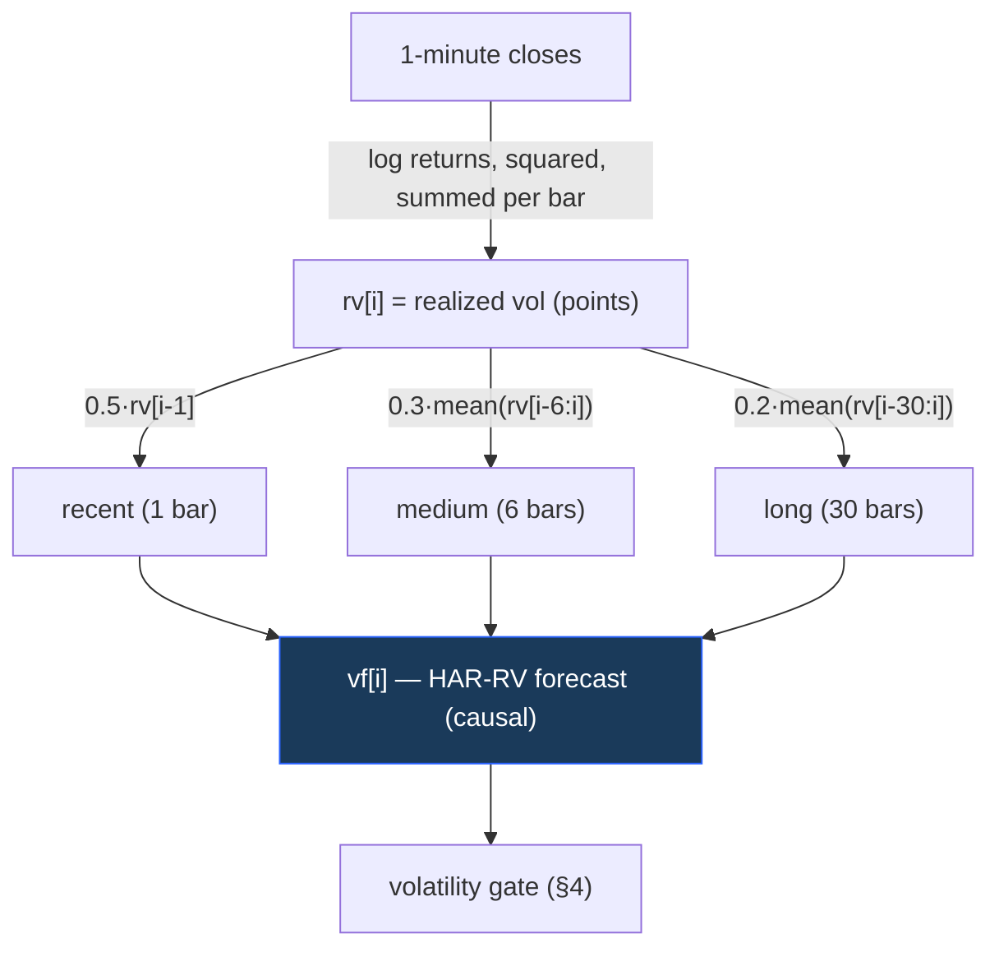
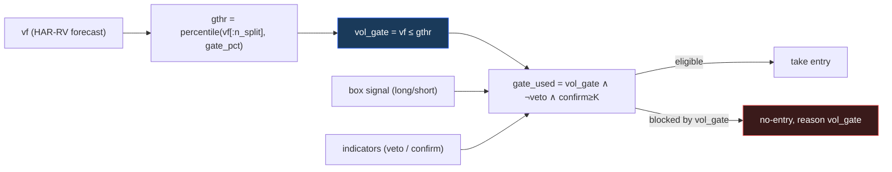

# HAR-RV Volatility Gate — how it works & how it's implemented

> **Status:** reference doc · **Scope:** the `gate_pct` volatility filter used by L1 (and exposed as an L2 lever).
> **Source of truth:** `volatility.py`, `strategy.py`, `optimize/core.py`. All formulas below are quoted from code.

## 0. TL;DR — does raising `gate_pct` stop more or fewer entries?

**Raising `gate_pct` stops *fewer* entries (it is MORE permissive). Lowering it stops *more*.**

The gate is a **low-volatility filter**. A bar is allowed to trade only where the forecast volatility
`vf` is **at or below a threshold**, and that threshold is the **`gate_pct`-th percentile** of the
reference volatility distribution:

```text
threshold = percentile(reference_vf, gate_pct)
allowed   = vf <= threshold        # enter-eligible bars
blocked   = vf >  threshold        # the most-volatile bars are dropped (reason "vol_gate")
```

So `gate_pct` is the **fraction of the (reference) volatility range you are willing to accept**, not the
fraction you reject:

| `gate_pct` | threshold | bars allowed | bars blocked | meaning |
|---:|---|---|---|---|
| **0** | — | **all** | none | **gate OFF** (special-cased; see §4) |
| 10 | 10th pct (very low) | only the calmest ~10% | ~90% | extremely strict |
| 50 | median | calmest ~50% | ~50% | block the more-volatile half |
| **86.9** | high | calmest ~87% | top ~13% | **the lean champion** |
| 100 | max | ~all | ~none | effectively off |

> ⚠️ **Naming gotcha:** `gate_pct` reads like "percent of signals to gate out," but it is the opposite —
> it is the **percentile ceiling on accepted volatility**. Higher = looser. The only non-monotone point
> is `gate_pct = 0`, which the code treats as "gate disabled" rather than "block everything."



---

## 1. What HAR-RV is (the concept)

**HAR-RV = Heterogeneous AutoRegressive model of Realized Volatility** (Corsi, 2009). The idea:
volatility is **persistent and multi-scale** — today's volatility is best predicted by a blend of
*recent*, *medium-term*, and *longer-term* realized volatility. The classic HAR uses daily / weekly /
monthly realized-vol averages; our system uses the same three-horizon blend but in **decision-bar units**
(see §3).

Two pieces:
1. **Realized Volatility (RV)** — a *measured* volatility for each decision bar, computed from the
   high-frequency (1-minute) returns inside that bar.
2. **HAR forecast (`vf`)** — a *causal* (past-only) prediction of the next bar's volatility, a weighted
   blend of the recent RV history. This forecast is what the gate thresholds against.

---

## 2. Realized volatility per bar — `compute_rv_pts` (`volatility.py:21`)

For each decision bar we sum the **squared 1-minute log-returns** that fall inside the bar's own
`[start, start+duration)` window, square-root it, and scale to **points** by the bar's close:

```text
per decision bar i:
  lr_t   = log(close_t / close_{t-1})          # 1-minute log returns
  rv[i]  = sqrt( Σ lr_t²  for t in bar i ) * close[i]      # realized vol, in points
```

Quoted from `volatility.py` (module docstring + `compute_rv_pts`):

```python
# per decision bar:  rv_pts = sqrt( sum of 1-min squared log-returns within the bar ) * bar_close
rv = np.where(cnt >= min_returns, np.sqrt(sq) * closes, np.nan)
```

Key implementation details:
- **Vectorised binning** (`np.searchsorted` + `np.add.at`) assigns each 1-min return to its decision bar
  in `O(M log N)` — essential for fine timeframes (1m has ~487k bars). (`volatility.py:42-53`)
- **Gap-aware:** a 1-min bar sitting in a session gap (outside any bar's `[start, start+dur)` window) is
  excluded. (`volatility.py:46-47`)
- **Minimum returns:** a bar needs `≥ 2` intrabar returns (`cnt >= 2`) to get an RV, else `NaN`; the 1-min
  decision frame is the degenerate case and accepts `1`. (`volatility.py:58`)
- **Units = points** (not %), because the gate and the strategy reason in price points.

---

## 3. The HAR forecast — `har_forecast` (`volatility.py:63`)

The causal forecast blends three look-back horizons of RV (recent / medium / long), in **decision-bar
units of 1 / 6 / 30 bars**, with fixed weights `0.5 / 0.3 / 0.2`:

```python
# vf[i] = 0.5*rv[i-1] + 0.3*mean(rv[i-6:i]) + 0.2*mean(rv[i-30:i])   (only for i >= 30)
vf[i] = 0.5 * rv[i - 1] + 0.3 * rv[i - 6:i].mean() + 0.2 * rv[i - 30:i].mean()
```

- **Causal (no look-ahead):** `vf[i]` uses only bars strictly before `i` (`rv[i-1]`, and means over
  `[i-6, i)` and `[i-30, i)`). This is critical — the gate decision at bar `i` never peeks at bar `i`.
- **Warm-up:** the first 30 bars (no full 30-bar history) are filled with the **median** of the finite
  forecasts: `np.where(np.isfinite(vf), vf, np.nanmedian(vf))`. (`volatility.py:72`)
- **Lag choice 1/6/30:** kept in *bar-count* units per timeframe (not wall-clock) so the gate is
  self-consistent across timeframes; reviewed and retained (WS-I rev#1). The gate only needs a
  **monotone, causal vol proxy**, which this provides.
- **Timeframe generalisation (WS-H.2):** the RV *window* is the decision-bar duration (`bar_minutes`,
  default `240` = 4h); the HAR lookback stays `1/6/30` *bars*. Default args reproduce the verified 4h
  forecast byte-for-byte (parity-locked by `optimize/test_parity.py`). (`volatility.py:9-13`)



Entry point: `vol_forecast(df_dec, df1, bar_minutes)` (`volatility.py:75`) = `har_forecast(compute_rv_pts(...))`.
It is computed **once per data bundle** and cached: `strategy.py:39/54/77/94`, `optimize/data.py:52`,
`perf/_common.py:46`.

---

## 4. How the forecast drives the gate

The gate turns the continuous forecast `vf` into a per-bar boolean mask. **Two code paths, identical math.**

### 4a. Dashboard path — `strategy.build_payload` (`strategy.py:258-261`)

```python
gthr = gate = None
if gate_pct > 0:
    gthr = float(np.percentile(vf[:n2025], float(gate_pct)))   # threshold frozen on the 2025 segment
    gate = vfw <= gthr                                         # per-bar: vol ≤ threshold ⇒ eligible
```

### 4b. Optimizer / fast path — `optimize.core.backtest_metrics` (`optimize/core.py:92-95`)

```python
if gate_pct > 0:
    ref = gate_ref_vf if gate_ref_vf is not None else vf[:n_split]
    gthr = float(np.percentile(ref, gate_pct))
    gate = vfw <= gthr
```

Properties:
- **`gate_pct = 0` ⇒ gate OFF.** Both paths guard `if gate_pct > 0`; `gate` stays `None` ⇒ every bar is
  eligible. Validated in `strategy.py:164`: `gate_pct must be in [0,100] (… 0 = gate OFF)`.
- **Threshold frozen on a reference segment (causality).** The percentile is computed on the **first
  calendar segment only** (`vf[:n2025]` / `vf[:n_split]`, i.e. the 2025 data), then applied to the whole
  series. This prevents the threshold from "seeing" future-period volatility. Walk-forward folds pass an
  explicit `gate_ref_vf` so each fold thresholds on its own causal reference (`optimize/core.py:58`).
- **The gate is one factor in the composite entry mask.** The engine's final per-bar eligibility is
  `gate_used = vol_gate ∧ ¬veto ∧ confirm≥K` (`optimize/core.py:114`). A bar blocked by the vol gate is
  logged with reason **`vol_gate`** (vs `veto` from indicators) — see `engine.py` `blocked_log` and
  `optimize/counterfactual_pause.py:attribute`.



---

## 5. Worked example (why higher `gate_pct` = fewer blocks)

Suppose the reference distribution of `vf` over 2025 has these percentiles (illustrative points):

| percentile | 10th | 50th | 87th | 95th |
|---|---:|---:|---:|---:|
| `vf` value | 60 | 110 | 190 | 240 |

- `gate_pct = 50` → `gthr = 110` → a bar with `vf = 150` is **blocked** (`150 > 110`).
- `gate_pct = 86.9` → `gthr ≈ 190` → the same `vf = 150` bar is now **allowed** (`150 ≤ 190`); only bars
  above ~190 (the top ~13%) are blocked.
- `gate_pct = 95` → `gthr = 240` → almost nothing is blocked.

So as `gate_pct` rises, the threshold slides up the volatility axis and **admits progressively more
bars** — monotonically fewer entries are stopped (until `gate_pct = 0`, the OFF special case).

**Intuition / trading rationale:** the strategy's box breakouts perform better in **calmer** regimes;
the gate exists to *skip the most volatile bars*, where breakouts whipsaw. A high champion `gate_pct`
(86.9) means the edge tolerates most volatility and only the extreme top tail is harmful enough to skip.

### `gate_pct = 0` vs `gate_pct = 100` — nearly identical, and on 4h *exactly* so

- `gate_pct = 0` → gate **OFF** → blocks nothing, ever.
- `gate_pct = 100` → `threshold = percentile(reference_vf, 100)` = the **reference (2025) maximum** → a bar
  is blocked only if `vf >` that max, i.e. only an **out-of-reference volatility spike** (a 2026 bar more
  volatile than anything in 2025).

So they differ **only** on post-reference bars exceeding the reference's worst volatility. **Measured on
the 4h bundle** (`strategy.get_bundle("4h")`, 2119 bars, reference = 1534 × 2025 bars): the global max
`vf` is **736.60 pts and it lies in 2025**, so **zero** bars exceed the reference max ⇒ `gate=100` blocks
**0**, exactly like `gate=0`. They coincide on this data. (They still take different code paths —
`gate=0` ⇒ `gate=None`, no comparison; `gate=100` ⇒ an all-True mask — but produce identical trades.)
On a future/other dataset whose out-of-sample volatility exceeds the reference max, `gate=100` would block
that handful while `gate=0` would not.

---

## 6. Implementation map

| Concern | Location |
|---|---|
| RV from 1-min, per bar | `volatility.py:21` `compute_rv_pts` |
| Causal HAR forecast (1/6/30, 0.5/0.3/0.2) | `volatility.py:63` `har_forecast` |
| Public entry `vol_forecast(df_dec, df1, bar_minutes)` | `volatility.py:75` |
| Gate (dashboard) — freeze on 2025, `vf ≤ gthr` | `strategy.py:258-261` |
| Gate (optimizer/fast) — `gate_ref_vf` per fold | `optimize/core.py:92-95` |
| `gate_pct` validation (`[0,100]`, 0 = OFF) | `strategy.py:164` |
| Composite mask `vol_gate ∧ ¬veto ∧ confirm` | `optimize/core.py:114` |
| Blocked-signal attribution (`vol_gate` vs `veto`) | `engine.py` `blocked_log`; `optimize/counterfactual_pause.py:31` `attribute` |
| Parity lock (4h forecast byte-exact) | `optimize/test_parity.py` |

---

## 7. Relevance to L2 (the second layer)

`gate_pct` is one of the **L2 search levers** (spec §7) and is exposed on the L2 dashboard
(`frontend/l2.html` → `/api/l2_backtest`). For L2 the same gate runs on the **same `vf`** (the frozen L1
bundle's forecast) but with L2's own `gate_pct` — so an L2 profile can be **stricter or looser** than L1
on exactly the bars L1 dropped. Because the L1 champion already runs a high gate (86.9), the bars it
**vol-gated** are its top-~13% volatility tail; an L2 profile that wants to act on those must itself set a
*higher* `gate_pct` (or `0` = off) to admit them. This is why "lean-params-as-L2" takes **0 trades** — L2
with L1's own gate re-blocks exactly what L1 blocked (see [[update_l2_backtester]]).

---

## 8. Caveats

- **Forecast, not realized:** `vf[i]` predicts bar `i`'s volatility from the past; it is intentionally a
  *monotone proxy*, not a calibrated variance. The gate only needs the **ranking** to be sensible.
- **Reference-segment dependence:** the threshold is fixed on 2025 (or the fold's reference). If a later
  regime is structurally more volatile, a fixed `gate_pct` blocks a larger share of it — by design
  (causal), but worth remembering when reading 2026 behaviour.
- **`gate_pct` is continuous in `[0,100]`** but the *effect* is discretised by the data: between two
  adjacent `vf` order-statistics the allowed set doesn't change.
