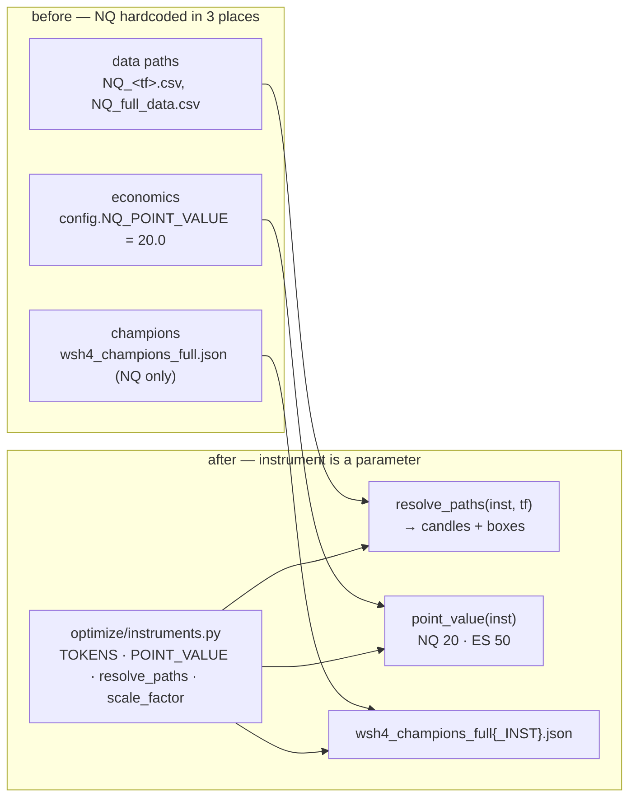
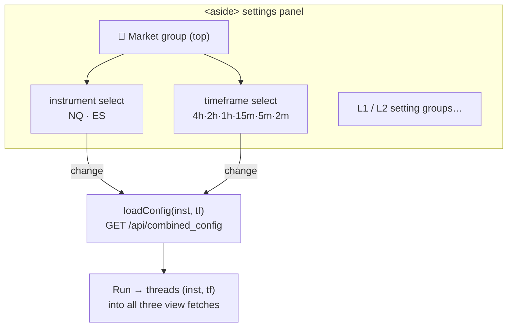

# Set 1 — Instrument selector (NQ / ES): engine + dashboard

> Detailed record of the first of four related system-update sets. Design spec:
> [`docs/superpowers/specs/2026-06-29-instrument-selector-design.md`](superpowers/specs/2026-06-29-instrument-selector-design.md).
> Commits: `c47152c · 07d13a4 · 1cc1dd6 · 74d4e0b · 082f100 · f39b442`.

## 0. TL;DR

A two-token **instrument** dropdown (`NQ`, `ES`) was added to the backtester engine and the combined
dashboard. Selecting an instrument runs the **same** box/L1/L2 engine on **that instrument's candles, boxes,
and economics** ($/pt). It composes with the decision-timeframe selector: every run is the pair
`(instrument, timeframe)`. **NQ is unchanged byte-for-byte** (default token, original data path); ES routes
through the cross-subproject registry. Golden 6-TF parity held throughout.

## 1. Why this was safe to add

The engine math was **already instrument-agnostic** — `box_lookup.py`'s 18:00 session roll,
`optimize/signals.decision_signals`, and `optimize/fast_engine.fast_backtest` are pure functions over
*(data, params)*. The "NQ" assumption lived in exactly three places, and each was made a parameter:

**NQ-parity proof (zero golden risk):** the registry's `ALL_STOCKS/.../NQ` candle+box files are
**byte-identical (md5)** to `config.DATA_ROOT/full_data/NQ_*.csv`. So NQ keeps its existing path and non-NQ
routes through the registry — same engine, different files.

## 2. Instrument economics

| token | data source | point value ($/pt) | scale_factor (vs NQ) |
|---|---|--:|--:|
| `NQ` | `config.DATA_ROOT` (unchanged) | 20.0 | 1.0 |
| `ES` | `ALL_STOCKS/CANDLES/CME/ES_Continuous_Data` + `BOXS/CME/ES` | 50.0 | ~0.273 |

`scale_factor` (ratio of median closes) is used only to **scale permissive default knobs** when no optimized
champion exists for an instrument, so a sensible default strategy loads for either market. Once a real
champion exists (see Set 3), it overrides the scaled default.

## 3. The resolver — `optimize/instruments.py`

A single small module is the source of truth for the instrument dimension:

- `TOKENS = ("NQ", "ES")` — the exposed set (the registry holds 6; ETFs are deferred, the design generalizes).
- `POINT_VALUE` — `{NQ: 20.0, ES: 50.0}`; `point_value(inst)` is threaded into every P/L computation.
- `resolve_paths(inst, tf)` — returns the candle CSV, the 1-min CSV, and the box CSV for `(inst, tf)`; NQ →
  `config.DATA_ROOT`, ES → registry (`subprojects/all-stocks-signals/instruments.py`).
- `scale_factor(inst)` — median-close ratio for default-knob scaling.

## 4. API contract

Both engine endpoints and both config endpoints accept an `instrument` field. **Contract: NQ is the default
when omitted; an unknown token is a hard `400`, never a silent NQ fallback** (so a typo can't quietly return
the wrong market's numbers).

| endpoint | instrument input | behaviour |
|---|---|---|
| `GET /api/config` | `?instrument=` | schema + defaults for that instrument |
| `GET /api/combined_config` | `?instrument=&tf=` | L1+L2 defaults for `(inst, tf)`; bad → 400 |
| `POST /api/backtest` | body `instrument` | single-layer engine run |
| `POST /api/backtest_causal` | body `instrument` | rich L1 causal run (dashboard L1 tab) |
| `POST /api/causal_backtest` | body `instrument` | L2 / combined causal run |

`strategy.py` (the `build_payload` L1 path) and `payload.build_view_payload(..., instrument=)` both thread the
token through to data load + `point_value`. Caches are **instrument-keyed** so NQ and ES results never collide.

## 5. Dashboard — the "Market" group

- The instrument + timeframe selectors were relocated into a dedicated **"Market"** `.sgroup` at the top of
  the settings panel (`082f100`), so picking the market is the first decision.
- Changing either selector re-fetches `/api/combined_config?instrument=&tf=` and repopulates the L1/L2 default
  knobs for that `(instrument, timeframe)`.
- **Run** threads `{instrument, tf}` into all three view requests (L1 / L2 / combined).

## 6. Test & parity evidence

- **`tests/e2e_dashboard_instrument.py`** — Playwright: the Market group exists, NQ/ES × all TFs load configs,
  all three views run for each.
- **`f39b442`** — comprehensive Playwright UI test (Market group + NQ/ES × 6 TFs × 3 views).
- **Golden gate** `perf/check_golden.py` (NQ, 6 TFs) stayed green for the entire set — NQ numbers never moved.
- **Negative-path:** bad instrument token → HTTP 400 (asserted), no silent fallback.

## 7. What this set deliberately did **not** do

- No ETF tokens (QQQ/SQQQ) — deferred; `TOKENS` + `POINT_VALUE` extend trivially when wanted.
- No optimizer changes — that is **Set 2** ([`INSTRUMENT_02_OPTIMIZER_WIRING.md`](INSTRUMENT_02_OPTIMIZER_WIRING.md)).
- No ES champions yet — defaults were scaled-permissive until **Set 3** produced real ones
  ([`INSTRUMENT_03_ES_CHAMPION_CAMPAIGN.md`](INSTRUMENT_03_ES_CHAMPION_CAMPAIGN.md)).
