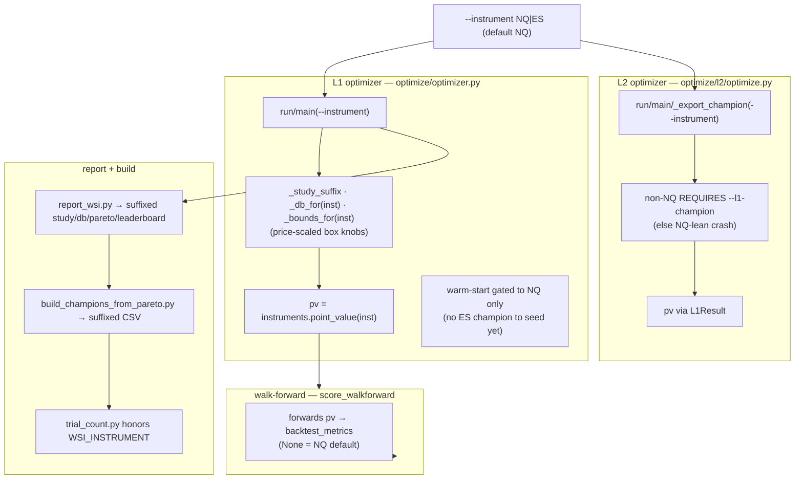
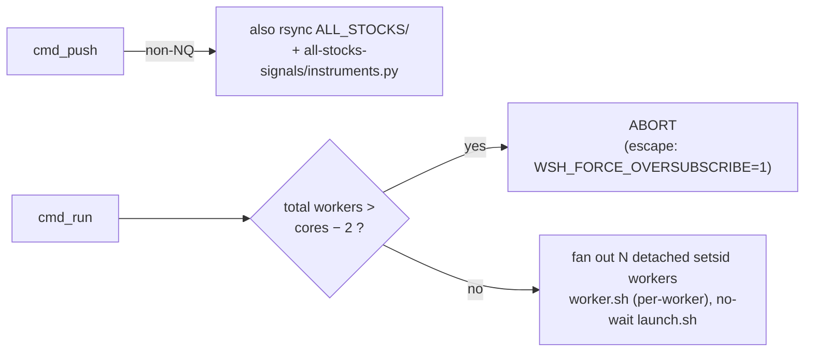

# Set 2 — Optimizer wired for (instrument, timeframe): L1 + L2

> Second of four related system-update sets. Spec: `a107055`; plan: `534f6cd`.
> Commits: `2ae4ca2 · efa0033 · 9549a12 · f0f39cb · c9ae6c4 · 194f6c3 · 1f1b3f2 · 7e40e0b · 8781977 · bcdb79c · 8daa703`.

## 0. TL;DR

The whole optimizer toolchain — L1 search, L2 search, the report/leaderboard generator, the champion
builder, the remote server runner, and the trial counter — now takes an `--instrument` (default `NQ`). Every
artifact name is **suffixed** so NQ and ES studies, databases, pareto CSVs and champion files never collide,
point value is threaded into every objective, and search **bounds are price-scaled** per instrument. NQ
behaviour is **byte-identical** to before (suffix is empty for NQ).

## 1. The naming rule (one rule, applied everywhere)

```
suf = "" if instrument == "NQ" else f"_{instrument}"

study     →  {prefix}_{tf}{suf}              e.g. wsh4_4h        /  wsh4_4h_ES
db        →  wsh_{tf}{suf}.db                e.g. wsh_4h.db      /  wsh_4h_ES.db
pareto    →  {tf}_wsi_pareto{suf}.png/.csv
champions →  wsh4_champions_full{suf}.json
```

This single rule (`_study_suffix`) is the backbone — it makes the instrument dimension a pure namespacing
concern, so NQ’s existing files are untouched (`suf=""`) and ES gets a parallel, non-colliding set.

## 2. What changed, layer by layer



### L1 — `optimize/optimizer.py`
- `run(..., instrument="NQ")`, `main(--instrument)`.
- `_study_suffix`, instrument-keyed `_db_for(..., instrument)`.
- `_bounds_for(inst)` **price-scales the box bounds** (SL/TP/breaker are in points; ES trades at ~1/4 NQ’s
  price, so the search ranges scale) — keeps the search space sane per instrument.
- `pv = instruments.point_value(inst)` into the objective.
- **Warm-start is gated to NQ** (`9549a12`): NQ seeds known champions (guaranteed ≥ prior); ES cold-starts
  because there is no ES champion to seed.

### Walk-forward — `score_walkforward` (`2ae4ca2`)
- Forwards `pv` to `backtest_metrics`; `None` preserves the NQ default, so NQ scoring is unchanged.

### L2 — `optimize/l2/optimize.py` (`1f1b3f2`)
- `run` / `main` / `_export_champion` accept `--instrument` (suffixed artifacts; pv via `L1Result`).
- **Non-NQ runs require `--l1-champion`** — L2 scores the *residuals* of an L1 champion, and there is no
  default ES L1 lean, so the path errors clearly instead of silently using NQ’s lean.

### Report + champion builder
- `report_wsi.py` (`f0f39cb`) honors `WSI_INSTRUMENT` → suffixed study, db, pareto, leaderboard, report.
- `build_champions_from_pareto.py` (`c9ae6c4`) reads the `WSI_INSTRUMENT`-suffixed pareto CSV.
- `trial_count.py` (`bcdb79c`) honors `WSI_INSTRUMENT` for target-based / watchdog counting.

### Dashboard default hook (`194f6c3`)
- `payload.instrument_l1_default(inst, tf)` reads the optimized champion
  (`wsh4_champions_full{_INST}.json`) when present, else falls back to **scaled-permissive** (Set 1’s
  `scale_factor`). This is the bridge that lets Set 3’s ES champions light up the dashboard automatically.

## 3. Remote runner — `optimize/server/remote_wsi.sh` (ES-capable)



- New env knobs: `WSH_INSTRUMENT` (→ `--instrument` + `WSI_INSTRUMENT` export), `WSH_TFS` (TF override),
  `WSH_WORKERS` (worker-count override).
- `cmd_push` also syncs `ALL_STOCKS/` + the registry for non-NQ instruments (ES data must be on the server).
- **Launcher robustness** (`8daa703`): self-contained per-worker `worker.sh` fired via `setsid`, no-wait
  `launch.sh` — earlier multi-hop / wait-based launchers were flaky from the harness.
- **Bug fixed** (`8daa703`): ES study-name expansion `'wsh4_$tf_ES'` → `'wsh4_${tf}_ES'` (was expanding to
  empty, so ES studies were mis-named).
- **Oversubscription guard** (`9d1ada9`, shared with Set 4): `cmd_run` aborts if total workers exceed
  `cores − 2` — this is the direct fix for the load-43 server freeze on a 32-core box.

## 4. Test isolation (`8781977`)

ES-default tests are isolated from the **real** champion file (monkeypatched path) so they exercise the
`_scaled_permissive` fallback deterministically — a committed ES champion can’t make the default-scaling test
pass/fail by accident.

## 5. Parity

- NQ suffix is empty everywhere ⇒ every NQ study/db/pareto/champion path is unchanged ⇒ golden 6-TF held.
- The only NQ code-path delta is `pv`/`bounds` now flow through helpers that default to the old NQ constants.
