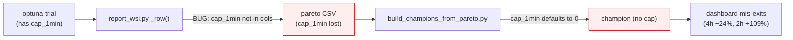
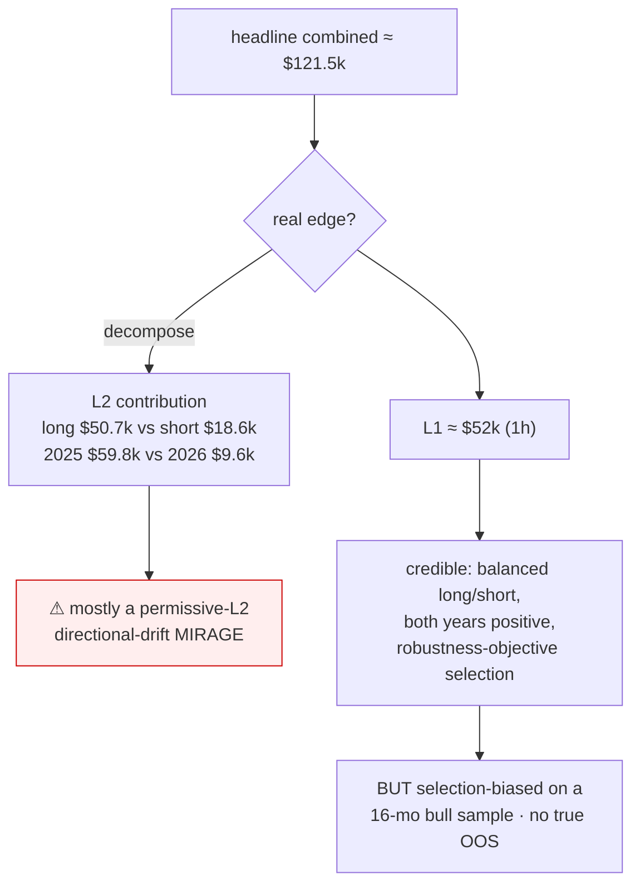

# Set 3 — ES L1 champion campaign, extraction & validity

> Third of four related system-update sets. Depends on Sets 1 & 2.
> Commits: `e8d512f · 65f5ae5 · 7e31537 · ea68114 · e942ef2 · eda7133`.
> Companion docs: [`RESEARCH_ES_CHAMPION_VALIDITY.md`](RESEARCH_ES_CHAMPION_VALIDITY.md) (the verdict),
> `optimize/reports/WS-I_RESULTS_ES.md` (per-TF recipes), `optimize/results/*_wsi_pareto_ES.png` (fronts).

## 0. TL;DR

A full **cold-start** NSGA-III campaign was run for **ES**, all 5 timeframes (4h/2h/1h/15m/5m), **10k trials
each, full 15-indicator SMC space**, on the AMD server fleet. Champions were extracted into
`optimize/results/wsh4_champions_full_ES.json`, imported as 5 dashboard profiles, and verified reproducible
in the dashboard via Playwright. A **validity study** then asked the hard question — *are these real?* — and
concluded the headline **combined $121.5k is mostly a permissive-L2 drift mirage**, while the **L1 ~$52k (1h)
is credible but selection-biased** on a 16-month bull sample with no true out-of-sample. The ES **L2**
campaign was launched and then **killed** by request (partial studies remain resumable).

## 1. Campaign parameters

| knob | value |
|---|---|
| instrument | ES (point value $50/pt) |
| timeframes | 4h, 2h, 1h, 15m, 5m (1m / 2m dropped by request) |
| trials / TF | 10,000 (cold start — no warm seed; ES has no prior champion) |
| search space | full — box/risk knobs + all 15 indicators on/off + their params + K |
| objectives | median fold P/L ↑ · worst-fold maxDD ↓ · median win-rate ↑ |
| feasibility | full-period maxDD ≤ 25% of full-period P/L |
| compute | AMD server fleet (32c/123GB), Postgres-backed studies |

## 2. Per-TF L1 champion (feasible Pareto)

From `optimize/reports/WS-I_RESULTS_ES.md` — champion = max median fold P/L among feasible:

| TF | feasible | med fold P/L | worst DD | win% | full-period P/L | DD%·P/L | K | #ind | cap_1min |
|---|--:|--:|--:|--:|--:|--:|--:|--:|--:|
| 4h | 8,339 | $12,087 | $2,896 | 69 | **$38,728** | 13% | 1 | 10 | 871 |
| 2h | 7,366 | $5,032 | $1,749 | 70 | $19,479 | 9% | 4 | 14 | 114 |
| 1h | 6,056 | $14,161 | $4,226 | 41 | **$52,167** | 9% | 5 | 7 | 923 |
| 15m | 5,790 | $2,981 | $750 | 64 | $8,456 | 11% | 4 | 8 | 109 |
| 5m | 5,542 | $6,762 | $3,818 | 62 | $23,310 | 20% | 4 | 8 | 827 |

(Full indicator recipes per TF — every enabled judge's tuned internal params — are in `WS-I_RESULTS_ES.md`.)

## 3. Extraction & the `cap_1min` round-trip bug

The first extraction reproduced **wrong** in the dashboard (4h off 24%, 2h 109%, 15m 78%). Root cause: the
`cap_1min` knob (max-hold in 1-minute bars) was **dropped** in the pareto CSV → champions were rebuilt without
it → they mis-exited.

**Fix** (`ea68114`): round-trip `cap_1min` through the whole pipe — `report_wsi.py:_row()` adds
`cap_1min=pr.get("cap_1min", 0)` and lists it in `cols`; `build_champions_from_pareto.py` reads
`cap_1min=int(_num(r.get("cap_1min")) or 0)` into the box. After the fix **all 5 TFs reproduce within ~3%**.

## 4. Dashboard champion labeling (`e942ef2`)

When an optimized champion file exists for a non-NQ instrument, the dashboard now labels it
**`🏆 {inst} champion {tf}`** (e.g. `🏆 ES champion 1h`) instead of the generic
**`⚙ {inst} permissive (scaled) {tf}`**. The 5 ES champions were imported into `profiles/l1_profiles.json`.
A Playwright test (`tests/e2e_dashboard_es_champions.py`, 7/7) verifies each ES champion **reproduces in the
dashboard** — P/L matches the optimizer within rounding, `cap_1min` loads, profiles import.

## 5. Validity verdict (see `RESEARCH_ES_CHAMPION_VALIDITY.md`)

- **Combined $121.5k** is dominated by a permissive L2 riding directional drift (long ≫ short, 2025 ≫ 2026) —
  treat as a **mirage**, not a tradeable edge.
- **L1 ~$52k** is the credible figure (balanced long/short, both years positive, selected on the
  median-fold robustness objective) — **but** it is selection-biased across 10k trials on a single 16-month
  bull sample, with **no true out-of-sample**. Not yet a deployable claim.

## 6. L2 ES campaign — launched then killed

The ES L2 cold-start campaign (`l2es1_<tf>_ES`, scoring L2 on the ES L1 champions' residuals via
`--l1-champion`) was launched on the server and then **killed by request**. Partial studies remain in
Postgres and are **resumable** — extract/resume only on request.

## 7. Artifacts produced by this set

- `optimize/results/wsh4_champions_full_ES.json` — 5 ES L1 champions (with `cap_1min`).
- `profiles/l1_profiles.json` — 5 `🏆 ES <tf> champion` profiles.
- `optimize/reports/WS-I_RESULTS_ES.md` — per-TF recipes + indicator params.
- `optimize/results/{4h,2h,1h,15m,5m}_wsi_pareto_ES.png` — feasible Pareto fronts.
- `docs/RESEARCH_ES_CHAMPION_VALIDITY.md` — the validity study.
- **Security** (`7e31537`): the Postgres storage URL (password) is no longer printed in `launch.sh`
  pre-create — logs `study <name> ready (postgres)` instead.
