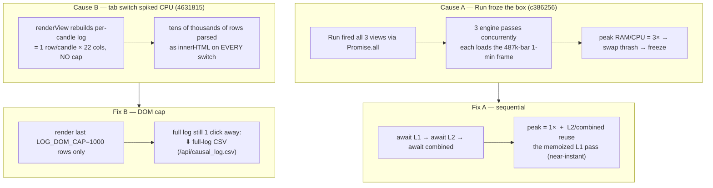

# Set 4 — Dashboard performance, launch reliability & server safety

> Fourth of four related system-update sets. These fixes were surfaced by exercising the heavier ES space.
> Commits: `632742a · d16ed49 · 9d1ada9 · c386256 · 4631815`.

## 0. TL;DR

Five reliability/performance fixes. The dashboard's three views now run **sequentially** (not in parallel) so
a single backtest doesn't 3× peak RAM/CPU and freeze a small box; the per-candle log table is **capped at
1000 DOM rows** so switching tabs is no longer O(candles); `run_dashboard.sh` is now **portable + detached +
self-healing**; the server runner **refuses to oversubscribe cores**; and the Postgres password no longer
leaks to logs.

## 1. Dashboard freeze — two distinct causes

The user reported the dashboard "freezing." Investigation found **two separate** causes — fixed separately.

### Fix A — sequential views (`c386256`)
`run()` changed from `Promise.all([l1, l2, combined])` to **awaited-in-order** fetches. Three parallel passes
each reloaded the 1-minute frame and recomputed the shared L1/causal work simultaneously → 3× peak load on a
14 GB box → freeze. Sequential keeps peak at 1× **and** lets the backend memoize: L2 and combined reuse the
first run's heavy L1 pass instead of recomputing it. Net: same-or-faster, a third of the peak load.

### Fix B — per-candle log DOM cap (`4631815`)
`out["log"]` has **one row per candle** (`len(log) == meta.n`). `renderView` rebuilt that whole 22-column
table as `innerHTML` on **every tab switch** — at 5m/15m that's tens of thousands of rows parsed each time
(the CPU spike / fan the user felt; the backtest itself was already fast). Now only the most-recent
`LOG_DOM_CAP=1000` rows render; the **complete** log stays available via the existing **⬇ full-log CSV**
button (`/api/causal_log.csv`). Header shows `last 1,000 of N candles`. This mirrors the event log's existing
`slice(-400)` cap. The payload is unchanged — only the DOM render is windowed, so all tests and the CSV
export are unaffected.

> **Note (architectural):** backtest *data* is cached in `VIEWS.{l1,l2,combined}` on Run — tab switches do
> **not** re-run the engine, they only **repaint** the shared DOM/charts from cached data. The cap makes that
> repaint cheap. A future option is a per-view DOM cache (build once per Run, toggle visibility) for truly
> zero-repaint switches, at the cost of ~3× DOM or 3× chart instances.

## 2. `run_dashboard.sh` — portable, detached, self-healing

| problem | fix | commit |
|---|---|---|
| zsh-only (`${0:A:h}`) — failed under bash | `#!/usr/bin/env bash` + `readlink -f` dir resolution | `d16ed49` |
| server died when the terminal closed | `setsid` (own session) so it survives the script + terminal | `d16ed49` |
| a frozen run left a wedged server holding the port → "Address already in use" on restart | detect & `pkill -9` a stale/wedged server before (re)start | `c386256` |

Subcommands: `start` (default) / `stop` / `restart` / `status`; `PORT` (default 8200) and `PYTHON`
overridable. Health-gated startup (`/api/health`, up to 60s) with last-log tail on failure.

## 3. Server safety — oversubscription guard (`9d1ada9`)

The AMD server "freezing a lot" was diagnosed to **my own oversubscription** (≈45 workers on 32 cores → load
43), not a server defect. `remote_wsi.sh cmd_run` now **aborts if total workers > cores − 2**, with an
explicit escape hatch `WSH_FORCE_OVERSUBSCRIBE=1`. (Shared with Set 2's runner work.)

## 4. Secret-leak fix (`632742a` + `7e31537`)

- `subprojects/meta-prophet/server/server.env` (host/port/user) was **untracked** from the public repo; a
  sanitized `server.env.example` was added and the real file gitignored.
- The Postgres storage URL (with password) is no longer printed by `launch.sh` (`7e31537`, see Set 3).

## 5. Standing operational rule (recorded)

A campaign was once mistakenly run on the user's **local 12c/14 GB box** and nearly broke it. **Hard rule,
recorded in memory:** never run compute on the local machine without explicit bold permission — default to
the server, ask first. Set 4's sequential-run + log-cap fixes also make the *local dashboard itself* survivable
on the small box.
