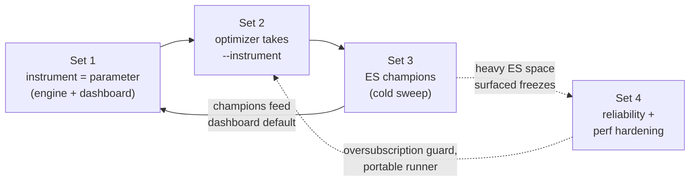

# Multi-instrument (NQ / ES) workstream — mega index

> One stock **dropdown** carried end-to-end: backtester engine → dashboard → optimizer → server → champions.
> This is the index; each **set** of related updates has its own detailed doc.

## The four sets

| # | Set | Detail doc | Headline |
|---|---|---|---|
| 1 | **Selector — engine + dashboard** | [`INSTRUMENT_01_SELECTOR_ENGINE_DASHBOARD.md`](INSTRUMENT_01_SELECTOR_ENGINE_DASHBOARD.md) | NQ/ES dropdown; instrument is now a parameter (data, $/pt, champions); NQ byte-identical |
| 2 | **Optimizer wiring (L1 + L2)** | [`INSTRUMENT_02_OPTIMIZER_WIRING.md`](INSTRUMENT_02_OPTIMIZER_WIRING.md) | `--instrument` through L1/L2/report/builder/runner; suffixed naming; price-scaled bounds |
| 3 | **ES champion campaign** | [`INSTRUMENT_03_ES_CHAMPION_CAMPAIGN.md`](INSTRUMENT_03_ES_CHAMPION_CAMPAIGN.md) | 5-TF × 10k cold sweep; `cap_1min` fix; validity: combined=mirage, L1 $52k credible-but-biased |
| 4 | **Perf / launch / server safety** | [`INSTRUMENT_04_DASHBOARD_PERF_AND_LAUNCH.md`](INSTRUMENT_04_DASHBOARD_PERF_AND_LAUNCH.md) | sequential views, 1000-row log cap, portable run script, oversubscription guard, secret-leak fix |

## How the sets compose



1. **Set 1** makes instrument a parameter, so the same engine runs NQ or ES.
2. **Set 2** lets the optimizer *search* per instrument and emit suffixed champions.
3. **Set 3** runs that search for ES, extracts champions (fixing `cap_1min`), and weighs their validity;
   the champions flow back into Set 1's dashboard default.
4. **Set 4** hardens the bits that the bigger ES space stressed (local box freeze, server load, launch script).

## Design contract (held across all sets)

- **NQ is the default and is byte-identical** — empty suffix, original data path, golden 6-TF green throughout.
- **Unknown instrument ⇒ HTTP 400**, never a silent NQ fallback (a typo can't return the wrong market).
- **Full forensic data is never lost** — the per-candle log DOM is capped for speed but the full log is one
  CSV click away.

## Commit map (oldest → newest)

```
Set 1  c47152c 07d13a4 1cc1dd6 74d4e0b 082f100 f39b442
Set 2  a107055 534f6cd 2ae4ca2 efa0033 9549a12 f0f39cb c9ae6c4 194f6c3 1f1b3f2 7e40e0b 8781977 bcdb79c 8daa703
Set 3  e8d512f 65f5ae5 7e31537 ea68114 e942ef2 eda7133
Set 4  632742a d16ed49 9d1ada9 c386256 4631815
```

## Test & parity status

| check | status |
|---|---|
| Golden 6-TF (NQ) `perf/check_golden.py` | ✅ green throughout (NQ never moved) |
| Playwright — instrument selector, TF selector, ES champions, full UI | ✅ `tests/e2e_dashboard_*` |
| ES champions reproduce in dashboard | ✅ within ~3% of optimizer (after `cap_1min` fix) |
| Bad-instrument negative path | ✅ HTTP 400 asserted |

## Known limits / next

- ETFs (QQQ/SQQQ) deferred — design extends trivially (`TOKENS` + `POINT_VALUE`).
- ES **L2** champions not finalized — campaign launched then killed; partial `l2es1_<tf>_ES` studies resumable.
- ES L1 numbers are **selection-biased on a 16-mo bull sample, no true OOS** — not yet a deployable claim
  (see Set 3 / `RESEARCH_ES_CHAMPION_VALIDITY.md`).
- Optional perf follow-up: per-view DOM cache for zero-repaint tab switches (Set 4 §1 note).

## Follow-on capability

- **Multi-timeframe layer fusion** (built on this workstream's per-layer plumbing): run two timeframes of one
  instrument at once — a primary (priority) layer + a secondary that fills the primary's flat windows, each
  with its own profile. Opt-in L2 mode; residual default byte-identical (golden untouched). See
  [`MTF_LAYER_FUSION.md`](MTF_LAYER_FUSION.md).
