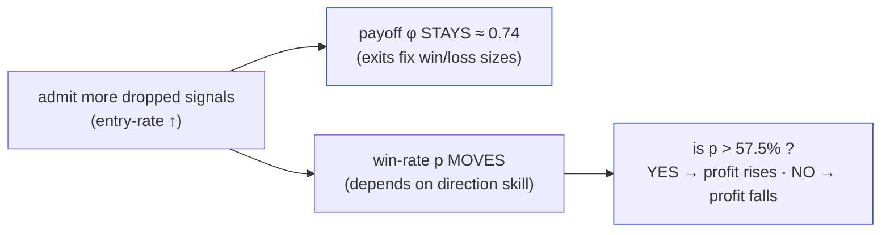
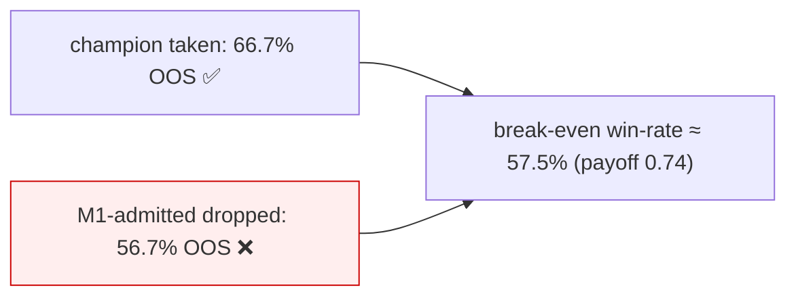

# Kalman / Signal-Fusion Study — Full-Depth Trial Compendium

> **Companion to** `docs/RESEARCH_KALMAN_FUSION_STUDY.md` (the concise running log with verdicts).
> This document is the **exhaustive** reference: every trial (M0 → M1 → M2 → M2-walk-forward → M3),
> documented at two altitudes simultaneously —
>
> - 🎓 **Paper depth** — the formal mechanism, math, and statistical reasoning, as you'd write it for a referee.
> - 👶 **Baby explanation** — the same idea in plain language, no jargon, for a reader who has never seen a Kalman filter.
>
> Each trial answers, in order: **what it's supposed to do · how it works under the hood · expected results ·
> actual results · comparison & explanation**, with **math formulas** and **verbatim code snippets** throughout.
> All code lives in `research/kalman_fusion/` and is **off the production path** — the golden parity gate
> (`perf/check_golden.py`, 6 timeframes) was verified byte-identical after every trial.

---

## Table of contents

1. [The problem, in one paragraph](#0-the-problem)
2. [Shared machinery & notation](#1-shared-machinery) — the rig, eligibility, metrics, the payoff/breakeven law, causality, IS/OOS, walk-forward
3. [Trial M0 — the ceiling](#m0)
4. [Trial M1 — champion-signal fusion (discrete multi-TF vote)](#m1)
5. [Trial M2 — Kalman trend-state director](#m2)
6. [Trial M2-WF — walk-forward validation of M2](#m2wf)
7. [Trial M3 — vol-regime exits & admission](#m3)
8. [Cross-trial synthesis & the closed verdict](#synthesis)

---

<a name="0-the-problem"></a>
## 0. The problem, in one paragraph

The production system ("the champion") is a two-layer box strategy on NQ 4h. On every decision bar a **box signal**
may fire (a directional long/short suggestion). The champion **does not take most of them** — a volatility gate and
a veto layer **drop ~69%** of fired signals, keeping only the ~31% it judges high quality. It makes **$142,203 on
214 trades** over the 2025–2026 research window. **The question of this entire study:** can we *safely admit far
more of the dropped signals* — pushing entry-rate from ~31% toward ~75% — **without hurting profit-per-trade**, so
total P/L rises? Every trial (M0–M3) is one disciplined attempt to answer that, and the honest answer that emerged
is **no, not on this data** — but *how* we proved that is the valuable part, and it's fully recorded here.

---

<a name="1-shared-machinery"></a>
## 1. Shared machinery & notation

Every trial is built on the same small, parity-safe research rig so results are comparable. Read this once; each
trial then reuses it.

### 1.1 The champion context `C`

`optimize/counterfactual_pause.load_champion("4h")` rebuilds the exact champion and returns a bundle `C`. The
numbers that matter for all math below (measured, not rounded):

| symbol | meaning | value (NQ 4h champion) |
|---|---|---|
| `pv` | NQ point value ($ per index point) | **$20.0** |
| `tp` | take-profit distance | **120.2 pt** |
| `sl_hard` | hard stop distance | **167.1 pt** |
| `sl_soft` | soft stop distance | **149.8 pt** |
| `flip` | reverse-entry toggle | **False** |
| `gate_pct` | vol-gate percentile | **86.9** |
| `K` | confirm threshold | **1** (⇒ nothing dropped by "confirm<K") |
| IS / OOS split | `config.YEARS` | **2025 = in-sample, 2026 = out-of-sample** |

### 1.2 Eligibility — *which* dropped signals we're even allowed to talk about

We only ever try to "rescue" a dropped signal if the champion was **flat** at that bar (otherwise it was already
busy in a trade and could not have taken it). This honest denominator is computed once:

```python
def eligible_dropped(C) -> dict:
    """Blocked box signals that fired while the champion was FLAT — the honest 'could we have taken it?'
    denominator. Excludes bars the champion was already in a trade."""
    taken   = cp.champion_taken_trades(C)
    in_pos  = build_state_timeline(taken, C["d"]["Date"].to_numpy(), C["n"])   # bool[n], True = in a trade
    cause   = cp.attribute(C["sig"], C["vol_gate"], C["veto"], C["confirm"])   # why each bar was dropped
    idxs = [i for i in range(1, C["n"])
            if cause[i] in ("vol_gated", "vetoed", "confirm<K") and not in_pos[i]]
    return {"idxs": idxs, "by_reason": ..., "n_taken": len(taken),
            "n_eligible": len(taken) + len(idxs)}
```

For this champion there are **482 eligible-dropped signals** (278 vetoed + 204 vol-gated; 0 by confirm since K=1).

### 1.3 Isolated re-simulation — the primitive every trial calls

To ask "what would this one signal have earned if we'd taken it in direction *d*?", we run the real engine on the
real 1-minute price path but with a **gate that is True at exactly one bar** — so exactly one trade is born, exits
resolve on real data, and there is **no look-ahead** (the exit can only see bars at or after entry):

```python
def simulate_one_custom(C, entry_idx, sls, slh, tp, flip):
    gate_one = np.zeros(C["n"], dtype=bool); gate_one[entry_idx] = True
    trades = fast_backtest(dd, cl, si, gate_one, md, mh, ml, mc, sls, slh, tp, flip)
    return trades[0] if trades else None
```

👶 *Baby version:* imagine a stock chart. Point at one candle and say "buy here." Then let the tape play forward
until the trade hits its profit target or stop-loss, and write down the result. That's one isolated simulation. We
never let it peek at the future beyond where the trade actually closed.

### 1.4 Metrics — payoff, win-rate, drawdown

```python
def payoff_ratio(pnls):
    wins = pnls[pnls > 0]; losses = pnls[pnls < 0]
    return wins.mean() / (-losses.mean())          # avg win size ÷ avg loss size
```

- **Win-rate** $p$ = fraction of trades with P/L > 0.
- **Payoff ratio** $\varphi$ = (average winning \$) ÷ (average losing \$).
- **Max drawdown** = largest peak-to-trough dip of the cumulative equity curve (in exit order).

### 1.5 ⭐ The law that governs the whole study: payoff is pinned, so the only lever is win-rate

This is the single most important idea. Expected profit per trade is

$$\mathbb{E}[\text{P/L}] \;=\; p\,W \;-\; (1-p)\,L$$

where $p$ = win-rate, $W$ = average win size, $L$ = average loss size. Divide through by $L$ and use
$\varphi = W/L$:

$$\mathbb{E}[\text{P/L}] \;=\; L\big[\,p\,\varphi - (1-p)\,\big].$$

The trade is **break-even** when the bracket is zero:

$$\boxed{\,p^\* \;=\; \dfrac{1}{1+\varphi}\,}$$

Now the key empirical fact: **the exits are fixed** (`tp = 120.2`, `sl_hard = 167.1`), so the *sizes* $W$ and $L$
are set by the exit rules, **not** by which signals we admit. Every stratum and every trial below measures the same
realized $\varphi \approx 0.74$. Therefore:

$$p^\* \;=\; \frac{1}{1+0.74} \;\approx\; \mathbf{57.5\%}.$$

> **Geometric sanity check:** the raw ratio of exit distances is $tp/sl_{hard} = 120.2/167.1 = 0.72$. The *realized*
> payoff is a hair higher (0.74) because some losers exit at the tighter *soft* stop (149.8) and fills vary — but it
> is a **constant of the exit rules**, confirmed to two decimals across all 482 signals.

**Consequences that shape every trial:**

1. Admitting more signals **cannot lower payoff** — it's fixed by exits. The user's constraint ("increase entries,
   keep or improve payoff") is *structurally free* as long as we don't touch exits.
2. So the **entire problem reduces to direction / win-rate**: any admitted signal is +EV iff we can call its
   direction right **more than 57.5%** of the time.
3. The only way to move payoff itself is to **change the exits** — which is exactly, and only, what M3 attempts.



### 1.6 Two validation regimes

- **Single-split IS/OOS** (M1, M2): fit/choose knobs on **2025**, report on **2026**. Cheap, but one holdout is
  noisy — a knob can get lucky on one year.
- **Expanding-window walk-forward** (M2-WF, M3): partition into calendar quarters; for each test quarter, train on
  **all strictly-earlier** quarters, apply forward, score only that quarter. Repeat. This is the gold standard —
  it exposes knobs that were secretly tuned to one lucky holdout. **This study's recurring lesson is that results
  which look great on a single split shrink or vanish under walk-forward.**

---

<a name="m0"></a>
## 2. Trial M0 — the ceiling

*Code: `research/kalman_fusion/ceiling.py`, `run_ceiling.py`. Artifact: `ceiling_4h.csv`.*

### 2.1 What it's supposed to do

Before building any director, answer: **is there even a prize worth chasing?** M0 puts an **upper bound** on how
much the dropped flow could earn if we had a *perfect* direction oracle, and decomposes the gap so we know whether
the problem is "no profit there" or "profit there but hard to direct."

### 2.2 How it works under the hood

For each of the 482 eligible-dropped signals we run three isolated re-simulations under the **champion's exact
exits**:

- **native** — take it in the box's suggested direction.
- **opposite** — take it in the reverse direction.
- **oracle** — `max(native, opposite)` per signal — i.e. *cheat* by always picking the better side after the fact.

```python
def simulate_dir(C, entry_idx, direction):
    """Isolated trade FORCED to `direction` (+1/-1), champion exits. Returns dollars or None."""
    si = si.copy()
    si[entry_idx - 1] = -dv if flip else dv     # overwrite the box side so `direction` is the REALISED side
    gate = np.zeros(C["n"], bool); gate[entry_idx] = True
    trades = fast_backtest(dd, cl, si, gate, md, mh, ml, mc, sls, slh, tp, flip)
    return trades[0]["pnl_points"] * C["pv"] if trades else None

# oracle = elementwise max of the two forced directions
oracle = np.nanmax(np.vstack([native, opposite]), axis=0)
```

👶 *Baby version:* for every trade the champion skipped, we replay history twice — once betting up, once betting
down — and record both outcomes. "Native" = what the box wanted. "Oracle" = a fortune-teller who always bets the
winning way. The fortune-teller isn't real; it just tells us *how big the treasure chest is*.

### 2.3 Expected results

If the dropped signals were pure noise, even the oracle would barely beat break-even. If they carry real but
mis-directed information, the oracle would be **far** above native — proving the prize is a *direction* problem, not
a *no-edge* problem.

### 2.4 Actual results

| stratum | dropped n | variant | entry-rate | payoff $\varphi$ | total P/L | win% |
|---|--:|---|--:|--:|--:|--:|
| **champion** | – | base | 30.7% | 0.74 | $142,203 | 69.2% |
| all dropped | 482 | box-native | 100% | 0.74 | $78,074 | 59.5% |
| all dropped | 482 | **oracle** | 100% | 0.74 | **$1,300,931** | 90.5% |
| vetoed | 278 | oracle | 70.7% | 0.74 | $810,515 | 86.6% |
| vetoed | 278 | box-native | 70.7% | 0.74 | $105,176 | 61.2% |
| vol_gated | 204 | oracle | 60.1% | 0.74 | $632,619 | 84.2% |
| vol_gated | 204 | box-native | 60.1% | 0.74 | $115,101 | 62.4% |

### 2.5 Comparison & explanation

- **Payoff is 0.74 in every row** — the empirical proof of §1.5. Admitting signals never moved it.
- **Native ($78k) < champion ($142k):** taking *all* dropped signals in the box direction is a *net loss* — the
  gate is correctly filtering at the box direction. Naively admitting more is worse, confirming the champion isn't
  leaving free money on the table the easy way.
- **Oracle ($1.3M) ≈ 9× the champion:** the dropped flow contains **enormous** directional information — the entire
  native→oracle gap ($78k → $1.3M) is a *direction* gap, exactly what a Kalman/fusion director targets. Win-rate
  swings from 59.5% (native) to 90.5% (oracle) while payoff sits still — a textbook illustration of "win-rate is the
  only lever."
- Rescuable flow is large under *both* drop reasons (vetoed oracle $810k, vol-gated oracle $632k), so neither
  bucket is a dead end a priori.

### 2.6 Verdict → PROCEED

The prize is real and it's a direction problem. **Build directors (M1, M2) and an exit/regime arm (M3).** Caveat
stated up front: oracle **peeks at outcomes** — it sizes the prize, it is not achievable. The real test is how much
of the native→oracle gap a *causal* director captures **out-of-sample**.

---

<a name="m1"></a>
## 3. Trial M1 — champion-signal fusion (discrete multi-TF vote)

*Code: `research/kalman_fusion/m1_fusion.py`, `run_m1.py`. Artifact: `m1_front.csv`.*

### 3.1 What it's supposed to do

Recover the missing **direction** for each dropped 4h signal by **fusing the box directions of finer timeframes**
(1h, 15m, 5m) plus the 4h box itself into a single weighted vote. Hypothesis: when the faster charts *agree* on a
direction, that direction is reliable enough to clear the 57.5% bar.

### 3.2 How it works under the hood

**(a) Causal observation matrix.** For each finer timeframe, take the box direction of the last finer bar whose
*close* is ≤ the 4h signal bar's close (strictly backward-looking — no peeking):

```python
finer_close = d["Date"].to_numpy("datetime64[ns]") + bar_td            # finer bar CLOSE time
j = np.searchsorted(finer_close, dec_start, side="right") - 1          # last finer bar closed <= signal close
col = np.where(j >= 0, dirs[np.clip(j, 0, len(dirs)-1)], 0)            # its box direction (+1/-1/0)
Z = np.column_stack(cols_data + [four_h])                              # int8[n, 4]: 1h,15m,5m,4h
```

**(b) Reliability weights fit on 2025 only.** For each timeframe column, measure how often its direction matched the
*profitable* side of the dropped signal (the M0 native-vs-opposite winner). Convert hit-rate to a weight:

$$w_t \;=\; \max\!\big(0,\; 2\,\text{hit\_rate}_t - 1\big)$$

```python
def fit_weights(Z, C, idxs_is):
    ps = profitable_side(C, idxs_is)               # +1/-1 profitable side per 2025 dropped signal
    for t in range(Z.shape[1]):
        hits = sum((Z[i,t] == ps[k]) for k,i in enumerate(idxs_is) if Z[i,t] and ps[k])
        hr   = hits / tot
        w[t] = max(0.0, 2*hr - 1)                  # 50% hit → weight 0; 75% hit → weight 0.5
```

The mapping $2\text{hit}-1$ is the **Youden-style** rescaling: a coin-flip (50%) earns weight 0, perfect earns 1.

**(c) Fuse & threshold.** Weighted score, normalized to a conviction in $[0,1]$; admit only if conviction exceeds a
swept threshold $\theta$:

$$\text{score} = \sum_t w_t\,z_{i,t}, \qquad
\text{conv} = \frac{|\text{score}|}{\sum_t |w_t|\,\mathbb{1}[z_{i,t}\neq 0]}, \qquad
\text{admit if conv} > \theta.$$

👶 *Baby version:* ask four faster clocks "up or down?" Give each a trust score based on how often it was right last
year. Add up their votes weighted by trust. If the weighted vote is lopsided enough, take the trade in that
direction; if it's wishy-washy, skip.

### 3.3 Expected results

If faster charts lead the 4h, weights would be solidly > 0 (hit-rates 65%+) and admitted OOS win-rate would clear
57.5%, turning the champion's OOS profit *up*.

### 3.4 Actual results

**Fitted 2025 weights:** 1h 0.10 · 15m 0.15 · 5m 0.10 · 4h 0.03. Inverting $w = 2\text{hit}-1$ ⇒ hit-rates of only
**~55–58%** — barely better than a coin flip.

| $\theta$ | IS entries | IS P/L | IS win% | OOS entries | OOS P/L | OOS win% |
|--:|--:|--:|--:|--:|--:|--:|
| **1.00** (admit none = champion) | 157 | $113,304 | 70.1% | 57 | **+$28,899** | 66.7% |
| 0.40 | 363 | $116,803 | 63.1% | 187 | **−$10,451** | 56.7% |
| 0.00 (admit all confident) | 366 | $101,465 | 62.3% | 188 | **−$8,047** | 56.9% |

### 3.5 Comparison & explanation

The admitted signals land at **56.7% OOS win-rate — *below* the 57.5% break-even line.** So every signal M1 adds is
slightly −EV, and it **converts the champion's +$28,899 OOS into a −$10,451 loss.** The reason is visible in the
weights: the finer-TF box directions are ~coin-flips about the dropped flow, and even that thin edge doesn't
generalize from 2025 to 2026.



### 3.6 Verdict → STOP

Discrete multi-TF box votes carry **near-zero durable directional information** about the dropped flow. Crucially:
**a Kalman filter over these same near-random inputs cannot manufacture signal** — "sophistication ≠ information."
So we do *not* build a fancier version on these inputs; we change the **information source**. That is M2.

---

<a name="m2"></a>
## 4. Trial M2 — Kalman trend-state director

*Code: `research/kalman_fusion/kalman_trend.py` (the filter) + `m2_trend.py` + `run_m2.py`. Artifact: `m2_front.csv`.*

### 4.1 What it's supposed to do

Replace M1's **discrete** votes with a **continuous** trend estimate from the *raw price series*. Instead of "which
way did the 5m box point," ask "how strongly, and in what direction, is price *actually trending* right now?" —
using a 2-state Kalman filter — and admit a dropped signal only when the trend is strong (high $|z|$), taking the
trade in the trend's direction.

### 4.2 How it works under the hood — the Kalman filter

**State model (local level + trend, a.k.a. constant-velocity).** The hidden state is
$\mathbf{x}_t = [\ell_t,\ v_t]^\top$ — level $\ell$ (smoothed log-price) and velocity $v$ (trend slope per bar). It
evolves as

$$\mathbf{x}_t = F\,\mathbf{x}_{t-1} + \text{noise}, \quad
F = \begin{bmatrix} 1 & 1 \\ 0 & 1 \end{bmatrix}, \qquad
y_t = H\,\mathbf{x}_t + \text{noise}, \quad H = \begin{bmatrix} 1 & 0 \end{bmatrix},$$

i.e. "next level = level + velocity; velocity persists," and we only *observe* the level (log-price) $y_t$. The
process covariance is the standard continuous white-noise-acceleration form scaled by $q$:

$$Q = q\begin{bmatrix} \tfrac13 & \tfrac12 \\ \tfrac12 & 1 \end{bmatrix}, \qquad R = r\ \text{(scalar obs. noise)}.$$

**Forward filter (predict → update), per bar, causal:**

$$
\begin{aligned}
&\textbf{predict:} & \mathbf{x} &\leftarrow F\mathbf{x}, & P &\leftarrow FPF^\top + Q \\
&\textbf{innovation:} & S &= HPH^\top + r \\
&\textbf{gain:} & K &= PH^\top/S \\
&\textbf{update:} & \mathbf{x} &\leftarrow \mathbf{x} + K\,(y_t - H\mathbf{x}), & P &\leftarrow P - KHP
\end{aligned}
$$

The **trend strength z-score** is the estimated velocity divided by its own standard deviation:

$$z_t \;=\; \frac{v_t}{\sqrt{P_{t}[1,1]}}.$$

Verbatim implementation (this is the entire filter — 20 lines, no fitting, `q=1e-5`, `r=1.0` fixed):

```python
def velocity_z(log_prices, q=1e-5, r=1.0):
    F = np.array([[1.,1.],[0.,1.]]); H = np.array([1.,0.])
    Q = q * np.array([[1/3,1/2],[1/2,1.]])
    x = np.array([y[0], 0.0]); P = np.eye(2)
    for t in range(n):
        x = F @ x;              P = F @ P @ F.T + Q          # predict
        S = float(H @ P @ H + r)                             # innovation variance
        K = (P @ H) / S                                      # Kalman gain
        x = x + K * (y[t] - float(H @ x))                    # update with observation
        P = P - np.outer(K, H) @ P
        vel[t] = x[1]; var[t] = P[1,1]
    z = vel / np.sqrt(np.maximum(var, 1e-12))
    return z, vel, var
```

👶 *Baby version:* a Kalman filter is a smart running-average that also tracks *speed*. Feed it the price each bar;
it keeps a best guess of "where price is" and "how fast it's climbing/falling," and it trusts new prices less when
they look like noise. The **z-score** is "how confident are we that price is genuinely trending, not wiggling." Big
positive z = strong up-trend; big negative = strong down-trend; near zero = chop.

**The director.** Compute $z$ on the 4h log-close and on the 1-minute log-close (aligned causally to each signal
bar), equal-weight them, and apply a conviction threshold $\theta$ on $|z|$. Two modes:

```python
def policy(C, z, theta, mode):
    admit = engine_gate(C).copy()                 # start from champion's own admits
    for i in eligible_dropped(C)["idxs"]:
        if abs(z[i]) <= theta:  continue          # weak trend → skip (this is the filter)
        zdir = int(np.sign(z[i]))
        if mode == "redirect":                    # take the trade in the TREND direction (may flip the box)
            admit[i] = True; direction[i-1] = zdir
        elif mode == "filter":                    # keep box dir, but only if trend AGREES
            if zdir == box_dir[i-1]:
                admit[i] = True; direction[i-1] = box_dir[i-1]
```

**θ is swept over the 2025-IS $|z|$ quantiles** (scale-free — this was a critical fix; an absolute θ grid admitted
nothing because dropped-signal z-scores are almost all $|z| < 0.25$).

### 4.3 Expected results

If trend *strength* is informative where discrete votes weren't, high-$|z|$ dropped signals should win **well above**
57.5% OOS, and admitting them should raise both entries and OOS P/L over the champion.

### 4.4 Actual results (θ\* = argmax 2025-IS P/L; OOS reported vs champion OOS +$28,899 / 57 / 66.7%)

| config | θ\* | OOS entries | OOS P/L | OOS win% | vs champion |
|---|--:|--:|--:|--:|---|
| **4h · filter** | 0.059 | 67 | **+$41,200** | 68.7% | **+$12,301, +10 trades** |
| combined · redirect | 0.091 | 61 | +$32,769 | 67.2% | +$3,870, +4 |
| 4h · redirect | 0.107 | 58 | +$31,303 | 67.2% | +$2,404, +1 |
| combined · filter | 0.080 | 62 | +$29,427 | 66.1% | ≈ champion |

And the edge held across the whole band $\theta \approx 0.03$–$0.11$ (OOS win 64–70% **> breakeven**, entries *up*).

### 4.5 Comparison & explanation

This is the **first mechanism to admit dropped signals that clear the breakeven bar out-of-sample** (68.7% ≫ 57.5%,
vs M1's 56.7%). *Why it beats M1:* the **continuous** velocity carries directional information the **discrete** box
votes lacked, and thresholding on $|z|$ **selects the strong-trend signals** (which win ~68%) while discarding
weak-trend chop. **Trend strength is itself the filter** — not merely its sign.

```mermaid
flowchart LR
  M1["M1 discrete votes: 56.7% OOS ❌"] --> BE["breakeven ≈ 57.5%"]
  M2["M2 continuous Kalman, high-|z| admits: 68.7% OOS ✅"] --> BE
  M2 --> WIN["OOS P/L $28.9k → $41.2k · entries 57 → 67"]
  classDef good fill:#efe,stroke:#0a0; class M2,WIN good;
```

### 4.6 Verdict → PROMISING, but must be walk-forward tested

M2 clears the bar on a single split — **+$41,200 OOS (+43%)**, more entries, held payoff. But θ was chosen on **one**
2025/2026 split, and the strict argmax point is noisy. **Before trusting the magnitude, harden with walk-forward**
(the l2v3 lesson: in-sample fronts lie). That is M2-WF.

---

<a name="m2wf"></a>
## 5. Trial M2-WF — walk-forward validation of M2

*Code: `research/kalman_fusion/m2_walkforward.py`, `run_m2_wf.py`.*

### 5.1 What it's supposed to do

Stress-test M2's headline number the honest way: never let θ see the future. Deploy M2 as you actually would —
**θ chosen only from past quarters, applied forward** — and check whether it still beats the champion in a
*majority* of test quarters, or whether the +43% was θ implicitly fit to one lucky 2026 holdout.

### 5.2 How it works under the hood

**Expanding-window quarterly folds.** Partition the span into calendar quarters; a quarter becomes a test fold once
≥ 2 prior quarters exist for training. Train = all bars strictly before the quarter; test = the quarter.

```python
def select_theta_train(C, z, mode, train_hi):
    idxs_tr = [i for i in eligible_dropped(C)["idxs"] if i < train_hi]
    grid = list(np.quantile(np.abs(z[idxs_tr]), [0,.5,.6,.7,.75,.8,.85,.9,.95])) + [1e9]
    return max(grid, key=lambda th: window_stats(C, z, th, mode, 0, train_hi)["pnl"])  # argmax TRAIN pnl

def walk_forward(C, z, mode):
    for f in quarter_folds(C):
        th = select_theta_train(C, z, mode, f["q_start"])        # θ from the PAST only
        m2   = window_stats(C, z, th,  mode, f["q_start"], f["q_end"])   # score THIS quarter
        champ= window_stats(C, z, 1e9, mode, f["q_start"], f["q_end"])   # θ=inf ⇒ champion book
        ...
```

👶 *Baby version:* it's the difference between "I picked the winning lottery numbers *after* the draw" (single-split
can accidentally do this) and "I must pick before each draw, using only past draws" (walk-forward). We re-pick the
strictness knob each quarter using only history, then see if it actually helped that quarter.

### 5.3 Expected results

If M2's edge is real, it survives — beats the champion in most quarters and in aggregate. If the +43% was a
one-holdout artifact, it collapses toward the champion.

### 5.4 Actual results

| **4h · filter** | 2025Q3 | 2025Q4 | 2026Q1 | 2026Q2 | aggregate | folds won |
|---|--:|--:|--:|--:|--:|:--:|
| M2 test P/L | $15,995 | $22,323 | $6,898 | $30,960 | **$76,176** | **2/4** |
| champion | $15,995 | $25,665 | $2,090 | $26,809 | $70,559 | |

`combined · redirect`: aggregate $74,429 vs $70,559, **1/4 folds**.

### 5.5 Comparison & explanation

The single-split **+$41,200 (+43%)** deflates to a **marginal +$5,617 (+8%) aggregate, winning only 2/4 folds** (and
just 1/4 for `combined`). The +43% was θ implicitly tuned to the one 2026 holdout; when θ must be chosen from prior
quarters only, M2 mostly **reverts to the champion** (2025Q3 is an exact tie — θ went to ∞, admitting nothing) with
one genuine win (2026Q2).

```mermaid
flowchart LR
  A["single-split: +$41k, +43% ✨"] -->|"honest walk-forward"| B["+$5.6k aggregate, +8%<br/>2/4 folds — not a majority"]
  classDef warn fill:#fff3cd,stroke:#b8860b; class B warn;
```

### 5.6 Verdict → NOT CONFIRMED

The trend-state carries at best a **weak, inconsistent** directional edge — real enough to nudge aggregate, not
robust enough to trust or size. **Do not build M2b or wire M2 to the dashboard.** Options: (a) re-test with more
forward data, or (b) attack the untouched lever — exits — in M3.

---

<a name="m3"></a>
## 6. Trial M3 — vol-regime exits & admission

*Code: `research/kalman_fusion/m3_regime.py`, `m3_walkforward.py`, `run_m3.py`. 6 tests in `test_m3.py`.*

### 6.1 What it's supposed to do

Every prior trial left **exits fixed**, so payoff was pinned at 0.74. M3 is the **only** trial that can move payoff
itself: let the market's **volatility regime** decide **how to exit** (3a) and **which dropped signals to admit**
(3b). Hypothesis: high-vol bars need wider stops/targets, low-vol bars tighter — and some regimes are tradeable in
the native direction.

### 6.2 How it works under the hood

**Regime = realized-vol tercile of the HAR-RV forecast `vf`** (already computed per decision bar), with cut-points
**frozen on the training slice only** (causal):

$$\text{regime}(i) = \mathbb{1}[vf_i > q_{33}] + \mathbb{1}[vf_i > q_{67}], \quad
(q_{33}, q_{67}) = \text{quantiles of } vf[:\text{train\_hi}].$$

```python
def regime_labels(vf, train_hi):
    lo, hi = np.quantile(vf[:train_hi], [1/3, 2/3])       # cuts FROZEN on train
    return (vf > lo).astype(int) + (vf > hi).astype(int)  # 0=LO, 1=MID, 2=HI
```

**3a — regime-scaled exits (the decisive gate).** Take the champion's own ~214 trades. Define **a-priori** exit
schemes (fixed multipliers on the champion's `(sl_soft, sl_hard, tp)` — chosen *before* seeing results, no sweep):

```python
EXIT_SCHEMES = {"TIGHT": 0.75, "BASE": 1.0, "WIDE": 1.5}   # BASE == the champion (null hypothesis)
```

Re-simulate each trade in isolation under each scheme (only the exit lines move ⇒ no look-ahead), then **on train
only** pick the P/L-max scheme *per regime*, and **on test** apply that frozen `{regime→scheme}` map:

```python
def learn_exit_map(C, trades, regimes, train_mask):        # TRAIN trades only
    for r in (0,1,2):
        sub = [t for t in trades if train_mask[t["entry_idx"]] and regimes[t["entry_idx"]]==r]
        out[r] = max(EXIT_SCHEMES, key=lambda s: sum(rescore_trade(C,t,s) for t in sub))
    return out
```

**3b — regime-gated admission (only if 3a survives).** Per regime, measure the native-direction win-rate of
eligible-dropped signals **on train**; admit a regime only if it clears the 57.5% breakeven:

$$\text{admit regime } r \iff \widehat{p}_r^{\text{train, native}} > \frac{1}{1+\varphi} = 0.575.$$

**Pre-registered decision rule:** *3a exits-first is decisive — if the learned regime→exit map does not beat
BASE (= champion) out-of-sample, 3b admission is abandoned.* (Rationale: if regime can't improve exits on the good
trades we already take, it won't rescue the marginal dropped ones.)

👶 *Baby version:* sort days into calm / normal / stormy by how jumpy the market is. On the trades we already take,
test whether calm days want tight stops and stormy days want wide stops — learning the rule only from the past, then
checking it on the future. If that "storm-aware exit" rule doesn't even beat leaving exits alone, we don't bother
with the harder question of taking extra trades.

### 6.3 Expected results

If regime genuinely conditions the right exit, the learned map would be **stable across folds** (e.g. always
"stormy → wide") and beat BASE out-of-sample. Instability across folds would signal overfitting.

### 6.4 Actual results (3a walk-forward, NQ 4h)

| | 2025Q3 | 2025Q4 | 2026Q1 | 2026Q2 | aggregate | folds won |
|---|--:|--:|--:|--:|--:|:--:|
| exit_map (LO,MID,HI) | W,W,T | B,W,W | B,B,W | B,B,W | — | |
| M3 test P/L | $16,484 | $11,246 | **−$8,631** | $42,904 | **$62,003** | **2/4** |
| base (champion) | $15,995 | $25,665 | $2,090 | $26,809 | $70,559 | |

### 6.5 Comparison & explanation

M3 **loses to the champion in aggregate (−$8,556, −12%)**, wins only 2/4 folds, and — the decisive tell — the
learned exit map is **unstable across folds** (`W,W,T → B,W,W → B,B,W → B,B,W`). A real regime→exit law would be
consistent; this reshuffles every quarter, the signature of **per-quarter overfitting**. 2026Q1 is the clearest
failure: the map trained on 2025 (`B,B,W`) *actively destroys* value out-of-sample (−$8,631 vs the champion's
+$2,090). By the pre-registered rule, **3b is abandoned** (the code exists in `walk_forward_3b` but is not scored).

```mermaid
flowchart LR
  A["3a: regime-scaled exits<br/>a-priori schemes, map-on-train"] -->|"honest walk-forward"| B["−$8.6k, −12%<br/>2/4 folds · unstable map"]
  B -->|"pre-registered rule"| C["3b admission ABANDONED"]
  classDef dead fill:#f8d7da,stroke:#a94442; class B,C dead;
```

### 6.6 Verdict → DEAD

Regime carries no durable exit edge on this data. M3 closes, and with it the study.

---

<a name="synthesis"></a>
## 7. Cross-trial synthesis & the closed verdict

| mechanism | information source | lever | single-split | walk-forward | verdict |
|---|---|---|---|---|---|
| **M0** ceiling | oracle (peeks) | direction | ~9× upper bound ($1.3M) | — | prize is real & is a *direction* problem; payoff pinned 0.74 → breakeven **57.5%** |
| **M1** discrete multi-TF votes | finer-TF box dirs | direction | — | 56.7% < 57.5% | **STOP** — coin-flip weights, no OOS edge |
| **M2** Kalman trend | continuous velocity | direction | +$41k (+43%) ✨ | +$5.6k (+8%), 2/4 | **not confirmed** — single-split over-fit |
| **M3** vol-regime exits | HAR-RV `vf` terciles | **payoff** | — | −$8.6k (−12%), 2/4 | **DEAD** — unstable map, no regime edge |

**The one-sentence conclusion:** *the signals the champion drops are genuinely hard to trade — neither their
direction (M1, M2) nor their exits (M3) carry an edge that survives honest walk-forward on the available ~2-year
window.*

**What was actually proven, and is worth keeping:**

1. **A structural law** (§1.5): with fixed exits, payoff is a constant and *win-rate is the only lever* — breakeven
   57.5%. This reframes any future entry-selection work: don't chase entry count, chase directional accuracy past
   the bar.
2. **A discipline that repeatedly saved us from a false positive:** M2 looked like a +43% win and would have been
   shipped on a single split; walk-forward correctly deflated it to +8%/2-of-4. This is the same mechanism that made
   the ES verdict and the l2v3 rejection trustworthy.
3. **A reusable, parity-safe research rig** (`research/kalman_fusion/`): isolated re-simulation, causal multi-frame
   alignment, a 20-line Kalman filter, regime labeling, and expanding-window walk-forward — all off the production
   path, golden 6/6 untouched throughout, ready for the next idea.

**The only thread worth re-pulling** if a longer out-of-sample accrues: M2's single genuine fold (2026Q2), where the
Kalman trend director beat the champion on data θ had never seen.

---

*Every number in this document is reproducible from `research/kalman_fusion/` via `run_ceiling.py` (M0),
`run_m1.py` (M1), `run_m2.py` (M2), `run_m2_wf.py` (M2-WF), and `run_m3.py` (M3). Champion context and the payoff
constants are from `optimize/counterfactual_pause.load_champion("4h")`.*
