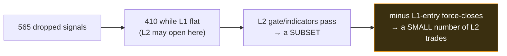
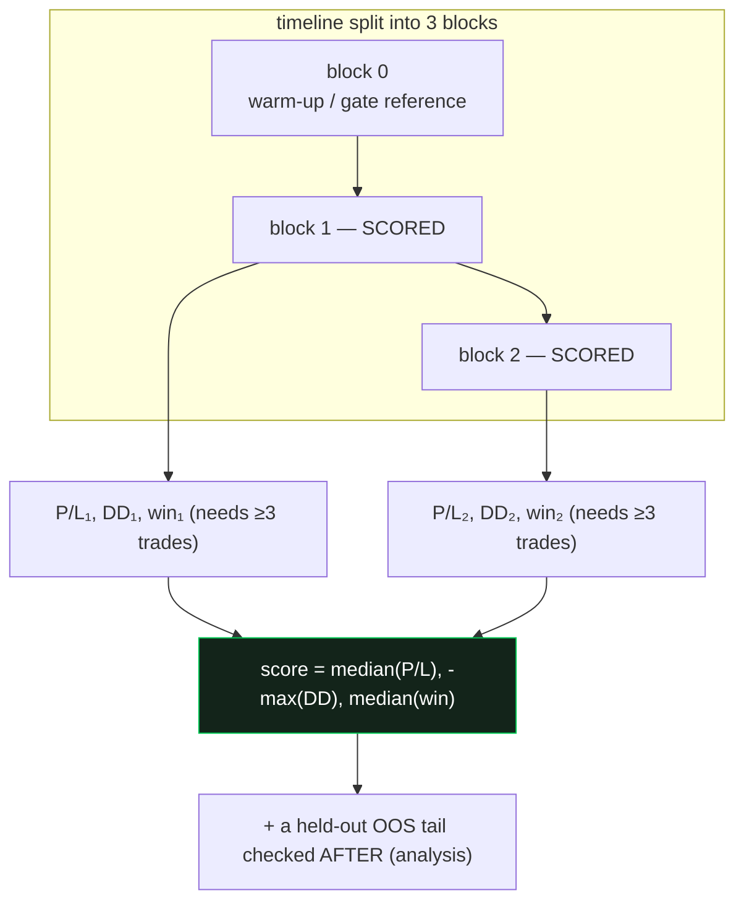
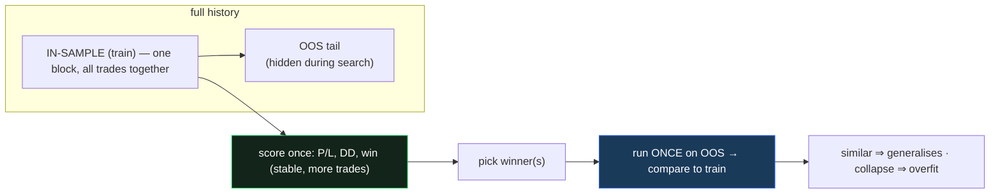

# L2 optimizer validation — walk-forward folds (option 1) vs full-period + OOS holdout (option 3)

> **Why this doc:** before we optimize the L2 layer, we must decide **how we check that a tuned L2 profile
> is genuinely good and not "overfit"** (memorising noise). Two options are on the table. This explains the
> difference in detail **and** in plain language, with the sparsity problem that makes the choice matter.

---

## 0. The one-sentence difference

- **Option 1 (walk-forward k-fold):** cut the history into **several time blocks**, score the profile in
  **each block separately**, and reward profiles that work **consistently across all blocks**.
- **Option 3 (full-period + OOS holdout):** score the profile **once on the whole training history**, and
  keep **one untouched slice at the end** to test the winner **after** optimizing.

The crux: **option 1 checks "does it work in every period?" *during* the search; option 3 checks "does it
still work on unseen data?" *once, at the very end*.**

---

## 1. Baby language — the exam analogy 🎓

You're studying for a test, and you want to know if you **actually learned the subject** or just
**memorised the answers** to specific questions.

- **Option 1 = practice on 3 different past exam papers.** You must score OK on *paper 1*, *paper 2*, and
  *paper 3*. If you only ace one and bomb the others, you didn't really learn — you got lucky on one paper.
  This catches "lucky memorisation" **while you study**. Downside: each practice paper only has a **few
  questions** (our data is small), so your score on each is **noisy** — one unlucky question swings it a lot.

- **Option 3 = study everything as one big pile, then sit ONE final mock exam you've never seen.** You get
  a single, **stable** study score (lots of questions together), and the real test of "did you learn?" is
  the **one fresh mock at the end**. Downside: while studying you **don't know** if you're consistent —
  you only find out at the very end whether it generalises.

**Trade-off in one line:** option 1 = *more checks, each shaky* (because each block is tiny); option 3 =
*one solid study score + one honest final test* (but no consistency check during studying).

---

## 2. Why this is hard for L2 specifically — sparsity

L2 only ever acts on the signals **L1 dropped** (veto + vol-gate). On the 4h champion that is:

- **492** dropped signals total, of which **410** happen while L1 is flat (the bars L2 may open on).
- L2 then takes only a **subset** of those 410 (its own gate/indicators must also pass), and some get
  **force-closed** when L1 enters → the actual L2 **trade count is small** (tens, not hundreds).

This small sample is the whole reason the choice matters (a normal strategy with thousands of trades
wouldn't care):

---

## 3. Option 1 — walk-forward k-fold (k=3, min_trades=3), in detail

**Mechanics (how the codebase does it — `optimize/folds.py`):**
1. The decision timeline is split into **k=3 consecutive, equal-time blocks** ("folds").
2. The **first block is a warm-up / reference** (used to freeze the volatility-gate threshold causally — no
   look-ahead), and the **later blocks are scored**.
3. For **each scored block**, L2 runs **only on that block's bars** and produces that block's P/L, drawdown,
   and win-rate.
4. **`min_trades=3`:** if any scored block has **fewer than 3 L2 trades**, the whole trial is declared
   **invalid and thrown away** (pruned) — we refuse to "trust" a block decided by 1–2 trades.
5. The trial's score = **median P/L across blocks**, **worst (largest) drawdown across blocks**, median
   win-rate. Median + worst = **rewards consistency, punishes one-lucky-window profiles**.

**Pros**
- Checks the profile in **multiple independent time windows during the search** → catches "only worked in
  one regime" overfitting **early**.
- Median/worst aggregation is **conservative** — a profile must be **broadly** good, not spiky.

**Cons (made worse by L2 sparsity)**
- Slicing ~410 candidates into 3 blocks → ~**135 candidates per block**, and L2 takes a subset → often
  **very few trades per block**. Many trials fail `min_trades=3` and get **pruned** → the search can return
  a **thin or empty** set of feasible profiles.
- Each block's numbers are **noisy** (few trades) → the "consistency" signal itself is shaky.
- We lowered `min_trades` from L1's 5 to **3** *because* of this — a compromise that admits noisier blocks.

---

## 4. Option 3 — full-period in-sample + single OOS holdout, in detail

**Mechanics:**
1. Reserve a slice at the **end** of history as **out-of-sample (OOS)** — the optimizer **never sees it**.
2. Optimize on **all the remaining (earlier) data as ONE block** → one P/L, one drawdown, one win-rate per
   trial. Because nothing is sliced, **all the in-sample L2 trades count together** → a **more stable**
   estimate and **far fewer pruned trials**.
3. After optimizing, take the winning profile(s) and run them **once on the untouched OOS slice**. Compare
   **train vs OOS**: similar → likely generalises; OOS collapses → it was **overfit**.

**Pros**
- **Uses the scarce data efficiently** — one big in-sample block = **more L2 trades per estimate** = a
  **stabler** score and **few trials pruned**. Well-suited to L2's small sample.
- The **OOS holdout is the honest generalisation test** and is exactly what the L2 spec's overfit policy
  asks for ("compare train vs held-out OOS in the analysis stage").
- Simpler, faster (one backtest per trial instead of k).

**Cons**
- **No within-training consistency check** — a profile that made all its money in *one lucky stretch* of
  the in-sample block can still score well; you only find out it's fragile **at the very end** (OOS), not
  during the search.
- The verdict rides on **one** OOS slice — if that tail happens to be an unusual regime, the
  generalisation read can mislead (one exam, one bad day).

---

## 5. Head-to-head

| | **Option 1 — walk-forward k=3** | **Option 3 — full-period + OOS** |
|---|---|---|
| In-sample estimates | 2 scored blocks (median/worst) | 1 block (all trades together) |
| Trades per estimate (sparse L2) | **few** → noisy, many trials pruned | **more** → stabler, few pruned |
| Catches regime-fragility *during* search | **yes** | no (only at the end) |
| Generalisation test | OOS tail, after | OOS tail, after (the main test) |
| Backtests per trial | k (slower) | 1 (faster) |
| Fit for a **small** dataset | weaker (slicing hurts) | **stronger** |
| Matches L1's method | yes (familiar) | no (new shape) |
| Overfit-policy match (spec §6/§7) | partial+ | **direct** (train-vs-OOS) |

---

## 6. Recommendation (you decide)

For the **first** L2 run, **Option 3 (full-period + OOS holdout)** is the safer fit, for three reasons:
1. **Sparsity:** L2's trade count is small; slicing into folds makes each estimate noisy and prunes most
   trials. One in-sample block keeps the most trades together → a usable search.
2. **Spec alignment:** the L2 design already says overfitting is judged by **comparing train vs a held-out
   OOS slice in the analysis stage** (not penalised during the search). Option 3 *is* that, literally.
3. **Speed:** 1 backtest/trial vs k → the heavy server run finishes sooner.

The price is no within-training consistency check — we accept that for round 1 and lean on the OOS slice
(and we can move to walk-forward later once we know L2 trades frequently enough to fill folds).

**Option 1** becomes the better choice **if** a quick count shows L2 takes *enough* trades that 3 folds
each clear a sensible `min_trades` — then the extra robustness is worth it. We can measure that count first
(it's cheap) and let the number decide.

> Either way the build is the same module; only the scoring wrapper differs. Once you pick, I'll plan + build
> `optimize/l2/optimize.py` accordingly, smoke-test locally, and gate the heavy `l2v1` server run on your go.
