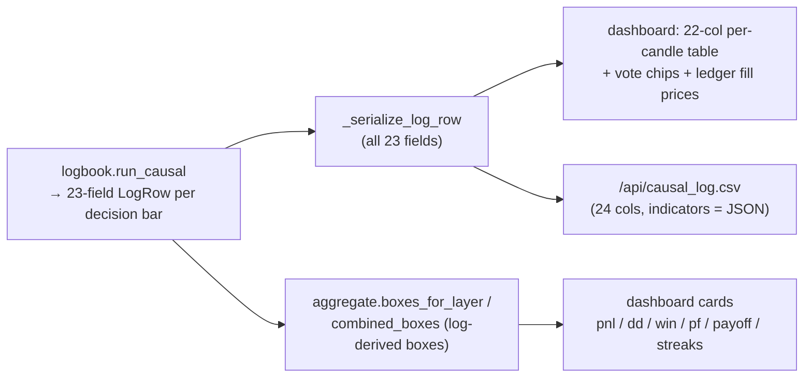

# Causal log — full field reference + verbose-logs / output-audit report

**Date:** 2026-06-23 · **Spec:** `docs/superpowers/specs/2026-06-23-verbose-causal-logs-and-output-audit-design.md`
· **Plan:** `docs/superpowers/plans/2026-06-23-verbose-causal-logs-and-output-audit.md`

The per-candle causal log (`logbook.run_causal` → one `LogRow` per **decision bar**) is the single
source of truth: the dashboard boxes, the per-candle table, the trade ledger, and the CSV download all
project from it. This work made the log **fully verbose** — every field populated, serialized, shown,
and exported — and audited that **every displayed box derives from the log**.

## Flow



## The 23 LogRow fields

All are now populated by `run_causal` (previously 4 were schema-only). Source: `optimize/l2/logbook.py`.

| field | type | meaning | populated |
|---|---|---|---|
| `i` | int | decision-bar index | always |
| `time` | int | epoch seconds | always |
| `layer` | str\|None | L1 \| L2 \| None | always |
| `decision` | str | entry \| nonentry | always |
| `reason` | str | entered \| box_silence \| vol_gated \| vetoed \| confirm<K \| open_trade \| force_closed \| breaker_locked/unlocked \| warmup/warmed | always |
| `box_cause` | str\|None | underlying L1 box/gate/veto/confirm cause (kept while in-position) | always |
| `event_type` | str\|None | ENTRY \| WIN \| LOSS \| LOCK \| UNLOCK \| SKIP \| NOENTRY \| WARMUP \| WARMED | always |
| `direction` | str\|None | entered direction (long/short) | entries |
| `box_dir` | str\|None | box signal direction from the prior bar | always |
| `entry_price` | float\|None | fill entry price | entries |
| `exit_time` | int\|None | epoch of exit | entries |
| `exit_price` | float\|None | fill exit price | entries |
| `exit_reason` | str\|None | why the trade exited | entries |
| `pnl` | float | realized P/L $ (on entry rows) | entries |
| `equity` | float | per-layer cumulative equity | entries |
| `dd` | float | per-layer underwater drawdown | entries |
| `in_position` | bool | layer holding on this bar | always |
| `position_owner` | str\|None | L1 \| L2 \| None | always |
| `l2_reason` | str\|None | L2's own decision on bars it evaluated | L2-eval bars |
| **`text`** | str | human-readable one-line summary | **now (was deferred)** |
| **`veto_flip`** | bool | entered direction reversed vs the box signal | **now (was deferred)** |
| **`indicators`** | list | per-bar `[{key, vote, active}]`, vote ∈ confirm/veto/neutral (relative to the box; same convention as the rich L1 view) | **now (was deferred)** |
| **`would_be_pnl`** | float\|None | candidate's would-be P/L on breaker-SKIP rows | **now (was deferred)** |

**Source of the new four:** `indicators` & `would_be_pnl` come from `L1Result.votes_by_bar` /
`L1Result.skipped_would_be` (added in `l1_runner.py`, computed from data the engine already produced —
no behaviour change); `text` & `veto_flip` are derived in `run_causal`.

## CSV export (`/api/causal_log.csv` and `aggregate.log_to_csv`)

24 columns (the 23 fields + a derived `datetime`), `indicators` JSON-encoded:

```
i, time, datetime, layer, decision, reason, box_cause, event_type, direction, box_dir,
veto_flip, entry_price, exit_time, exit_price, exit_reason, would_be_pnl, pnl, equity, dd,
in_position, position_owner, l2_reason, text, indicators(JSON)
```

The live download keeps its provenance `#`-comment header (view / params / tf / timestamp /
equity caveat). `pandas.read_csv(comment='#')` skips it.

## Dashboard

- **Per-candle log table:** all 22 columns (every field; `indicators` as confirm/veto/neutral chips),
  in a horizontally-scrolling `.tablewrap`.
- **Trade ledger:** gained `entry $` / `exit $` (fill prices).
- Verified live (Playwright): 22 columns, ~6,357 vote chips rendered, no console errors.

## Diff vs the last tag (`approved-4h-indicators-backtester`, 2026-06-09)

The tag **predates the entire causal-log architecture**: at that commit only the standalone
`frontend/index.html` L1 dashboard existed (with an event log + per-entry indicator chips), and there
was **no per-candle causal log, no `optimize/l2/` stack, and no causal CSV**. So nothing the tag
exposed was *dropped* — the current 23-field per-candle log is a strict **superset successor**:

- The tag's per-entry indicator vote chips → now present **per candle** in the log (`indicators`).
- The tag's event types (ENTRY/WIN/LOSS/LOCK/…) → preserved as `event_type` on every row.
- **Added since the tag:** the full per-bar causal taxonomy (`reason`/`box_cause`/`l2_reason`),
  per-layer `equity`/`dd`, `in_position`/`position_owner`, fill prices, `would_be_pnl`, `veto_flip`,
  `text`, and the L1/L2/combined log-derived boxes.

## Output-calculation audit conclusion

- The **live dashboard is 100% log-first**: every box (`pnl`, `pnl_2025/2026`, `max_dd`, `win`, `pf`,
  `payoff`, `exposure`, `n_taken`, streak/total boxes) comes from `aggregate.boxes_for_layer` /
  `combined_boxes` / `_financials` over the log, locked by `test_parity_anchor` + `test_aggregate` +
  the golden gate.
- **No live box was miscalculated** → no value changed → no parity/golden re-lock was needed
  (`perf/check_golden.py` ✅ ALL MATCH throughout; 67 L2 tests green).
- The only engine-derived code was **two dead endpoints** (zero frontend refs): `/api/combined_backtest`
  (`build_combined_payload`) and `/api/l2_backtest` (`build_l2_payload`). Both were **retired** (routes +
  functions + `_l1_full_summary`/`_serialize_trade` + their tests). `metrics.score`/`metrics.combined`
  are kept as test oracles. End state: the only backtest path is the log-first one — an engine-derived
  box cannot resurface. (`/api/l2_config` is a config route, left as-is.)

## TIME_CAP exit (2026-06-23)

A new exit reason `TIME_CAP` was added: a per-layer `cap_1min` setting (default `0` = off) force-closes
an open trade at the Nth 1-minute bar's close if no SL/TP/soft-SL fired. Precedence is lowest
(hard-SL > hard-TP > soft-SL > TIME_CAP). It's modeled as a 4th exit candidate in both engines
(`engine.py` walk + `fast_engine.py`), threaded through the L1/L2 layer params, exposed as a
"Max hold (traded 1-min bars)" dashboard field, and surfaces in this log/CSV automatically. Spec/plan:
`docs/superpowers/{specs,plans}/2026-06-23-max-1min-open-trade-streak-cap*`.

**Semantics — `cap_1min` counts TRADED 1-min bars, not wall-clock minutes.** The cap fires at the Nth
1-minute bar *present in the data* from entry (bar 1 = the first bar at/after the fill). NQ futures are
closed overnight and over weekends, so those windows contain **no** 1-min bars. A trade entered before a
gap therefore still holds exactly N bars, but its calendar span can be several days — e.g. with
`cap_1min=240`, a Friday-afternoon entry exits ~Sunday evening (240 traded bars straddle the weekend),
not 4 wall-clock hours later. Gap-free trades hold a clean N minutes (e.g. 240 → 3h59m, since bar 1 is
index 0). This is intended and confirmed behaviour (`fast_engine` slices `m_close[e:]` by array index;
`engine.py` increments `bars_held` per traded bar) — the field label and tooltip say "traded 1-min bars"
to make the unit explicit.

## END_OF_DAY exit cap (2026-06-25)

A second exit-cap mode sits alongside the 1-min bar cap, selected per layer by `cap_mode` ∈
`none | bars | eod` (default `none`; a bare `cap_1min>0` normalises to `bars`). In `eod` mode an open
trade is force-closed at the end of its **trading day** — the 18:00→17:00 session (box-date rule), NOT
the calendar day. **Full days** (session ends 16:59) exit `eod_margin_min` minutes before the 17:00
close (default 15 → the 16:45 bar). **Partial / early-close days** (12:59, 13:14, 09:xx) exit at the
session's last bar. Abnormal/truncated sessions get no EOD (trade runs to data end → OPEN, dropped).
There is no 17:00 bar, so the rule is "last bar with time ≤ cutoff", never an exact-time match.

Computed in `optimize/trading_days.py` (`eod_targets(m_dates, margin_min) → (eod_target, session_last)`,
locked by `optimize/test_trading_days.py` to 342 full / 14 partial / 1 abnormal). Modeled as a 5th exit
candidate in both engines (lowest priority: hard-SL > hard-TP > soft-SL > cap), threaded through the
same seams as `cap_1min`, parity-locked by `test_fast_parity`. Surfaces as `exit_reason == "END_OF_DAY"`
with taxonomy leaves `end_of_day_exit` + `end_of_day_win`/`end_of_day_loss`, and a "Exit cap mode"
dashboard dropdown. Default-off is byte-identical (golden unchanged).

## Candle taxonomy boxes (2026-06-24)

A per-node counter set classifies every candle, derived purely from this log (no engine change).
L1 partitions all bars (except bar 0) by `box_cause`:
`no_box_signal(box_silence) | gate_rejected(vol_gated) | indicator_veto(vetoed) |
indicator_no_confirm(confirm<K) | passed_all_gates(would_enter)`. The `passed_all_gates` bucket
splits into `entered` (a trade), `passed_skipped` (`reason==breaker_locked`), and
`passed_in_position` (a qualified signal while a trade was already open). `entered` trades split by
`exit_reason` (tp/sl-soft/sl-hard/time-cap), and TIME_CAP splits win/loss. L2 mirrors this from its
own `l2_reason` over the L1 drops it was forwarded (`vetoed∪vol_gated`, L1-flat), adding the
`l1_entry_exit` force-close leaf and a `forwarded_but_l1_in_position` reconciliation box. Each box
carries a count; trading leaves also carry summed $ (realized; `passed_skipped` uses `would_be_pnl`).
Computed in `optimize/l2/taxonomy.py`, surfaced at `meta.taxonomy`, rendered as the
"📊 Candle taxonomy" dashboard group. Invariants locked in `optimize/l2/test_taxonomy.py`
(partition sums, `entered==n_taken`, exit/win-loss partitions, L2 universe reconcile, additive combined).

## Follow-up — shareable bundles

`cap_1min`/`TIME_CAP` also needs the same port into the bundles (see below).


`shareable/server_agent_kit/` and `shareable/two_layer_causal_backtester/` carry their own copies of
`logbook.py` / `aggregate.py` / `payload.py` / `dashboard.html`. They still have the pre-verbose log
surface and the (now-retired) engine-derived paths. Porting this verbose-logs + audit work into the
bundles is a deliberate follow-up — kept out of this change to keep the main-repo diff reviewable.
