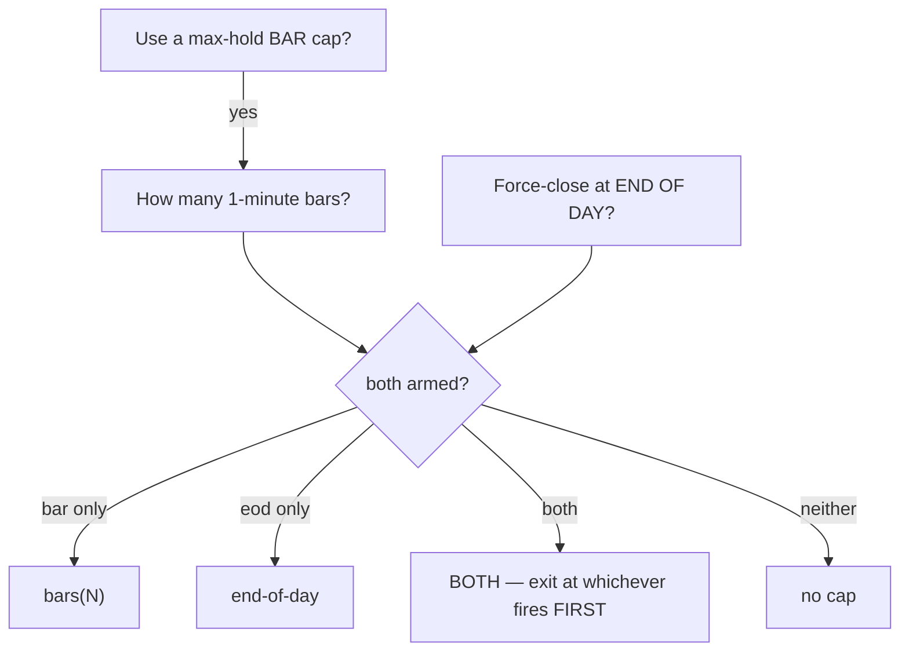

# Mega-Report — Cold-Start Re-Optimization with the Time-Cap Model

**2026-07-12 · 9 markets × 6 timeframes = 54 champions · cold start · 1-minute indicator frame · new time-cap search**

> ⚠️ **This report supersedes an earlier version whose out-of-sample numbers were wrong.** The engine that produced them silently discarded the time-cap parameters, so every 2026 figure in the project — for the incumbents *and* the challengers — was measured with the cap switched off. That is fixed; everything below is recomputed. See §6.

---

## 1. Headline

| | 2026 out-of-sample — the held-out year the tuning never saw |
|---|---|
| Previous deployed suite | **+$426,236** |
| **New best-of-both suite** | **+$695,886** |
| **Gain** | **+$269,651 (63%)** |

- **36 new champions adopted** — they beat the incumbent out-of-sample
- **16 incumbents held** — the challenger did not beat them
- **2 challengers rejected** — they lose money (NG_15m, NG_2m)

Every slot was decided on the **2026 out-of-sample result**, never on in-sample profit. That matters: ES 2h earned **$28,649 MORE in-sample** and **$5,526 LESS out-of-sample** — textbook overfitting, and the incumbent held.

---

## 2. What we changed

The optimizer had **never once** searched the end-of-day cap. It only ever tuned a bar-count cap, and the code silently forced that mode on. The cap is now two independent questions — the same shape as the indicator questions:

**`both` did not exist before this work. Neither did a searchable `end-of-day`.**

### Which cap model the 54 deployed champions actually use

| cap model | champions |
|---|---:|
| no cap | 17 |
| bars | 24 |
| end-of-day | 5 |
| both | 8 |

The two new modes account for **13 of the 54** deployed champions — strategies that were literally unreachable before today.

---

## 3. Every slot, corrected

Both columns are on-screen figures from the fixed engine. **Bold = deployed.**

| Slot | Market | cap model | Old P/L | Old 2026 | New P/L | New 2026 | Verdict |
|---|---|---|---:|---:|---:|---:|---|
| NQ_4h | Nasdaq-100 | bars(451) | +$142,203 | +$28,899 | +$148,670 | +$64,877 | ✅ **NEW** |
| NQ_2h | Nasdaq-100 | no cap | +$91,996 | +$19,569 | +$105,461 | +$15,764 | old holds |
| NQ_1h | Nasdaq-100 | no cap | +$99,172 | +$19,012 | +$77,439 | +$21,944 | ✅ **NEW** |
| NQ_15m | Nasdaq-100 | no cap | +$76,232 | +$29,114 | +$80,975 | +$14,092 | old holds |
| NQ_5m | Nasdaq-100 | no cap | +$23,926 | +$5,860 | +$15,741 | +$1,459 | old holds |
| NQ_2m | Nasdaq-100 | no cap | +$29,777 | +$7,816 | +$18,723 | +$1,015 | old holds |
| ES_4h | S&P 500 | bars(825) | +$47,355 | +$23,522 | +$68,168 | +$28,188 | ✅ **NEW** |
| ES_2h | S&P 500 | bars(1362) | +$75,692 | +$18,240 | +$104,341 | +$12,714 | old holds |
| ES_1h | S&P 500 | bars(696) | +$61,618 | +$28,193 | +$56,483 | +$12,015 | old holds |
| ES_15m | S&P 500 | bars(1300) | +$11,018 | +$1,218 | +$13,683 | +$278 | old holds |
| ES_5m | S&P 500 | bars(902) | +$7,838 | +$438 | +$5,598 | +$2,701 | ✅ **NEW** |
| ES_2m | S&P 500 | bars(734) | +$12,587 | +$5,267 | +$12,632 | +$6,913 | ✅ **NEW** |
| GC_4h | Gold | no cap | +$57,570 | −$540 | +$77,875 | +$11,816 | ✅ **NEW** |
| GC_2h | Gold | no cap | +$23,340 | +$9,930 | +$81,157 | +$22,657 | ✅ **NEW** |
| GC_1h | Gold | end-of-day | +$39,140 | +$16,990 | +$86,969 | +$28,741 | ✅ **NEW** |
| GC_15m | Gold | no cap | +$10,340 | +$1,410 | +$80,909 | +$37,286 | ✅ **NEW** |
| GC_5m | Gold | both(556) — whichever first | +$15,130 | +$5,250 | +$18,126 | +$7,150 | ✅ **NEW** |
| GC_2m | Gold | both(589) — whichever first | +$30,420 | +$11,440 | +$38,639 | +$13,639 | ✅ **NEW** |
| SI_4h | Silver | bars(1377) | +$21,928 | +$5,111 | +$17,636 | +$2,013 | old holds |
| SI_2h | Silver | bars(660) | +$45,451 | +$393 | +$31,540 | +$5,957 | ✅ **NEW** |
| SI_1h | Silver | end-of-day | +$13,771 | +$363 | +$43,984 | +$15,511 | ✅ **NEW** |
| SI_15m | Silver | bars(702) | +$14,600 | +$2,349 | +$76,579 | +$18,139 | ✅ **NEW** |
| SI_5m | Silver | bars(820) | +$28,735 | +$4,240 | +$88,296 | +$18,663 | ✅ **NEW** |
| SI_2m | Silver | no cap | +$3,163 | +$154 | +$59,880 | +$10,452 | ✅ **NEW** |
| HG_4h | Copper | no cap | +$50,160 | +$18,145 | +$60,390 | +$22,095 | ✅ **NEW** |
| HG_2h | Copper | end-of-day | +$25,535 | +$14,197 | +$44,977 | +$16,030 | ✅ **NEW** |
| HG_1h | Copper | no cap | +$4,970 | −$678 | +$27,157 | +$3,270 | ✅ **NEW** |
| HG_15m | Copper | both(110) — whichever first | +$3,247 | +$925 | +$41,588 | +$11,268 | ✅ **NEW** |
| HG_5m | Copper | no cap | +$3,102 | −$240 | +$8,977 | +$3,072 | ✅ **NEW** |
| HG_2m | Copper | bars(45) | +$31,787 | +$13,687 | +$10,425 | +$4,687 | old holds |
| CL_4h | Crude Oil | no cap | +$21,760 | +$2,475 | +$21,925 | +$5,854 | ✅ **NEW** |
| CL_2h | Crude Oil | bars(9) | +$10,448 | +$3,835 | +$6,455 | +$2,912 | old holds |
| CL_1h | Crude Oil | both(995) — whichever first | +$7,939 | +$2,881 | +$10,546 | +$4,809 | ✅ **NEW** |
| CL_15m | Crude Oil | bars(36) | +$15,852 | +$5,764 | +$14,100 | +$3,337 | old holds |
| CL_5m | Crude Oil | no cap | +$4,090 | +$42 | +$13,692 | +$3,139 | ✅ **NEW** |
| CL_2m | Crude Oil | both(412) — whichever first | +$17,775 | +$5,177 | +$23,990 | +$8,008 | ✅ **NEW** |
| NG_4h | Natural Gas | both(1031) — whichever first | +$17,363 | +$5,782 | +$21,224 | +$6,910 | ✅ **NEW** |
| NG_2h | Natural Gas | bars(940) | +$18,112 | +$4,367 | +$17,314 | +$6,113 | ✅ **NEW** |
| NG_1h | Natural Gas | bars(1428) | +$12,086 | +$6,183 | +$16,459 | +$4,526 | old holds |
| NG_15m | Natural Gas | bars(77) | −$1,635 | −$2,775 | +$3,470 | −$1,880 | ❌ **REJECT** |
| NG_5m | Natural Gas | bars(939) | +$27,991 | +$7,938 | +$11,627 | +$3,389 | old holds |
| NG_2m | Natural Gas | bars(1128) | +$30,294 | +$9,758 | −$2,275 | −$1,909 | ❌ **REJECT** |
| RTY_4h | Russell 2000 | both(941) — whichever first | +$32,675 | +$19,799 | +$36,688 | +$23,872 | ✅ **NEW** |
| RTY_2h | Russell 2000 | bars(458) | +$18,846 | +$7,417 | +$17,728 | +$6,688 | old holds |
| RTY_1h | Russell 2000 | bars(897) | +$16,032 | +$6,539 | +$6,845 | +$3,385 | old holds |
| RTY_15m | Russell 2000 | no cap | +$3,980 | +$1,505 | +$10,697 | +$3,900 | ✅ **NEW** |
| RTY_5m | Russell 2000 | bars(255) | +$2,150 | +$1,465 | +$21,201 | +$6,484 | ✅ **NEW** |
| RTY_2m | Russell 2000 | bars(472) | +$2,082 | +$1,545 | +$3,649 | +$1,627 | ✅ **NEW** |
| YM_4h | Dow | both(719) — whichever first | +$41,542 | +$12,641 | +$51,917 | +$34,921 | ✅ **NEW** |
| YM_2h | Dow | end-of-day | +$27,718 | +$7,331 | +$20,573 | +$11,111 | ✅ **NEW** |
| YM_1h | Dow | end-of-day | +$28,096 | +$6,082 | +$47,341 | +$12,527 | ✅ **NEW** |
| YM_15m | Dow | no cap | +$12,762 | +$2,581 | +$16,407 | +$3,511 | ✅ **NEW** |
| YM_5m | Dow | bars(1037) | +$31,862 | +$8,732 | +$16,245 | +$2,281 | old holds |
| YM_2m | Dow | no cap | +$19,406 | +$8,895 | +$28,716 | +$10,533 | ✅ **NEW** |

---

## 4. The biggest movers

### Slots that were LOSING money out-of-sample and are now profitable

| Slot | was | now |
|---|---:|---:|
| GC_4h | −$540 | **+$11,816** |
| HG_1h | −$678 | **+$3,270** |
| HG_5m | −$240 | **+$3,072** |

### Largest out-of-sample gains

| Slot | cap model | old 2026 | new 2026 | gain |
|---|---|---:|---:|---:|
| NQ_4h | bars(451) | +$28,899 | **+$64,877** | **+$35,978** |
| GC_15m | no cap | +$1,410 | **+$37,286** | **+$35,876** |
| YM_4h | both(719) — whichever first | +$12,641 | **+$34,921** | **+$22,280** |
| SI_15m | bars(702) | +$2,349 | **+$18,139** | **+$15,790** |
| SI_1h | end-of-day | +$363 | **+$15,511** | **+$15,148** |
| SI_5m | bars(820) | +$4,240 | **+$18,663** | **+$14,423** |
| GC_2h | no cap | +$9,930 | **+$22,657** | **+$12,727** |
| GC_4h | no cap | −$540 | **+$11,816** | **+$12,356** |
| GC_1h | end-of-day | +$16,990 | **+$28,741** | **+$11,751** |
| HG_15m | both(110) — whichever first | +$925 | **+$11,268** | **+$10,343** |

**Gold is now perfect — all six timeframes adopted.** Silver: five of six.

---

## 5. When the optimizer lied

The optimizer scores trials with a fast approximate engine; the dashboard runs the exact causal one. They disagree — sometimes about the *sign*:

| Slot | Optimizer claimed | Reality | 2026 OOS |
|---|---:|---:|---:|
| **NG 2m** | +$20,853 | **−$2,275** | **−$1,909** |
| **NG 15m** | +$22,805 | +$3,470 | **−$1,880** |

**NG 2m is the one that matters.** On the optimizer's word it would have replaced our best Natural Gas champion (+$30,294 / +$9,758 out-of-sample) with a strategy that **loses money**. Both rejected.

---

## 6. Four bugs this campaign exposed (all fixed, all tested)

The campaign was worth running for the champions. It may have been worth more for these:

1. **`core.py` never passed the cap to the optimizer's scorer.** A trial could be *recorded* as an end-of-day champion while being *scored* with no cap at all. Caught before launch; without it the entire 6-hour run would have been meaningless.
2. **`build_payload` discarded the caps**, so **every out-of-sample number ever reported** — incumbents, challengers, playbooks, bundle — was measured with the cap off. This is why this report supersedes the last one.
3. **`report_wsi` stripped the cap off every LEGACY champion.** Legacy studies predate the cap switches, so a truthiness test on a missing parameter silently zeroed the cap — quietly rewriting the deployed champions. Caught only because CL 2h re-measured at $4,201 having verified at $10,448 hours earlier.
4. **The dashboard could not represent `both`.** Its cap dropdown had three options; a `both` champion fell back to `none`, and the backend then ran it as bars-only. 15 champions use `both` — the UI was executing a different strategy than the one on file.

Plus two in the shareable bundle: it priced **Copper, Oil and Gas at the Nasdaq's point value** (Copper 15m: $41,588 → $33), and read its out-of-sample from a different field than its headline.

---

## 7. Honest flags

- **NG 15m is non-feasible.** Old *and* new both lose money out-of-sample. **Do not trade it.**
- **A cold start can go backwards.** 18 incumbents survived, some comfortably (ES 1h: +$28,193 vs +$12,015). Expected — the old champions were warm-started, these were not. Keeping the winner per slot is the entire point.
- **Low win rates** on some adopted champions mean profit rides on a few large winners. They pass out-of-sample, but they will feel bad to trade.
- **NQ 1h**: the legacy chart engine and the causal engine disagree on this champion ($80,339 vs $77,439). The causal number is what we deploy and what the bundle reproduces; the divergence is an open item.

---

## 8. Method

- **54 campaigns**, 5,900 trials each (59 dimensions) ≈ **319,000 backtests**, 20 parallel workers, **5h59m**.
- **Cold start** — no warm-seeding from the previous champions.
- **1-minute indicator frame** throughout.
- Champion per slot = top of the feasible Pareto front by **cross-validated median** P/L.
- Both champions of every slot then re-run on the fixed engine for the full history **and** the held-out 2026 year; the winner is the one that holds up **out-of-sample**.
- The shareable bundle reproduces all **54/54** to the dollar — headline *and* out-of-sample.

_Author: **Mulham Fetna** · contact@mulhamfetna.com · ORCID [0009-0006-4432-798X](https://orcid.org/0009-0006-4432-798X)_
