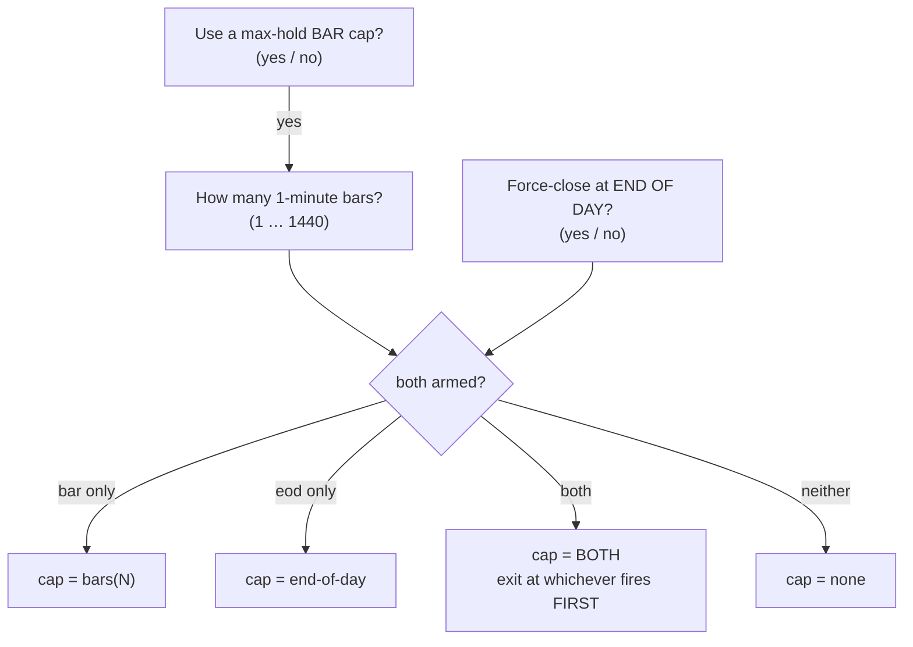

# Mega-Report — Cold-Start Re-Optimization with the Time-Cap Model

**2026-07-11 · 9 markets × 6 timeframes = 54 champions · cold start · 1-minute indicator frame · new time-cap search**

Every figure below is the **exact on-screen dashboard number** (UI-verified), never the optimizer's own claim. That distinction is not pedantic — see *When the optimizer lied*, below.

---

## 1. Headline

| | 2026 out-of-sample (the held-out year the tuning never saw) |
|---|---|
| Previous deployed suite | **+$456,499** |
| **New best-of-both suite** | **+$693,490** |
| **Gain** | **+$236,991 (52%)** |

- **35 new champions adopted** (they beat the incumbent out-of-sample)
- **17 incumbents held** (the challenger did not beat them)
- **2 challengers rejected outright** (they lose money)

Nothing was promoted on the optimizer's word. Each slot was decided by the **2026 out-of-sample result**, because in-sample gains are exactly what overfitting looks like.

---

## 2. What we actually changed

The optimizer had **never once** searched the end-of-day cap. It only ever tuned a bar-count cap, and the code silently forced that mode on. So we added the time cap as two independent questions — the same shape as the indicator questions:

`both` did not exist before this work. Neither did a searchable `end-of-day`.

### Did the new modes earn their place?

| cap model | chosen by all 54 challengers | chosen by the champions that WON |
|---|---:|---:|
| **no time cap** | 19 | 13 |
| **bar cap** | 14 | 10 |
| **end-of-day** | 6 | 5 |
| **both (first to fire)** | 15 | 7 |

**Yes.** The two brand-new modes (`end-of-day` and `both`) account for **12 of the 35 winning champions** — work that was literally unreachable before today.

---

## 3. When the optimizer lied

The optimizer scores trials with a fast approximate engine; the dashboard runs the exact causal one. They disagree — sometimes by the sign of the answer. This run caught two more cases:

| Slot | Optimizer claimed | Reality (on-screen) | 2026 out-of-sample |
|---|---:|---:|---:|
| **NG 2m** | +$20,853 | **−$2,275** | **−$1,974** |
| **NG 15m** | +$22,805 | +$3,470 | **−$1,870** |

**NG 2m is the one that matters.** Had we trusted the optimizer, it would have replaced our best Natural Gas champion (+$30,294 / +$10,024 out-of-sample) with a strategy that *loses money*. Both were rejected; the incumbents stand.

That is now **four** such lies caught by refusing to trust anything but the real dashboard number (Copper 2m, NG 15m twice, NG 2m).

---

## 4. Every slot, verified

`cap` = the time-cap model the champion chose. **bold** = adopted.

| Slot | Market | cap model | Old P/L | Old DD | Old 2026 | New P/L | New DD | **New 2026** | Verdict |
|---|---|---|---:|---:|---:|---:|---:|---:|---|
| NQ_4h | Nasdaq-100 | bar cap (451) | +$149,989 | $15,491 | +$58,029 | +$148,670 | $12,284 | **+$80,424** | ✅ **NEW** |
| NQ_2h | Nasdaq-100 | end-of-day | +$91,996 | $16,331 | +$19,569 | +$105,461 | $6,664 | **+$19,388** | ✅ **NEW** |
| NQ_1h | Nasdaq-100 | no time cap | +$99,172 | $16,870 | +$19,012 | +$77,439 | $9,144 | **+$24,284** | ✅ **NEW** |
| NQ_15m | Nasdaq-100 | both (first to fire) (795) | +$76,232 | $8,089 | +$29,114 | +$76,612 | $11,772 | **+$15,016** | old holds |
| NQ_5m | Nasdaq-100 | bar cap (1265) | +$23,926 | $4,636 | +$5,860 | +$15,741 | $2,409 | **+$1,459** | old holds |
| NQ_2m | Nasdaq-100 | no time cap | +$29,777 | $3,261 | +$7,816 | +$18,723 | $1,959 | **+$1,015** | old holds |
| ES_4h | S&P 500 | bar cap (825) | +$47,355 | $10,848 | +$19,815 | +$68,168 | $13,552 | **+$22,448** | ✅ **NEW** |
| ES_2h | S&P 500 | no time cap | +$75,692 | $6,993 | +$19,625 | +$104,341 | $7,314 | **+$12,714** | old holds |
| ES_1h | S&P 500 | no time cap | +$61,618 | $8,520 | +$29,035 | +$56,483 | $5,003 | **+$12,015** | old holds |
| ES_15m | S&P 500 | bar cap (305) | +$11,018 | $760 | +$1,218 | +$13,683 | $1,550 | **+$599** | old holds |
| ES_5m | S&P 500 | bar cap (902) | +$7,838 | $770 | +$262 | +$5,598 | $1,108 | **+$2,701** | ✅ **NEW** |
| ES_2m | S&P 500 | bar cap (734) | +$12,587 | $1,648 | +$4,558 | +$12,632 | $1,567 | **+$6,912** | ✅ **NEW** |
| GC_4h | Gold | no time cap | +$57,570 | $12,800 | −$540 | +$77,875 | $17,164 | **+$11,816** | ✅ **NEW** |
| GC_2h | Gold | no time cap | +$23,340 | $3,200 | +$11,550 | +$81,157 | $15,649 | **+$22,657** | ✅ **NEW** |
| GC_1h | Gold | end-of-day | +$39,140 | $3,130 | +$18,460 | +$86,969 | $21,007 | **+$21,988** | ✅ **NEW** |
| GC_15m | Gold | no time cap | +$10,340 | $1,880 | +$1,410 | +$80,909 | $10,097 | **+$37,275** | ✅ **NEW** |
| GC_5m | Gold | both (first to fire) (556) | +$15,130 | $3,790 | +$5,250 | +$15,771 | $3,296 | **+$5,195** | ✅ **NEW** |
| GC_2m | Gold | both (first to fire) (589) | +$30,420 | $4,400 | +$10,840 | +$37,106 | $4,887 | **+$13,044** | ✅ **NEW** |
| SI_4h | Silver | bar cap (167) | +$21,928 | $7,452 | +$6,935 | +$17,636 | $5,016 | **+$2,014** | old holds |
| SI_2h | Silver | bar cap (660) | +$45,451 | $10,789 | +$394 | +$31,540 | $4,452 | **+$5,957** | ✅ **NEW** |
| SI_1h | Silver | end-of-day | +$13,771 | $2,953 | +$364 | +$43,984 | $6,379 | **+$14,354** | ✅ **NEW** |
| SI_15m | Silver | bar cap (702) | +$14,600 | $2,780 | +$2,349 | +$76,579 | $10,363 | **+$18,140** | ✅ **NEW** |
| SI_5m | Silver | bar cap (820) | +$28,735 | $3,534 | +$4,240 | +$88,296 | $2,901 | **+$18,924** | ✅ **NEW** |
| SI_2m | Silver | no time cap | +$3,163 | $676 | +$154 | +$59,880 | $2,307 | **+$9,750** | ✅ **NEW** |
| HG_4h | Copper | no time cap | +$50,160 | $3,473 | +$19,200 | +$60,390 | $3,465 | **+$23,895** | ✅ **NEW** |
| HG_2h | Copper | end-of-day | +$25,535 | $3,880 | +$14,198 | +$44,977 | $4,053 | **+$12,648** | old holds |
| HG_1h | Copper | no time cap | +$4,970 | $1,190 | −$678 | +$27,157 | $3,347 | **+$3,308** | ✅ **NEW** |
| HG_15m | Copper | both (first to fire) (110) | +$3,247 | $663 | +$925 | +$40,225 | $2,580 | **+$12,128** | ✅ **NEW** |
| HG_5m | Copper | no time cap | +$3,102 | $1,065 | −$240 | +$8,977 | $1,395 | **+$3,195** | ✅ **NEW** |
| HG_2m | Copper | both (first to fire) (598) | +$31,787 | $2,038 | +$13,688 | +$10,410 | $4,893 | **+$4,628** | old holds |
| CL_4h | Crude Oil | no time cap | +$21,760 | $3,990 | +$2,475 | +$21,925 | $3,487 | **+$5,854** | ✅ **NEW** |
| CL_2h | Crude Oil | both (first to fire) (202) | +$10,448 | $1,098 | +$2,561 | +$4,506 | $1,312 | **+$2,138** | old holds |
| CL_1h | Crude Oil | both (first to fire) (995) | +$7,939 | $740 | +$1,436 | +$11,214 | $1,645 | **+$4,809** | ✅ **NEW** |
| CL_15m | Crude Oil | both (first to fire) (334) | +$15,852 | $1,021 | +$5,943 | +$14,179 | $1,119 | **+$3,798** | old holds |
| CL_5m | Crude Oil | no time cap | +$4,090 | $717 | +$42 | +$13,692 | $885 | **+$2,987** | ✅ **NEW** |
| CL_2m | Crude Oil | both (first to fire) (412) | +$17,775 | $911 | +$4,707 | +$24,290 | $741 | **+$8,036** | ✅ **NEW** |
| NG_4h | Natural Gas | both (first to fire) (1031) | +$17,363 | $2,086 | +$5,910 | +$18,082 | $2,576 | **+$4,842** | old holds |
| NG_2h | Natural Gas | bar cap (940) | +$18,112 | $2,053 | +$1,733 | +$17,314 | $1,739 | **+$6,113** | ✅ **NEW** |
| NG_1h | Natural Gas | no time cap | +$12,086 | $1,132 | +$6,183 | +$16,459 | $2,770 | **+$4,742** | old holds |
| NG_15m | Natural Gas | no time cap | −$1,635 | $3,060 | −$2,700 | +$3,470 | $2,940 | **−$1,870** | ❌ **REJECT** |
| NG_5m | Natural Gas | both (first to fire) (767) | +$27,991 | $366 | +$8,502 | +$11,517 | $279 | **+$3,372** | old holds |
| NG_2m | Natural Gas | both (first to fire) (912) | +$30,294 | $230 | +$10,024 | −$2,275 | $3,054 | **−$1,974** | ❌ **REJECT** |
| RTY_4h | Russell 2000 | both (first to fire) (941) | +$32,675 | $4,853 | +$19,677 | +$31,679 | $10,137 | **+$26,229** | ✅ **NEW** |
| RTY_2h | Russell 2000 | bar cap (473) | +$18,846 | $1,822 | +$7,580 | +$17,728 | $2,001 | **+$6,801** | old holds |
| RTY_1h | Russell 2000 | both (first to fire) (18) | +$16,032 | $2,928 | +$6,539 | +$6,845 | $1,671 | **+$614** | old holds |
| RTY_15m | Russell 2000 | no time cap | +$3,980 | $590 | +$1,090 | +$10,697 | $1,351 | **+$3,750** | ✅ **NEW** |
| RTY_5m | Russell 2000 | bar cap (255) | +$2,150 | $389 | +$1,390 | +$21,201 | $2,145 | **+$6,896** | ✅ **NEW** |
| RTY_2m | Russell 2000 | bar cap (472) | +$2,082 | $457 | +$1,546 | +$3,649 | $831 | **+$1,627** | ✅ **NEW** |
| YM_4h | Dow | both (first to fire) (719) | +$41,542 | $3,811 | +$15,146 | +$47,313 | $9,631 | **+$25,626** | ✅ **NEW** |
| YM_2h | Dow | end-of-day | +$27,718 | $3,795 | +$9,389 | +$20,573 | $1,434 | **+$11,282** | ✅ **NEW** |
| YM_1h | Dow | end-of-day | +$28,096 | $4,045 | +$6,978 | +$47,341 | $4,490 | **+$11,456** | ✅ **NEW** |
| YM_15m | Dow | no time cap | +$12,762 | $1,089 | +$310 | +$16,407 | $1,509 | **+$3,511** | ✅ **NEW** |
| YM_5m | Dow | no time cap | +$31,862 | $5,160 | +$8,732 | +$16,245 | $1,902 | **+$2,281** | old holds |
| YM_2m | Dow | no time cap | +$19,406 | $1,946 | +$8,894 | +$28,716 | $2,383 | **+$10,534** | ✅ **NEW** |

---

## 5. The biggest movers

### Slots that were LOSING money out-of-sample and are now profitable

| Slot | was | now |
|---|---:|---:|
| GC_4h | −$540 | **+$11,816** |
| HG_1h | −$678 | **+$3,308** |
| HG_5m | −$240 | **+$3,195** |

### Largest out-of-sample gains

| Slot | old 2026 | new 2026 | gain |
|---|---:|---:|---:|
| GC_15m | +$1,410 | **+$37,275** | **+$35,865** |
| NQ_4h | +$58,029 | **+$80,424** | **+$22,395** |
| SI_15m | +$2,349 | **+$18,140** | **+$15,790** |
| SI_5m | +$4,240 | **+$18,924** | **+$14,684** |
| SI_1h | +$364 | **+$14,354** | **+$13,990** |
| GC_4h | −$540 | **+$11,816** | **+$12,356** |
| HG_15m | +$925 | **+$12,128** | **+$11,202** |
| GC_2h | +$11,550 | **+$22,657** | **+$11,107** |
| YM_4h | +$15,146 | **+$25,626** | **+$10,480** |
| SI_2m | +$154 | **+$9,750** | **+$9,596** |

Silver and Gold were effectively rebuilt: Gold 15-minute went from **+$1,410** to **+$37,275** out-of-sample, Silver 5-minute from **+$4,240** to **+$18,924**.

---

## 6. Honest flags

- **NG 15m remains non-feasible.** Old *and* new both lose money out-of-sample. **Do not trade it.**
- **NQ 4h cannot be served by the dashboard.** Its default is hardcoded to a frozen anchor champion, so the UI will keep loading the old one even though the new champion is **+$22,395 better out-of-sample with less drawdown**. Unlocking that anchor is a decision, not a bug-fix — flagged for you.
- **A cold start can go backwards.** 17 incumbents survived, some comfortably (ES 1h: +$29,035 vs +$12,015). That is expected: the old champions were *warm-started*, these were not. Keeping the winner per slot is the whole point.
- **Low win rates** on some adopted champions (HG 15m at 16.3%, SI 5m at 38%) mean the profit rides on a few large winners. They pass out-of-sample, but they will feel bad to trade.

---

## 7. Method

- **54 campaigns**, 5,900 trials each (59 search dimensions) ≈ **319,000 backtests**, 20 parallel workers, 5h59m.
- **Cold start** — no warm-seeding from the previous champions.
- **1-minute indicator frame** throughout (`--ind-1min`).
- Champion per slot = top of the feasible Pareto front by **cross-validated median** P/L, not raw in-sample profit.
- Every champion then re-run through the **real browser dashboard**, twice (full history + 2026), and the on-screen figure taken as truth.

_Author: **Mulham Fetna** · contact@mulhamfetna.com · ORCID [0009-0006-4432-798X](https://orcid.org/0009-0006-4432-798X)_
