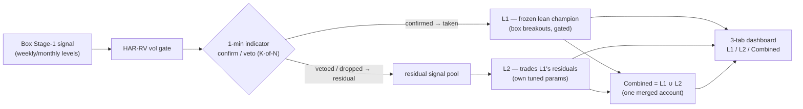
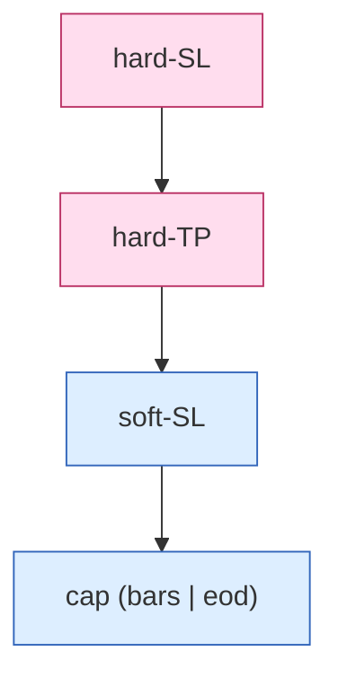
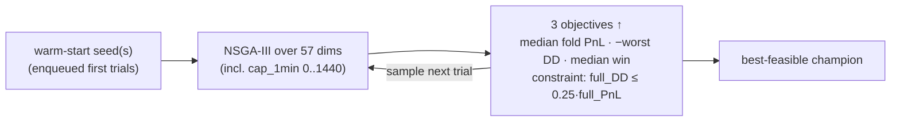
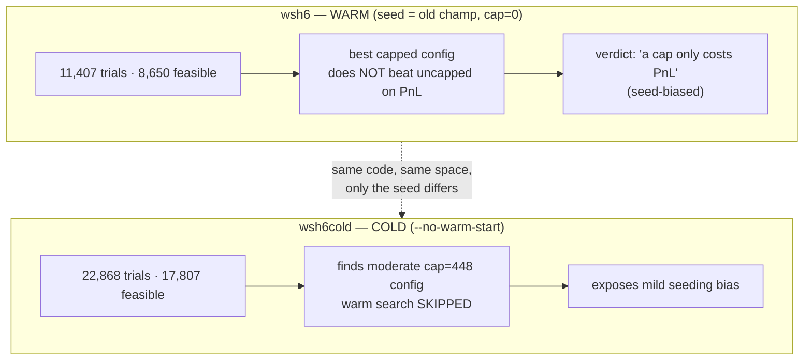
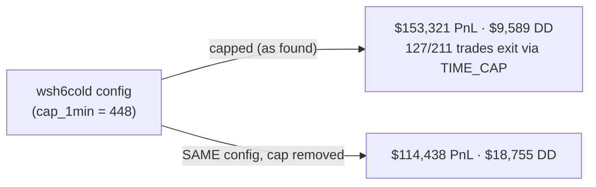
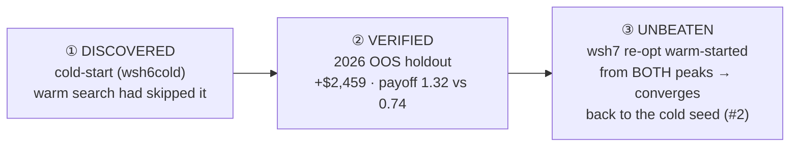
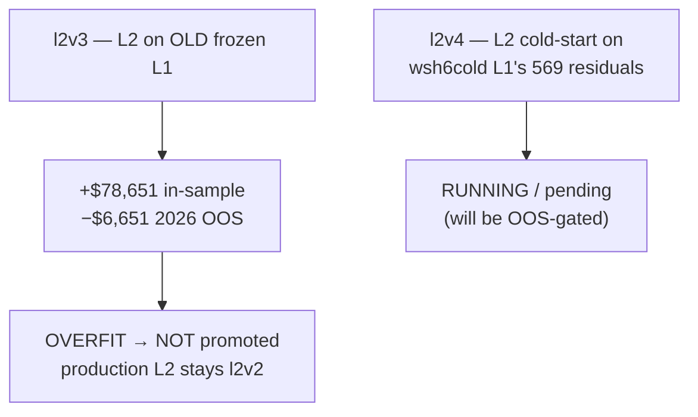
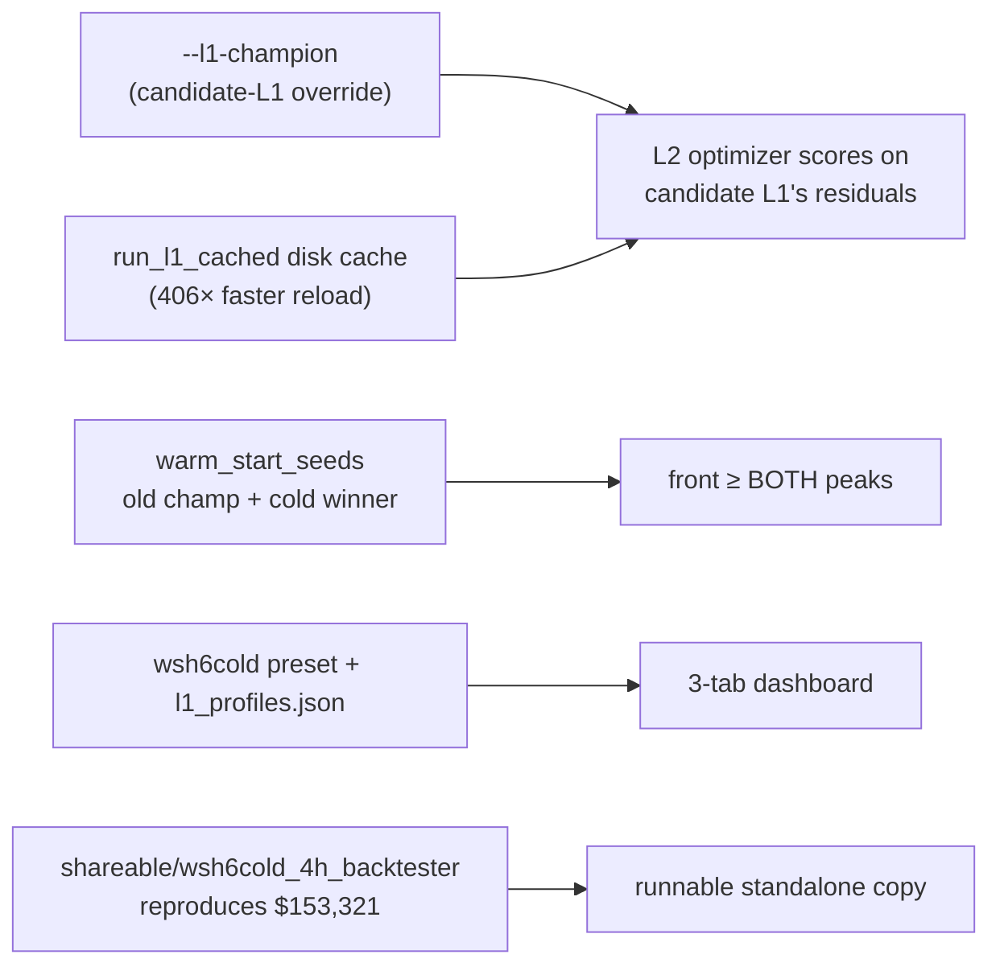

# Milestone — Two Layers + Time-Cap + Cold-Start

**Date:** 2026-06-26 · **Branch/Tag:** `two-layers-time-capped` · **Status:** shipped to `dev` (no
production default swapped; everything additive/side-by-side)

This is the centerpiece narrative for the milestone. It ties together three threads that landed
together:

1. the **two-layer** (L1 / L2 / Combined) architecture and its 3-tab dashboard;
2. the **TIME-CAP** exit feature (`cap_mode ∈ none|bars|eod`) wired through **both** parity-locked
   engines and added as a **searched optimizer dimension**;
3. the **COLD-START DISCOVERY** — the headline finding that a warm-started global search has a mild
   **seeding bias**, which a cold-start control exposed by finding a capped champion (`cap=448`) that the
   warm search skipped — a champion that then **edged the old one out-of-sample** and survived a
   triple-confirmation re-optimization.

> One-breath summary: we taught the optimizer to search hold-time (`cap_1min`), ran it warm and it said
> "a cap only costs PnL"; we did not trust that and ran a **cold-start control**, which found a moderate
> `cap=448` config the warm search had skipped. That config reproduces to the cent (**$153,321 / $9,589
> DD**), **beats the old champion on the 2026 OOS holdout** (+$2,459, payoff **1.32 vs 0.74**), and a
> third re-optimization warm-started from *both* peaks converged right back to it. Lesson: **warm-start is
> a floor, not a freeze — always run a cold-start control and an OOS check before trusting a champion.**

---

## 1. The two-layer architecture (recap)

The system runs as **one merged account** computed by a single causal pass, but is reported as three
views:

- **L1** — the **frozen lean champion**. It trades box (Stage-1) breakouts, gated by the HAR-RV
  volatility filter and a **1-minute indicator confirm/veto** layer (K-of-N). When the 1-min gate vetoes
  a signal (or the vol-gate drops it), that signal is **not** taken by L1 — it becomes a *residual*.
- **L2** — trades **L1's dropped / vetoed residual signals**: the ones L1 left on the table. L2 has its
  own tuned parameter set, found by its own optimizer round, scored **only** on those residuals.
- **Combined** — L1 ∪ L2 on **one** account (merged P/L, merged drawdown).

The whole thing is computed by **one per-candle causal pass** (`optimize/l2/logbook.run_causal`) that is
the single source of truth; every box/chart/CSV is derived from it. The **3-tab dashboard** (L1 / L2 /
Combined) renders those three views from the same pass.

---

## 2. The TIME-CAP feature

A trade can now be force-closed by elapsed hold-time, controlled per layer by `cap_mode`:

| `cap_mode` | meaning |
|---|---|
| `none` | no time cap (legacy behaviour; default) |
| `bars` | exit after `cap_1min` **traded 1-min bars** have elapsed (the count advances only on bars the engine actually trades through) |
| `eod` | **end-of-trading-day** exit. The trading day runs **18→17** (18:00 prior day to 17:00). On **full** trading days the position exits **15 minutes before the close**; on **partial** days it exits at the session close. The `trading_days.py` classifier decides full vs partial. |

### Exit precedence

The time-cap is the **lowest-priority** exit — a hard stop or hard target always wins first:

**hard-SL ▸ hard-TP ▸ soft-SL ▸ cap.** The cap never pre-empts a real stop/target; it only closes a trade
that would otherwise keep riding.

### Both engines, parity-locked

The strategy has **two** implementations that must stay byte-identical:

- `engine.py` — the slow, full-feature engine (per-year bundles, `strategy.build_payload`);
- `optimize/fast_engine.py` — the vectorised fast engine used by the optimizer and the L2 stack.

The time-cap was wired through **both** and kept in lockstep by `optimize/test_fast_parity.py` and the
**golden gate** (`perf/check_golden.py`, **6/6 byte-identical**). The default `cap_mode=none` path is
unchanged, so the production anchors and all golden baselines were untouched.

---

## 3. The optimizer cap_1min search dimension

`cap_1min` was added as a **new searched dimension**: `trial.suggest_int("cap_1min", 0, 1440)` (0 = off,
up to ~1 trading day of 1-min bars; when `cap_1min>0` the engine treats `cap_mode` as `bars`). With it,
the L1 (non-split, 4h) search space is **57 dimensions**.

- **Warm-start seeds** — prior champions are enqueued as the first trials (clamped to bounds), so the new
  champion is **≥ the seed by construction** — a floor guarantee.
- **Trial budget** — `recommended_trials = dims × 100` (the `--auto-trials` plan). With 57 dims the
  proportional plan is ~5,700; this round was run well past that (see §4).

---

## 4. THE COLD-START DISCOVERY (headline)

The subtle, load-bearing insight of this milestone:

> **Warm-start is a *floor*, not a *freeze*.** Enqueuing the champion guarantees the result is **≥** that
> champion, but it does **not** pin any parameter — **all 57 dimensions are re-sampled on every trial**.
> The seed only gives the search a strong starting point; it does not stop the sampler from exploring.

### wsh6 (warm) — "a cap only costs PnL" (under warm search)

The `wsh6` cap search was warm-started from the current champion (`cap=0`):

- **11,407 trials**, **8,650 feasible**.
- Verdict: it found **no capped configuration that beat the uncapped champion on PnL**. Under warm search,
  the conclusion was *"a time-cap only costs PnL."*

That is a tidy, believable, and — as it turned out — **incomplete** answer. The warm search kept getting
pulled toward the neighbourhood of the uncapped seed.

### wsh6cold — the cold-start control

We did not trust a single warm verdict. We ran a **cold-start control** with `--no-warm-start` (no seed
enqueued; the sampler starts from scratch):

- **22,868 trials**, **17,807 feasible**.
- It found a **moderate `cap=448`** configuration that the **warm search had skipped** — directly exposing
  a mild **seeding bias** in the warm run.

---

## 5. The wsh6cold champion + verification

### Results table

| config | full PnL | full DD | 2025 PnL | 2026-OOS PnL | OOS DD | OOS win | OOS payoff |
|---|--:|--:|--:|--:|--:|--:|--:|
| **WARM** / old champ (`cap0`) | $149,989 | $15,491 | $91,960 | $58,029 | $8,141 | 72.5% | 0.74 |
| **COLD** wsh6cold (`cap448`) | **$153,321** | **$9,589** | $90,513 | **$60,488** | $8,280 | 60.6% | **1.32** |

**Reproduced to the cent: $153,321 / $9,589 DD.**

### What the table says

- **OOS edge.** The cold `cap=448` champion **edges the old champion out-of-sample**: **+$2,459** on the
  2026 holdout ($60,488 vs $58,029), **payoff 1.32 vs 0.74**, **profit factor 2.02 vs 1.93**. The OOS
  win-rate is *lower* (60.6% vs 72.5%) but each win is much larger relative to each loss — a healthier
  payoff profile, not a luckier one.
- **Drawdown nuance (important — don't over-read the −38%).** The headline full-window DD drops 38%
  ($9,589 vs $15,491), but that improvement is **mostly in-sample**: the 2025 DDs are $9,589 vs $15,491,
  while the **2026 OOS DDs converge** (~$8,280 vs $8,141, essentially equal). So out-of-sample the new
  champion is **≈ DD-neutral** — the real OOS win is the **healthier payoff profile**, not a smaller
  drawdown.
- **The cap is load-bearing.** **127 of 211** trades exit via `TIME_CAP`. The cap is not cosmetic: the
  **same config with the cap removed** earns only **$114,438** at a **$18,755** DD. Removing the cap
  destroys both the PnL and the DD — the hold-time limit *is* the edge here.

### wsh6cold parameters

| box param | value |
|---|--:|
| `sl_soft` | 123.30 |
| `sl_hard` | 190.45 |
| `tp` | 230.74 |
| `gate_pct` | 97.69 |
| `dd_limit` | 1766.21 |
| `cooldown` | 1 |
| `k` | 3 |
| `flip` | false |
| `cap_1min` | **448** |
| `ind_1min` | true |

**7 indicators enabled:**

| indicator | params |
|---|---|
| `ema_trend` | fast 172, slow 362 |
| `macd` | 95 / 39 / 98 |
| `obv` | slope 128 |
| `cci` | n 139, thr 50 |
| `bollinger` | n 108, k 4.0 |
| `adx` | n 38, thr 17 |
| `cisd` | (enabled) |

---

## 6. wsh7 — TRIPLE-CONFIRMATION

To make sure `cap=448` wasn't a cold-start fluke, we ran a **third** re-optimization (`wsh7`):

- **24,237 trials**, warm-started from **BOTH** peaks — the **old champion** (`cap0`) **AND** the **cold
  cap=448 winner**.
- Its **best-feasible converged back to the cold seed** (it surfaced as **trial #2**); **nothing beat
  it.**

So `cap=448` is now triply attested:

**Discovered by cold-start · verified out-of-sample · unbeaten by re-optimization.**

---

## 7. The L2 angle

The same cap_1min + candidate-L1 machinery drove the second-layer rounds:

- **l2v3** — L2 optimized on the **OLD frozen L1's** residuals. Its champion **overfit**: **+$78,651
  in-sample** collapsing to **−$6,651 on the 2026 OOS holdout**. It was therefore **NOT promoted** —
  production L2 **stays `l2v2`** (the honest, OOS-positive baseline).
- **l2v4** — L2 **cold-start** on the **wsh6cold L1's 569 residual signals** (the residuals of the *new*
  cold champion, not the old L1). It is **RUNNING / pending**, and like everything else will be
  **OOS-gated** before any promotion.

---

## 8. Infrastructure shipped

| item | what it does | commit |
|---|---|---|
| `--l1-champion` CLI flag | score L2 on **any candidate L1's** residuals (not just the frozen production L1) | `617c610` |
| candidate-L1 disk cache | `run_l1_cached` caches a candidate L1 to disk when `params != None` → **406× faster** reload between L2 trials | `c03ed8a` |
| `warm_start_seeds` (both peaks) | now enqueues **both** the old champion **and** the cold `cap=448` winner — the Pareto front is provably **≥ both** peaks | `c831320` |
| wsh6cold side-by-side preset | registered as a dashboard preset **and** as an **L1-tab profile** in `profiles/l1_profiles.json` | `c831320`, `5c5c67f` |
| shareable bundle | `shareable/wsh6cold_4h_backtester` (+ `.zip`) — a verified, runnable copy reproducing **$153,321** | (bundle) |

---

## 9. Methodological takeaway

This milestone is as much a **method** lesson as a result:

- **Dimensions are coupled (non-separable).** `cap_1min` changes *which trades survive*, which changes the
  effective SL/TP/gate/indicator landscape — you cannot tune it independently. That coupling is **exactly
  why** a **joint, global** multi-objective optimizer is used instead of one-factor-at-a-time tuning.
- **Warm-start is a floor guarantee, not a global optimum.** Enqueuing a champion guarantees you do no
  worse than it, but it biases the search toward the seed's neighbourhood. The warm `wsh6` run's
  "a cap only costs PnL" verdict was a **seeding artifact**, not a truth about the strategy.
- **Always run a cold-start control + an OOS check before trusting a champion.** The cold-start control
  (`wsh6cold`) is what found `cap=448`; the 2026 OOS holdout is what proved it was real (and what *killed*
  the overfit `l2v3`). Neither step is optional.

---

## 10. Commit trail

| commit | summary |
|---|---|
| `c831320` | wsh6cold cold-start candidate registered as preset + added as a warm-start seed |
| `617c610` | `--l1-champion` flag — score L2 on a candidate L1's residuals |
| `5c5c67f` | import wsh6cold (`cap=448`) as an L1-tab dashboard profile |
| `c03ed8a` | disk-cache the candidate L1 in `run_l1_cached` (`params != None`) — 406× faster |

---

## 11. Status

| thread | state |
|---|---|
| Time-cap (`none\|bars\|eod`) in both engines | ✅ shipped, golden 6/6, parity-locked |
| `cap_1min` searched dimension (57 dims) | ✅ shipped |
| wsh6 warm cap search (11,407 / 8,650 feasible) | ✅ complete — "cap only costs PnL" (seed-biased) |
| wsh6cold cold-start (22,868 / 17,807 feasible) | ✅ complete — found `cap=448` |
| wsh6cold verification ($153,321 / $9,589, OOS +$2,459) | ✅ reproduced to the cent |
| wsh7 triple-confirmation (24,237 trials) | ✅ converged back to the cold seed; unbeaten |
| Infra: `--l1-champion`, disk cache, seeds, preset/profile, bundle | ✅ shipped |
| l2v3 (L2 on old L1) | ❌ overfit (−$6,651 OOS) → NOT promoted; L2 stays l2v2 |
| l2v4 (L2 cold-start on wsh6cold residuals) | 🟡 RUNNING / pending (OOS-gated) |
| Production default / anchors | unchanged (everything additive) |
