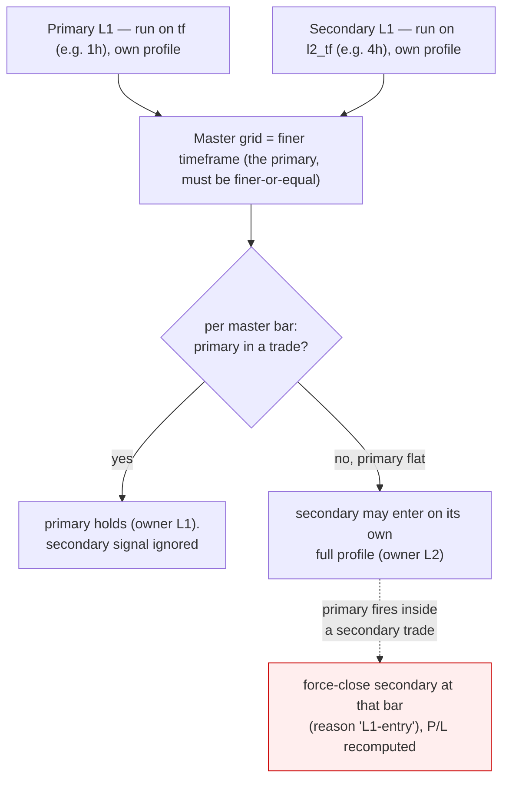

# Multi-timeframe layer fusion (primary + secondary)

> Spec: [`superpowers/specs/2026-06-30-multi-timeframe-layer-fusion-design.md`](superpowers/specs/2026-06-30-multi-timeframe-layer-fusion-design.md) ·
> Plan: [`superpowers/plans/2026-06-30-multi-timeframe-layer-fusion.md`](superpowers/plans/2026-06-30-multi-timeframe-layer-fusion.md)

## What it does

Trade **two timeframes of one instrument at once**, each with its **own profile**. The **primary** (the main
timeframe selector, e.g. 1h) has priority. The **secondary** (a new L2 timeframe, e.g. 4h) runs as a full
independent strategy but is **eligible to enter only while the primary is flat** — it fills the primary's idle
windows. Net effect: "I'm on both 1h and 4h signals; 1h wins, 4h fills the gaps."

This is an **opt-in L2 mode**. The default L2 stays the **residual-manager** (manage L1's dropped signals on
the same frame) and is **byte-identical** to before — the golden 6-TF gate never moves.

## Semantics (single shared position, primary priority)

- One open trade at a time (1 contract), owner ∈ {L1 primary, L2 secondary} — never both at once.
- Secondary enters on its **own** vol-gate / indicator confirm-veto / breaker / flip / cap — only when the
  primary is flat at that master bar.
- A primary entry **strictly inside** a secondary trade **force-closes** the secondary at that bar's close
  (reason `L1-entry`), P/L recomputed honestly. This reuses the engine's existing `l1_priority` oracle.
- **Master grid = the finer of the two timeframes.** The primary must be **finer-or-equal** to the secondary
  (make your higher-frequency layer the primary); a coarser primary is rejected (HTTP 400).

## Surface

| Layer | Where |
|---|---|
| Fusion core | `optimize/l2/mtf.py` — `LayerView`, `master_grid`, `run_dual_tf` (pure, no I/O) |
| Causal log | `optimize/l2/logbook.py` — `run_causal(..., l2_mode="residual"\|"independent", l2_tf=None)` |
| Payload | `optimize/l2/payload.py` — `build_view_payload(..., l2_mode=, l2_tf=)`; memo keyed on `(l2_mode, l2_tf)`; primary-finer guard |
| API | `server.py` `/api/causal_backtest` body: `l2_mode`, `l2_tf` (omit ⇒ residual, byte-identical; bad `l2_tf` ⇒ 400) |
| UI | `frontend/dashboard.html` — L2 group **Mode** selector reveals an **L2 timeframe** dropdown; `run()` threads both |
| Tests | `optimize/l2/test_mtf.py` (fusion + payload + API), `tests/e2e_dashboard_mtf.py` (Playwright) |

## Safety

- `l2_mode="residual"` is the default everywhere → **golden 6-TF unchanged**.
- The secondary uses any L2 profile (full layer params), including the ES champions in `profiles/l2_profiles.json`.

## Out of scope (v1)

- Per-layer **instrument** (cross-stock fusion) — deferred; same instrument both layers.
- Two simultaneous positions / multi-contract — single shared position only.
- A coarser-than-secondary primary — rejected (the primary must be the finer/higher-frequency layer).
- A joint multi-timeframe **optimizer** — this is the backtester/dashboard capability only.
