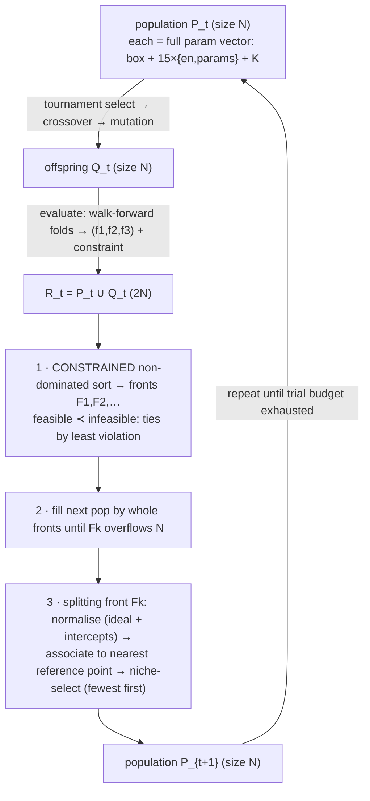

# NSGA-III — many-objective search for the indicator layer

## 0. The problem we're solving
We want strategy configurations (box params + which indicators + their params + K) that are **good on
three axes at once** — and no single weighting is "correct". So we search for the **Pareto front**:
the set of configs where you can't improve one objective without hurting another.

```
   Objectives (all MAXIMISED):
     f1 = median fold P/L         (profit, consistent across walk-forward folds)
     f2 = − worst-fold maxDD      (drawdown; maximise the negative = minimise DD)
     f3 = median fold win-rate    (% winning trades)
   Constraint (feasible region):
     full-period maxDD ≤ 25% × full-period P/L      (hard; infeasible trials ranked last)
```

## 1. Why NSGA-III (not NSGA-II)
NSGA-II keeps diversity with **crowding distance** — fine for 2 objectives, but in 3+ dimensions
crowding distance loses resolution and the front collapses toward a few regions. **NSGA-III**
replaces crowding with a set of **reference points** spread on a normalized hyperplane, and keeps the
population spread *evenly across those reference directions*. So with 3 objectives (P/L, DD, win-rate)
NSGA-III gives a well-distributed front instead of a clump.

```
   2 objectives (NSGA-II)             3 objectives (NSGA-III)
   f2                                  reference points on the simplex f1+f2+f3=1
   │   o   o                                 f3
   │ o   o   o   crowding distance           /\
   │o  o   o  o  keeps spacing              /  \   • • •   each • = a reference direction;
   └───────────── f1                       / •• \  • • •   niching keeps ≥1 solution near each
                                          /______\ • • •
                                          f1     f2
```

## 2. One generation, end to end


### 2a. Constrained non-dominated sorting (how feasibility enters)
```
   compare trial a vs b:
     both feasible      → a dominates b iff a ≥ b on all objectives and > on one
     one feasible       → the feasible one dominates
     both infeasible    → the one with SMALLER constraint violation dominates
   → feasible solutions are always preferred; the front you keep is feasible-first.
```
Here the constraint value is `full_dd − 0.25·full_pnl` (≤ 0 ⇒ feasible). Reported fronts are filtered
to feasible only.

### 2b. Reference points + niching (how NSGA-III keeps spread)
```
   normalize objectives to [0,1] via the ideal point (best per objective) and intercepts
   (worst on each axis of the extreme points) → all candidates live near the simplex.
   each candidate ── perpendicular distance ──► nearest reference direction (•)
   niche count ρ(•) = #already-selected associated to •
   fill: pick the reference point with the smallest ρ; take its closest unselected candidate;
         increment ρ; repeat. → no objective direction is starved.
```

## 3. How it's wired here (`optimize/optimizer.py`)
```
 study = create_study(directions=["maximize","maximize","maximize"],
                      sampler=NSGAIIISampler(seed, constraints_func=_constraints))
 objective(trial):
   suggest box params (sl_soft, sl_hard_delta, tp, gate_pct, dd_limit, cooldown, flip)
   suggest indicators: for each of 15 → en_<key> ∈ {F,T} + its schema params  (rectangular space)
   suggest K ∈ [1,5]                                  (clamped to #confirmers by confirm_mask)
   r = score_walkforward(...)        → median_pnl, worst_dd, median_win   (3 objectives)
   full = backtest_metrics(window=full)  → full_pnl, full_dd              (constraint)
   trial.set_user_attr("constraint", [full_dd − 0.25·full_pnl])
   return median_pnl, −worst_dd, median_win
 _constraints(trial) = trial.user_attrs["constraint"]   # ≤0 feasible
```
Search-space size ≈ **53 dimensions** (7 box + 15 enable flags + ~30 indicator params + K). A trial
is **pruned** (not scored) if any walk-forward fold has < `min_trades` (=5) trades — so the indicator
gate's heavy filtering means many raw trials are pruned; budget must be sized accordingly.

## 4. Walk-forward scoring per trial (what feeds the objectives)
```
 decision frame ── split into K equal-CALENDAR-time folds ──►  fold0 (warmup/causal gate ref, NOT scored)
                                                               fold1 … foldK-1 (scored, gate frozen on prior data)
 per scored fold: backtest_metrics (vectorized) → pnl, max_dd, win
   f1 = median(fold pnls)   f2 = −max(fold max_dds)   f3 = median(fold wins)
 constraint uses a separate FULL-window backtest (full_pnl, full_dd).
```
State isolation: each fold is an independent `backtest_metrics` call (no equity/breaker leakage).

## 5. Output
The result is the **feasible Pareto front** — many (P/L, DD, win-rate) trade-off points, each a full
config. No single winner is auto-picked: you choose the trade-off, then **re-validate that config on
the exact dashboard engine** (where retrace/wait + carry apply). Per-TF fronts + a cross-TF
leaderboard are written by the reporting step (I.10).

> 📊 **Interactive (real I.9 smoke data):**
> [`charts/nsga3_feasibility.html`](charts/nsga3_feasibility.html) — full-period P/L vs max DD with the
> `DD = 25%·P/L` feasibility line; and
> [`charts/nsga3_objectives_3d.html`](charts/nsga3_objectives_3d.html) — the three objectives in 3-D
> (green = feasible).

## 6. Practical notes (from the 4h smoke)
- Feasibility (full-period DD ≤ 25% P/L) is reachable — the box winner sits ≈ 20%; a 200-trial 4h
  smoke reached a 29% near-miss with ~90% of trials pruned (min_trades × indicator gate).
- ⇒ the full sweep needs a **large trial budget per timeframe** (thousands) to populate a feasible
  front over the 53-dim space; NSGA-III's reference-point niching then spreads the survivors.
- Determinism: seeded sampler ⇒ reproducible search; studies persist to SQLite (`wsh3_<tf>`,
  resumable).
