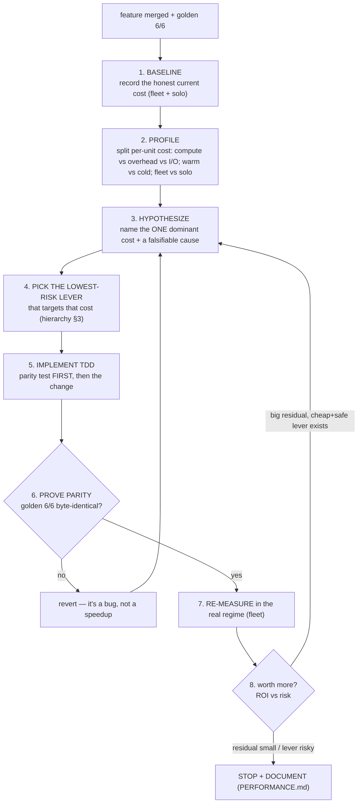

# Optimization SOP — analyze & optimize any added feature "to the bones"

*The standard operating procedure for taking a newly-added feature and making it as fast as it should be —
**without ever changing its results.** Distilled from the fastening program (`PERFORMANCE.md` §4.4/§7/§9, the
memoization + disk vote cache). Follow it in order; do not skip the gates.*

---

## 0. The five laws (read first — they override cleverness)

1. **MEASURE, DON'T GUESS.** Never optimize what you haven't profiled. This project has *repeatedly* been
   wrong about the bottleneck — the candidate-L1 disk cache (§4.4) was a real 406× per-call win that **did not
   move the fleet**; the batched-CPU engine was killed by one profile showing the workload is compute-bound,
   not overhead-bound. Assumptions cost weeks. A measurement costs minutes.
2. **RESULT-PARITY IS SACRED.** An optimization that changes a number is a *bug*, not a speedup. Every change
   must pass the **golden gate byte-identical** (`perf/check_golden.py` 6/6) before it is trusted.
3. **LOWEST RISK THAT CAPTURES THE WIN.** Prefer caching (result-neutral by construction) over vectorization
   over algorithm rewrites. Reach for a risky rewrite only when a cheap, safe lever can't capture the win.
4. **DON'T GOLD-PLATE.** Once the big win is banked and the residual is small/situational, **stop**. Diminishing
   ROI × rising risk is a losing trade. "It could be faster" is not a reason to touch working code.
5. **FLEET ≠ SOLO; WARM ≠ COLD.** The bottleneck under 24-way parallelism is often invisible in a single call
   (memory-bandwidth contention is fleet-only). Warm-cache cost ≠ cold-miss cost. Measure the regime you
   actually run in.

---

## 1. The pipeline



---

## 2. Phase detail

### Phase 1 — Baseline (the honest number)
- Record the cost **in the regime you run**: fleet `trials/min` (or req/s, wall-clock) **and** a solo per-unit
  time. Note worker count, store (sqlite/Postgres), warm vs cold.
- Write it down *before* touching anything — it's the only thing the speedup is measured against.

### Phase 2 — Profile (find the real bottleneck)
The non-negotiable step. Split the per-unit wall-clock into its parts and find the one that dominates:
- **compute vs overhead vs I/O** — e.g. for the optimizer: `ask (sampler)` / `compute (score)` / `tell (store
  write)`. (We found 100% compute, ~0.3% overhead → the batched engine was the wrong target.)
- **warm vs cold** — run past warmup, then measure; separately measure a cold miss. (Cold `ifvg`=74.5 s vs
  warm ~5 ms — wildly different; the fix differs by which dominates.)
- **fleet vs solo** — if a solo call is fast but the fleet is slow, suspect **contention** (memory bandwidth,
  DB locks), not per-call compute. Measure with the real worker count.
- Tools: a tiny harness that times the components (see `scratch/profile_trial.py` pattern); `cProfile` for
  cumulative breakdown; a controlled worker-count sweep **with a long enough ramp** (short ramps catch cold
  misses and lie — a known trap).

### Phase 3 — Hypothesize (one cause, falsifiable)
State the single dominant cost and a cause you can *disprove*: "X is N% of the time because Y." If you can't
falsify it, you can't trust the fix.

### Phase 4 — Pick the lowest-risk lever (§3 hierarchy)
Choose the cheapest, safest lever that targets the Phase-3 cost. If two levers tie, pick the one that keeps
**byte-parity by construction**.

### Phase 5 — Implement (TDD, parity test first)
- Write the **parity test first**: assert the optimized path equals the reference (byte-identical for caches;
  per-component equality for algorithm changes), including a **cross-process / cross-state** test if the
  optimization caches.
- Then the minimal implementation. Commit per task.

### Phase 6 — Prove parity (the gate)
- `python3 perf/check_golden.py` → **6/6 MATCH**. Also run the feature's own suite.
- **Clear any new cache before golden** so a dev-time stale entry can't mask a real break.
- If golden mismatches: **revert.** It is a correctness bug. Do not "investigate later."

### Phase 7 — Re-measure (real regime)
Re-run the Phase-1 measurement in the **fleet** regime. The §1.3 lesson: a per-call win may not move the fleet.
Confirm the speedup is real where it matters (e.g. memoization took candidate-L1 from 24→1,286/min, §7.4).

### Phase 8 — Decide & document
- **Residual large + a cheap/safe lever exists** → loop to Phase 3.
- **Residual small or only a risky lever remains** → **STOP.** Record the result + the *refuted* options in
  `PERFORMANCE.md` (so the next person doesn't re-chase a dead lever).

---

## 3. The lever hierarchy (cheapest/safest → most work/risk)

| # | Lever | Parity risk | When |
|---|---|---|---|
| 1 | **Skip redundant work** (don't compute what's unused; early-exit/prune) | none | always first |
| 2 | **In-process memoize** (cache pure results by content key) | none (stores exact value) | repeated identical work in a process |
| 3 | **Disk-persist / share the cache** across processes + workers | none (versioned+content-signed key) | cold re-pay on respawn / cross-worker |
| 4 | **Vectorize** a hot loop (numpy/SIMD) | **medium** — float-order/edge cases; needs byte-parity proof | a single hot kernel dominates |
| 5 | **Parallelize / batch** across independent units | medium — contention, scheduling | embarrassingly-parallel work, overhead-bound |
| 6 | **Algorithm rewrite** (different complexity) | **high** — full re-validation | nothing cheaper captures the win |

Rules of thumb:
- **Caching (1–3) is the default** — it's result-neutral by construction and reuses the proven atomic-write
  pattern (`vote_cache.py`, candidate-L1 disk cache §4.4): write to a temp file, `os.replace` (atomic),
  best-effort (never fail the run), key = `(VERSION, content_signature, config)`.
- **Vectorize/rewrite (4–6) only after** caching can't capture the win — and only with a per-component parity
  test, not just golden.
- **Adding workers** has a ceiling: this box is **memory-bandwidth-bound** past ~16 workers; more cores can
  make the fleet *slower*. Re-measure the sweet spot after any change that alters per-trial memory traffic.

---

## 4. The parity protocol (never skip)

- **Golden gate:** `perf/check_golden.py` must print **6/6 MATCH** with the exact baselines (4h $142,203/214,
  2h $91,996, 1h $99,172, 15m $77,098, 5m $23,926, 2m $29,777). This is the contract.
- **Caches are byte-identical by construction** — they store and reload the exact computed value. The only
  failure mode is **staleness**, closed by a `CACHE_VERSION` (bumped on any logic change) + a content
  signature in the key. Tests point caches at a tmp dir so golden never reads a cross-run entry.
- **Algorithm/vectorization changes** need a dedicated **equivalence test** (`assert optimized == reference`
  on a representative input matrix) *in addition to* golden.
- **Shared arrays must be read-only** downstream — if a cached array could be mutated by a consumer, copy or
  prove it's never mutated (our vote arrays are consumed read-only by the mask builders).

---

## 5. Stop / continue triggers (so we don't over- or under-optimize)

**STOP when** any of:
- the dominant cost is now < ~20% of the per-unit time, **or**
- the only remaining lever is tier 4–6 (vectorize/rewrite) **and** the residual ROI is small/situational, **or**
- the feature isn't on the hot path of a run you actually do at scale.

**CONTINUE / escalate when** all of:
- a single run at the target scale would take **> ~12 h**, **and**
- you run such runs **repeatedly** (so the work amortizes), **and**
- profiling shows a clear dominant cost a known lever targets.

---

## 6. Anti-patterns (real traps this project hit — don't repeat)

- **Optimizing the assumed bottleneck.** The backtest "felt" expensive; it was 5 ms. Profile.
- **Per-call win ≠ fleet win.** A 406× per-call cache that didn't move the fleet (the real cost was elsewhere).
- **Short measurement windows.** An 18 s ramp caught cold-SMC startup and reported 24/min where steady-state
  was 1,286/min. Ramp past warmup before sampling.
- **Building before measuring.** The batched-CPU engine (multi-week) was scoped, then a 2-minute profile
  refuted its premise. Measure-first saved the weeks.
- **Gold-plating.** Items that help only many-short-respawn runs aren't worth a high-risk rewrite for typical
  single big runs.
- **`pkill -f <pattern>` self-match.** The kill command's own argv matched the pattern; it killed the
  just-launched process. Kill by precise pattern / PID, and count real procs with `ps -eo args | grep -c '^python3 -u <exact>'`.

---

## 7. The checklist (copy per feature)

```
[ ] 1. Baseline recorded (fleet trials/min + solo per-unit; worker count; warm/cold; store)
[ ] 2. Profiled: cost split (compute/overhead/io), warm vs cold, fleet vs solo — dominant cost named
[ ] 3. Hypothesis stated (one dominant cost + falsifiable cause)
[ ] 4. Lowest-risk lever chosen from the hierarchy (§3) that targets it
[ ] 5. Parity test written FIRST (byte-identical / per-component; + cross-process if caching)
[ ] 6. Implemented minimally, TDD, committed per task
[ ] 7. Golden 6/6 byte-identical (cache cleared first) + feature suite green
[ ] 8. Re-measured in the FLEET regime; speedup confirmed where it matters
[ ] 9. Decision: continue (cheap+safe lever, big residual) or STOP
[ ] 10. Documented in PERFORMANCE.md (result + measured numbers + REFUTED options)
```

---

*Companion docs: `PERFORMANCE.md` (the single source of truth for what's been done + the golden contract),
`OPTIMIZER_PARALLELISM_AND_GPU.md` (when batching/GPU is/ isn't worth it). Governing principle everywhere:
**evidence before assertions — measure, prove parity, then claim the win.**
