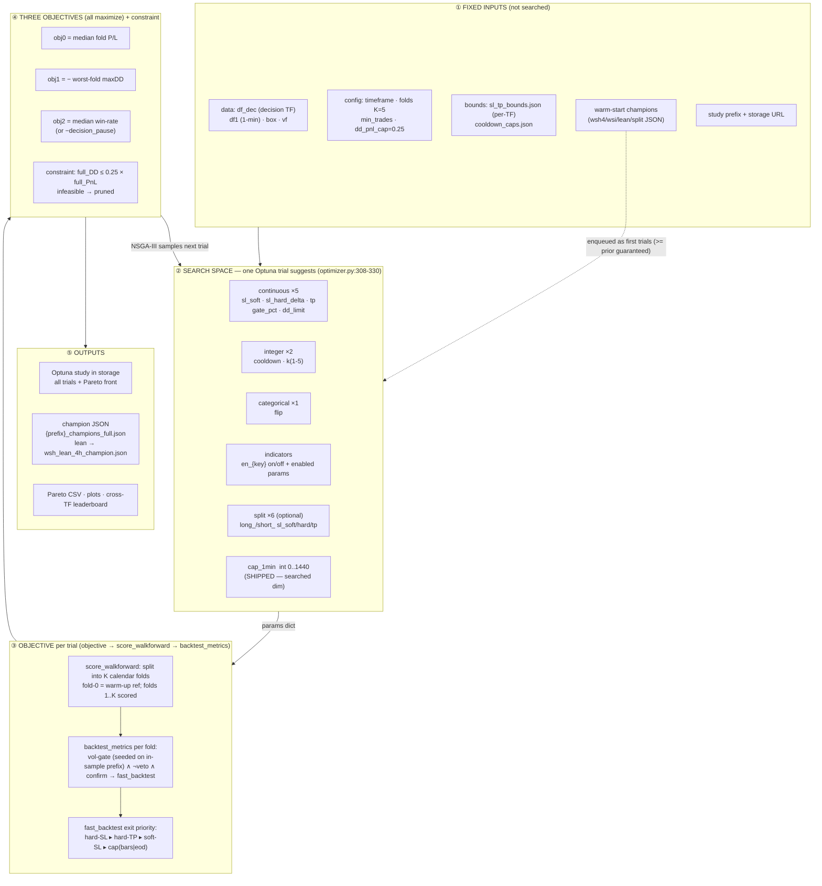
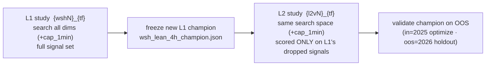
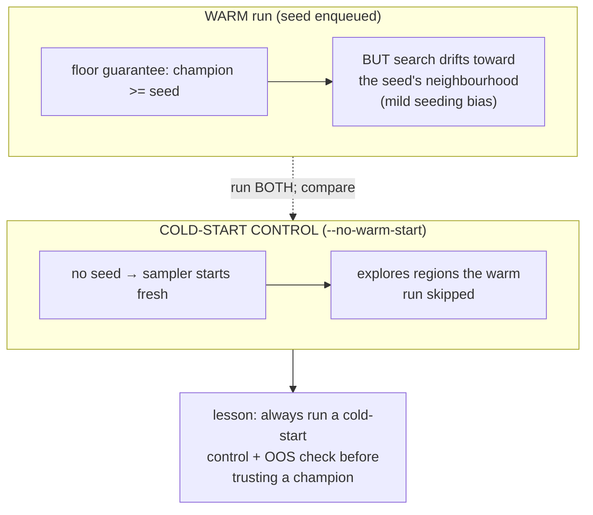
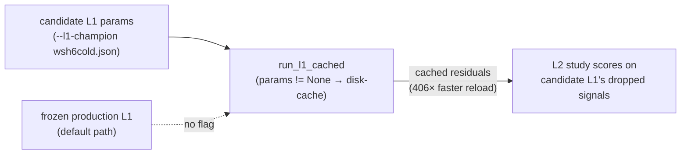

# Optimizer Map — Inputs, Outputs & Governing Rules

**Date:** 2026-06-25 (extended 2026-06-26) · Code-grounded reference (file:line cited).
The `cap_1min` search dimension — formerly proposed (⊕) — is now **implemented and shipped**: it is a
real searched `suggest_int("cap_1min", 0, 1440)` dimension in both the L1 and L2 optimizers, lifting the
L1 non-split space to **57 dims**. See the milestone narrative
`docs/MILESTONE_two_layers_time_capped.md` and the design spec
`docs/superpowers/specs/2026-06-25-optimizer-cap1min-search-design.md` (with its `## Results (2026-06-26)`
section).

## Optimizer pipeline

## L1 -> L2 sequencing (two rounds)

## Inputs (searched dimensions)

| group | params | type · range | source |
|---|---|---|---|
| Continuous ×5 | `sl_soft`, `sl_hard_delta`, `tp`, `gate_pct`, `dd_limit` | float, per-TF bounds | `optimizer.py:309-315`, `sl_tp_bounds.json` |
| Integer ×2 | `cooldown`, `k` | int (`k` 1-5; cooldown capped) | `optimizer.py:318`, `cooldown_caps.json` |
| Categorical ×1 | `flip` | {False, True} | `optimizer.py` |
| Indicators | `en_{key}` on/off + each enabled indicator's params | mixed | `_suggest_indicators` `optimizer.py:56-72` |
| Split ×6 (optional) | `long_/short_` × `sl_soft/hard/tp` | float | `--split-sltp` |
| **cap_1min (SHIPPED)** | max-hold in traded 1-min bars (the `bars` time-cap) | **int 0..1440 (0=off)** | `suggest_int("cap_1min",0,1440)` in `optimizer.py` `objective` + `l2/optimize.py suggest_l2_params`; wired into `core.py backtest_metrics → fast_backtest` |

## Fixed inputs (not searched)

| input | role | source |
|---|---|---|
| `df_dec`, `df1`, `box`, `vf` | decision-TF candles, 1-min candles, box levels, volatility feature | `optimize/data.py` |
| `bar_td` | decision-bar duration (per TF) | `optimize/timeframes.py` |
| folds `K=5`, `min_trades`, `dd_pnl_cap=0.25` | walk-forward + feasibility config | `optimizer.py` |
| `sl_tp_bounds.json`, `cooldown_caps.json` | per-TF search bounds | `optimize/results/` |
| warm-start champions | enqueued as the first trials | `warm_start_seeds` `optimizer.py:243-275` |
| timeframe · study prefix · storage URL | run identity + persistence target | CLI / env |

## Outputs

| output | what | where |
|---|---|---|
| Study | every trial's params + 3 objective values + constraint | Postgres `wsh-pg` (or per-TF sqlite) |
| Pareto front | non-dominated trials | study |
| Champion | best feasible -> dashboard-schema JSON | `optimize/results/{prefix}_champions_full.json`; lean -> `wsh_lean_4h_champion.json` |
| Reports | Pareto CSV, plots, cross-TF leaderboard | `report_wsi.py` outputs |

## Governing rules

| rule | value | source |
|---|---|---|
| Objectives | 3, all **maximize**: median fold PnL · −worst-fold DD · median win-rate (or −decision-pause) | `optimizer.py:382-385` |
| Feasibility constraint | `full_DD <= 0.25 x full_PnL` (relaxable `--dd-pnl-cap`) | `optimizer.py:45` |
| Validation | walk-forward **K=5** folds; objectives are **medians** across folds (consistency, not one lucky fold) | `folds.py` |
| Sampler | **NSGA-III** default (also nsga2/tpe/motpe/gp/cmaes) | `make_sampler` `optimizer.py:166` |
| Trial budget | `trials = dimensions x 100` (`--auto-trials`); `--trials-per-dim` overrides; `--plan` = dry-run | `recommended_trials` `optimizer.py:140` |
| Warm-start | prior champions enqueued as first trials, clamped to bounds -> **new champion >= prior guaranteed**; `warm_start_seeds` now enqueues **BOTH** the old `cap0` champion **and** the cold `cap=448` winner -> front provably **>= both peaks**. ⚠️ It is a **floor, not a freeze**: all 57 dims are re-sampled every trial (see Cold-start control below) | `optimizer.py:243-275, 391-401` |
| L1-champion override | `--l1-champion <json>` lets the L2 study score on **any candidate L1's** dropped signals (not just the frozen production L1); the candidate L1 is disk-cached in `run_l1_cached` when `params != None` (**406× faster** reload between L2 trials) | `l2/optimize.py` (`run_l1_cached`), `--l1-champion` CLI |
| Storage precedence | `WSH_STORAGE_URL` (Postgres) > per-TF `wsh_{tf}.db` > shared `wsh.db` | `storage.py:20-41` |
| Study naming / no-mix | `{prefix}_{tf}`; a **fresh run needs a NEW prefix** (wsh4->5->6; L2 l2v1->2->3) | `optimizer.py:364`, `l2/optimize.py:81` |
| L2 scope | scored **only on L1's dropped signals**; reads frozen L1 champion; in=2025 / oos=2026 | `l2/optimize.py:22-68` |
| Engine | exit priority hard-SL ▸ hard-TP ▸ soft-SL ▸ cap; $20/pt; 1 contract; exits on 1-min frame | `fast_engine.py` |

## Trial-budget worked example (adding ⊕ cap_1min)

| | dims | proportional (×100) | double (×200) | "square" |
|---|--:|--:|--:|--:|
| L1 (non-split) | ~52 -> **53** | 5,300 | **~10,600** | ~28,000,000 (infeasible) |

`cap_1min` interacts with every other parameter (it changes which trades survive), so doubling the
per-dim budget is the principled honoring of a "bigger budget" instinct; literal squaring of the trial
count is computationally infeasible.

## The `cap_1min` dimension (shipped 2026-06-26)

`cap_1min` is the **bars** time-cap exposed to the search: a trade is force-closed after `cap_1min`
**traded 1-min bars** (`cap_mode=bars` whenever `cap_1min>0`, else `none`). It is wired through:

- `optimizer.py objective` — `cap_1min = trial.suggest_int("cap_1min", 0, 1440)`, added to the params
  dict; `search_dims` integer count bumped so `--plan`/`--auto-trials` count it (L1 non-split = **57 dims**).
- `optimizer.py _native_seed` — reads `box.get("cap_1min", 0)`, clamped to `[0,1440]`, so a champion with
  no cap (default 0) **warm-starts and reproduces exactly**.
- `core.py backtest_metrics` — `cap_1min = int(params.get("cap_1min", 0))` passed into `fast_backtest`
  (the previously-missing wire; the engine already accepted it from the time-cap work).
- `l2/optimize.py suggest_l2_params` — mirrors the same `suggest_int` so **L2 searches it too**.

Exit precedence is unchanged: **hard-SL ▸ hard-TP ▸ soft-SL ▸ cap**. The cap is the lowest-priority exit.

## Warm-start is a FLOOR, not a FREEZE — the cold-start control

The most important governing nuance discovered in this round. Enqueuing a champion guarantees the result
is **≥ that champion** (the floor), but it does **NOT pin any parameter** — every one of the 57 dims is
re-sampled on every trial. A warm search is therefore biased *toward the seed's neighbourhood* and can
**miss** optima elsewhere in the space.

**Evidence (the cap_1min round).** The **warm** `wsh6` cap search (11,407 trials, 8,650 feasible) found
no capped config beating the uncapped champion — verdict "a cap only costs PnL". The **cold-start
control** `wsh6cold` (`--no-warm-start`, 22,868 trials, 17,807 feasible) found a moderate **`cap=448`**
config the warm run had **skipped** — which then **beat the old champion on the 2026 OOS** (+$2,459,
payoff 1.32 vs 0.74) and survived `wsh7` triple-confirmation (24,237 trials warm-started from *both*
peaks → converged back to the cold seed). Full numbers in `docs/MILESTONE_two_layers_time_capped.md`.

**Operating rule:** for any new champion, run a **cold-start control** and an **OOS holdout check** before
promoting. Dimensions are coupled (non-separable) — that coupling is why a joint global optimizer is used,
and why a warm-only verdict cannot be trusted as globally optimal.

## L2 against a candidate L1 — `--l1-champion` + disk cache

By default the L2 study reads the **frozen production L1** (`wsh_lean_4h_champion.json`) and scores on its
dropped signals. The `--l1-champion <json>` flag overrides that with **any candidate L1**, so an L2 round
can be scored on a *new* (not-yet-frozen) L1's residuals — e.g. l2v4 scores on the **wsh6cold** L1's
**569** residual signals.

`run_l1_cached` disk-caches the candidate L1 when `params != None`, giving a **406×** faster reload
between L2 trials (the L1 pass is recomputed once, then reused). This made the candidate-L1 L2 rounds
practical at full trial budgets.
