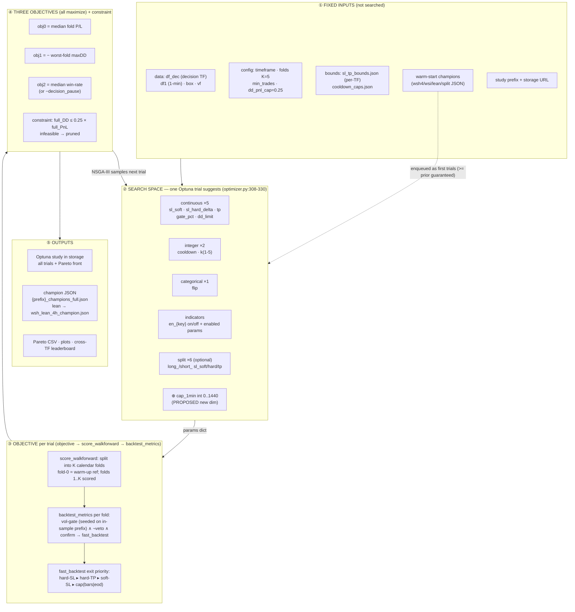
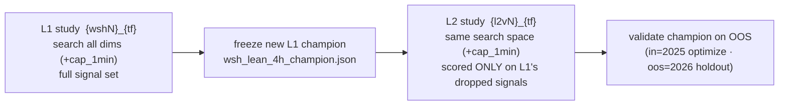

# Optimizer Map — Inputs, Outputs & Governing Rules

**Date:** 2026-06-25 · Code-grounded reference (file:line cited). The proposed `cap_1min` search
dimension is marked **⊕** (not yet implemented — see
`docs/superpowers/specs/2026-06-25-*optimizer-cap*` once written).

## Optimizer pipeline

## L1 -> L2 sequencing (two rounds)

## Inputs (searched dimensions)

| group | params | type · range | source |
|---|---|---|---|
| Continuous ×5 | `sl_soft`, `sl_hard_delta`, `tp`, `gate_pct`, `dd_limit` | float, per-TF bounds | `optimizer.py:309-315`, `sl_tp_bounds.json` |
| Integer ×2 | `cooldown`, `k` | int (`k` 1-5; cooldown capped) | `optimizer.py:318`, `cooldown_caps.json` |
| Categorical ×1 | `flip` | {False, True} | `optimizer.py` |
| Indicators | `en_{key}` on/off + each enabled indicator's params | mixed | `_suggest_indicators` `optimizer.py:56-72` |
| Split ×6 (optional) | `long_/short_` × `sl_soft/hard/tp` | float | `--split-sltp` |
| **⊕ cap_1min (proposed)** | max-hold in traded 1-min bars | **int 0..1440 (0=off)** | new `suggest_int` |

## Fixed inputs (not searched)

| input | role | source |
|---|---|---|
| `df_dec`, `df1`, `box`, `vf` | decision-TF candles, 1-min candles, box levels, volatility feature | `optimize/data.py` |
| `bar_td` | decision-bar duration (per TF) | `optimize/timeframes.py` |
| folds `K=5`, `min_trades`, `dd_pnl_cap=0.25` | walk-forward + feasibility config | `optimizer.py` |
| `sl_tp_bounds.json`, `cooldown_caps.json` | per-TF search bounds | `optimize/results/` |
| warm-start champions | enqueued as the first trials | `warm_start_seeds` `optimizer.py:243-275` |
| timeframe · study prefix · storage URL | run identity + persistence target | CLI / env |

## Outputs

| output | what | where |
|---|---|---|
| Study | every trial's params + 3 objective values + constraint | Postgres `wsh-pg` (or per-TF sqlite) |
| Pareto front | non-dominated trials | study |
| Champion | best feasible -> dashboard-schema JSON | `optimize/results/{prefix}_champions_full.json`; lean -> `wsh_lean_4h_champion.json` |
| Reports | Pareto CSV, plots, cross-TF leaderboard | `report_wsi.py` outputs |

## Governing rules

| rule | value | source |
|---|---|---|
| Objectives | 3, all **maximize**: median fold PnL · −worst-fold DD · median win-rate (or −decision-pause) | `optimizer.py:382-385` |
| Feasibility constraint | `full_DD <= 0.25 x full_PnL` (relaxable `--dd-pnl-cap`) | `optimizer.py:45` |
| Validation | walk-forward **K=5** folds; objectives are **medians** across folds (consistency, not one lucky fold) | `folds.py` |
| Sampler | **NSGA-III** default (also nsga2/tpe/motpe/gp/cmaes) | `make_sampler` `optimizer.py:166` |
| Trial budget | `trials = dimensions x 100` (`--auto-trials`); `--trials-per-dim` overrides; `--plan` = dry-run | `recommended_trials` `optimizer.py:140` |
| Warm-start | prior champions enqueued as first trials, clamped to bounds -> **new champion >= prior guaranteed** | `optimizer.py:243-275, 391-401` |
| Storage precedence | `WSH_STORAGE_URL` (Postgres) > per-TF `wsh_{tf}.db` > shared `wsh.db` | `storage.py:20-41` |
| Study naming / no-mix | `{prefix}_{tf}`; a **fresh run needs a NEW prefix** (wsh4->5->6; L2 l2v1->2->3) | `optimizer.py:364`, `l2/optimize.py:81` |
| L2 scope | scored **only on L1's dropped signals**; reads frozen L1 champion; in=2025 / oos=2026 | `l2/optimize.py:22-68` |
| Engine | exit priority hard-SL ▸ hard-TP ▸ soft-SL ▸ cap; $20/pt; 1 contract; exits on 1-min frame | `fast_engine.py` |

## Trial-budget worked example (adding ⊕ cap_1min)

| | dims | proportional (×100) | double (×200) | "square" |
|---|--:|--:|--:|--:|
| L1 (non-split) | ~52 -> **53** | 5,300 | **~10,600** | ~28,000,000 (infeasible) |

`cap_1min` interacts with every other parameter (it changes which trades survive), so doubling the
per-dim budget is the principled honoring of a "bigger budget" instinct; literal squaring of the trial
count is computationally infeasible.
