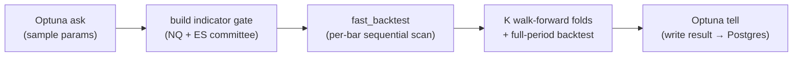
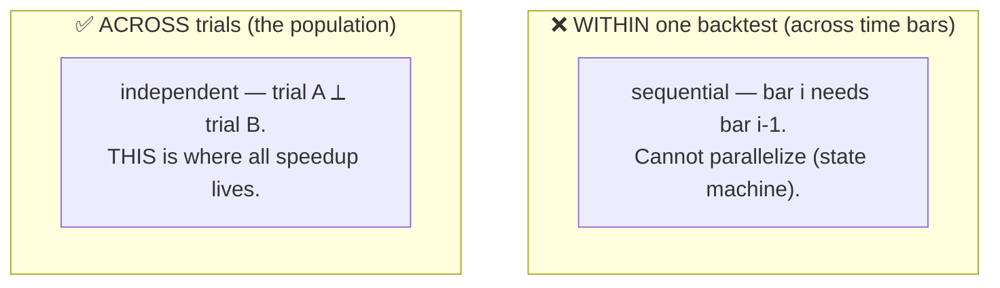
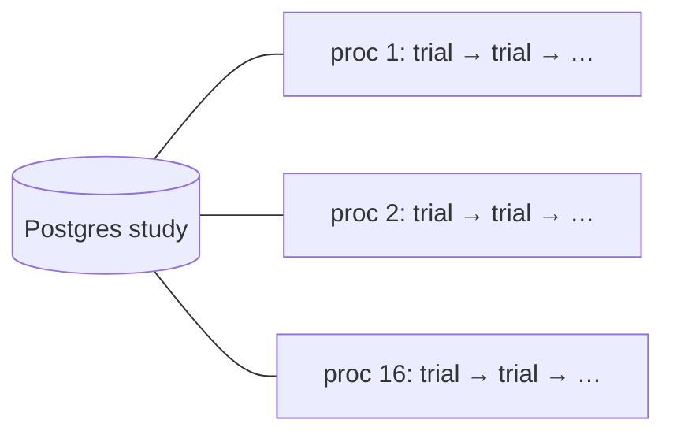
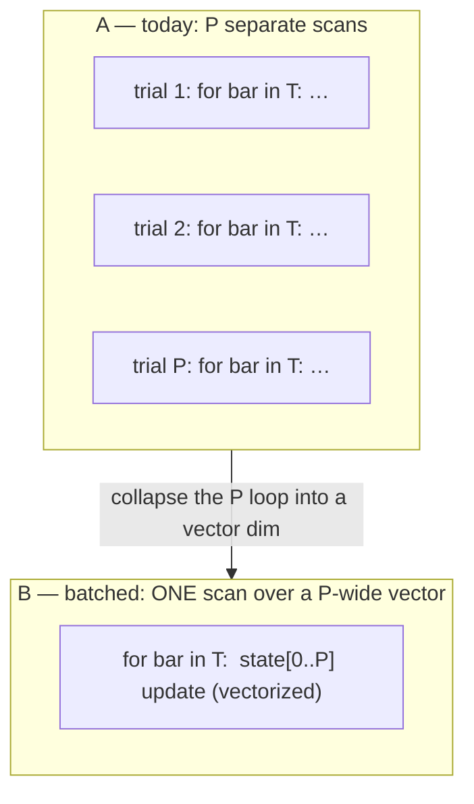
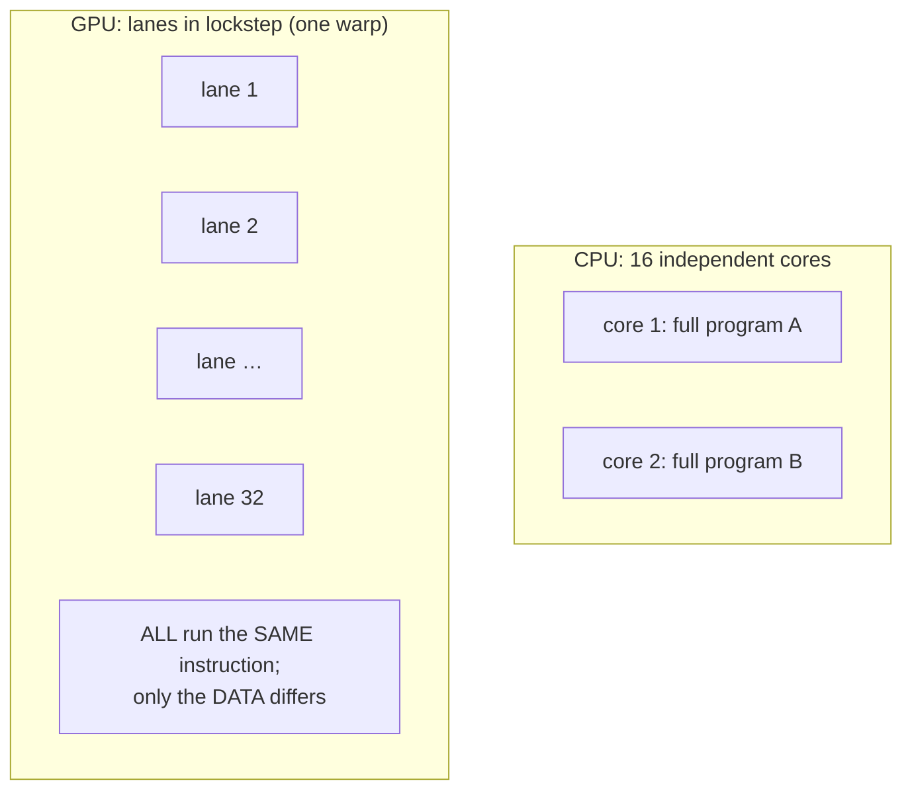
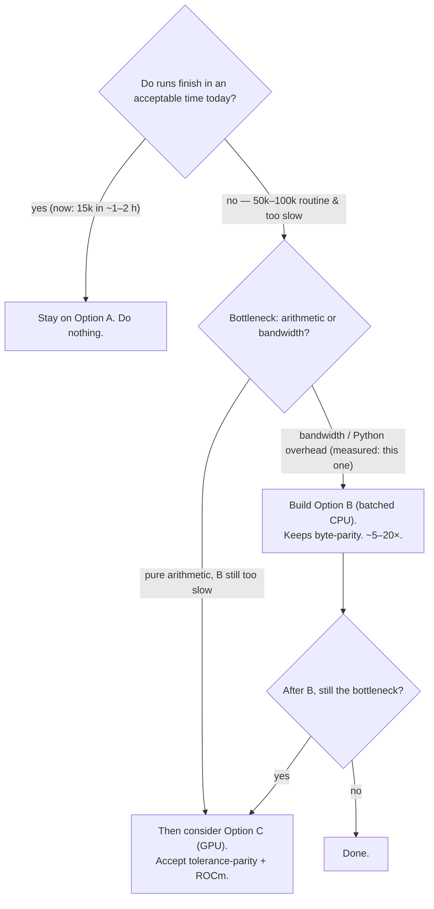

# Optimizer parallelism, batched engines, and GPU — the full picture

*Why the optimizer runs the way it does, what it would take to run 50k–100k trials "in one click," and exactly
where CPU multiprocess, a batched CPU engine, and a GPU kernel each fit (and don't). Companion to
`docs/PERFORMANCE.md` (single-backtest speed + the candidate-L1 §7 finding).*

---

## 0. TL;DR / the decision

| Option | What it is | Speedup vs today | Effort | Golden byte-parity | Verdict |
|---|---|---|---|---|---|
| **A. CPU multiprocess** (today) | one trial per OS process, ~16 in parallel | 1× (baseline) | none | ✅ exact | **Keep for now** — runs finish in ~1–2 h |
| **B. Batched CPU engine** | one program scores a whole NSGA *population* as a `[P × bars]` array | **~5–20×** | medium-large rewrite | ✅ achievable (same float order) | **The right lever** when 50k–100k becomes routine |
| **C. GPU kernel** | the batched engine as a CUDA/ROCm/CuPy/JAX kernel | another ~2–8× *if* not bandwidth-bound | large + ROCm + new validation | ❌ not byte-exact (needs tolerance regime) | Only after B, only if B is still the bottleneck |

**One sentence:** the speedup you want (50k–100k cheaply) comes from **batching across trials**, and the first,
safest version of that is **on the CPU** — not the GPU. GPU is a *later* optimization on top of the same batched
rewrite, and it costs you the byte-exact golden gate.

---

## 1. Anatomy of one trial — where the time actually goes

Each optimizer trial does, in order:

Two properties dominate everything below:

1. **The backtest is a *sequential state machine*.** Walking the decision bars in order, each bar's outcome
   depends on prior state: open-position carry, first-touch SL/TP exit resolution on the 1-minute frame, the
   drawdown-HWM circuit breaker, cooldown locks. You cannot compute bar *i* without bar *i-1*'s state. (Seen
   directly: "removing an early entry frees a later one.")
2. **Trials are *independent*** (embarrassingly parallel). Trial A's result never depends on trial B's.

So there are **two different axes of parallelism**, and they are not interchangeable:

Everything below exploits the **ACROSS-trials** axis. The **WITHIN** axis is sequential and stays sequential no
matter the hardware.

---

## 2. Option A — CPU multiprocess (what we run today)

**Model:** one OS process = one trial at a time, running the plain numpy `fast_backtest`. A watchdog pool keeps
~16 processes alive, all pulling trials from the shared Postgres study (Optuna coordinates).

**Strengths:** zero extra work; byte-exact (it *is* the golden engine); trivially correct.

**Ceiling:** you can only run **as many concurrent trials as you have cores** (~16–30 useful on this 32-core
box). And the box is **memory-bandwidth-bound** past ~16 workers — extra cores stop helping because they contend
for the same RAM bandwidth streaming the 487k-bar arrays. So Option A caps at roughly "cores × per-trial-rate."

**Why it's fine right now:** `wshes1` does 15k trials in ~1–2 h (fast engine + no candidate-L1 tax, PERFORMANCE.md
§7). No pain ⇒ no reason to rewrite.

---

## 3. Option B — Batched CPU engine (the real lever for 50k–100k)

**Idea:** stop scoring trials one at a time. NSGA-III evaluates a *population* of P candidates per generation.
Score **all P at once** by promoting the population to an array dimension:

- params become arrays of shape `[P]` (P stop-losses, P take-profits, …)
- the per-bar scan becomes one loop over `T` bars where **each step operates on all P trials at once** as a
  length-`P` vector (`np.where` masks replace `if`/`else`)
- result: instead of `P × T` Python iterations you do `T` iterations, each a vectorized op over `P` lanes

**Why it's a big win:** at these speeds, per-trial Python/Optuna overhead (ask/tell, object churn, the Python
`for`-loop over bars) is *most* of the cost — not the arithmetic. Batching deletes the per-trial loop overhead
and lets numpy SIMD chew the `P`-wide vectors. Realistic **~5–20×** depending on how much batches cleanly.

**What's hard (honest):**
- **The first-touch exit** (§5) — per-trade, variable-length search across the 1-minute frame with *different*
  entry bars and SL/TP per trial. The gnarly part. Doable (vectorized `searchsorted`/`cummax`/segmented
  reductions) but it's the crux.
- **Breaker / cooldown** are sequential across *trades within a trial*; they batch across the P dimension and
  stay sequential along time — fine.
- **Variable trade counts per trial** → ragged arrays → pad-to-max + mask. Standard, fiddly.

**Parity:** still numpy, **same float ops in the same order** ⇒ a batched CPU engine **can stay byte-identical**
to golden. Decisive advantage over GPU: we keep `check_golden.py` as an exact gate.

**Effort:** medium-large — an engine rewrite + a "batched == per-trial, byte-for-byte" parity test on top of
golden. Weeks, not days; the correct investment *if* 50k–100k sweeps become routine.

---

## 4. Option C — GPU kernel (and why "one trial per core" is a myth)

### 4.1 GPUs are SIMT, not "thousands of little CPUs"

The intuitive model — "16 CPU cores → 16 trials; a GPU has thousands of cores → thousands of independent
trials" — is the one thing that does **not** hold. A GPU core is **not** a CPU running its own program. GPUs are
**SIMT (Single Instruction, Multiple Thread)**:

- cores group into **warps** (NVIDIA, 32 threads) / **wavefronts** (AMD; on `gfx1031` RDNA2 = 32 lanes). Every
  lane in a warp executes the **same instruction at the same time**, on different data.
- they **cannot** each run a different, independent backtest. There is no CPython on a GPU lane.

So a GPU needs **one kernel** over a **batch dimension** — i.e. the *same* batched engine as Option B, in
CuPy/JAX/Numba/a custom kernel. **There is no shortcut that keeps the current per-trial Python and spreads it
over GPU cores.** "One trial per core" inevitably becomes "one batched kernel over all trials."

### 4.2 Warp divergence — why a branchy backtest fights the GPU

When lanes hit a **data-dependent branch** (`if hit SL … elif breaker locked … else …`) and take different
paths, the warp **serializes** the paths (run the `if` block with some lanes masked, then the `else`) — you lose
parallelism exactly where the backtest is busiest. A backtest is *full* of such branches, so a naive GPU port
underperforms its lane count.

### 4.3 Byte-parity dies

GPU reductions (sums, percentiles) are **order-nondeterministic** → results differ in the last bits → **not
byte-identical** to golden. You'd replace the exact gate with a tolerance regime ("within $\epsilon$") — a real
loss of the project's strongest safety net.

### 4.4 AMD/ROCm friction (this box)

The GPU is **AMD `gfx1031`** (`HSA_OVERRIDE_GFX_VERSION=10.3.0`). Numba-CUDA doesn't run on AMD; CuPy/JAX/PyTorch
have ROCm builds but are fussier than CUDA. More setup/maintenance than NVIDIA.

### 4.5 And the bottleneck might just move

The workload is **memory-bandwidth-bound**, not compute-bound. GPUs win when starved for *arithmetic*; if you're
starved for *bandwidth* (streaming 487k-bar arrays), the GPU relocates the bottleneck to the **PCIe transfer**
host→device. Speedup ≠ lane count.

---

## 5. The first-touch-exit problem (the crux of B and C)

Both batched options live or die on one kernel: **given a trade entered at bar `e` with levels `SL`,`TP`, find
the first 1-minute bar after `e` whose high/low crosses a level, and which.** Today: a clean per-trade loop.
Batched across P trials with different `e`/`SL`/`TP`:

- align each trial's trade to its slice of the 1-minute frame,
- compute per-1-min-bar "hit SL?"/"hit TP?" boolean masks for all trials at once,
- take the **first True** per trade (`argmax` over the mask), with the same "TP and SL in the same bar"
  conservative rule the exact engine uses.

Vectorizable, but the hardest ~30% of the rewrite and where a parity bug would hide. Any plan starts here with a
byte-exact test against the current `fast_backtest` first-touch.

---

## 6. Parity strategy (per option)

| Option | Parity approach |
|---|---|
| A (today) | n/a — it *is* the reference |
| B (batched CPU) | **byte-exact**: assert batched output == per-trial `fast_backtest` for a random param matrix, plus golden 6/6. Same float order ⇒ achievable. |
| C (GPU) | **tolerance-based**: `abs(pnl_gpu − pnl_cpu) < $\epsilon$` per trial; golden becomes a near-match. A genuine downgrade. |

---

## 7. Decision matrix + triggers

**Triggers to build B:** a single production sweep would take **> ~12 h** on the CPU pool, **and** we run such
sweeps **repeatedly** (per-contributor × multi-seed × multi-TF) so the rewrite amortizes.

**Trigger to look at C:** B is built, parity-validated, *and* still the wall — unlikely on a bandwidth-bound
workload, and it forfeits exact golden.

---

## 8. Where the GPU genuinely belongs

Not the backtester. The **mega-goal's learned policy** π(state) → {enter?, direction, SL, TP, exit} — if that's a
gradient-boosted model / neural net / RL policy, **training it** is exactly the GPU's job, and the AMD box was
acquired for ML training ("meta-prophet"). Spend GPU effort on the *policy head* (dense linear algebra, no
sequential-state-machine / byte-parity baggage), not the discrete NSGA search over a path-dependent backtester.

---

## 9. So why are we "holding" the batched-CPU engine?

Only because **(a)** today's runs finish in ~1–2 h, so there's no pain to justify a multi-week engine rewrite
*right now*, and **(b)** it carries real parity risk that must be retired with a new test layer. It is **not** a
technical "no" — it's a sequencing call. If the goal shifts to *"50k–100k sweeps as a routine one-click thing"*
(per-contributor × multi-seed × multi-TF), Option B becomes worth building, and this document is the spec-seed.
The moment a sweep would cost > ~12 h and we'd run it repeatedly, B pays for itself.
