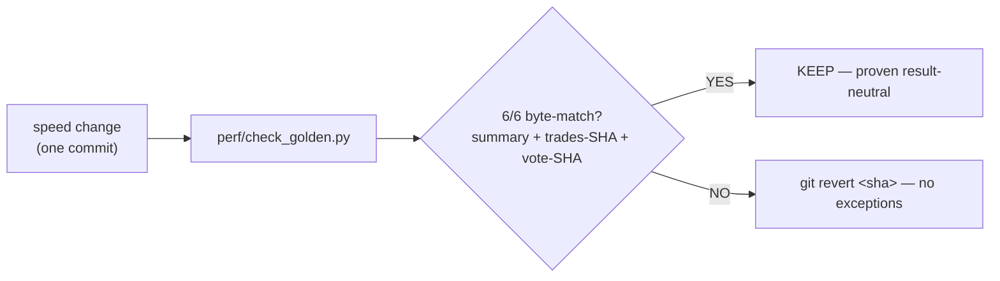
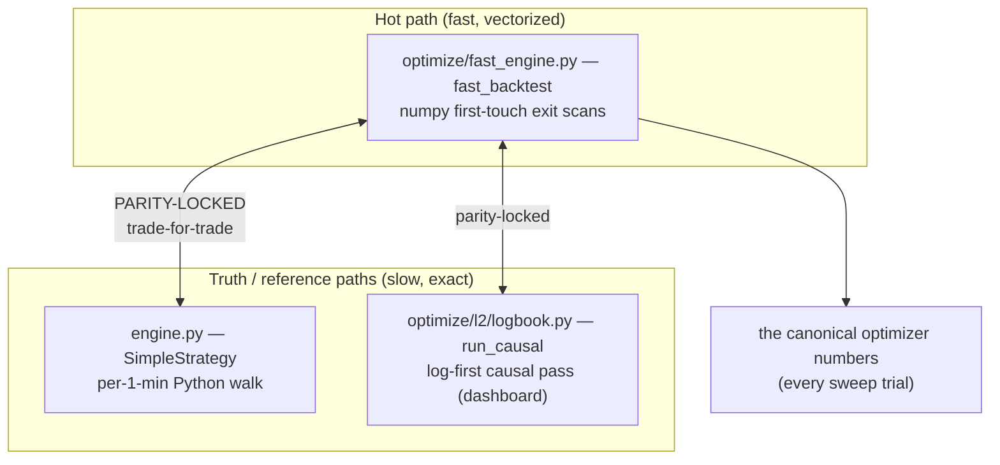
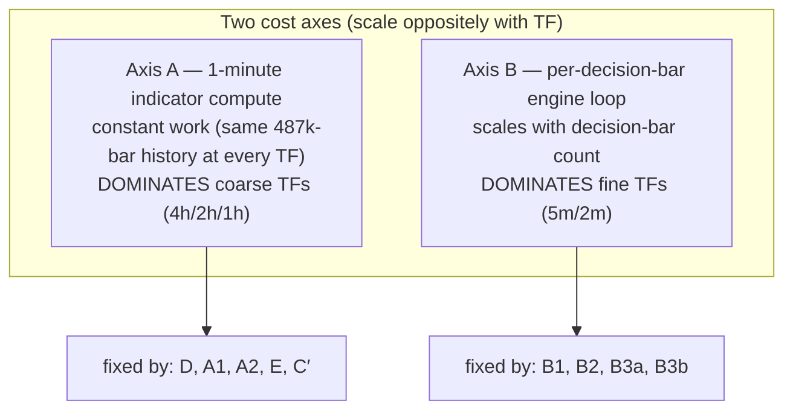
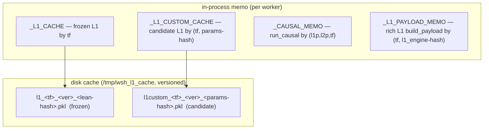
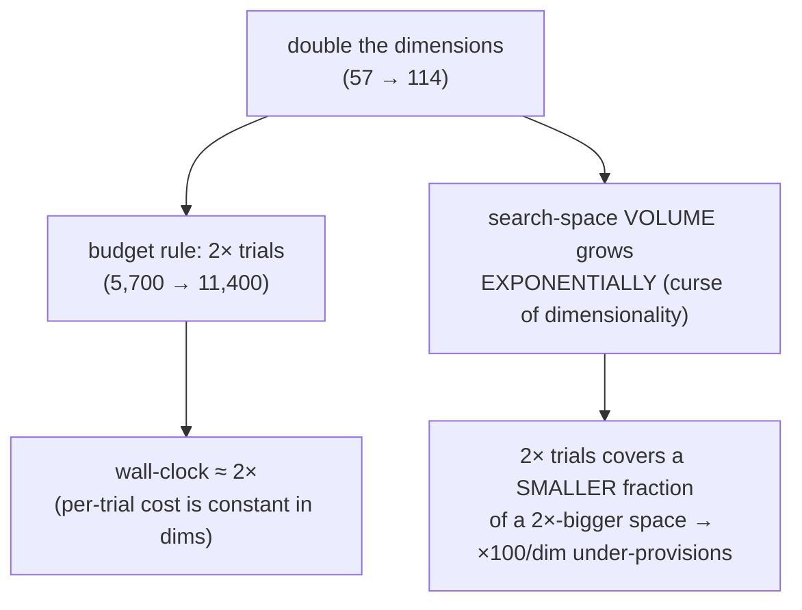
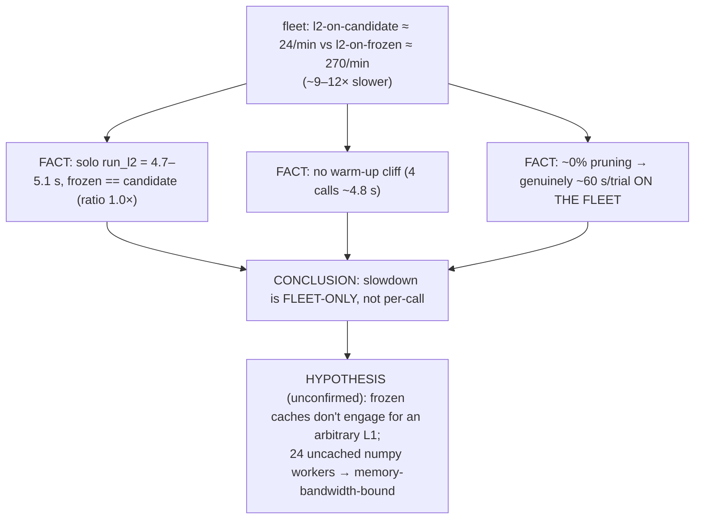
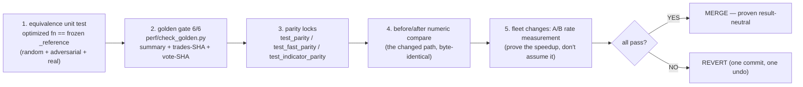
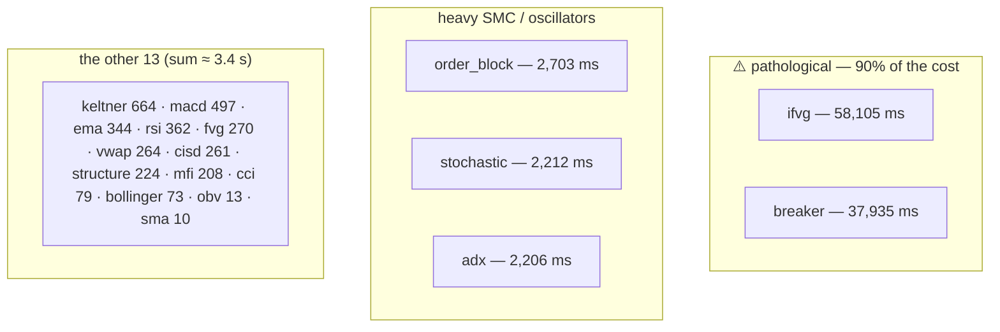

# PERFORMANCE — the single source of truth for speed

This document consolidates **every** speed/performance concern in the project into one reference: the
governing rule, the proof gates, the two-engine architecture, the full optimization history, the caching
layers, the dimensionality→trials→wall-clock model, measured fleet throughput, the open L2-slowdown
investigation, the cross-instrument ES contributor per-trial cost, and the standing verification protocol. Where a topic has its own deep-dive report, this
document **summarizes and cross-references** it rather than duplicating it. The cross-reference map:

| Topic | Deep-dive doc |
|---|---|
| End-to-end optimization record (Axis A + Axis B) | `perf/MASTER_REPORT_backtester_optimization.md` |
| ROI / "import-now-or-hold" decision | `perf/REPORT_optimization_roi_and_decision.md` |
| Pinned status + golden baselines table | `perf/STATUS_optimization.md` |
| Per-step before/after detail | `perf/UPDATE_step_*.md` (D, A1, A2, E, C′, B1, B2, B3a, B3b) |
| Profiling deep analysis (where the 37 s went) | `optimize/REPORT_backtester_speed_optimization.md` ⚠️ **SUPERSEDED — 21-indicator era, see §8** |
| **CURRENT indicator profile + the `dfa` fix (2026-07-27)** | **`optimize/REPORT_indicator_cache_acceleration.md`** |
| **Worst-case-parameter cost of all 165 indicators** | **`optimize/REPORT_post_dfa_tail.md`** |
| **Clearing the 2 s budget — 0/165 over (#62)** | **`docs/CLOSEOUT-2026-07-28-indicator-budget.md`** |
| **Cache substrate / level — measured NO-GO** | **`optimize/REPORT_cache_substrate_and_level.md`** |
| **Rules to run before/after any expansion round** | **`docs/EXPANSION_ROUND_PLAYBOOK.md`** |
| **Perf harnesses + every measured artifact** | **`optimize/perf/README.md`** |
| Vectorized fast engine (numpy first-touch exits) | `docs/VECTORIZATION.md` |
| 1-minute indicator layer + its vectorization | `docs/ONEMIN_INDICATORS_AND_VECTORIZATION.md` |
| Axis-B investigation + action plan | `perf/INVESTIGATION_axisB_per_decision_loop.md`, `perf/ACTION_PLAN_axisB.md` |

---

## 1. Principles (read this first)

### 1.1 The governing rule: speed work is STRICTLY result-neutral

> **Every optimization must produce byte-identical results, and that identity must be PROVEN by
> comparison — never assumed.**

Speed is only ever bought against a hard correctness contract. A change is allowed to make the backtester
faster; it is **never** allowed to change a single trade, a single P/L cent, or a single indicator vote.
The way we *know* a change is result-neutral is not by inspection or reasoning — it is by re-running and
**byte-comparing** against frozen references (the golden gate, §1.2) plus the parity locks (§2). If the
comparison does not pass, the change is reverted, full stop. Every step in the optimization history below
is one commit (one revert point) precisely so that a parity failure has a single, surgical undo.

This is why the entire perf workstream advertises "**byte-identical at every step**" — that is not a
marketing line, it is the acceptance criterion. Forbidden "optimizations" (because they change results)
include: coarsening the indicator frame, dropping SMC indicators, approximating rolling stats (EWMA in
place of an SMA std), or any reordering that perturbs float rounding.

### 1.2 The golden gate

`perf/check_golden.py` is the regression gate. It re-runs `strategy.build_payload` and asserts
**byte-equality** against frozen baselines across **6 timeframes — 4h / 2h / 1h / 15m / 5m / 2m**. For
each TF it compares three things exactly:

1. **every summary metric** (P/L, DD, n_taken, win, pf, …) — exact equality;
2. the **taken-trade ledger** — SHA-256 must match;
3. **every enabled indicator's per-decision-bar vote array** — SHA-256 must match (catches indicator-level
   drift even when the net trades happen to coincide).

Any speed change must keep the gate at **6/6 MATCH**. The frozen baselines (immutable since Phase 0):

| TF | P/L | DD | n | trades SHA |
|----|----:|---:|--:|:----------:|
| 4h | $142,203 | $14,082 | 214 | 64bd6101 |
| 2h | $91,996 | $16,331 | 262 | d082404d |
| 1h | $99,172 | $16,870 | 315 | af13d36b |
| 15m | $77,098 | $7,889 | 654 | cf7d893e |
| 5m | $23,926 | $4,636 | 332 | e1bb7c2e |
| 2m | $29,777 | $3,261 | 276 | 9716070e |

The **L1 4h anchor** is the headline: **~$142,203 / 214 trades / 8 enabled indicators**. Capture the
baselines with `perf/capture_golden.py`; check with `perf/check_golden.py [tf ...]` (no args ⇒ all 6).

### 1.3 "Measure, don't guess" — the live lesson

The profiler, not intuition, decides where the time goes. Two concrete reminders are baked into this
project's history:

- **Plan corrections discovered by profiling.** The original plan flagged a "second order_blocks" as a
  ~9 s duplicate to de-dup (step "B de-dup SMC"); profiling showed it was actually the **cheap ~0.05 s**
  decision-frame call — the step was **dropped**. Separately, the real `order_blocks` redundancy and the
  bollinger/cci per-bar storm were only located by reading the `cProfile` call counts (the tell-tale
  `486,925` calls to `_var`/`_std`/`_mean` = one numpy call per 1-minute bar).
- **The candidate-L1 disk-cache that did NOT help the fleet (the headline cautionary tale).** I
  hypothesized that l2v4's slowness was the per-worker recompute of the candidate L1, so I implemented a
  candidate-L1 disk cache (commit `c03ed8a`, §4.4 — a genuine 406× per-call win). I then **measured** the
  fleet completion rate and it **did not move** — l2v4 stayed at ~24 trials/min. The real bottleneck is
  elsewhere (§7). The cache is still correct and useful (it eliminates a real recompute), but it was **not**
  the fleet bottleneck. Lesson, now a rule: **implement, measure, compare — do not declare a speedup from a
  plausible mechanism; prove it with a before/after rate.**
- **The stale profile that nearly cost a GPU purchase (2026-07-27, #54).** After the library grew
  **21 → 165 indicators** with no re-profiling, the standing hot list
  (`order_blocks`/`bollinger`/`cci`) was **completely wrong**: one indicator, **`dfa`, was 81% of all
  indicator compute** — a triple-nested Python loop calling `np.polyfit` ~10⁸ times, costing up to
  **756 s (12.6 min) for a single compute**. The plan of record was to buy a GPU; a **3-minute profile**
  redirected it to a one-function rewrite worth **1,396×**, free, with zero decision changes. Lesson, now
  rule **P1** of `docs/EXPANSION_ROUND_PLAYBOOK.md`: **an old profile is INVALID after library growth —
  re-profile before trusting any statement about what is slow.** See §8.

---

## 2. The two-engine architecture + parity

The project deliberately runs **two** backtest implementations that must produce identical trades, and a
third walking reference. Speed lives in the fast path; truth is anchored by parity to the slow paths.

- **Fast vectorized path — `optimize/fast_engine.py` (`fast_backtest`).** The optimizer's hot path. It
  reproduces the exact trades of the Python engine using numpy boolean scans: entry bars are a boolean
  mask; exits are `argmax` of first-touch masks on the 1-minute frame (hard-SL / hard-TP / 2-consecutive-
  close soft rule), earliest-hit wins with a fixed priority tie-break. Minutes → milliseconds. **This is
  what produces the canonical numbers** for every optimizer trial. See `docs/VECTORIZATION.md`.
- **Slow causal / log-first path — `optimize/l2/logbook.py` `run_causal`.** Drives the dashboard's
  per-candle causal log (single source of truth for the L1/L2/combined views). Read-only downstream, so it
  is memoizable (§4).
- **Walking reference — `engine.py` (`SimpleStrategy`).** The original per-1-minute Python walk; correct
  but slow. Used by `strategy.build_payload` (dashboard + standalone backtester + bench). The optimizer
  does **not** use it (it uses `fast_engine`); Axis B (§3) sped *this* path up for interactive use.

**The parity locks (the contract that lets us ever use the fast path):**

| Lock | What it proves | Result |
|---|---|---|
| `optimize/test_parity.py` | `core.backtest_metrics` (box only) == `strategy.build_payload` | +$7,735 / $3,670 / n=66 |
| `optimize/test_fast_parity.py` | `fast_backtest` == `SimpleStrategy` (normal/flip/gate/wide/tight) | OK |
| `optimize/test_indicator_parity.py` | gate = vol ∧ ¬veto ∧ confirm: `fast_backtest` == `SimpleStrategy`, 5 indicator configs + all-off == vol_gate | OK |

**Faithfulness boundary (documented, never silent):** the fast path models confirm/veto as an
immediate-fill **gate** (exact), but does **not** model the retrace/wait-fill + live-carry resolver — those
change entry price/time and live only in the exact dashboard engine. The optimizer keeps them off; a chosen
winner is re-validated on the dashboard where they apply. This is a deliberate feature subset, which is also
why `fast_engine` cannot simply replace the slow engine inside `build_payload`.

---

## 3. Vectorization history (the perf workstream, task #210)

A backtest's time lives in two places that scale **oppositely** with timeframe. Two independent fronts
attacked them. Every step is one commit, one revert point, gated by the four-layer parity net (§8).

Decision-bar counts (why fine TFs explode): 4h ≈ 2,119 · 2h ≈ 4,236 · 1h ≈ 8,121 · 15m ≈ 32,467 ·
5m ≈ 97,401 · 2m ≈ 243,504. The 1-minute series is ~487k bars (≈230× the 4h decision frame), so moving
indicators onto it multiplied every per-bar indicator cost by ~230× — that regression is exactly what
Axis A reverses.

### 3.1 Axis A — vectorize / de-dup the 1-minute indicator compute

The diagnosis (from `cProfile`, see `optimize/REPORT_backtester_speed_optimization.md`): `smc.order_blocks`
was the #1 cost (~15–18 s, and computed ~2× redundantly), then `bollinger` (~10.7 s) and `cci` (~6 s) were
per-bar Python loops calling `np.std`/`np.mean` ~487,000 times each.

| Step | SHA | Indicator / change | Before | After | Speedup | Method |
|------|-----|--------------------|-------:|------:|--------:|--------|
| D | `e764482` | `obv` | 540 ms | 8 ms | 64× | `np.cumsum(sign(diff)·vol)` replaces sequential loop |
| A1 | `1f1c29f` | `bollinger` std | 6,375 ms | 159 ms | 40× | rolling std via `sliding_window_view().std()` |
| A2 | `f178ec3` | `cci` MAD | 3,567 ms | 925 ms | 4× | rolling mean-abs-deviation vectorized |
| E | `08b8c77` | `order_blocks` sampled | — | — | −9 s | per-bar OB signal emitted only at sampled indices (`signal_at`) |
| C′ | `5d1945e` | `order_blocks` numpy zones | 16,600 ms | 5,830 ms | 2.8× | live zones Python lists → numpy arrays (overlap `np.any`, prune mask) |

Also vectorized bitwise-exactly under the 1-minute-indicator work: **Stochastic %D** (5.15 s → 2.98 s) and
**Money-Flow-Index** rolling sums (1.83 s → 0.29 s), both via `sliding_window_view`. A separate, large
structural win: **compute each ENABLED indicator's vote once** and share it across the veto gate, confirm
resolver and attribution — and **skip disabled indicators entirely** (computing a disabled `order_block` on
1-minute bars was pure waste). That memoization alone took the full-history 4h dashboard backtest
**72.8 s → 28.2 s** with an identical result. Net Axis-A effect on the 4h full backtest: **36.2 s → 12.1 s
(−67%)**.

`rsi`, `ema`, `rma` are **true O(N) recurrences** — a single sequential pass is already optimal, nothing to
vectorize. **Numba (`C`)** remains BLOCKED here (Python 3.14 has no numba wheel + PEP 668); `C′` was the
dependency-free numpy substitute. `market_structure` / `structure_trend` vectorization is on HOLD (high
risk on stateful SMC for ~2–3 s; low ROI).

### 3.2 Axis B — remove the per-decision-bar pandas overhead in the engine

The fine-TF monster was the per-decision-bar loop in the walking engine (`engine.SimpleStrategy` via
`build_payload`). The profiler hot list (15m, pre-Axis-B) named the culprits: `_stage1_candle_signal`
(27.2 s, per-bar entry rule in pandas scalars), `pandas fast_xs` (`df.iloc[idx]`, 25.8 s, per-bar Series
build), and per-bar timestamp boxing.

| Step | SHA | Change | Effect |
|------|-----|--------|--------|
| B1 | `6b89b22` | vectorize `decision_signals`: per-bar pandas loop → numpy gather + array ops (`optimize/signals.py`) | signal precompute 100–490×, bit-identical, +18 equiv tests |
| B2 | `6bab4e2` | inject signal into engine: `engine.backtest(signals=…)` reads the precomputed array, not per-bar `_stage1` | fine TFs −36…−58%, byte-identical |
| B3a | `e20c8b8` | numpy `df_4h` rows: pre-extract `Date/Close`; loop indexes arrays, not `df_4h.iloc[idx]` | fine TFs further −14…−19%, byte-identical |
| B3b | `7fc9655` | numpy 1-min exit walk: `_walk_exit_for_4h` over numpy arrays, not `iloc[lo:hi].itertuples()` | Axis B complete, byte-identical |

B1 element-for-element proof: `decision_signals == decision_signals_ref` on all 6 real TFs, **0 mismatches**
(including 243,504 bars at 2m).

### 3.3 Net effect on throughput (the headline timing table)

Full backtest per TF (`baseline` = Phase 0 pre-everything; `post-Axis-A` after C′; `B3b` = final):

| TF | baseline | post-Axis-A | B3b (final) | total Δ vs baseline |
|----|---------:|------------:|------------:|--------------------:|
| 4h | 36.2 s | 13.7 s | **11.1 s** | **−69%** |
| 1h | 36.1 s | 21.2 s | **15.8 s** | **−56%** |
| 15m | 84.4 s | 43.7 s | **21.9 s** | **−74%** |
| 5m | 113.4 s | 96.3 s | **35.2 s** | **−69%** |
| 2m | >600 s | 269.1 s | **89.4 s** | **≥ −85%** |

Reading it: **Axis A** did most of the coarse-TF win (4h 36→14); **Axis B** did most of the fine-TF win
(2m 269→89, 5m 96→35). The two fronts are complementary. Result: **byte-identical at every step**, 148→166
tests passing. **Scope honesty:** Axis B sped the *interactive/dashboard* walking engine; it did **not**
change optimizer-sweep speed — the sweep already used `fast_engine`. The ROI report's standing guidance:
the durable coarse-TF win is banked; remaining axis-A micro-steps (A3, market_structure) are low/negative
ROI before the system's shape settles; the genuinely valuable future targets are the sweep caches (§4) and
keeping the safety net (§8) as the system expands.

---

## 4. Caching layers (exact, with file:line refs)

All caches obey the §1.1 rule: each is keyed so that **any** input change invalidates it, and each is proven
result-neutral. The L1 caches live in `optimize/l2/payload.py`.

### 4.1 `sig_int` precompute — param-independent decision signals

`optimize/optimizer.py:316`: `sig_int = signals_to_int(sig_mod.decision_signals(df_dec, box))` — computed
**once** per `run()`, then threaded into every trial via `sig_int=sig_int` (`optimizer.py:346`,
`optimizer.py:353`). The box Stage-1 signal does not depend on the tuned params, so computing it per trial
would be pure waste; this is the cheapest, most fundamental sweep cache.

### 4.2 perf #2 — FROZEN-L1 disk-cached pass

The frozen lean L1 (the deployed 4h champion) is deterministic, so its `L1Result` is persisted to disk.
`run_l1_cached(params is None)` path:

- File: `payload._l1_cache_file(tf)` (`optimize/l2/payload.py:35`), under `_DISK_CACHE =
  /tmp/wsh_l1_cache` (`payload.py:28`).
- Key: SHA-256 of `_L1_CACHE_VER` + the lean params for that TF (`payload.py:36`) — any lean-param change
  produces a different filename, so a stale pickle is **never** loaded. Schema version `_L1_CACHE_VER =
  "v3-votes"` (`payload.py:32`) is part of the filename **and** loads field-check (`vf_seed is None` ⇒
  recompute, `payload.py:134`), a belt-and-suspenders guard against unpickling an old schema with a
  defaulted field.
- Effect: **~38 s recompute → ~1 s load** on every fresh worker process. In-process memo `_L1_CACHE`
  (`payload.py:24`, `:127`) short-circuits repeat calls within a process.

### 4.3 perf #3 — shared L1/L2 indicator compute within a Run

Within a single dashboard/run request the per-candle causal pass and the rich L1 payload are each computed
once and shared across the fan-out of per-view requests:

- `_CAUSAL_MEMO` (`payload.py:48`, bounded LRU-ish, max 8 at `:49`): `_run_causal_memo(l1p, l2p, tf)`
  (`payload.py:72`) shares **one** `logbook.run_causal` pass across the unified page's three per-view
  requests (l2 + combined send identical params). The `CausalResult` is read-only downstream, so sharing is
  byte-safe.
- `_L1_PAYLOAD_MEMO` (`payload.py:55`, max 8 at `:56`): `_build_l1_payload_memo(l1_engine, tf)`
  (`payload.py:59`) memoizes `strategy.build_payload` (the ~8 s full-feature 1-minute pass) by
  `(tf, l1_engine-params-hash)` — a deterministic pure function whose result is serialized read-only, so
  the cache is byte-identical (task #210 note in-code at `payload.py:51`).

### 4.4 NEW (commit `c03ed8a`) — CANDIDATE-L1 disk cache

Before this, an **arbitrary** (non-frozen) L1 profile — e.g. a wsh6cold champion driving an L2 sweep — was
recomputed (~5.5 s, full 1-minute pass) on every worker respawn because the frozen disk key is the *lean*
param hash and never matched a candidate. The new path disk-caches the candidate `L1Result`:

- Trigger: `run_l1_cached(params is not None)` (`optimize/l2/payload.py:99`).
- Key: `(tf, params-hash)`, where `h = sha256(json.dumps(params, sort_keys=True))[:16]`
  (`payload.py:100`); in-process memo `_L1_CUSTOM_CACHE` (`payload.py:25`, `:102`).
- File: `_l1_custom_cache_file(tf, h)` → `l1custom_<tf>_<ver>_<h>.pkl` (`payload.py:41`), same temp dir +
  version scheme as the frozen cache; same `vf_seed` staleness field-check (`payload.py:109`).
- **Atomic write for the 24-worker race:** on a cold first launch many workers may compute the same
  candidate L1 simultaneously. The write goes to a `NamedTemporaryFile` in the cache dir, then
  `Path.replace` (≈ `os.replace`, atomic on the same filesystem) into place (`payload.py:118`–`123`), so a
  reader never sees a half-written pickle. The write is best-effort — a failure never fails the run
  (`payload.py:124`).
- **Measured: 5.5 s compute → 0.0 s reload (≈406×)**, identical result **$153,321**; golden **6/6** —
  PROVEN result-neutral (§1.1). Tests: `optimize/l2/test_payload.py`.
- **Honest scope (the §1.3 lesson):** this is a real ~406× *per-call* win, but it did **not** move the
  l2v4 fleet completion rate — the fleet bottleneck is elsewhere (§7).

---

## 5. Dimensionality ↔ trials ↔ wall-clock

The optimizer's trial budget is **proportional to the search-space dimensionality**, so sampling density
stays roughly constant as indicators or split SL/TP add dimensions.

### 5.1 The dimension count — `search_dims()` (`optimize/optimizer.py:129`)

| Group | dims (shared SL/TP) | dims (split long/short) |
|---|---:|---:|
| base continuous (sl_soft, sl_hard_delta, tp, gate_pct, dd_limit) | 5 | 5 |
| base categorical (flip) | 1 | 1 |
| base integer (cooldown, k, cap_1min) | 3 | 3 |
| indicator on/off flags (one per indicator) | 18 | 18 |
| indicator params (every indicator's params) | 30 | 30 |
| split long/short SL/TP overrides | 0 | 6 |
| **TOTAL** | **57** | **63** |

A **joint L1+L2** search roughly doubles this to **≈114** dimensions.

### 5.2 The budget rule — `recommended_trials()` (`optimize/optimizer.py:141`)

`TRIALS_PER_DIM = 100` (`optimizer.py:125`; empirically wsh4 ran ≈105/dim, wsh5 ≈87/dim). The recommended
budget is `dims × per_dim`:

- 57 dims → **5,700** trials
- 114 dims (joint L1+L2) → **11,400** trials

`print_plan()` (`optimizer.py:147`) reports the breakdown + budget before every launch so it can be
accepted (the `--plan` dry-run; `--auto-trials`/`--trials-per-dim` CLI).

### 5.3 The doubling trade-off (and why ×100/dim under-provisions at high dims)

A single trial is **one backtest regardless of how many params it sets**, so **per-trial cost is ≈ constant
in dimensions**. Therefore, under the budget rule, doubling the dimensions doubles the trial count, which
roughly doubles wall-clock:

> wall-clock ≈ trials × per-trial-cost ≈ (dims × 100) × const → **linear in dims**.

But the *coverage* cost is **super-linear** (curse of dimensionality): the search-space **volume** grows
exponentially with dimensions, so 2× the trials covers a **smaller fraction** of a 2×-bigger space. The
×100/dim rule keeps a constant *trials-per-axis*, not a constant *density of the joint space* — so at high
dimensions it **under-provisions** (you would want **more than** 2× the trials to hold true coverage
constant). The rule is a pragmatic budgeting heuristic, not a coverage guarantee.

| | shared SL/TP | split SL/TP | joint L1+L2 |
|---|---:|---:|---:|
| dimensions | 57 | 63 | ≈114 |
| recommended trials (×100) | 5,700 | 6,300 | 11,400 |
| relative wall-clock (budget rule) | 1.0× | ~1.1× | ~2.0× |
| relative coverage of joint space | baseline | lower | **much** lower (volume ↑ exponentially) |

---

## 6. Fleet throughput reference (measured, with worker-second math)

Measured completion rates on the AMD fleet. "completed/min" is total completed trials per minute across all
workers; "~per-trial" is the per-worker wall-clock implied by `workers / (completed_per_min / 60)` =
worker-seconds per trial.

| workload | workers | completed/min | ~per-trial (worker-s) |
|---|---:|---:|---:|
| L1 cap search (wsh6 / wsh7) | 30 | ~50 | ~33 s |
| L2 on FROZEN L1 (l2v3) | 24 | ~270 | ~5 s |
| L2 on CANDIDATE L1 (l2v4) | 24 | ~24 | ~60 s |

Worker-second check: L2-on-frozen at 270/min on 24 workers ⇒ 24 / (270/60) ≈ **5.3 s/trial** — matches the
solo `engine.run_l2` time (§7). L2-on-candidate at 24/min on 24 workers ⇒ 24 / (24/60) ≈ **60 s/trial** —
**~9–12× slower** than the frozen case, on the same backtest workload. That ~9–12× gap is the subject of §7.

---

## 7. The candidate-L1 L2 slowdown — investigation (✅ RESOLVED 2026-06-28, see §7.4)

L2 sweeps run at ~270 trials/min when scored against the **frozen** L1 (l2v3) but collapse to ~24 trials/min
when scored against an **arbitrary candidate** L1 (l2v4) — a ~9–12× fleet slowdown on identical backtest
work. The question: is the candidate L1 algorithmically heavier, or is something about running 24 of them in
parallel the problem?

### 7.1 VERIFIED FACTS

- **The candidate L1 is NOT algorithmically heavier per call.** `engine.run_l2` measured **solo** is
  **4.7–5.1 s and IDENTICAL** on the frozen L1 vs the cold candidate L1 — **ratio 1.0×**.
- **No warm-up cliff.** Four consecutive `run_l2` calls on the candidate L1 were all ~4.8 s — there is no
  first-call penalty hiding the cost.
- **The slowdown is FLEET-ONLY, not per-call.** The server's **total**-trial rate (including pruned) for
  l2v4 is ~24/min with **~0% pruning**, so it is genuinely **~60 s/trial on the fleet** — yet a single call
  is ~5 s. The ~9–12× factor appears **only under 24-way parallelism**, not in any single invocation.

This is exactly why the candidate-L1 disk cache (§4.4) — a real 406× per-*call* win — did **not** move the
fleet rate: the bottleneck is not the per-call compute the cache eliminates.

### 7.2 OPEN DIAGNOSIS — explicitly a HYPOTHESIS, not confirmed

The frozen-L1 path's caches (perf #2 §4.2 / perf #3 §4.3) are keyed to the **frozen lean params** and do
**not** engage for an arbitrary candidate L1. So on the candidate path, all 24 workers run the **uncached**
full 1-minute traversal concurrently. The hypothesis: under 24-way parallelism the uncached path becomes
**memory-bandwidth-bound** — 24 numpy-heavy workers each re-traversing the full ~487k-bar 1-minute series
saturate memory bandwidth / cache, so wall-clock per worker inflates ~10× even though single-worker time is
unchanged. **This has NOT yet been isolated by a controlled measurement** — it remains the leading
hypothesis, not a finding.

### 7.3 The GATED FIX + validation protocol

After l2v4 finishes and **frees the fleet** (so an A/B is uncontaminated by the live sweep):

1. **ISOLATE** — run a controlled frozen-vs-candidate L2 A/B on the idle fleet to confirm or refute the
   memory-bandwidth hypothesis (e.g. vary worker count and watch per-worker time; confirm the frozen-cache
   engagement is the differentiator).
2. **IMPLEMENT** the targeted fix — extend the shared/cached 1-minute compute (perf #2/#3) to the candidate-
   L1 path so 24 workers don't each re-traverse the full series.
3. **PROVE result-parity** — golden gate **6/6** byte-match **plus** a candidate-L1 parity test asserting
   byte-identical L1Result before/after the fix.
4. **MEASURE** the fleet speedup (before/after completed-per-min).

**Merge ONLY if result-neutral.** This honors §1.1 and §1.3: don't guess the cause or the fix — isolate by
controlled measurement after the running round, implement, then compare.

### 7.4 ✅ RESOLUTION (2026-06-28) — the indicator-vote memoization (commit `c0db7f7`)

The §7.2 hypothesis was **confirmed and fixed**, exactly per the §7.3 protocol:

- **The fix (§7.3 step 2):** `optimize/core.py` + `optimize/l2/engine.py` now **memoize** the param-independent
  1-minute indicator source (built once per fold-window, not every trial) **and** per-`(window, config)`
  indicator votes — so the 24 workers no longer each re-traverse the full ~487k-bar 1-minute series every
  trial. (Mirrors the parity-locked `gate._cached_source` pattern; the vote reimpl is an exact memoized copy
  of `runner.compute_votes`.) Originally surfaced via a user-supplied "fastened" bundle; adopted after
  verification.
- **Parity (§7.3 step 3):** golden **6/6 byte-identical** + L2 suite **78 passed** (payload / parity-anchor /
  contributors). Result-neutral.
- **Measured fleet speedup (§7.3 step 4):** candidate-L1 (`--l1-champion wsh6cold`) 16-worker fleet rate
  **≈ 24/min → 1,286/min (~50×)** on the idle AMD server. The hypothesis held: the bottleneck was the
  uncached concurrent 1-minute re-traversal (memory-bandwidth contention), and caching it removed it.

**Conclusion:** the candidate-L1 path is no longer the bottleneck. The per-call disk cache (§4.4) handles the
candidate L1 *build*; this memoization handles the per-trial *re-traversal* — together they close §7. A
remaining, separate lever is the **cold** `ifvg`/`breaker` cost (the memo can't help a config's first compute;
PERFORMANCE.md §9) — tracked as the ifvg/breaker vectorization, not part of this resolution.

---

## 8. Result-parity verification protocol (the standing gate)

Any speed change must pass this protocol before it is kept. It is the same harness that gated every step of
the optimization history above, and the template any future change follows.

The non-negotiable elements:

1. **Golden gate 6/6 byte-match** — `perf/check_golden.py` across 4h/2h/1h/15m/5m/2m (summary + trades-SHA +
   per-indicator vote-SHA). Phase boundaries run all 6; intra-phase steps may run the coarse 3 then the full
   6 before commit.
2. **Targeted parity test for the changed path** — e.g. the candidate-L1 parity test for §7's fix, the B1
   element-for-element `decision_signals == decision_signals_ref` proof, the frozen `_reference.py`
   equivalence tests for each vectorized indicator.
3. **Before/after numeric comparison** — the actual result (P/L, trades, votes) must be byte-identical, with
   the value pinned (e.g. the candidate-L1 cache: $153,321 unchanged; the parity anchor $7,735/$3,670/n=66;
   the L1 4h anchor $142,203).
4. **For fleet changes, an A/B rate measurement** — completed-per-min before vs after (§6), because a
   plausible per-call win can fail to move the fleet (§1.3, §7).

The **template** is the cap-search regression gate (`optimize/test_cap_search.py`) layered on top of the
golden gate: a search-feature change must keep both the feature's own regression test green **and** the
6-TF golden byte-match. Keep and extend this safety net as the system grows — per the ROI report it is the
single most valuable asset built by the perf workstream, because it is what makes every future optimization
cheap and safe.

---

## 9. Cross-instrument (ES) contributor — per-trial cost (measured 2026-06-27)

The cross-instrument L2 contributor (§ feature: ES feeds NQ's L2) adds a per-trial cost that is **entirely
the ES indicator committee recompute**. Measured on the real ES 4h alignment (`optimize/l2/contributors/`),
warm caches primed, single-call timing (scratchpad `prof_es3.py`). NQ L1 4h = **n=2119 decision bars**;
the ES 1-minute frame the committee runs on = **486,954 bars**.

### 9.1 What is cached vs what recomputes per trial

| Work | Cost | Cadence |
|---|---|---|
| `load_contributor_inputs("ES","4h")` (read ES candles/levels) | **492 ms** | once per worker process (`gate._INPUT_CACHE`) |
| `indicator_source_1min` (build the 1-min `MarketContext`) | **22 ms** | once per worker process (`gate._SRC_CACHE`) |
| **ES committee votes** (`_vote_from_1min` per enabled indicator) | **see 9.2** | **every trial** — params (fast/slow/period) change each trial, so the indicator series is recomputed over all 486,954 1-min bars |
| touch/traversal state + signal encoding | < 5 ms | every trial (negligible) |

The one-time cost (**514 ms/worker**) is trivial. The per-trial cost is dominated by recomputing each
enabled indicator's full 1-min series only to read a vote at the 2,119 NQ decision-bar indices (`j_nq`).

### 9.2 Per-indicator `_vote_from_1min` cost — the smoking gun

| indicator | ms | indicator | ms | indicator | ms |
|---|--:|---|--:|---|--:|
| **ifvg** | **58,105** | keltner | 664 | bollinger | 73 |
| **breaker** | **37,935** | macd | 497 | cci | 79 |
| order_block | 2,703 | rsi | 362 | obv | 13 |
| stochastic | 2,212 | ema_trend | 344 | sma_trend | 10 |
| adx | 2,206 | fvg | 270 | | |
| structure_trend | 224 | vwap | 264 | | |
| mfi | 208 | cisd | 261 | | |

- **Full 18-indicator committee = 106.4 s per trial.** Average 5.9 s/indicator — but the average lies: the
  distribution is bimodal.
- **`ifvg` (58.1 s) + `breaker` (37.9 s) = 96.0 s = 90% of the total.** These two SMC scans are ~15–60×
  slower than everything else on a 487k-bar frame (the inverse-FVG and breaker-block structural passes do
  not vectorize over a long minute series the way the momentum/trend indicators do).
- Drop those two and the remaining **16 indicators sum to ~10.4 s**; drop the top-5 (add order_block,
  stochastic, adx) and the **cheap 13 sum to ~3.4 s**.

### 9.3 Why the optimizer feels this

The contributor committee is searchable per indicator (`en_<key>` booleans, §B3). Most trials enable only a
subset, so per-trial cost ∝ *which* indicators are on. But NSGA-III **will** explore trials that enable
`ifvg`/`breaker`, and any such trial pays +40–58 s — versus a typical contributor-free L2 trial that runs in
single-digit seconds. Across thousands of trials × 24 workers this is the dominant cost of `--contributors ES`.

### 9.4 The levers (cheapest → most work), all to be applied result-neutrally (golden 6/6)

1. **Exclude `ifvg` + `breaker` from the ES committee search space** (cheapest, biggest win): 106 s → ~10 s
   worst-case trial, a ~10× cut, by removing 90% of the cost for two indicators that are unlikely to be the
   ones that make ES *help* NQ. Implement as an opt-out list in `_suggest_contributor`. **Recommended first move.**
2. **Cache the param-independent slow structure** of the SMC indicators per `(token, tf)` if their internal
   passes have a reusable prefix (needs code reading — only if we keep ifvg/breaker).
3. **Compute votes only at the `j_nq` indices** instead of the full 487k-bar series — requires the indicator
   to support sparse/as-of evaluation; large refactor, deferred.
4. Reuse the **candidate-L1 cache pattern** (§4.4 / §7) for the committee outputs across trials that share an
   indicator's params — limited benefit because params vary by design.

> **Headline:** the ES contributor's per-trial cost is **not** the alignment/state machinery (cheap, cached);
> it is the indicator committee, and within it **two indicators (`ifvg`, `breaker`) are 90% of the cost**.
> Excluding them turns a 106 s worst-case trial into ~10 s with no impact on the contributor-free path.

### 9.5 L1 contributor: also drop `stochastic` + `adx`

When ES is searched on the **L1** optimizer (`optimizer.py --contributors ES`), each trial scores **K
walk-forward folds + a full-period backtest**, so the ES committee compute is effectively multiplied vs the
single-window L2 path. The masks are precomputed **once per trial over the full frame** then sliced per fold
(so the committee runs once, not K+1 times), but the per-trial floor still matters. So the L1 ES committee
(`contributor_search.L1_ES_EXCLUDE`) excludes **`stochastic` (2.2 s) + `adx` (2.2 s)** on top of the SMC
family — the heaviest remaining non-SMC indicators on the 487k-bar ES frame. L2 keeps the SMC-only default.

### 9.6 Disk-persistent vote cache — cold SMC paid once-ever

Item 1's memoization (§7.4) caches the per-`(slice, config)` indicator votes **in process**, so it resets on
watchdog respawn and each fresh worker re-pays the cold `ifvg` (74.5 s) / `breaker` (25 s) computes. A
**disk** tier (`optimize/vote_cache.py`) now sits behind the in-process memos: on a memo miss it loads the
vote from disk; on a disk miss it computes and **atomically persists** it (best-effort, never fails the run —
mirrors the §4.4 candidate-L1 disk cache). The key is `(CACHE_VERSION, slice_signature, use_1min, key, mode,
params)` — versioned + content-signed, so a dataset change (new endpoints) or an indicator-math change (bump
`CACHE_VERSION`) can't produce a stale hit. Result-neutral by construction (stores/reloads the exact array);
golden 6/6 + L2 78 + cross-process-reuse tests gate it. Net: the expensive SMC votes are computed **once ever**
and shared across all workers + respawns — the residual lever after item 1, biggest benefit on many short /
frequently-respawning sweeps. Votes are per-decision-bar (~2 KB), so the store is tiny.

---

## 10. Indicator cold-compute — the 2026-07-27 re-profile (**CURRENT**)

**Supersedes the hot list in `optimize/REPORT_backtester_speed_optimization.md`** (written at ~21
indicators; the library is now **165** and the cost moved entirely). Full detail:
`optimize/REPORT_indicator_cache_acceleration.md`, `REPORT_post_dfa_tail.md`,
`REPORT_cache_substrate_and_level.md`; artifacts and harnesses: `optimize/perf/README.md`.

### 10.1 What the measurement said (#54)

A 3-trial NQ 4h profile (165 indicators, 1-minute frame, cold cache) on the AMD server:

| | before | after the `dfa` fix |
|---|---:|---:|
| wall clock | 208 s | **40 s (5.1×)** |
| cold indicator compute | 206 s (99% of wall) | 39 s |
| cold computations | 233 | 233 *(identical work — apples-to-apples)* |
| **`dfa`** | **167 s = 81% of all indicator time** | 0.161 s = 0.42% |

`dfa` (`indicators/calc/quant.py`) was a triple-nested Python loop calling `np.polyfit` per segment per
scale per bar — ~10⁸ least-squares solves. Replaced by the closed-form OLS slope + residual mean-square in
one Numba pass:

| `dfa` on the real 486,969-bar frame | before | after | speed-up | **vote flips** |
|---|---:|---:|---:|:---:|
| n=20 | 57.0 s | 0.044 s | 1,309× | **0** |
| n=100 (default) | 248.3 s | 0.178 s | **1,396×** | **0** |
| n=400 (grid max) | **756.6 s** | 0.658 s | 1,150× | **0** |

### 10.2 The parity contract for this class of change

`np.polyfit` solves via LAPACK, so a closed form is **not** bit-identical in the last float digits. The
contract enforced is the **discretized decision**: `dfa`/`autocorr`/`hurst_exp` are **veto** indicators, so
what must be identical is the veto boolean across the **entire searched threshold grid** on the real
series — verified as **zero flips**. The original implementations are retained verbatim as
`dfa_reference` / `autocorr_reference` / `hurst_exp_reference` (the parity oracles), and **without numba
the code falls back to them**, so a missing optional dependency can never change a number.
Regression-checked with a **control run** (identical suite on unmodified code): same 25 pre-existing
failures, empty diff both ways ⇒ zero regressions. **And the GOLDEN GATE is 6/6 byte-identical**
(4h $151,655/277 · 2h $101,518/173 · 1h $110,038/353 · 15m $82,156/654 · 5m $20,092/314 ·
2m $31,898/276) — three indicators rewritten up to 1,396× faster and **not one ledger or vote hash
moved** (log: `optimize/perf/logs/goldengate_dev_2026-07-27.log`).

### 10.3 Worst-case parameter cost — the number to plan against (#56)

Profiling at *sampled* parameters is what let `dfa` hide. Scanning **every** indicator at defaults /
all-min / all-max (`optimize/perf/bench_worstcase.py`):

| | all 165 indicators, full frame |
|---|---:|
| at sampled parameters | ~39 s |
| **at worst-case parameters** | **123.6 s → 111.1 s** after the `autocorr`/`hurst_exp` fixes |
| indicators over a 2 s budget | **19 → 17** (73.1 s → 60.2 s) |

Fixed here: `autocorr` 9.47 s → 0.081 s (**116×**), `hurst_exp` 5.24 s → 0.233 s (**22×**), 0 vote flips.
Remaining leaders: `sinewave` 6.6 s, `ifvg` 5.2 s, `proj_bands` 5.1 s, `ou_halflife` 4.4 s,
`cmo_chande_dmi` 4.0 s — several expensive at **default** parameters, so paid on nearly every trial that
enables them. (`ifvg` independently corroborates §9's ES-committee finding.) → **all cleared in §10.6.**

### 10.4 Caching: measured, and deliberately NOT changed (#58)

| finding | number |
|---|---|
| cache **read** vs the **compute** it replaces | **15 µs vs ~167,000 µs = 0.009%** |
| disk-cache **hit rate** in a fresh sweep | **0.00** over 1,995 lookups / 30 trials |
| `.npy` (current) · tmpfs · `shared_memory` · **Redis** · mmap | 15.32 · 15.17 (noise) · 0.36 · **24.70 (1.6× slower)** · 29.24 µs |

⇒ **NO-GO on every substrate and re-keying change.** Fresh sweeps never repeat parameters (~4-billion
grid) and every fold is a distinct slice, so the disk cache is barely read; the caching that actually pays
is the in-process `_VOTE_MEMO` (§7.4). The 201,354 files / 4.3 GB in the production cache are evidence of
**misses written**, not hits. Two corrections to earlier claims: **`mode` is never searched** by
`_suggest_indicators`, so there is no 3× confirm/veto/both duplication; and **precomputing all parameter
combinations is impossible** — ~4.0 B combos ≈ **3.9 PB** for one instrument. *What would change this:* a
replay-shaped workload (champion re-validation, ablation grids), where `shared_memory`'s 43× becomes worth
revisiting.

### 10.5 Standing rules produced by this work

`docs/EXPANSION_ROUND_PLAYBOOK.md` — read before/after **any** expansion round. Most load-bearing:
**P1** an old profile is invalid after growth · **P2** no `np.polyfit`/`np.corrcoef`/`np.linalg.*` inside a
per-bar loop · **P3** multiply per-bar cost by **486,969** · **P4** profile the **worst-case** parameter ·
**P5** multiply the grid out before proposing any "store everything" design · **P9** measure before buying
hardware · **C5** run a **control** before calling a test failure "pre-existing". ⚠️ When timing anything,
**warm up first** — an unwarmed benchmark extrapolated Numba JIT compile ×24 and reported `dfa` at 5.52 s
against a measured 0.178 s.

### 10.6 The 2 s budget, met — 0/165 over (#62, 2026-07-28) ← **the current cost picture**

The 17 indicators §10.3 left over budget are cleared. Full detail:
`docs/CLOSEOUT-2026-07-28-indicator-budget.md`.

| all 165 indicators, worst case over the full frame | |
|---|---:|
| after #56 | 110.2 s, **17 over the 2 s budget** (60.3 s) |
| **after #62** | **22.4 s (4.9×), 0 over budget** |
| new slowest indicator | `rsi_connors` **1.53 s** (never on the list, never touched) |

**The biggest win was a shared LEAF, not an indicator.** `classic._roll_max`/`_roll_min` — a per-bar
`np.max(slice)` loop with **19 call sites** — was on its own enough to put `ichimoku_cloud`,
`ichimoku_tk_cross`, `chande_kroll` and `smi` over budget, and it also silently taxed a dozen indicators
that never appeared on any cost table. Replaced with an O(N) monotonic deque; `ema`/`rma`/`nan_ema` got
compiled recurrences. All bit-identical.

**And unlike #54, this was not an algorithms problem.** Apart from the deque and a trig lookup table in
`sinewave`, every fix is *the same arithmetic, compiled*. `dfa` needed a closed form because its per-bar
work was heavyweight (a LAPACK solve); these were merely numerous. Worst offenders at **default**
parameters: `ifvg` 29.98 s → 0.314 s (95×), `sinewave` 6.20 → 0.043 (144×), `proj_bands` 4.56 → 0.013
(**362×**), `ou_halflife` 4.10 → 0.022 (185×), `cmo_chande_dmi` 3.95 → 0.019 (208×).

**Parity is now stronger than the contract it inherited.** A left-to-right window sum is differently
*rounded* from numpy's pairwise sum — invisible until the value meets a comparison, and `ou_halflife`
vetoes on `b >= 0` while `lsma`/`frama` vote `sign(close − line)`. It flipped **1 real bar in
`ou_halflife` and 2 in `frama`** on the 486,969-bar frame. `indicators/_numba.pw_sum` reproduces numpy's
pairwise order bit-for-bit, so the **whole window-statistic family is now BIT-identical**, not merely
vote-identical. Residual, stated plainly: `dominant_cycle` / `mama_fama` / `hilbert_sinewave` keep a ~1 ULP
drift (their `arctan`/`sin` sit inside a loop-carried recurrence and cannot be hoisted into numpy the way
`frama`'s `log`/`exp` were) — zero vote flips, and the closest any bar comes to its decision boundary is
**3.5–15 million times** the drift.

### 10.7 The cross-series blind spot — closed (#74, 2026-07-28)

§10.6's "0 of 165" had a hole. `bench_worstcase.py` built a **single-instrument** context, so
`rolling_corr`, `rolling_beta`, `cointegration` and `pca_factor` short-circuited on `ref_close is None`,
returned instantly, and were reported at **0.00 s** — "never ran", not "cheap". Measured with an ES
reference attached they were **27.4 s, all four over budget**, and cross-series votes are deliberately
never cached, so that would be paid on **every trial**. Full detail:
`docs/CLOSEOUT-2026-07-28-xseries-blindspot.md`.

| | before | after |
|---|---:|---:|
| `cointegration` · `rolling_corr` · `pca_factor` · `rolling_beta` | 8.26 · 7.53 · 5.82 · 5.76 s | 0.57 · 0.53 · 0.35 · 0.37 s |
| the four together | **27.4 s** | **1.9 s (14×)** |
| over the 2 s budget | **4 of 4** | **0 of 4** |

`rolling_corr` / `rolling_beta` / `spread_zscore` are **bit-identical** on the real frame (`pw_sum`).
`pca_factor` cannot be — per-bar BLAS covariance + LAPACK `eigh` — and disagreed in **three independent
ways**, each caught only by measuring: the score on the sign boundary; near-coincident eigenvalues
(drift **1.33** at n=3, on scores nowhere near zero); and a near-zero primary loading making
`sign(pc1[0])` noise on a **well-conditioned** matrix. It now falls back to the reference on any of the
three, so disagreement is impossible rather than unobserved — 0 stance flips on the real frame and
across 280 stress configurations, at a fallback rate of 0.4%.

**The scan can no longer hide this:** it takes `--reference`, separates *void* (could not run) from
*quiet* (ran, did not vote), and **exits non-zero** when anything was void. Verified: without
`--reference` it exits 1 and names all four.

⚠️ **This work also uncovered #75, a correctness bug:** `runner.indicator_source_1min` builds
`market_context(df1)` with **no reference at any call site**, so on the production `--ind-1min` path all
four cross-series indicators are inert regardless of `--reference` — while the optimizer still admits
them to the search space. Deliberately not fixed in #74 (it changes results); see #75.

---

## 11. One-paragraph bottom line

Speed work here is governed by one rule — **prove byte-identical results, never assume them** — enforced by
the 6-TF golden gate (L1 4h anchor ~$142,203 / 214 trades) and the fast↔slow engine parity locks. Two
fronts (Axis A indicator vectorization, Axis B per-decision-loop rewrite) cut a single backtest ~3–7×
byte-identically; four caching layers (sig_int, the frozen-L1 disk pass, the within-run causal/payload
memos, and the new candidate-L1 disk cache at 406× per call) cut repeated work. The trial budget is
proportional to dimensionality (57→5,700, 114→11,400 at ×100/dim), so doubling dimensions ~doubles
wall-clock while *under*-covering an exponentially larger space. The former headline finding — the candidate-
L1 L2 slowdown (~9–12× **fleet-only**) — is now **RESOLVED (§7.4)**: the hypothesis (24 uncached workers each
re-traversing the 487k-bar 1-minute series → memory-bandwidth contention) was confirmed and fixed by the
indicator-vote **memoization** (commit `c0db7f7`), measured **≈24/min → 1,286/min (~50×)** on the candidate-L1
fleet, golden 6/6 byte-identical. The newest measured finding (§9) is the **cross-instrument
ES contributor per-trial cost**: alignment/state are cheap and cached (514 ms once/worker), but the ES
indicator committee recomputes per trial, and **two indicators — `ifvg` (58 s) and `breaker` (38 s) — are
90% of a 106 s full-committee trial**; excluding them from the ES search space is a ~10× cut with zero
impact on the contributor-free golden path. **The current headline (§10, 2026-07-27) is the indicator
cold-compute re-profile**: after the library grew 21→165 the standing hot list was stale, and **one
indicator (`dfa`) was 81% of all indicator time** — a per-bar `np.polyfit` loop costing up to **756 s** for
a single compute. A closed-form + Numba rewrite gave **1,150–1,396×** with **zero** vote changes, taking a
3-trial profile **208 s → 40 s (5.1×)**; `autocorr` (116×) and `hurst_exp` (22×) followed. Measurement also
closed the storage question for good — a cache read is **0.009%** of the compute it replaces and the disk
cache's hit rate in a fresh sweep is **0.00**, so every substrate change (tmpfs, Redis, shared-memory,
re-keying) is a **NO-GO**, and no GPU/ARM hardware is needed. **#62 then finished the job (§10.6): the
2 s-per-compute budget is met at 0 of 165 indicators and the library's worst case fell 110.2 s → 22.4 s** —
and the biggest single win was a five-line *shared leaf* (`_roll_max`/`_roll_min`, 19 call sites) that no
indicator's name mentions, which alone had put four indicators over budget. Unlike `dfa`, almost none of
that round needed a cleverer algorithm; it needed the same arithmetic out of the interpreter. Parity is now
**bit-identical** for everything except three Ehlers filters whose transcendentals sit inside a
loop-carried recurrence, and those ship with a measured decision-boundary margin of 10⁶–10⁷×. The standing
defence is `docs/EXPANSION_ROUND_PLAYBOOK.md`: **re-profile after every expansion round, profile the
worst-case parameter rather than the default, rank by function rather than by indicator, and run the
worst-case scan as a gate (it now exits non-zero) instead of reading it as a report.**
