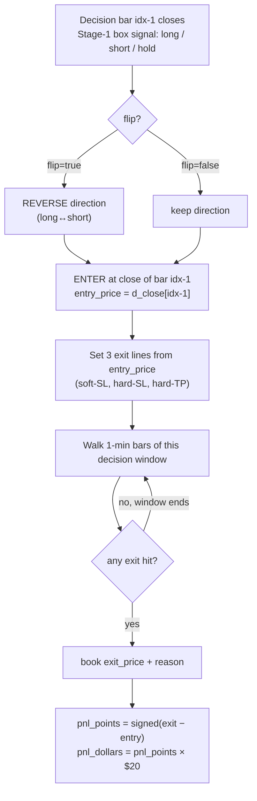
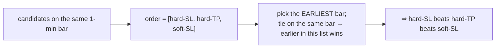
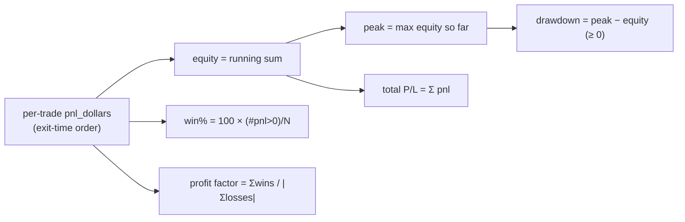
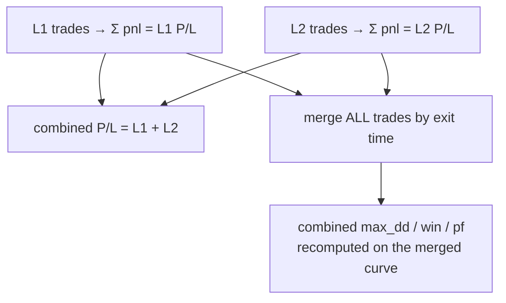

# How P/L Works — and Exactly How It's Calculated

> Scope: the NQ box strategy backtester (L1, L2, and the combined account). This explains the
> money math end-to-end and points at the exact code that does it. Everything here is verified
> against the source — file:line references are given so you can check each claim.
>
> Last reviewed: 2026-06-22 (post flip = reverse-entry-only).

---

## TL;DR — the one formula

Every trade is **1 contract**. P/L is just the price you exited minus the price you entered,
in the direction you actually held, times **$20 per NQ point**:

```
pnl_points  = (exit_price − entry_price)   if you entered LONG
            = (entry_price − exit_price)   if you entered SHORT

pnl_dollars = pnl_points × 20.0            # NQ_POINT_VALUE, $/point/contract
```

No fees, no commission, no slippage, no position sizing. One contract, clean prices.
Everything else in this document is *which* price is the entry, *which* is the exit, and how
per-trade dollars roll up into the equity curve, drawdown, win-rate, and profit factor you see
on the dashboard.

---

## 1. Units & constants

| Constant | Value | Where | Meaning |
|---|---|---|---|
| `NQ_POINT_VALUE` | **20.0** | `config.py:26`, `engine.py:154` | USD per index point, per contract |
| Position size | **1 contract** | `engine.py:24` | Fixed. No ladder, no scaling |
| `DD_CAP` | 5000.0 | `config.py:40` | Drawdown circuit-breaker goal (a *risk control*, not part of the P/L formula) |
| `YEARS` | (2025, 2026) | `config.py:24` | Used only to split P/L into `pnl_2025` / `pnl_2026` |
| Fees / commission / slippage | **none** | — | Not modeled anywhere |

So a 1-point favorable move = **$20**. A 100-point stop = **−$2,000**. The l2v1 champion's
"impossible −5k" loss was its 271.46-point hard stop: `271.46 × 20 = −$5,429`.

---

## 2. The trade lifecycle

A trade is opened on the **decision timeframe** (e.g. the 4h bar) and exited by walking the
**1-minute bars** inside that decision window. One position at a time per layer.



**No look-ahead:** the signal is read from the *just-closed* bar `idx-1`; entry is its close;
exits are the 1-minute bars that come *after* that close (`engine.py:330-336, 477-479`).

---

## 3. Entry price

The entry fill is the **close of the just-closed decision bar** — `d_close[idx-1]`.

- `engine.py:409-410` → `entry_px = float(d4_close[idx - 1])`
- `fast_engine.py:87` → `ep = float(d_close[idx - 1])`

Both engines use the identical source, so they agree trade-for-trade (locked by
`optimize/test_fast_parity.py`).

---

## 4. The exit model

There is exactly **one take-profit and two stop-losses**. They are placed as absolute price
lines at entry, a fixed point-distance away (the `sl_soft` / `sl_hard` / `tp` parameters,
in points):

| Line | LONG | SHORT | Code |
|---|---|---|---|
| Soft stop-loss | `entry − sl_soft` | `entry + sl_soft` | `engine.py:449,454` |
| Hard stop-loss | `entry − sl_hard` | `entry + sl_hard` | `engine.py:450,455` |
| Hard take-profit | `entry + tp` | `entry − tp` | `engine.py:451,456` |

> *(There are optional per-bar multipliers `_m`/`_tm` for the regime study; they default to
> `1.0` (`engine.py:370-381`), so in the dashboard and normal backtests the lines are exactly
> the distances above. There is **no soft take-profit** — it was removed 2026-06-22.)*

### 4.1 How each exit fills

| Exit reason | Trigger | Fill price | Code |
|---|---|---|---|
| `STOP_LOSS_HARD` | 1-min **low ≤** hard line (long) / **high ≥** (short) — intrabar touch | **the line** | `engine.py:299-300, 309-310` |
| `TAKE_PROFIT_HARD` | 1-min **high ≥** TP line (long) / **low ≤** (short) — intrabar touch | **the line** | `engine.py:301-302, 311-312` |
| `STOP_LOSS_SOFT` | **2 consecutive** 1-min **closes** past the soft line | **the 2nd close** (not the line) | `engine.py:303-317` |
| `L1-entry` (L2 only) | L1 takes a position → L2 force-flat | bar close | combined/causal path |
| `OPEN` | dataset ends with position still open | — (not counted as a realized trade's exit) | `engine.py:481-483` |

**Hard exits fill at the line** (a touch is assumed fillable at that price). **Soft-SL fills at
the close that confirmed it** — it needs two consecutive 1-minute closes beyond the line, and
books the second close as the exit; a single breach that snaps back resets the counter
(`engine.py:328`; vectorized in `fast_engine.py:113-118`).

### 4.2 Precedence within a bar — loss-first

If more than one condition is live, the engine is pessimistic: **hard-SL > hard-TP > soft-SL**.



`fast_engine.py:122` → `order = [(t_slh, R_SL_HARD, slh_line), (t_tph, R_TP_HARD, tph_line), (t_soft, R_SL_SOFT, None)]`
and the earliest-index / lowest-rank selection at `fast_engine.py:125-132`. Same rule stated in
`engine.py:14`.

---

## 5. Per-trade P/L — the money line

`engine.py:503-509` (`_finalise`):

```python
if direction == 'long':
    pnl = fill - entry_price
else:
    pnl = entry_price - fill
trade['pnl_points']  = pnl
trade['pnl_dollars'] = pnl * point_value      # point_value = 20.0
```

Vectorized twin, `fast_engine.py:139`: `pnl_pts = (fill - ep) if d == LONG else (ep - fill)`.

### Worked examples (entry at 20,000.00)

| Scenario | Line | Exit reason | Fill | pnl_points | **pnl_dollars** |
|---|---|---|---|---|---|
| LONG, tp = 57 | 20,057 | TAKE_PROFIT_HARD | 20,057.0 | +57.0 | **+$1,140** |
| LONG, sl_hard = 178 | 19,822 | STOP_LOSS_HARD | 19,822.0 | −178.0 | **−$3,560** |
| LONG, sl_soft = 110 | 19,890 | STOP_LOSS_SOFT | 19,885.0 (2nd close) | −115.0 | **−$2,300** |
| SHORT, tp = 57 | 19,943 | TAKE_PROFIT_HARD | 19,943.0 | +57.0 | **+$1,140** |

Note the soft-SL example books **−115**, not −110: it fills at the confirming *close*, which can
be a little past the line. That is the whole point of "soft" — it waits for confirmation instead
of firing on an intrabar wick.

---

## 6. `flip` (reverse-entry-only) and how to read P/L

As of 2026-06-22, `flip` does **one** thing: it reverses the **entry direction** (a box *short*
signal makes you enter *long*, and vice-versa). It does **not** change the exit model.

`fast_engine.py:79` → `d = -raw if flip else raw` (entry direction). `engine.py:364-367` swaps the
signal before the lines are built. After that, soft-SL / hard-SL / hard-TP and the P/L formula all
apply to the **direction you actually entered**, exactly as for a normal trade.

**Reading rule for logs:** trust the *entered* direction. If a row says you entered **long**, then
P/L = `exit − entry`, the take-profit is *above* entry and both stops are *below* — even if the box
signal that triggered it was a short. The dashboard tags these rows with a `⇄` badge so a reader
doesn't have to reverse anything mentally.

---

## 7. From trades to the numbers on screen

Trades are booked in **exit-time order** into a single running account (`optimize/core.py:127-150`):

```python
pnl  = float(t["pnl_points"]) * pv     # points → dollars        (core.py:134)
eq  += pnl                             # cumulative equity        (core.py:142)
peak = max(peak, eq)                   # high-water mark          (core.py:143)
dd   = peak - eq                       # underwater (≥ 0)         (core.py:144)
```



The summary block (`optimize/core.py:177-185`):

| Metric | Formula | Code |
|---|---|---|
| **Total P/L** | `Σ pnl_dollars` | `core.py:177` |
| **pnl_2025 / pnl_2026** | sum filtered by `exit_time.year` | `core.py:178-179` |
| **max_dd** | `max(peak − equity)` over all trades = `(maximum.accumulate(eq) − eq).max()` | `core.py:159,180` |
| **win** | `100 × (pnl > 0).mean()`, 1 dp | `core.py:183` |
| **pf** (profit factor) | `Σ(winning pnl) / |Σ(losing pnl)|`, 2 dp; `None` if no losses | `core.py:184-185` |
| **exposure** | `100 × taken / candidates` | `core.py:182` |

**Sign convention:** drawdown is stored **positive** (it's `peak − equity`, the depth underwater).
A reported `max_dd` of `$7,136` means the equity curve was, at worst, $7,136 below its prior peak.

**Drawdown circuit-breaker:** if `use_brk` is on, once realized drawdown crosses the cap the engine
*skips* subsequent candidate trades for a cooldown (`core.py:135-142`, the `locked`/`skipped` path).
That changes *which trades are taken*; it does not change how a taken trade's P/L is computed.

---

## 8. The combined L1 + L2 account

L1 (the frozen lean champion) and L2 (which trades the signals L1 dropped) are **separate
positions** but report into **one** account. L2 force-flattens when L1 opens, so the two never
hold at the same time.

- **Per-layer equity/DD** are booked in exit-time order and written onto each layer's rows
  (`optimize/l2/logbook.py:175-183`).
- **Combined P/L = L1 P/L + L2 P/L** (simple sum), and the combined **max_dd / win / pf are
  recomputed over the merged L1+L2 trade set**, again in exit-time order
  (`optimize/l2/aggregate.py:138-176`, `_merged_dd`).



> The combined drawdown is **not** `L1_dd + L2_dd` — it is the underwater of the *merged* equity
> curve, which is generally smaller than the sum (the layers' drawdowns don't line up in time).
> Example anchor (l2v2): L1 $149,989 + L2 $25,383 = **combined $175,372** over 289 trades.

---

## 9. What is *not* in the P/L

Be aware of the modeling assumptions — they make the backtest optimistic vs. live trading:

- **No costs.** No commission, exchange fees, or slippage. Live, budget a few points/round-trip.
- **Hard exits fill exactly at the line.** A touch is assumed fillable at that price; in reality a
  gap-through could fill worse.
- **1 contract, always.** No sizing, no compounding, no margin model. Equity is a pure sum of
  per-trade dollars starting from 0.
- **Soft-SL fills at the confirming 1-min close** — realistic, but it does mean the realized loss
  can slightly exceed the nominal `sl_soft` distance (see the −115 vs −110 example).

---

## 10. Where it lives (quick map)

| Concern | File:line |
|---|---|
| Point value `$20`, `DD_CAP`, `YEARS` | `config.py:24,26,40` |
| Entry price (`d_close[idx-1]`) | `engine.py:409-410` · `fast_engine.py:87` |
| Exit lines (long/short) | `engine.py:447-456` |
| Exit triggers + fills | `engine.py:299-317` |
| Soft-SL 2-close rule | `engine.py:303-317,328` · `fast_engine.py:113-118` |
| Exit precedence (SL>TP>soft) | `engine.py:14` · `fast_engine.py:120-132` |
| `flip` = reverse entry only | `engine.py:364-367` · `fast_engine.py:79` |
| Per-trade P/L | `engine.py:503-509` · `fast_engine.py:139` |
| Equity / DD / win / pf | `optimize/core.py:127-189` |
| Combined L1+L2 | `optimize/l2/logbook.py:175-183` · `optimize/l2/aggregate.py:138-176` |

**Two engines, one answer.** `engine.py` is the readable Python loop; `optimize/fast_engine.py` is
the vectorized NumPy version used by the optimizer. They are kept **trade-for-trade identical** by
`optimize/test_fast_parity.py`, so the P/L you see in a single backtest matches what the optimizer
scored — by construction.
