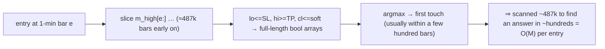

# Backtester optimization — the bounded exit-scan (analysis + design, parked)

*Output of the Optimization SOP (phases 1–4) applied to `fast_backtest`. The backtester is **not** maxed: one
measured O(M)-per-entry inefficiency. This documents the finding, the parity-preserving fix, the ROI gate, and
the implementation/test plan — **parked for study; not yet built.** Reopen via `OPTIMIZATION_SOP.md` if L1
full-set sweeps become routine.*

---

## 0. TL;DR

`fast_backtest` scans the **entire remaining 1-minute series** (`m_high[e:]`, `cl <= line`, … over up to
~487k bars) **for every entry**, even though exits are found within the first few hundred bars — making each
entry **O(M)** instead of O(exit-distance). cProfile: **89% of the time is this per-entry scanning**, not the
numpy primitives. The fix — a **doubling forward window with a full-scan fallback** — is **byte-parity-preserving**
by construction and cuts the common case to O(exit-distance). ROI is **run-type-dependent**: low for L2/dashboard,
**meaningful for L1 full-set sweeps** (e.g. `wshes1`, where the scan is now the dominant warm-trial cost after
the vote cache). **Build it only if L1 full-set/contributor sweeps become routine** (SOP don't-gold-plate rule).

---

## 1. The measurement (SOP phase 1–2)

`fast_backtest` (`optimize/fast_engine.py`), NQ 4h, 1-minute frame = **486,969 bars**:

| run | trades | time |
|---|--:|--:|
| all-pass gate (worst case) | 564 | **125 ms** |
| real gate (vol+indicators) | 255 | **59 ms** |

cProfile (10× all-pass, cumulative): total 1.46 s, of which **`fast_backtest`'s own code = 1.31 s (89%)**;
the numpy primitives (`searchsorted`/`argmax`/`any`) total only ~0.15 s.

**Conclusion:** the cost is not the numpy ops — it's the function's own per-entry work: building and scanning
boolean arrays over the full remaining 1-minute slice.

## 2. The root cause (SOP phase 3)

Inside the `while idx < n` entry loop, for **each** entry at 1-minute index `e`:

```python
hi, lo, cl = m_high[e:], m_low[e:], m_close[e:]          # slices to END of data (up to ~487k bars)
t_slh = _first_true(lo <= slh_line)                      # full-length boolean array + scan
t_tph = _first_true(hi >= tph_line)                      # "
soft_breach = cl <= sls_line                             # full-length boolean array
# ... pairwise-AND over soft_breach, argmax, etc.
```

Each comparison allocates and scans a `len(cl)` boolean array. Early in the series `len(cl) ≈ 487k`, while the
exit is typically found within hundreds of bars. So per entry it does **~O(M)** work to discover an
**O(exit-distance)** answer. Many entries × full-remaining-scan = the 89%.



## 3. The fix — doubling window + full-scan fallback (SOP phase 4, recommended)

Replace the inline full-slice scan with a helper `_first_exit(hi, lo, cl, lines, …)` that searches a **forward
window** `[e : e+W]`:

1. Start `W = W0` (e.g. 2048 1-minute bars ≈ 1.4 trading days).
2. Compute **all four** exit-kind first-touches **within the window** (hard-SL, hard-TP, soft = 2 consecutive
   breaching closes, time/EOD cap).
3. If ≥1 is found → the **earliest across kinds** is the exit (priority order breaks same-bar ties — unchanged).
4. If none found → **double `W`** and retry; if `W` reaches end-of-data with no exit → the existing OPEN/break.

The **selection semantics are untouched** — only *how far we scan to find the earliest* changes.

### Why it is byte-parity-preserving (the proof)
The true exit is the earliest touch across kinds at some bar `X`. The window `[e:e+W]` is **contiguous from
`e`**, so once `W ≥ X-e` it contains `X` **and every earlier bar**. Therefore "earliest touch within the
window" equals the **global earliest** — identical bar, kind, and fill. The doubling guarantees we expand until
either an exit is found (⇒ identical to the full scan) or we exhaust the data (⇒ identical OPEN/break). The
window is a pure fast-path; it never changes *which* exit is chosen.

Edge cases that stay correct:
- **Soft "2 consecutive closes":** both breaching bars are within the window when the fire bar ≤ `W`; the
  pairwise-AND over the window slice finds the same first fire. If it would fire just past `W` → window-miss →
  double. ✓
- **Same-bar ties across kinds:** all kinds are evaluated over the *same* window, so the priority-rank
  tiebreak is applied to the same candidate set as the full scan. ✓
- **Split SL/TP, flip, cap, EOD:** untouched — they already index relative to `e`. ✓

### Alternatives considered
- **(B) Fixed window + exact full-scan fallback.** Simpler parity story (fallback *is* the unchanged code) but
  `W` is a tuned magic constant; frequent fallback if too small, little win if too large. Doubling adapts.
- **(C) Precompute `cummin(low)`/`cummax(high)` once → searchsorted per entry (O(log M)).** Elegant for hard
  SL/TP (the running extreme is monotonic), but the soft 2-consecutive-closes rule doesn't reduce to a running
  extreme — needs separate handling → more complexity + parity risk. Deferred.

## 4. ROI gate (SOP phase 7–8) — when to build

| context | backtest share | ROI |
|---|---|---|
| **L2 sweeps** (thin residual, few entries) | ~5 ms/trial | **low** — not the bottleneck |
| **Dashboard** (one interactive run) | ~125 ms once | **low** — already fine |
| **L1 full-set sweeps** (many entries; ~6 backtests × ~60 ms ≈ **360 ms/trial warm**) | dominant warm cost *after the vote cache* | **meaningful** |

**Trigger to build (SOP §5):** L1 full-set / contributor sweeps (e.g. more `wshes`-style runs) become routine
**and** a run would take > ~12 h. Otherwise the don't-gold-plate law says leave it logged.

## 5. Implementation sketch (for the eventual plan)

- **New:** `_first_exit(...)` helper in `optimize/fast_engine.py` encapsulating the doubling-window search +
  the (unchanged) candidate-priority selection.
- **Modify:** `fast_backtest`'s per-entry block to call `_first_exit` instead of the inline full-slice scans.
- **No public signature change**; `engine.py`/`logbook` (the exact causal engine) is **not** touched — only the
  optimizer fast path.
- `W0` a module constant (start 2048; doubling makes it non-critical).

## 6. Test plan (TDD, parity-first)

1. **Equivalence oracle:** capture the *current* `fast_backtest` output on a randomized matrix of `(entry bar,
   sl_soft, sl_hard, tp, flip, long/short split, cap modes)` **before** editing; assert the windowed version is
   **byte-identical** to that oracle.
2. **Window-boundary cases:** exit exactly at `W`, just past `W` (forces a doubling), and never (OPEN/break) —
   all identical.
3. **Existing locks:** `optimize/test_fast_parity.py` (fast↔exact engine) green; **golden 6/6**; L2 suite.
4. **Re-measure:** all-pass (125 ms) + real-gate (59 ms) + an L1 full-set warm-trial timing — confirm the win.

## 7. Status

**PARKED — analysis complete, not built.** This is the backtester's one known optimization lever. The
backtester is otherwise well-optimized (vectorized first-touch; fast↔exact parity-locked). Reopen via
`OPTIMIZATION_SOP.md` (brainstorm→spec→plan→TDD) when the §4 trigger fires.

*Companion: `OPTIMIZATION_SOP.md` (the procedure), `PERFORMANCE.md` (engine history + golden contract),
`optimize/fast_engine.py` (the code).*
