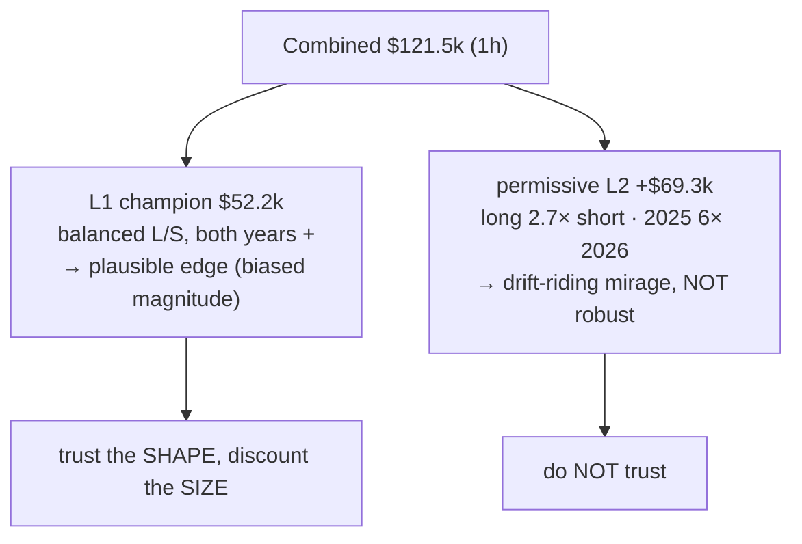

# Is the ES result real? — validity study of the ES 1h champion + the $121.5k combined number

**Date:** 2026-06-30
**Question (user):** the backtester is wired correctly, so is the >$120k ES combined result a lucky random
shot that found an amazing strategy, or is it not real? Deep study.

**TL;DR.** The **$121.5k combined number is largely a mirage** — ~$69k of it comes from an *unoptimized*,
*long-biased*, *2025-concentrated* permissive L2 layer that mechanically rides ES's +24% bull drift over a
short 16-month sample. The **L1 1h champion ($52k) is far more credible** — balanced long/short, consistent
across both years, selected by a robustness objective — **but** it is still the winner of 6,056 feasible
trials on a single-regime sample with **no true out-of-sample holdout**, so its magnitude is optimistically
biased and its forward edge is *plausible but unproven*. It is **not "amazing"**; it is "promising, unvalidated."

---

## 0. The sample we're judging on (this dominates everything)

- ES data spans **only 2025-01-01 → 2026-05-19 (~16.5 months)**, 8,121 1h bars.
- ES rose **+24.3%** over that window (2025 +16.1%, 2026 +6.9%) — a **monotonic bull regime**, no bear/chop.
- **Buy-and-hold 1 contract = $72,138.** The L1 champion ($52k) *underperforms* buy-hold in raw dollars
  (but is roughly market-neutral and far lower-risk — see §1).
- There is **no period the optimizer never saw**: the walk-forward folds + the full-period feasibility
  constraint both used 2025 **and** 2026. So "2026" is *not* a clean holdout — it is pseudo-OOS at best.

A 16-month, single-direction sample is a small, easy stage to look good on. Hold this in mind for all numbers.

## 1. L1 1h champion ($52,185 full / $14,161 median-fold) — CREDIBLE

Decomposition of the 210 trades:

| cut | P/L | trades | win% |
|---|---:|---:|---:|
| **long** | $24,885 | 90 | 40% |
| **short** | $27,300 | 120 | 38% |
| 2025 | $30,073 | 152 | 38% |
| 2026 (4.5 mo) | $22,113 | 58 | 41% |

**Why this is credible, not drift:**
- **Shorts ($27.3k) outearn longs ($24.9k) in a +24% bull market.** A drift-rider is long-dominated; this is
  balanced and even short-tilted → it is finding genuine two-sided box setups, not just buying the rally.
- **Both years positive, both directions positive.** 2026's $22k in 4.5 months annualizes *above* 2025's $30k
  → no decay in the recent period.
- Low win rate (~38%) with positive expectancy is the normal signature of a breakout-box (small losses, larger
  TP-side wins) — not a curve-fit artifact.

**The caveat — selection bias / winner's curse:**
- The champion is the **#1 of 6,056 feasible trials** on the selection objective (median-fold P/L $14,161 = the
  single max; p99 $12,020, p90 $7,366, median $3,623).
- Mitigants: (a) selection was by **median *fold* P/L** (cross-time-slice consistency), **not** peak full P/L —
  in fact the max-full-P/L config ($72,542) was **rejected** for being less fold-consistent; (b) the champion
  sits on a **populated plateau** (293 feasible trials ≥ $40k full P/L, 147 ≥ $50k), not an isolated spike.
- But picking the max of 6k on 16 months still means **forward performance will regress** toward the p90–p99
  band, not the headline $52k. Treat $52k as an *upper* estimate.

**Verdict (L1):** a *plausible, modest, two-sided edge* on this regime — but magnitude is optimistically biased
and unproven out-of-sample.

## 2. The permissive L2 layer (+$69,316) — NOT robust; this is the mirage

The combined $121.5k = L1 $52.2k + the L2 layer. The L2 used here is the **scaled-permissive default — NOT an
optimized champion** (no ES L2 was ever optimized). It takes **every** signal L1 dropped (539 trades vs L1's 210).

| cut | P/L | trades | win% |
|---|---:|---:|---:|
| **long** | **$50,728** | 269 | 63% |
| **short** | **$18,588** | 270 | 58% |
| **2025** | **$59,756** | 385 | 62% |
| **2026 (4.5 mo)** | **$9,560** | 154 | 58% |

**Two red flags, opposite to L1:**
1. **Long-biased: longs earn 2.7× shorts** ($50.7k vs $18.6k) on equal trade counts → this layer is
   *mechanically harvesting the bull drift*. "Always take a position on every dropped signal" in a trending
   market = a thinly-disguised long-the-trend bet.
2. **2025-concentrated: $59.8k in 2025 vs $9.6k in 2026.** Annualized, the L2 "edge" **collapsed ~70%** in the
   recent period. That is the opposite of a stable strategy.

**Verdict (L2):** the +$69k is **not a real edge** — it is drift + a short favorable sample + an untuned
"take-everything" layer. The headline $121.5k is inflated by it.

## 3. Direct answer

- **"Random shot that found an amazing strategy"?** Partly. The *combined* $121.5k is mostly the random-shot
  side — an unoptimized permissive layer that got lucky on a 16-month bull. Don't trust it.
- **"Not real"?** The L1 champion is *not fake* — its balanced, two-year-consistent, short-also-profitable
  profile is hard to fake by pure noise. But its **size is overstated** (winner of 6k trials, no holdout,
  easy regime). Reality is a smaller, real-ish edge — not an "amazing" one.

## 4. What would make it trustworthy (recommendations)

1. **A true out-of-sample holdout.** Re-optimize on 2025 only, then evaluate *untouched* 2026 (and ideally
   forward-paper-trade). The current pipeline used all data for selection → no honest OOS exists yet.
2. **More + harder data.** 16 months of pure uptrend is the easiest possible test. Get older ES history that
   includes a bear/chop regime; the edge must survive a non-bull period to be real.
3. **Optimize the L2 layer for ES** (the `--instrument ES` L2 optimizer is wired but never run). Replace the
   drift-riding permissive layer with a tuned one, then re-judge combined — and judge it long/short-balanced
   and year-stable, not on headline P/L.
4. **Benchmark vs buy-hold + report risk-adjusted.** $52k < $72k buy-hold in raw $; the L1 case rests on being
   ~market-neutral at far lower drawdown, so report Sharpe/DD-adjusted, not just P/L.
5. **Quote the regressed estimate, not the max.** Use the p90–p99 of the fold objective as the honest forward
   expectation for any champion picked as the max of thousands of trials.

## 5. Method notes / caveats

- The 1h champion is analysed in depth as representative; the L2 long-drift conclusion is **structural** (a
  "take-every-dropped-signal" layer is mechanically trend-following), so it generalizes across TFs — but a
  per-TF confirmation run is the obvious next step.
- Engine validity is *not* in question: the dashboard reproduces the optimizer's full_pnl within ~3%
  (see the cap_1min round-trip fix). The doubt here is about **statistical validity of the result**, not the
  backtester's correctness.
