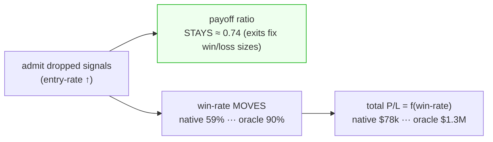

# Kalman / signal-fusion study — results

Extends `docs/RESEARCH_SIGNAL_FUSION_KALMAN.md`. Design:
`docs/superpowers/specs/2026-07-01-kalman-signal-fusion-study-design.md`. Plan:
`docs/superpowers/plans/2026-07-01-kalman-signal-fusion-study.md`. Code: `research/kalman_fusion/`.

**Question:** can Kalman state-estimation / signal fusion admit far more of the box signals the champion
currently drops (~75% target vs ~31% today), *without* degrading the payoff ratio — so total P/L rises?

---

## M0 — the ceiling (NQ 4h champion, full research window)

Reused the canonical champion (wsh4 lean 4h, $142,203 / 214 trades) as the baseline. For every box signal the
champion **dropped while flat** (482 of them), replayed it under the champion's exact exits in its box direction
(**native**) and in the best-of-both directions (**oracle** — an upper bound that peeks at the outcome).

| stratum | dropped n | variant | entry-rate | payoff | total P/L | win% |
|---|--:|---|--:|--:|--:|--:|
| **champion** | – | base | 30.7% | 0.74 | $142,203 | 69.2% |
| **all dropped** | 482 | box-native | 100% | 0.74 | $78,074 | 59.5% |
| **all dropped** | 482 | **oracle** | 100% | 0.74 | **$1,300,931** | 90.5% |
| vetoed | 278 | oracle | 70.7% | 0.74 | $810,515 | 86.6% |
| vetoed | 278 | box-native | 70.7% | 0.74 | $105,176 | 61.2% |
| vol_gated | 204 | oracle | 60.1% | 0.74 | $632,619 | 84.2% |
| vol_gated | 204 | box-native | 60.1% | 0.74 | $115,101 | 62.4% |
| confirm<K | 0 | — | — | — | — | — |

*(K=1 for this champion, so nothing is dropped by "confirm<K"; all drops are vol-gate or veto. Artifacts:
`research/kalman_fusion/ceiling_4h.csv`.)*

## The structural finding (matters more than the headline number)

**Payoff ratio is pinned at 0.74 across every stratum and variant.** That is not a coincidence: the exits
(TP ≈ 120 pt, hard-SL ≈ 163 pt) fix the *sizes* of wins and losses, so the win/loss magnitude ratio ≈ 120/163 ≈
0.74 **regardless of which signals you admit**. Entry selection moves **win-rate** (and therefore total P/L),
**not** payoff.

**Consequences:**
1. The user's constraint — *"increase entries while payoff holds or improves"* — is **structurally satisfied
   for free** as long as exits are unchanged. Payoff can't fall below today's from admitting more; it's a
   constant of the exit rules. (It only moves if a mechanism changes exits — that's M3's regime-scaled-exit arm.)
2. So the **entire problem reduces to DIRECTION / win-rate on the admitted signals.** Admitting them *box-native*
   is a net loss vs the champion ($78k < $142k — the gate is correctly filtering at the *box* direction). But the
   **oracle ceiling is ~9× ($1.3M)** — the whole gap is a directional-information gap.
3. The rescuable flow is large and roughly even across both drop reasons (vetoed oracle $810k on 278 signals,
   vol_gated oracle $632k on 204).

## Decision gate → **PROCEED to M1/M2/M3**

The dropped flow is **highly rescuable, and the lever is direction.** This is exactly what fusion /
state-estimation targets:

- **M1 (champion-signal fusion)** and **M2 (price/trend state)** — estimate the *direction* of each admitted
  dropped signal. Any lift in directional accuracy over "box-native" converts directly to win-rate and total
  P/L, at fixed payoff 0.74. The realistic target sits between native ($78k) and oracle ($1.3M).
- **M3 (vol/regime state)** — its distinctive lever is **exits by regime**, the only way to move payoff *above*
  0.74; and conditional admission to avoid the chop bars where *both* directions lose.

**Caveats:** oracle is an upper bound (peeks at outcomes), not achievable — it sizes the prize, not the result.
n=1 / in-sample (2025→2026). The real test is whether a *causal* director captures a meaningful fraction of the
native→oracle gap **out-of-sample** — that is Phase 2+ (each its own plan), and the l2v3 lesson (in-sample fronts
lie) governs promotion.

---

*Phase 1 delivered: parity-safe research rig (`research/kalman_fusion/` — `metrics`, `rig`, `ceiling`,
`run_ceiling`; 10 tests; champion reproduced byte-for-byte) + this M0 ceiling. Production engine + golden gate
untouched.*
