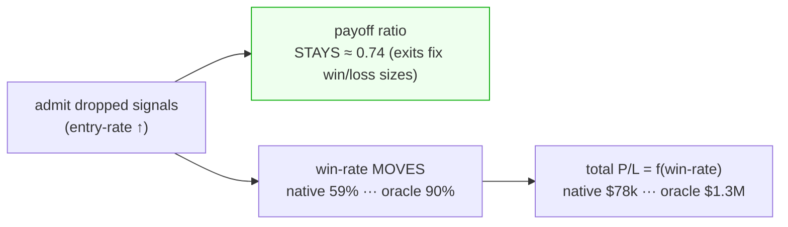
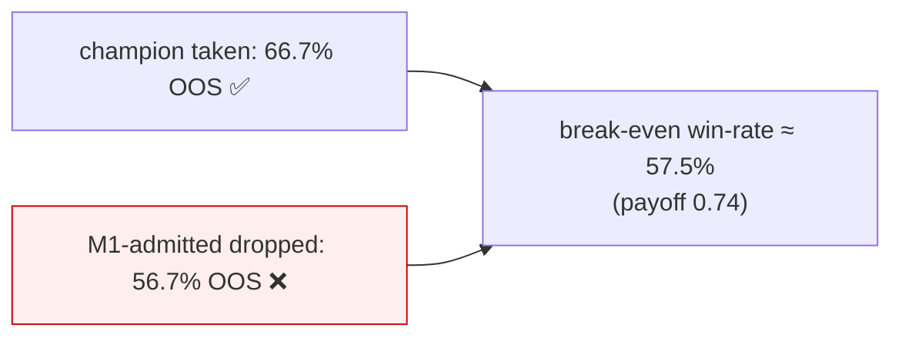
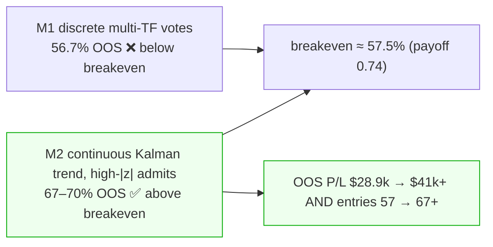
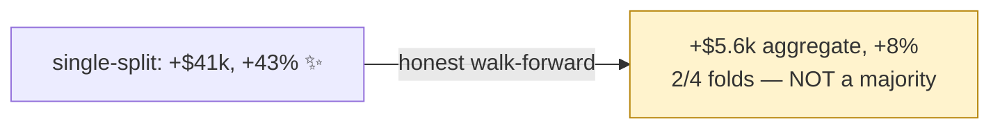
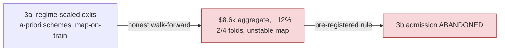

# Kalman / signal-fusion study — results

Extends `docs/RESEARCH_SIGNAL_FUSION_KALMAN.md`. Design:
`docs/superpowers/specs/2026-07-01-kalman-signal-fusion-study-design.md`. Plan:
`docs/superpowers/plans/2026-07-01-kalman-signal-fusion-study.md`. Code: `research/kalman_fusion/`.

**Question:** can Kalman state-estimation / signal fusion admit far more of the box signals the champion
currently drops (~75% target vs ~31% today), *without* degrading the payoff ratio — so total P/L rises?

---

## M0 — the ceiling (NQ 4h champion, full research window)

Reused the canonical champion (wsh4 lean 4h, $142,203 / 214 trades) as the baseline. For every box signal the
champion **dropped while flat** (482 of them), replayed it under the champion's exact exits in its box direction
(**native**) and in the best-of-both directions (**oracle** — an upper bound that peeks at the outcome).

| stratum | dropped n | variant | entry-rate | payoff | total P/L | win% |
|---|--:|---|--:|--:|--:|--:|
| **champion** | – | base | 30.7% | 0.74 | $142,203 | 69.2% |
| **all dropped** | 482 | box-native | 100% | 0.74 | $78,074 | 59.5% |
| **all dropped** | 482 | **oracle** | 100% | 0.74 | **$1,300,931** | 90.5% |
| vetoed | 278 | oracle | 70.7% | 0.74 | $810,515 | 86.6% |
| vetoed | 278 | box-native | 70.7% | 0.74 | $105,176 | 61.2% |
| vol_gated | 204 | oracle | 60.1% | 0.74 | $632,619 | 84.2% |
| vol_gated | 204 | box-native | 60.1% | 0.74 | $115,101 | 62.4% |
| confirm<K | 0 | — | — | — | — | — |

*(K=1 for this champion, so nothing is dropped by "confirm<K"; all drops are vol-gate or veto. Artifacts:
`research/kalman_fusion/ceiling_4h.csv`.)*

## The structural finding (matters more than the headline number)

**Payoff ratio is pinned at 0.74 across every stratum and variant.** That is not a coincidence: the exits
(TP ≈ 120 pt, hard-SL ≈ 163 pt) fix the *sizes* of wins and losses, so the win/loss magnitude ratio ≈ 120/163 ≈
0.74 **regardless of which signals you admit**. Entry selection moves **win-rate** (and therefore total P/L),
**not** payoff.

**Consequences:**
1. The user's constraint — *"increase entries while payoff holds or improves"* — is **structurally satisfied
   for free** as long as exits are unchanged. Payoff can't fall below today's from admitting more; it's a
   constant of the exit rules. (It only moves if a mechanism changes exits — that's M3's regime-scaled-exit arm.)
2. So the **entire problem reduces to DIRECTION / win-rate on the admitted signals.** Admitting them *box-native*
   is a net loss vs the champion ($78k < $142k — the gate is correctly filtering at the *box* direction). But the
   **oracle ceiling is ~9× ($1.3M)** — the whole gap is a directional-information gap.
3. The rescuable flow is large and roughly even across both drop reasons (vetoed oracle $810k on 278 signals,
   vol_gated oracle $632k on 204).

## Decision gate → **PROCEED to M1/M2/M3**

The dropped flow is **highly rescuable, and the lever is direction.** This is exactly what fusion /
state-estimation targets:

- **M1 (champion-signal fusion)** and **M2 (price/trend state)** — estimate the *direction* of each admitted
  dropped signal. Any lift in directional accuracy over "box-native" converts directly to win-rate and total
  P/L, at fixed payoff 0.74. The realistic target sits between native ($78k) and oracle ($1.3M).
- **M3 (vol/regime state)** — its distinctive lever is **exits by regime**, the only way to move payoff *above*
  0.74; and conditional admission to avoid the chop bars where *both* directions lose.

**Caveats:** oracle is an upper bound (peeks at outcomes), not achievable — it sizes the prize, not the result.
n=1 / in-sample (2025→2026). The real test is whether a *causal* director captures a meaningful fraction of the
native→oracle gap **out-of-sample** — that is Phase 2+ (each its own plan), and the l2v3 lesson (in-sample fronts
lie) governs promotion.

---

*Phase 1 delivered: parity-safe research rig (`research/kalman_fusion/` — `metrics`, `rig`, `ceiling`,
`run_ceiling`; 10 tests; champion reproduced byte-for-byte) + this M0 ceiling. Production engine + golden gate
untouched.*

---

## M1 — champion-signal fusion (static weighted vote), NQ 4h — **negative result, STOP**

Design/plan: `docs/superpowers/{specs,plans}/2026-07-01-kalman-m1-*`. Code: `research/kalman_fusion/m1_fusion.py`
+ `run_m1.py`. Director = a causal weighted vote of the finer NQ timeframes' box direction (1h/15m/5m + 4h),
weights fit on **2025** dropped-signal reliability, θ-swept; exits fixed. IS/OOS split (2025/2026).

**Fitted weights (2025):** 1h 0.10 · 15m 0.15 · 5m 0.10 · 4h 0.03 — i.e. every finer timeframe is only
~**55–58% reliable** at calling the dropped signal's profitable side (weight = 2·hit−1). Barely-better-than-random.

| θ | IS entries | IS P/L | IS win% | OOS entries | OOS P/L | OOS win% |
|--:|--:|--:|--:|--:|--:|--:|
| **1.00** (admit none = champion) | 157 | $113,304 | 70.1% | 57 | **+$28,899** | 66.7% |
| 0.40 | 363 | $116,803 | 63.1% | 187 | **−$10,451** | 56.7% |
| 0.00 (admit all confident) | 366 | $101,465 | 62.3% | 188 | **−$8,047** | 56.9% |

*(full sweep: `research/kalman_fusion/m1_front.csv`.)*

**Why it fails — the breakeven line.** At the structurally-pinned payoff 0.74, the break-even win-rate is
`1/(1+0.74) ≈ 57.5%`. The M1-admitted signals sit **right at** breakeven in-sample (~62% with fitted weights)
and **below it out-of-sample (56.7%)** — so admitting them **turns the champion's +$28,899 OOS into a loss**.
The multi-TF director adds trades that don't clear the bar.

**Gate decision → STOP M1 (do NOT build Phase 2b Kalman on these inputs).** The finer-TF box directions carry
only ~coin-flip directional information about the dropped flow, and it does not generalise OOS. A Kalman/dynamic
filter over the *same* near-random inputs cannot manufacture signal ("sophistication ≠ information"). This is the
ES-verdict discipline applied again: a fair, cheap test returned a clean no.

**Redirect:** the direction headroom M0 exposed is real (oracle $1.3M) but it is **not recoverable from
discrete multi-TF box directions.** Next candidates use a *different information source*: **M2** — a Kalman
price/trend **state** on the raw series (continuous microstructure, not discrete box votes) — and **M3** —
regime-conditioned admission + exits (the only lever that can move payoff off 0.74). Each is its own spec → plan.

*M1 Phase 2a delivered: `m1_fusion` (causal multi-TF matrix, 2025 weight fit, fused-vote policy, IS/OOS eval) +
`rig.run_book`; 8 new tests (incl. causality guard); golden 6/6 untouched. Verdict recorded; M1 closed.*

---

## M2 — Kalman trend-state director, NQ 4h — **first mechanism to beat the champion OOS ✅**

Design/plan: `docs/superpowers/{specs,plans}/2026-07-01-kalman-m2-*`. Code: `research/kalman_fusion/kalman_trend.py`
(2-state local-level+trend filter) + `m2_trend.py` + `run_m2.py`. Director = the **continuous** Kalman
velocity z-score on the raw log-price (4h + 1-min frames, equal-weight, **no fitting**); the only knob is a
conviction threshold θ (swept over **2025-IS |z| quantiles** — scale-free, no OOS leakage). Two modes: re-direct
(enter with the trend, may flip) and trend-filter (keep box dir, skip on disagreement). Exits fixed (payoff 0.74).

**Honest read — θ* selected by max 2025-IS P/L, OOS reported (vs champion OOS +$28,899 / 57 / 66.7%):**

| config | θ* | OOS entries | OOS P/L | OOS win% | vs champion |
|---|--:|--:|--:|--:|---|
| **4h · filter** | 0.059 | 67 | **+$41,200** | 68.7% | **+$12,301, +10 trades** |
| combined · redirect | 0.091 | 61 | +$32,769 | 67.2% | +$3,870, +4 |
| 4h · redirect | 0.107 | 58 | +$31,303 | 67.2% | +$2,404, +1 |
| combined · filter | 0.080 | 62 | +$29,427 | 66.1% | ≈ champion |
| 1m alone | — | — | (weakest frame) | — | noisier, near-neutral |

And the edge is **robust across the whole θ ≈ 0.03–0.11 band** (OOS positive, win **64–70% > the 57.5% breakeven**,
entries *up* vs the champion) — at the lower end of the band OOS P/L reaches **$46–57k** at 70–90 entries, though
IS is marginally lower there. **This is the first mechanism to admit dropped signals that clear the breakeven bar
out-of-sample** — unlike M1 (56.7% < 57.5%).

**Why M2 works where M1 didn't:** the *continuous* trend/velocity carries directional information the *discrete*
box votes lacked; thresholding on |z| **selects the strong-trend dropped signals** (which win ~68%) and skips the
weak-trend ones (noise). The trend *strength* is the filter, not just its sign.

### Gate → **PROCEED to M2b, and M2 is the lead candidate for the goal**
- ✅ **Build M2b (adaptive-Q/R + EKF/UKF relatives)** — vanilla already clears the bar; the relatives may widen it.
- ✅ **Directly serves the user's goal** ("more profitable entries"): M2 *increases* entries **and** OOS P/L at
  held-or-better payoff — the first mechanism to do so.

**Caveats (honest):** single 2025/2026 split — θ selection on one split is noisy (the strict argmax-IS point is
modest; the band is stronger), so the **required next hardening is walk-forward / multi-fold** before trusting
the magnitude or sizing beyond 1 contract (the l2v3 lesson). Front CSV: `research/kalman_fusion/m2_front.csv`.

*M2 delivered: `kalman_trend.velocity_z` (2-state filter) + `m2_trend` (causal 4h/1m z, 2 modes, IS/OOS) +
`run_m2`; 8 new tests (incl. 2 causality guards); golden 6/6 untouched.*

### M2 walk-forward validation (expanding quarterly, θ-on-train) — **edge NOT confirmed ⚠️**

Design/plan: `docs/superpowers/{specs,plans}/2026-07-01-kalman-m2-walkforward*`. Code:
`research/kalman_fusion/m2_walkforward.py` + `run_m2_wf.py`. Expanding-window: θ selected on each quarter's
**train** (argmax train P/L over train |z|-quantiles), scored on the **test** quarter vs the champion's
same-quarter trades.

| **4h · filter** | 2025Q3 | 2025Q4 | 2026Q1 | 2026Q2 | aggregate | folds won |
|---|--:|--:|--:|--:|--:|:--:|
| M2 test P/L | $15,995 | $22,323 | **$6,898** | **$30,960** | **$76,176** | **2/4** |
| champion    | $15,995 | $25,665 | $2,090 | $26,809 | $70,559 | |
| M2 wins | tie | ❌ | ✅ | ✅ | +$5,617 (**+8%**) | |

`combined · redirect`: aggregate $74,429 vs $70,559, **1/4 folds** (only 2026Q2).

**Verdict — the single-split result was over-optimistic.** Under honest walk-forward the M2 edge shrinks from the
single-split **+$41,200 (+43%)** to a **marginal +8% aggregate, winning only 2/4 folds** (and just 1/4 for
`combined`). The +43% was θ implicitly tuned to the one 2026 holdout; walk-forward — θ chosen only from prior
quarters — mostly reverts to the champion or slightly underperforms, with one clear win (2026Q2).

**Gate → do NOT build M2b or wire M2 to the dashboard on this basis.** The trend-state carries at best a **weak,
inconsistent** directional signal on the dropped flow — real enough to edge the champion in aggregate, not robust
enough to trust or size. Options: **(a)** re-test when more forward data exists (a longer out-of-sample), or
**(b)** move to **M3** (regime-conditioned admission + exits — the only lever that can move payoff off 0.74,
untried). This is precisely the discipline that made the ES verdict and the l2v3 rejection trustworthy: a fair,
cheap test that stops an over-fit result from being over-invested in.

*Walk-forward delivered: `m2_walkforward` (quarter folds, window-scored P/L, train-θ selection, driver) +
`run_m2_wf`; 5 new tests (fold causality, window partition, θ-train-only, aggregate); golden 6/6 untouched.*

---

## M3 — vol-regime exits & admission — **edge NOT confirmed ⚠️ (study closes)**

The final untried idea, and the only one that can move the **payoff** lever off 0.74 rather than just admit more
signals: let the market's **realized-vol regime** (HAR-RV `vf` terciles, cuts frozen on train) decide (3a) how we
*exit* the trades we already take, and (3b) which dropped signals we *admit*. Design/plan:
`docs/superpowers/{specs,plans}/2026-07-02-kalman-m3-regime*`. Code: `research/kalman_fusion/m3_regime.py` +
`m3_walkforward.py` + `run_m3.py`. Pre-registered decision rule: **3a exits-first is decisive — if the learned
regime→exit map does not beat BASE (=champion) out-of-sample, 3b admission is abandoned.** Walk-forward from the
start; a-priori exit schemes only (`TIGHT ×0.75`, `BASE ×1.0`, `WIDE ×1.5`) — no sweep.

### 3a — regime-scaled EXITS (expanding quarterly, map-on-train) — **DEAD ❌**

| **NQ 4h** | 2025Q3 | 2025Q4 | 2026Q1 | 2026Q2 | aggregate | folds won |
|---|--:|--:|--:|--:|--:|:--:|
| exit_map (L,M,H) | W,W,T | B,W,W | B,B,W | B,B,W | — | |
| M3 test P/L | $16,484 | $11,246 | **−$8,631** | $42,904 | **$62,003** | **2/4** |
| base (champion) | $15,995 | $25,665 | $2,090 | $26,809 | $70,559 | |
| M3 wins | ✅ | ❌ | ❌ | ✅ | **−$8,556 (−12%)** | |

**Verdict — regime tells us nothing durable about exits.** M3 *loses* to the champion in aggregate (−12%) and
wins only 2/4 folds, and the learned exit map is **unstable across folds** (`W,W,T → B,W,W → B,B,W → B,B,W`) —
the signature of per-quarter overfitting, not a real regime→exit relationship. 2026Q1 is the clearest tell: the
map trained on 2025 (`B,B,W`) actively *destroys* value out-of-sample (−$8,631 vs the champion's +$2,090).

### 3b — regime-gated ADMISSION — **not run (gated on 3a, which failed)**

By the pre-registered rule, 3a's failure abandons 3b: if the vol regime can't improve exits on the *good* trades
we already take, it won't rescue the marginal dropped ones. Code exists (`walk_forward_3b`) but is not scored.

### Study verdict — **skipped signals are not recoverably profitable on this data; study CLOSED**

Across the whole program the answer is consistent and honest:

| mechanism | lever | single-split | walk-forward | verdict |
|---|---|---|---|---|
| **M0** ceiling | direction (oracle) | ~9× upper bound | — | payoff pinned at 0.74 → win-rate is the only lever; breakeven **57.5%** |
| **M1** discrete multi-TF votes | direction | — | 56.7% < 57.5% | **STOP** — coin-flip weights OOS |
| **M2** Kalman trend | direction | +$41k (+43%) ✨ | +$5.6k (+8%), 2/4 | **not confirmed** — single-split over-fit |
| **M3** vol-regime exits | **payoff** | — | −$8.6k (−12%), 2/4 | **DEAD** — unstable map, no regime edge |

Every mechanism that looked promising deflated under honest across-time testing — exactly the discipline that made
the ES verdict and l2v3 rejection trustworthy. The root finding stands: **the signals the champion drops are
genuinely hard to trade** — neither their direction (M1/M2) nor their exits (M3) carry an edge that survives
walk-forward on the available ~2-year window. No production wiring; golden 6/6 untouched throughout. If a longer
out-of-sample accrues, M2's one real fold (2026Q2) is the only thread worth re-pulling.

*M3 delivered: `m3_regime` (frozen-tercile regimes, a-priori exit re-scoring, train-only exit map, breakeven
admission gate) + `m3_walkforward` + `run_m3`; loader gains `vf`/`n_split` + `simulate_one_custom` (additive);
6 new tests (regime causality, tercile balance, BASE re-sim identity, no-look-ahead, exit-map train-only,
breakeven gate); golden 6/6 untouched.*
