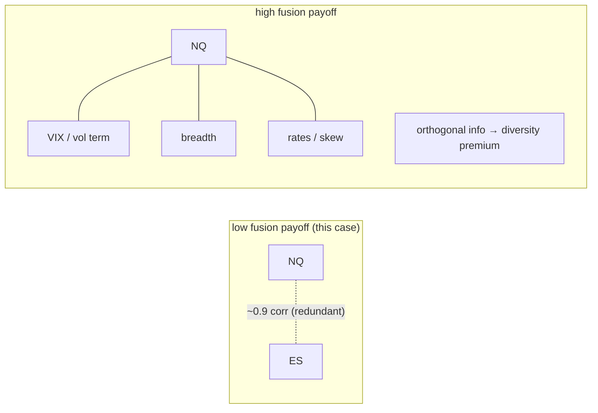
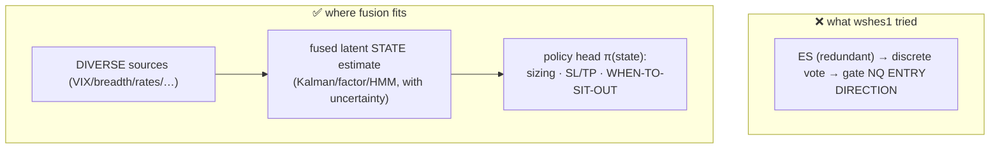

# Research note — does Kalman / signal fusion still help, after the ES verdict?

*Decision-oriented analysis prompted by `wshes1` (see `docs/XINST_ES_L1_VERDICT.md`): the optimizer, given ES as
a fair unforced option, kept it off. Does that also rule out Kalman filtering / signal fusion — or is fusion a
different mechanism worth pursuing?*

**Status:** research direction (no code). **Bottom line up front:** the ES verdict is a verdict on *"ES as a
discrete directional voter,"* **not** on fusion in general. Fusion is not ruled out — but the result also tells
us the **most likely-redundant input (ES)** and the **most likely-wrong target (entry direction)**. Fusion's
real shot here is **regime / risk-state estimation from *diverse* sources, inside the policy head** — not a
Kalman filter bolted onto NQ+ES for entries.

---

## 1. What `wshes1` proved — and its boundaries

It tested ES as a **discrete voter** (confirm / veto / ignore via touch/traversal state), combined through
AND / pool / OR-boost gates, optimizer-free, 15,023 trials → ES-on solutions were dominated, **0 of 813**
Pareto-front points used ES.

That is a verdict on one *specific* use. It did **not** test:

| wshes1 (committee gate) | what it leaves untested |
|---|---|
| discretizes ES → 3-way vote | **continuous** fusion (keeps magnitude / strength) |
| one fixed rule for all time | **state-conditioned / time-varying** estimation |
| ES *gates NQ's* existing box signals | ES helping *estimate NQ's latent state* directly |
| ignores the NQ–ES relationship | the **spread / basis** (cointegration) as its own quantity |
| target = entry **direction** | target = **regime / volatility / risk** (sizing, sit-out) |

So fusion is a genuinely different mechanism. The question is whether the *difference* matters here.

---

## 2. Three reasons to doubt Kalman-on-NQ+ES (for direction)

1. **Redundancy, not complementarity.** Fusion pays off when sources carry *independent* information about the
   target. ES and NQ are ~0.9+ correlated — same risk factor, same sessions. ES is the **least diverse** input
   you could add to NQ. Fusing two near-duplicates mostly just denoises NQ slightly using a correlated copy — a
   marginal effect, not a new edge.

2. **The committee already hunted the directional edge** — 10 ES indicators × 2 state-defs × 3 topologies ×
   truth-table × 15k trials — and found nothing robust. Strong prior that ES's *directional* content about NQ at
   the 4h frame is **already inside NQ's own price**. Continuous-vs-discrete doesn't manufacture signal that
   isn't there.

3. **Kalman's classic edge is at the wrong timescale.** The textbook win — a dynamic hedge-ratio / mean-reverting
   **spread** on a cointegrated pair — is a **sub-minute microstructure** phenomenon. At a **4h** decision frame
   NQ↔ES lead-lag is long gone; they move contemporaneously. The spread could be a *separate* strategy, but it
   isn't "helping the box strategy."

---

## 3. On the "more advanced relatives"

Vanilla Kalman (linear-Gaussian) → EKF/UKF (nonlinear) → particle filters (non-Gaussian) → HMM /
regime-switching → learned state-space (S4 / Mamba). Crucial point:

> **More sophistication buys nonlinearity and non-Gaussianity — not information.** If the inputs are redundant,
> no filter fixes "redundant-in." Advanced filters only help when the *dynamics* are the problem
> (regime switches, fat tails) — which points to a **different target** (regime detection), not to rescuing
> NQ+ES direction.

So the promising relative is **regime-switching / learned SSM for state detection**, fed **diverse** inputs —
not a fancier filter on the same redundant pair.

---

## 4. Where fusion genuinely earns its keep here

Two changes flip it from "marginal" to "promising":

- **Different target — regime / volatility / risk state → the policy head.** A state estimate is valuable for
  *sizing, stop/target, and sit-out* decisions, not for the box entry direction. This is exactly the mega-goal's
  "head-1 estimate → head-2 decide" split (`docs/superpowers/specs/2026-06-26-cross-instrument-l2-state-feature-layer-design.md`).
- **Diverse inputs, not ES.** Fuse NQ with genuinely orthogonal signals — VIX / vol term structure, market
  breadth, rates, options skew/flow — where the diversity premium actually exists.

---

## 5. The cheap pre-test (gate before building a fusion stack)

Don't build a Kalman/SSM stack on faith. **First** ask the one-feature version of the question:

> Does conditioning on **any single orthogonal feature** (e.g. a volatility/regime state variable) improve
> **risk-adjusted** return — via sizing or sit-out — vs the unconditioned strategy?

- If **one** diverse feature moves the risk-adjusted needle → a fusion stack (combine several) is justified.
- If **no** single diverse feature helps → fusion sophistication won't save it; stop.

This mirrors the discipline that made `wshes1` trustworthy: test the mechanism fairly and cheaply before
committing to the heavy build.

---

## 6. Recommendation

| | verdict |
|---|---|
| Kalman / fusion on **NQ+ES** for **entry direction** | **No** — ES is redundant with NQ at 4h; the committee already found no edge; lead-lag is the wrong timescale. |
| Kalman / SSM / HMM for **regime/risk state** from **diverse** inputs, feeding the **policy head** (sizing/sit-out) | **Worth pursuing** — but as part of the mega-goal, gated behind the §5 one-feature pre-test. |
| Fancier filter to rescue NQ+ES | **No** — sophistication ≠ information. |

**One line:** the ES result doesn't end the fusion question; it redirects it — *off* ES and entry-direction,
*onto* diverse-source regime/risk estimation for the policy head, and only after a cheap single-feature
pre-test earns the build.

---

*Related: `docs/XINST_ES_L1_VERDICT.md` (the ES result), the cross-instrument spec
`docs/superpowers/specs/2026-06-26-cross-instrument-l2-state-feature-layer-design.md` (the state-feature layer /
policy-head architecture this note slots into).*
